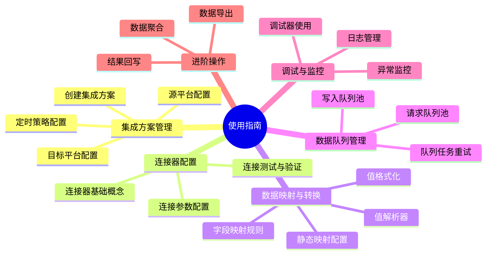
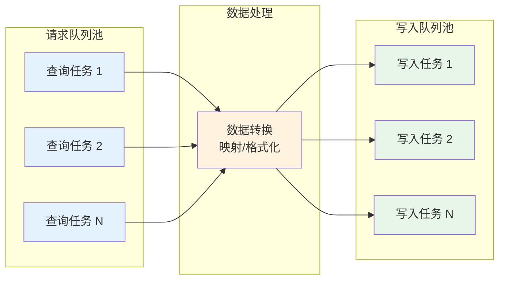

# 使用指南

本文档章节详细介绍轻易云 iPaaS 平台的核心功能使用方法，涵盖从集成方案创建、连接器配置、数据映射到运行监控的完整操作链路。通过本章内容，你将掌握如何独立完成数据集成任务的配置与管理。

---

## 本章内容概览

---

## 核心操作模块

### 1️⃣ 集成方案管理

集成方案是轻易云 iPaaS 平台的核心单元，每个方案代表一种业务数据对接策略。通过配置集成方案，你可以定义数据从源系统到目标系统的流转规则。

| 功能模块 | 说明 | 推荐阅读 |
|---------|------|---------|
| [创建集成方案](./create-integration) | 了解如何新建集成方案，配置基本信息、源/目标平台 | ⭐ 必学 |
| [源平台配置](./source-platform-config) | 配置数据查询参数、主键字段、数据拍扁等 | ⭐ 必学 |
| [目标平台配置](./target-platform-config) | 配置数据写入参数、映射关系、特殊操作 | ⭐ 必学 |
| [启动与定时策略](./schedule-and-launch) | 启动/停止方案、配置 Crontab 定时策略 | ⭐ 必学 |

> [!TIP]
> 在创建集成方案前，请确保源系统和目标系统的[连接器](../connectors/README)已配置完成。

### 2️⃣ 连接器配置

连接器是轻易云 iPaaS 与外部系统通信的桥梁。平台提供 500+ 预置连接器，覆盖主流 ERP、OA、电商、数据库等系统。

| 连接器类型 | 代表系统 | 配置要点 |
|-----------|---------|---------|
| ERP 类 | 金蝶云星空、用友 NC、畅捷通 T+ | 应用凭证、账套配置 |
| OA 协同 | 钉钉、飞书、企业微信 | OAuth 授权、应用凭证 |
| 电商平台 | 旺店通、聚水潭、万里牛 | 店铺授权、API 密钥 |
| 数据库 | MySQL、Oracle、MongoDB | 连接串、账号权限 |

详细连接器配置请参考：[连接器文档中心](../connectors/README)

### 3️⃣ 数据映射与转换

数据映射是实现异构系统数据互通的关键环节。轻易云 iPaaS 提供强大的数据映射与转换能力。

| 功能 | 说明 | 适用场景 |
|-----|------|---------|
| [字段映射](./data-mapping) | 源字段与目标字段的对应关系配置 | 基础数据同步 |
| [静态映射](./data-mapping) | 通过映射表实现编码转换 | 基础资料对接（如物料编码映射） |
| [值格式化](./value-formatting) | 日期、金额、文本等格式转换 | 数据格式标准化 |
| [值解析器](../developer/value-resolver-advanced) | 复杂数据的自定义转换逻辑 | 特殊格式处理 |
| [自定义函数](../advanced/custom-functions) | 使用脚本实现复杂转换 | 高度定制化场景 |

### 4️⃣ 数据队列管理

轻易云 iPaaS 采用双队列池机制，确保亿级数据有序处理、不丢失、不重复。

| 功能 | 说明 |
|-----|------|
| [请求队列池](./data-queue-management) | 查看与管理源系统查询任务 |
| [写入队列池](./data-queue-management) | 查看与管理目标系统写入任务 |
| [队列重试机制](./data-queue-management) | 失败任务自动重试与人工干预 |

### 5️⃣ 调试与监控

平台提供完善的调试工具和监控能力，帮助你快速定位问题、保障集成任务稳定运行。

| 工具 | 用途 | 适用角色 |
|-----|------|---------|
| [调试器](./debugger) | 激活集成方案指令集，单步调试数据流转 | 运维人员、开发人员 |
| [日志管理](./log-management) | 查看方案运行日志，追踪数据状态 | 所有用户 |
| [异常监控](./monitoring-alerts) | 实时监控异常错误，快速响应处理 | 运维人员 |
| [数据管理](./data-quality) | 查看数据质量与处理结果，辅助自定义查询分析 | 高级用户 |

### 6️⃣ 数据导出

支持将集成方案的运行数据导出为多种格式，便于离线分析和归档。

| 导出类型 | 说明 |
|---------|------|
| [请求数据导出](./export-data) | 导出源系统查询的原始数据 |
| [写入结果导出](./export-data) | 导出目标系统写入结果 |
| [日志导出](./export-data) | 导出运行日志用于审计 |

---

## 推荐阅读顺序

根据你的角色和学习目标，选择合适的学习路径：

### 🔰 基础用户路径

适合初次接触轻易云 iPaaS 的业务人员、项目经理：

1. 学习[创建集成方案](./create-integration)了解基本概念
2. 掌握[连接器配置](../connectors/README)建立系统连接
3. 配置[源平台](./source-platform-config)定义数据查询规则
4. 配置[目标平台](./target-platform-config)定义数据写入规则
5. 学习[数据映射](./data-mapping)实现字段对应
6. 配置[启动与定时策略](./schedule-and-launch)并启动方案
7. 使用[监控工具](./log-management)查看运行状态

### 🧑‍💻 进阶用户路径

适合需要处理复杂集成场景的数据工程师、集成顾问：

1. 完成基础用户路径全部内容
2. 学习[值格式化](./value-formatting)实现数据标准化
3. 掌握[静态映射](./data-mapping)处理编码转换
4. 使用[调试器](./debugger)排查复杂问题
5. 了解[数据队列管理](./data-queue-management)优化处理性能
6. 学习[数据聚合](../advanced/data-aggregation)处理海量数据
7. 掌握[结果回写](../advanced/write-back)实现数据闭环

---

## 关键概念速查

| 术语 | 说明 |
|-----|------|
| **集成方案** | 定义数据从源系统到目标系统流转规则的完整配置 |
| **连接器** | 与外部系统建立连接的适配器组件 |
| **请求参数** | 源平台查询时使用的业务参数（如日期、部门、物料编码） |
| **响应参数** | 源平台查询返回的业务字段数据 |
| **数据映射** | 源字段与目标字段的对应关系配置 |
| **主键字段** | 用于唯一标识数据记录的字段 |
| **队列池** | 存储待处理任务的缓冲区，分为请求队列和写入队列 |
| **Crontab** | Linux 定时任务表达式，用于配置同步频率 |

---

## 下一步

> [!TIP]
> 建议按照推荐阅读顺序循序渐进学习。如需快速上手，可直接从[创建第一个集成方案](./create-integration)开始。

| 导航 | 链接 |
|-----|------|
| 🚀 开始实践 | [创建集成方案 →](./create-integration) |
| 📖 了解连接器 | [连接器配置 →](../connectors/README) |
| 🔄 数据映射 | [字段映射指南 →](./data-mapping) |
| 🛠️ 调试工具 | [调试器使用 →](./debugger) |
| ❓ 常见问题 | [FAQ →](../faq/README) |
