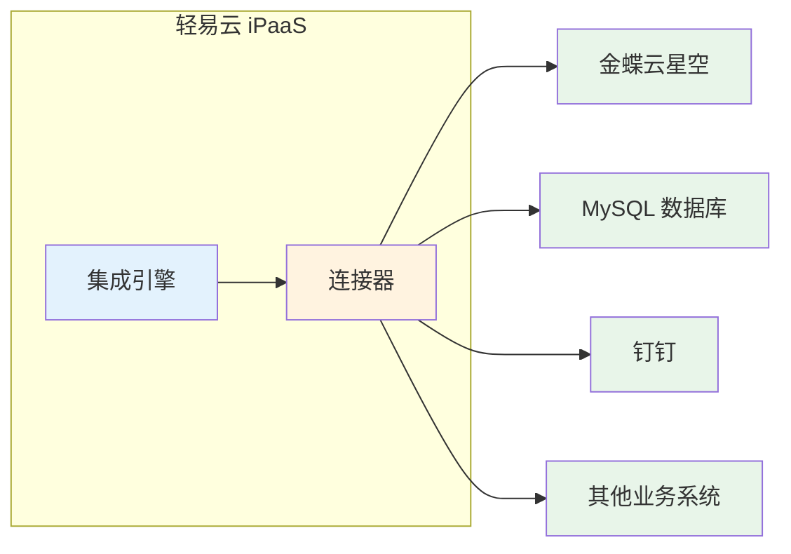
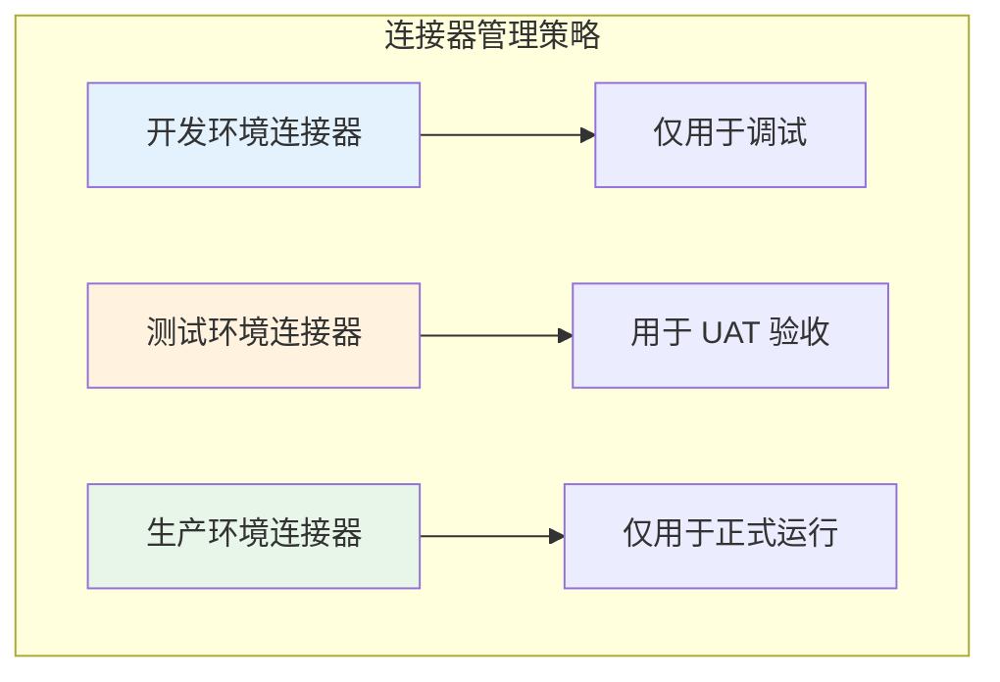

# 配置连接器

连接器（Connector）是轻易云 iPaaS 平台与外部系统建立通信的桥梁组件。通过连接器，平台能够安全地访问源系统和目标系统的数据，实现跨系统的数据集成与流转。本文将详细介绍连接器的概念、配置方法、鉴权类型以及日常管理操作。

---

## 什么是连接器

连接器是预先封装好的系统适配器，内置了与特定应用程序或数据库通信所需的协议、接口规范和认证逻辑。每个连接器对应一类业务系统（如金蝶云星空、MySQL 数据库、钉钉等），通过配置连接参数即可建立与目标系统的安全连接。



### 连接器的核心作用

| 作用 | 说明 |
|------|------|
| **协议适配** | 处理不同系统的通信协议（HTTP/HTTPS、数据库协议、消息队列等） |
| **认证管理** | 封装 OAuth、API Key、账密等多种鉴权方式 |
| **数据转换** | 处理系统间的数据格式差异 |
| **连接池管理** | 维护连接复用，提升性能与稳定性 |

> [!TIP]
> 轻易云 iPaaS 提供 500+ 预置连接器，覆盖主流 ERP、OA、电商、数据库等系统。如需接入未预置的系统，可参考[自定义连接器开发](../developer/custom-connector)。

---

## 运行环境说明

连接器支持配置三种运行环境，用于隔离不同阶段的系统连接：

| 环境 | 标识 | 用途说明 |
|------|------|----------|
| **开发环境** | `env_development` | 用于开发和调试阶段，连接测试系统 |
| **测试环境** | `env_test` | 用于 UAT 验收测试，连接预发布系统 |
| **生产环境** | `env_production` | 用于正式运行，连接生产系统 |

> [!IMPORTANT]
> 在完成开发与测试后，正式运行前务必将连接器环境切换至**生产环境**，以确保数据安全和系统稳定性。

---

## 新建连接器

### 前置条件

- 已获取目标系统的访问凭证（根据系统类型可能是 API Key、OAuth 授权或账号密码）
- 确认目标系统的网络地址可访问
- 了解目标系统的版本信息

### 操作步骤

#### 步骤一：进入连接器管理页面

1. 登录轻易云 iPaaS 控制台
2. 在左侧导航栏选择**连接器**
3. 点击右上角**新建连接器**按钮

#### 步骤二：选择应用类型

1. 在应用类型列表中选择目标系统（如金蝶云星空、MySQL、钉钉等）
2. 系统将根据所选类型自动加载对应的连接参数模板

> [!NOTE]
> 不同应用类型的连接器参数各不相同。金蝶系列通常需要配置 AppKey 和 AppSecret，数据库类需要配置主机地址和端口，OA 类通常需要 OAuth 授权。

#### 步骤三：填写基本信息

| 字段 | 必填 | 说明 |
|------|------|------|
| **连接器名称** | ✅ | 用于标识该连接器的名称，建议包含环境信息（如「金蝶生产环境」） |
| **运行环境** | ✅ | 选择开发/测试/生产环境之一 |
| **所属组织** | ✅ | 选择该连接器归属的业务组织 |
| **描述** | — | 可选，填写连接器的用途说明 |

> [!WARNING]
> 选择**运行环境**后，后续仅需配置对应环境的连接参数。如选择「开发环境」，则只需填写「开发环境」页签的参数即可。

#### 步骤四：配置连接参数

根据所选应用类型，填写相应的连接参数。常见参数类型包括：

**ERP 类系统（以金蝶为例）**:

```json
{
  "host": "https://api.kingdee.com",
  "app_key": "your_app_key",
  "app_secret": "your_app_secret",
  "account_id": "your_account_id"
}
```

**数据库类系统（以 MySQL 为例）**:

```json
{
  "host": "db.example.com",
  "port": 3306,
  "database": "production_db",
  "username": "db_user",
  "password": "your_password"
}
```

**OA 协同类系统（以钉钉为例）**:

```json
{
  "app_key": "your_app_key",
  "app_secret": "your_app_secret",
  "agent_id": "your_agent_id"
}
```

> [!TIP]
> 连接器参数的具体字段和格式，可参考[集成专题](../connectors/README)中对应系统的详细文档。

#### 步骤五：测试连接

1. 填写完连接参数后，点击**测试连接**按钮
2. 系统将尝试与目标系统建立连接并验证凭证有效性
3. 测试成功后，界面会显示**连接成功**提示

#### 步骤六：保存连接器

1. 确认测试通过后，点击**保存**按钮
2. 系统将创建连接器并分配唯一标识（Connector ID）
3. 保存成功后，连接器将显示在连接器列表中

---

## 连接器鉴权类型

轻易云 iPaaS 连接器支持多种鉴权方式，以适应不同系统的安全要求。

### API Key 鉴权

通过固定密钥进行身份验证，适用于大多数开放 API 平台。

**特点**：
- 配置简单，一次配置长期使用
- 适合服务端到服务端的调用
- 需要妥善保管密钥，避免泄露

**典型应用**：金蝶云星空、用友 YonSuite、电商平台接口

```json
{
  "api_key": "sk-xxxxxxxxxxxxxxxx",
  "api_secret": "xxxxxxxxxxxxxxxx"
}
```

### OAuth 2.0 鉴权

通过 OAuth 2.0 协议进行授权，适用于需要用户授权的 SaaS 平台。

**特点**：
- 支持授权码模式和客户端凭证模式
- 令牌有过期时间，支持自动刷新
- 安全性高，适合第三方应用集成

**典型应用**：钉钉、飞书、企业微信、Salesforce

```json
{
  "client_id": "your_client_id",
  "client_secret": "your_client_secret",
  "redirect_uri": "https://your-app.com/callback",
  "scope": "read write"
}
```

> [!NOTE]
> OAuth 类型连接器配置后，需要完成授权流程（通常需要点击「授权」按钮跳转到第三方平台进行授权确认）。

### 账密鉴权

通过用户名和密码进行身份验证，适用于传统系统和数据库。

**特点**：
- 配置直观，易于理解
- 密码支持加密存储
- 部分系统支持双因素认证

**典型应用**：MySQL、Oracle、SQL Server、传统 ERP 系统

```json
{
  "username": "admin",
  "password": "encrypted_password",
  "domain": "optional_domain"
}
```

### 混合鉴权

部分系统需要组合多种鉴权方式。

**典型应用**：金蝶云苍穹（AppKey + OAuth）、部分电商开放平台

---

## 连接测试与验证

### 测试机制说明

连接测试将执行以下验证：

1. **网络连通性** — 验证目标地址可达
2. **协议兼容性** — 验证通信协议匹配
3. **凭证有效性** — 验证鉴权信息正确
4. **权限检查** — 验证具备必要操作权限

### 常见测试结果

| 结果状态 | 说明 | 处理建议 |
|----------|------|----------|
| **连接成功** | 所有检查通过 | 可以保存并使用该连接器 |
| **连接超时** | 网络不可达或目标系统无响应 | 检查网络配置、防火墙设置、目标系统状态 |
| **认证失败** | 凭证错误或已过期 | 检查 AppKey/密码是否正确，确认令牌未过期 |
| **权限不足** | 凭证有效但权限不够 | 联系目标系统管理员开通相应接口权限 |

### 批量测试

在连接器列表页面，可以选择多个连接器进行**批量测试**，快速验证多个连接的健康状态。

---

## 连接器管理

### 编辑连接器

1. 进入**连接器**列表页面
2. 找到需要编辑的连接器，点击**编辑**按钮
3. 修改需要更新的字段（名称、参数等）
4. 修改后建议重新进行**连接测试**
5. 点击**保存**完成更新

> [!WARNING]
> 编辑连接器参数后，使用该连接器的集成方案在下次运行时将使用新配置。如修改了生产环境的连接参数，请确保已充分测试，避免影响线上业务。

### 删除连接器

1. 进入**连接器**列表页面
2. 找到需要删除的连接器，点击**删除**按钮
3. 确认删除对话框中的提示信息
4. 点击**确认删除**

> [!CAUTION]
> 删除连接器前，请确保：
> - 该连接器未被任何集成方案引用
> - 已备份必要的连接参数信息
> - 删除操作不可恢复

### 复制连接器

当需要创建配置相似的连接器时，可以使用**复制**功能：

1. 进入**连接器**列表页面
2. 找到作为模板的连接器，点击**复制**按钮
3. 系统将创建一个新连接器，复制原连接器的所有参数
4. 修改连接器名称和需要调整的参数
5. 进行连接测试并保存

> [!TIP]
> 复制功能特别适用于：
> - 同一系统的不同环境（开发/测试/生产）
> - 同一类型系统的不同实例（如多个 MySQL 数据库）

---

## 连接器状态监控

### 状态说明

| 状态 | 图标 | 说明 |
|------|------|------|
| **正常** | 🟢 | 连接正常，可正常使用 |
| **异常** | 🔴 | 连接失败，需要检查配置或目标系统状态 |
| **未测试** | ⚪ | 创建后未进行连接测试 |
| **编辑中** | 🟡 | 参数被修改但未保存 |

### 健康检查

系统会定期对连接器进行健康检查，检测项目包括：

- 网络连通性
- 认证有效性（针对 OAuth 等需要刷新的鉴权方式）
- 接口可用性

当检测到异常时，系统将通过以下方式通知：

- 控制台状态图标变化
- 邮件/短信告警（需配置告警规则）
- Webhook 推送（需配置 webhook）

---

## 最佳实践

### 环境隔离



- 为每个环境创建独立的连接器
- 连接器名称中包含环境标识（如「MySQL-生产」）
- 生产环境连接器限制编辑权限

### 凭证安全

- 定期轮换 API Key 和密码（建议 90 天）
- 使用平台提供的密码加密存储功能
- 避免在多个连接器间复用同一组凭证
- 离职人员及时清理相关连接器权限

### 性能优化

- 合理设置连接池大小
- 对于高频调用的系统，启用连接复用
- 定期检查连接器的响应时间，异常时及时优化

---

## 常见问题

**Q: 连接测试通过但集成方案运行失败？**

A: 连接测试仅验证基本连通性和认证，集成方案运行失败可能是：
- 接口权限不足（连接测试可能只验证了基础接口）
- 请求参数格式不正确
- 目标系统业务规则限制

**Q: OAuth 授权过期后如何重新授权？**

A: 进入连接器编辑页面，点击「重新授权」按钮，按照引导完成授权流程。

**Q: 同一系统可以创建多个连接器吗？**

A: 可以。建议为不同环境、不同用途创建独立的连接器，便于管理和故障隔离。

**Q: 连接器参数修改后多久生效？**

A: 保存后立即生效。正在运行的集成方案将在下次调度时使用新配置。

---

## 下一步

- 了解如何[创建集成方案](./create-integration)，使用连接器实现数据集成
- 探索[连接器列表](../connectors/README)，查找已支持的系统
- 学习[自定义连接器开发](../developer/custom-connector)，接入更多系统
