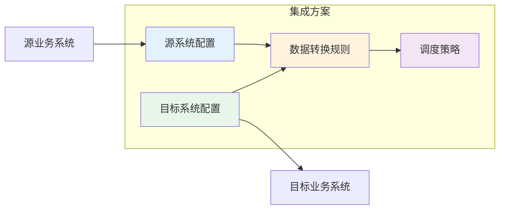
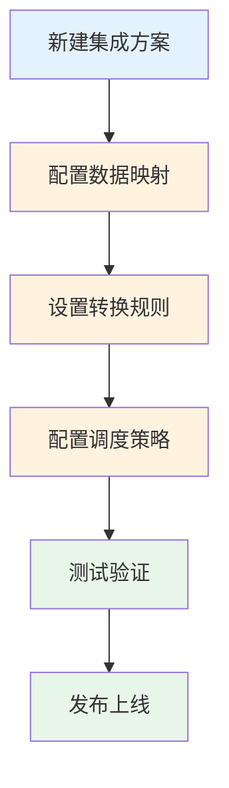
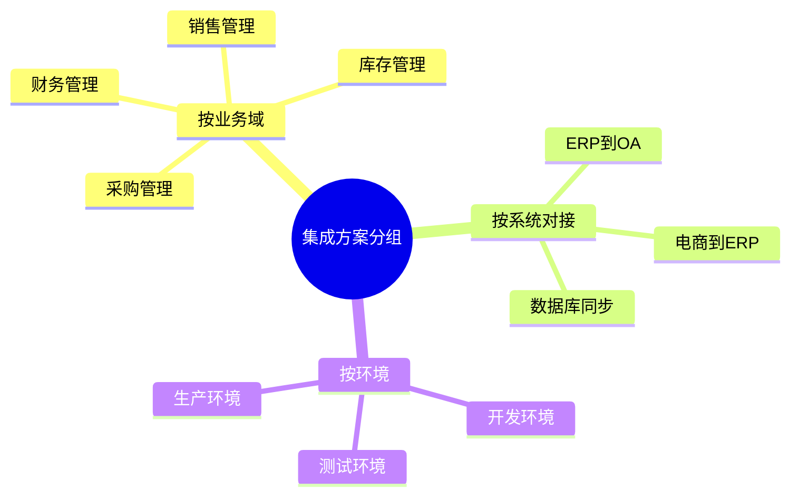

# 新建集成方案

集成方案是轻易云 iPaaS 平台的核心概念，用于定义数据从源系统到目标系统的流转规则。每一个集成方案代表一种业务对接策略，你可以根据业务需求创建多个不同的集成方案，例如采购订单同步、销售出库同步、库存数据分发等。本文将详细介绍如何新建一个集成方案，包括源/目标连接器的选择、方案类型配置、基础参数设置以及命名与分组管理。

---

## 前置条件

在新建集成方案之前，请确保已完成以下准备工作：

1. **源系统和目标系统的连接器已配置完成** — 集成方案需要引用已创建的连接器来建立系统连接
2. **了解业务数据流向** — 明确数据从哪个系统获取、写入到哪个系统
3. **确认接口类型** — 源系统需要配置**查询接口**（数据读取），目标系统需要配置**操作接口**（数据写入）

> [!IMPORTANT]
> 如果尚未配置连接器，请先参考[配置连接器](./configure-connector)完成连接器的创建和测试。

---

## 集成方案概述

### 什么是集成方案

集成方案是数据集成流程的配置载体，它定义了：

- **数据源**：从哪个系统、通过哪个接口读取数据
- **数据目标**：将数据写入到哪个系统、通过哪个接口
- **转换规则**：数据在传输过程中的字段映射与格式转换
- **调度策略**：数据同步的触发方式（定时或实时）

### 方案类型说明

轻易云 iPaaS 支持两种集成方案类型，适应不同的业务场景：

| 方案类型 | 适用场景 | 特点 |
|---------|---------|------|
| **定时同步** | 周期性数据同步，如每日库存同步、每小时订单导入 | 按预设时间间隔触发，资源占用可控 |
| **实时同步** | 即时性要求高的场景，如订单实时推送、库存实时更新 | 基于事件触发，延迟低，响应快 |

> [!TIP]
> 对于大部分业务场景，建议先使用**定时同步**方案，待运行稳定后再考虑迁移到实时同步。

---

## 新建集成方案步骤

### 步骤一：进入集成方案管理页面

1. 登录轻易云 iPaaS 控制台
2. 在左侧导航栏选择**数据集成** > **集成方案**
3. 点击页面右上角的**新建方案**按钮

### 步骤二：配置基本信息

在基本信息配置页面，需要填写以下字段：

| 字段 | 必填 | 说明 |
|------|------|------|
| **方案编码** | ✅ | 集成方案的唯一标识，建议使用英文或数字，如 `PURCHASE_ORDER_SYNC` |
| **方案名称** | ✅ | 用于显示的名称，建议清晰描述方案用途，如「采购订单同步-金蝶到用友」 |
| **方案类型** | ✅ | 选择**定时同步**或**实时同步** |
| **最大重试次数** | — | 当数据写入失败时，系统自动重试的次数，默认为 3 次 |
| **方案分组** | — | 选择或新建分组，用于对方案进行分类管理 |
| **描述** | — | 可选，填写方案的业务背景和用途说明 |

> [!NOTE]
> **方案编码**一旦创建后不可修改，建议使用统一的命名规范，如 `{业务}_{源系统}_{目标系统}`。

#### 方案分组管理

为了方便管理大量集成方案，建议按照以下维度进行分组：

- **按业务模块**：如采购、销售、库存、财务
- **按系统对接**：如金蝶-钉钉、用友-旺店通
- **按数据流向**：如上游同步、下游分发

新建分组时，点击分组选择框右侧的**新建分组**按钮，输入分组名称即可。

### 步骤三：配置源系统信息

源系统配置用于指定数据从哪个系统读取：

1. 选择**源数据平台**（如金蝶云星空、MySQL 等）
2. 选择已配置好的**连接器**
3. 选择**源接口** — 注意源接口必须是**查询接口**（用于读取数据）

> [!WARNING]
> 源接口只能选择**查询接口**类型的接口。如果列表为空，请检查所选连接器是否已配置查询接口，或返回连接器管理页面添加相应接口。

#### 源接口参数配置

选择接口后，可能需要配置接口参数：

| 参数类型 | 说明 | 示例 |
|---------|------|------|
| **过滤条件** | 用于筛选需要同步的数据 | 创建时间大于昨天、状态为已审核 |
| **分页参数** | 控制每次查询的数据量 | 每页 500 条 |
| **排序规则** | 数据排序方式 | 按创建时间倒序 |

### 步骤四：配置目标系统信息

目标系统配置用于指定数据写入到哪个系统：

1. 选择**目标数据平台**
2. 选择已配置好的**连接器**
3. 选择**目标接口** — 注意目标接口必须是**操作接口**（用于写入数据）

> [!WARNING]
> 目标接口只能选择**操作接口**类型的接口。操作接口通常包括新增、更新、删除等数据操作类型。

#### 目标接口参数配置

选择接口后，可能需要配置写入策略：

| 参数 | 说明 |
|------|------|
| **写入模式** | 新增：只插入新数据；更新：只更新已有数据；新增或更新：根据主键判断 |
| **主键映射** | 指定用于判断数据是否存在的唯一标识字段 |
| **异常处理** | 单条失败时：跳过继续 / 终止整个批次 |

### 步骤五：选择标准模板（可选）

如果轻易云已为该业务场景预置了标准集成模板，系统将在此步骤展示可选模板列表：

- **标准模板**：预配置好字段映射和转换规则，可直接使用或在此基础上修改
- **空白方案**：从零开始配置所有规则

> [!TIP]
> 建议优先选择标准模板，可大幅减少配置工作量。标准模板已针对常见业务场景优化了字段映射和转换逻辑。

选择模板后，点击**下一步**进入方案详情配置页面。

### 步骤六：完成创建

确认所有配置信息无误后，点击**完成创建**按钮：

1. 系统将保存集成方案的基本配置
2. 自动跳转到方案详情页面
3. 在详情页面可以继续配置**数据映射**、**转换规则**、**调度策略**等

---

## 方案配置后续步骤

新建集成方案后，还需要完成以下配置才能正式运行：

### 1. 配置数据映射

在方案详情页面的**数据映射**页签，配置源字段与目标字段的对应关系：

- 拖拽或选择方式建立字段映射
- 支持字段类型自动转换
- 可配置默认值和条件映射

详细操作请参考[数据映射](./data-mapping)。

### 2. 设置转换规则

如需要更复杂的数据处理，可在**转换规则**页签配置：

- 字段计算表达式
- 数据格式转换
- 条件分支处理
- 自定义脚本（高级功能）

### 3. 配置调度策略

根据方案类型配置相应的调度策略：

**定时同步方案**：
- 设置执行频率（如每 5 分钟、每小时、每天）
- 设置执行时间段（如仅工作时间）
- 配置超时时间和告警规则

**实时同步方案**：
- 配置事件触发源（如 Webhook、消息队列）
- 设置触发条件
- 配置并发控制策略

### 4. 测试验证

正式发布前，建议进行充分的测试：

1. **单元测试**：单条数据试运行，验证映射和转换逻辑
2. **批量测试**：小批量数据测试，检查性能和稳定性
3. **回归测试**：模拟异常情况，验证错误处理机制

### 5. 发布上线

测试通过后，点击**发布**按钮将方案投入生产运行：

- 发布前系统会进行配置完整性检查
- 发布后方案进入运行状态，按调度策略自动执行
- 可在**运行监控**页面查看方案执行状态

---

## 最佳实践

### 命名规范建议

**方案编码**：
- 使用大写字母和下划线
- 格式：`{业务域}_{源系统}_{目标系统}_{方向}`
- 示例：`PURCHASE_KINGDEE_YONYOU_OUT`、`INVENTORY_MYSQL_REDIS_SYNC`

**方案名称**：
- 使用中文，清晰描述业务含义
- 包含环境标识（开发/测试/生产）
- 示例：「采购订单同步-金蝶到用友-生产环境」

### 分组策略建议

### 版本管理建议

对于关键业务方案，建议采用版本管理策略：

- 重大变更前先**复制**方案，在新方案上修改
- 使用方案名称区分版本，如「销售订单同步-v2」
- 保留旧版本一段时间，确保新版本稳定后再下线

---

## 常见问题

**Q: 为什么源接口列表为空？**

A: 可能原因包括：
- 所选连接器未配置查询接口，需要到连接器详情页添加
- 连接器配置异常，建议先测试连接器连通性
- 当前账号无权限查看该接口

**Q: 可以修改已创建方案的方案类型吗？**

A: 方案类型（定时/实时）一旦创建后不可修改。如需更换类型，建议复制现有方案后重新创建。

**Q: 如何实现一个源对多个目标的同步？**

A: 目前一个集成方案只支持一个源和一个目标。如需一对多，可以：
- 创建多个集成方案，使用相同的源接口
- 在第一个目标同步完成后，通过 Webhook 触发其他方案

**Q: 方案分组可以修改吗？**

A: 可以。在方案列表页面，点击方案的**移动**按钮，可以将方案移动到另一个分组。

**Q: 删除方案会有什么影响？**

A: 删除方案将：
- 停止该方案的所有调度任务
- 删除方案的配置信息（不可恢复）
- 保留历史运行日志（用于审计追溯）

> [!CAUTION]
> 删除操作不可恢复，建议删除前先禁用方案并观察一段时间，确认无影响后再执行删除。

---

## 下一步

- 学习如何[配置数据映射](./data-mapping)，建立源字段与目标字段的对应关系
- 了解[流程编排](./process-orchestration)，实现更复杂的业务逻辑
- 探索[任务调度](./task-scheduling)的进阶配置选项
- 查看[监控告警](./monitoring-alerts)，掌握方案运行状态的监控方法
