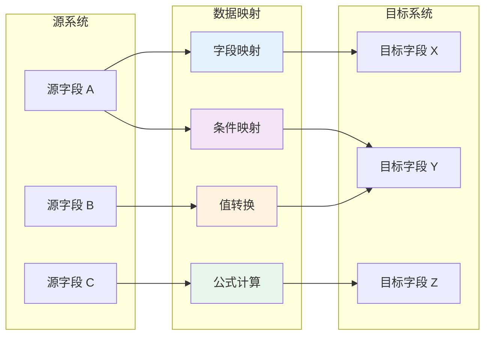
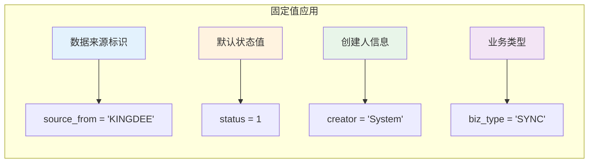
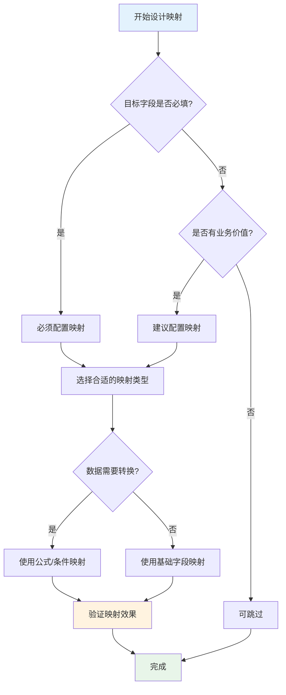

# 数据映射

数据映射是轻易云 iPaaS 平台的核心功能之一，用于实现源系统与目标系统之间的字段对应关系配置。通过灵活的数据映射机制，你可以完成基础字段映射、固定值赋值、公式计算、条件转换、嵌套对象处理以及数组映射等操作，确保异构系统间的数据能够准确、高效地流转。

---

## 数据映射概述

在系统集成过程中，源系统和目标系统的数据字段往往存在差异：字段命名不同、数据格式不一致、编码体系不统一。数据映射功能提供了一套完整的解决方案，帮助你在不同系统之间建立准确的数据对应关系。



### 支持的映射类型

| 映射类型 | 说明 | 适用场景 |
|---------|------|---------|
| **基础字段映射** | 源字段与目标字段的直接对应 | 字段名称不同但值可直接传递 |
| **固定值映射** | 为目标字段设置常量值 | 目标系统需要固定标识或默认值 |
| **公式/表达式映射** | 使用函数和运算符对源数据进行处理 | 数值计算、字符串拼接、日期格式化 |
| **条件映射** | 根据条件判断返回不同值 | 状态码转换、分类映射 |
| **嵌套对象映射** | 处理 JSON 对象内部字段的映射 | API 接口数据对接 |
| **数组映射** | 处理列表数据的批量映射 | 订单明细、商品列表等批量数据 |
| **静态映射表** | 通过预设映射表进行值转换 | 编码转换（如物料编码映射） |

---

## 基础字段映射

基础字段映射是最常用的映射方式，直接将源系统的字段值传递到目标系统的对应字段。

### 配置步骤

1. 进入集成方案的**目标平台配置**页面
2. 在**字段映射**区域，点击**添加映射**按钮
3. 选择**源字段**（从源系统获取的字段）
4. 选择**目标字段**（要写入目标系统的字段）
5. 确认映射类型为**字段映射**
6. 点击**保存**

### 配置示例

假设源系统（金蝶云星空）返回的字段为 `FMaterialId`，目标系统（MySQL 数据库）对应的字段为 `material_code`：

| 配置项 | 值 |
|--------|-----|
| 源字段 | `FMaterialId` |
| 目标字段 | `material_code` |
| 映射类型 | 字段映射 |

> [!TIP]
> 当源字段和目标字段名称完全相同时，系统会自动建议映射关系，你只需确认即可。

---

## 固定值映射

固定值映射用于为目标字段设置一个常量值，无论源数据如何，该字段始终写入相同的值。

### 使用场景

- 为目标系统标识数据来源
- 设置默认状态值
- 填充必填字段的固定内容

### 配置步骤

1. 在字段映射区域，点击**添加映射**按钮
2. 将**源字段**设置为「固定值」
3. 在**固定值**输入框中填写要传递的常量值
4. 选择**目标字段**
5. 点击**保存**

### 配置示例

| 配置项 | 值 | 说明 |
|--------|-----|------|
| 源字段 | `固定值` | 选择固定值类型 |
| 固定值 | `QEASY_IPAAS` | 写入的常量值 |
| 目标字段 | `source_system` | 标识数据来源 |

### 常见应用场景



---

## 公式/表达式映射

公式映射允许你使用内置函数和运算符对源数据进行加工处理，支持数学运算、字符串处理、日期转换等多种操作。

### 支持的运算类型

| 类型 | 运算符/函数 | 示例 |
|------|------------|------|
| 数学运算 | `+`, `-`, `*`, `/`, `%` | `{{amount}} * 1.13` |
| 字符串拼接 | `concat()` | `concat({{first_name}}, ' ', {{last_name}})` |
| 日期格式化 | `formatDate()` | `formatDate({{create_time}}, 'YYYY-MM-DD')` |
| 条件判断 | `if()`, `switch()` | `if({{status}} == 1, '启用', '禁用')` |
| 数值处理 | `round()`, `abs()` | `round({{price}}, 2)` |
| 字符串截取 | `substring()`, `replace()` | `substring({{code}}, 0, 6)` |

### 配置步骤

1. 在字段映射区域，点击**添加映射**按钮
2. 选择**映射类型**为「公式/表达式」
3. 在**表达式编辑器**中输入公式
4. 选择**目标字段**
5. 点击**验证**检查公式语法
6. 点击**保存**

### 公式编写语法

使用双大括号 `{{字段名}}` 引用源字段值：

```json
{{unit_price}} * {{quantity}} * (1 - {{discount_rate}})
```

### 常用公式示例

**示例一：金额计算**

```json
{{amount}} * {{tax_rate}} + {{amount}}
```

**示例二：字符串拼接**

```text
concat('SO-', {{order_no}}, '-', {{line_no}})
```

**示例三：日期格式化**

```text
formatDate({{create_date}}, 'YYYY-MM-DD HH:mm:ss')
```

**示例四：条件赋值**

```text
if({{status}} == 'A', '已审核', if({{status}} == 'B', '已关闭', '草稿'))
```

> [!NOTE]
> 公式编辑器支持语法高亮和实时验证。输入字段名时，系统会自动提示可用的源字段列表。

---

## 条件映射

条件映射根据源数据的值或特定条件，返回不同的目标值，适用于状态码转换、分类映射等场景。

### 配置方式

条件映射可以通过以下两种方式实现：

1. **公式条件**：在公式映射中使用 `if()` 或 `switch()` 函数
2. **条件映射器**：使用可视化条件配置界面

### 使用公式实现条件映射

```text
switch({{status_code}}, 
  '01', '待处理',
  '02', '处理中', 
  '03', '已完成',
  '99', '已取消',
  '未知状态')
```

### 使用条件映射器

条件映射器提供可视化的规则配置界面：

1. 选择**映射类型**为「条件映射」
2. 选择**条件字段**（作为判断依据的源字段）
3. 点击**添加条件规则**
4. 配置条件运算符和值
5. 设置对应的目标值
6. 配置默认返回值（当所有条件都不满足时使用）

### 条件规则配置示例

| 条件字段 | 运算符 | 条件值 | 目标值 |
|---------|--------|--------|--------|
| `order_type` | 等于 | `1` | `销售订单` |
| `order_type` | 等于 | `2` | `采购订单` |
| `order_type` | 等于 | `3` | `退货订单` |
| — | 默认 | — | `其他订单` |

### 多条件组合

支持配置多个条件的组合规则：

| 条件 1 | 逻辑 | 条件 2 | 目标值 |
|--------|------|--------|--------|
| `amount > 10000` | 且 | `status == 'A'` | `大客户订单` |
| `amount > 10000` | 且 | `status == 'B'` | `大客户待审` |
| `amount <= 10000` | — | — | `普通订单` |

---

## 嵌套对象映射

当源数据或目标数据包含 JSON 对象结构时，需要使用嵌套对象映射来配置对象内部字段的对应关系。

### 场景说明

假设源系统返回的数据结构如下：

```json
{
  "order_id": "SO202403001",
  "customer": {
    "name": "张三",
    "phone": "13800138000",
    "address": "北京市朝阳区"
  },
  "total_amount": 15000
}
```

目标系统需要的字段为平铺结构：`customer_name`、`customer_phone`、`customer_address`。

### 配置方法

1. 在字段映射区域，点击**添加嵌套映射**按钮
2. 选择**源对象字段**（如 `customer`）
3. 展开对象结构，选择内部字段（如 `customer.name`）
4. 选择对应的目标字段（如 `customer_name`）
5. 重复步骤 3-4 配置其他子字段
6. 点击**保存**

### 点符号引用

嵌套对象中的字段使用点符号（`.`）进行引用：

| 源字段路径 | 说明 |
|-----------|------|
| `customer.name` | customer 对象中的 name 字段 |
| `customer.address.city` | 多层嵌套对象中的字段 |
| `items[0].sku` | 数组中第一个对象的 sku 字段 |

> [!TIP]
> 使用公式映射时，同样支持点符号引用嵌套字段，如 `{{customer.name}}`。

---

## 数组映射

数组映射用于处理列表类型的数据，如订单明细、商品列表等一对多的数据关系。

### 数组映射模式

| 模式 | 说明 | 适用场景 |
|------|------|---------|
| **一对一映射** | 将源数组的每个元素映射到目标数组的对应位置 | 数组结构相同 |
| **字段提取映射** | 从数组元素中提取特定字段 | 只需要部分字段 |
| **聚合映射** | 对数组进行汇总计算 | 统计数量、金额合计 |

### 配置步骤

1. 在字段映射区域，识别数组类型的字段（通常标识为 `[]` 或 `Array`）
2. 点击数组字段旁的**展开**按钮，进入数组映射配置
3. 配置数组元素级别的字段映射关系
4. 设置数组处理选项（如空数组处理、数组长度限制等）
5. 点击**保存**

### 数组公式函数

| 函数 | 说明 | 示例 |
|------|------|------|
| `sum()` | 求和 | `sum({{items}}, 'amount')` |
| `count()` | 计数 | `count({{items}})` |
| `first()` | 取第一个元素 | `first({{items}}).sku` |
| `last()` | 取最后一个元素 | `last({{items}}).price` |
| `join()` | 字符串连接 | `join({{items}}, 'sku', ',')` |

### 数组映射示例

**场景**：计算订单明细的总金额

```text
sum({{order_items}}, 'subtotal')
```

**场景**：获取第一个商品的 SKU

```text
first({{products}}).sku_code
```

**场景**：将所有商品编码用逗号连接

```text
join({{products}}, 'product_code', ',')
```

---

## 静态映射表

静态映射表用于维护源值与目标值之间的对照关系，适用于基础资料编码的转换（如物料编码映射、客户编码映射）。

### 创建映射表

1. 进入**数据映射管理**页面
2. 点击**新建映射表**按钮
3. 填写映射表基本信息：
   - **映射表名称**：用于标识该映射表
   - **源系统**：数据来源系统
   - **目标系统**：数据目标系统
   - **描述**：映射表的用途说明
4. 点击**创建**

### 维护映射关系

#### 手动维护

1. 在映射表详情页，点击**添加映射**按钮
2. 填写源值和目标值
3. 可选：填写标签便于识别
4. 点击**保存**

#### 批量导入

使用 Excel 模板批量导入映射关系：

1. 点击**导入**按钮，下载 Excel 模板
2. 按照模板格式填写映射数据：

| a_value | a_label | b_value | b_label |
|---------|---------|---------|---------|
| 源值 | 源标签 | 目标值 | 目标标签 |
| MAT001 | 原材料 A | RAW001 | 原料 A |
| MAT002 | 原材料 B | RAW002 | 原料 B |
| MAT003 | 原材料 C | RAW003 | 原料 C |

3. 上传填写好的 Excel 文件
4. 系统自动解析并导入映射关系
5. 检查导入结果，处理异常数据

> [!NOTE]
> - `a_value` 和 `b_value` 为必填字段，分别代表源系统和目标系统的值
> - `a_label` 和 `b_label` 为可选字段，用于添加描述性标签

### 在方案中使用映射表

1. 在集成方案的目标平台配置中，进入字段映射设置
2. 选择需要使用映射表的字段
3. 将**映射类型**改为「静态映射」
4. 选择已创建的映射表
5. 配置**未匹配处理方式**：
   - **保留原值**：当源值在映射表中找不到时，使用原始值
   - **设置默认值**：使用指定的默认值
   - **标记异常**：记录异常，跳过该数据
6. 点击**保存**

### 映射表示例

**物料编码映射示例**：

| 金蝶编码（源） | 金蝶名称 | 用友编码（目标） | 用友名称 |
|---------------|---------|-----------------|---------|
| 10.01.001 | 螺丝钉 | 1001001 | 螺丝钉 |
| 10.01.002 | 螺母 | 1001002 | 螺母 |
| 10.02.001 | 电机 | 1002001 | 电机 |

---

## 可视化配置界面

轻易云 iPaaS 提供直观的可视化界面进行数据映射配置，无需编写代码即可完成复杂的映射关系设置。

### 映射配置主界面

> [!NOTE]
> 仓库暂未包含该界面截图资源。实际使用时，可结合控制台中的源字段区、目标字段区和映射关系区对照本节说明完成配置。

### 界面区域说明

| 区域 | 说明 |
|------|------|
| **源字段区** | 展示从源系统获取的所有可用字段及其数据类型 |
| **目标字段区** | 展示目标系统需要写入的字段 |
| **映射关系区** | 显示已配置的映射关系，支持拖拽调整 |
| **预览区** | 实时展示映射效果，可输入测试数据验证 |

### 快捷操作

| 操作 | 说明 |
|------|------|
| 拖拽映射 | 从源字段区拖拽字段到目标字段区，快速建立映射 |
| 自动匹配 | 系统根据字段名称相似度自动建议映射关系 |
| 批量映射 | 选择多个字段进行批量映射配置 |
| 映射复制 | 复制已有的映射配置到其他字段 |

### 映射验证

配置完成后，使用**映射验证**功能检查配置正确性：

1. 点击**验证**按钮
2. 系统检查以下内容：
   - 必填字段是否已映射
   - 数据类型是否兼容
   - 公式语法是否正确
   - 映射表是否存在且有效
3. 查看验证结果，处理警告和错误

---

## 最佳实践

### 映射设计原则



### 性能优化建议

1. **减少公式复杂度**：过于复杂的公式会影响处理性能，必要时可拆分为多个简单映射
2. **合理使用静态映射表**：对于频繁使用的编码转换，优先使用静态映射表而非公式
3. **避免嵌套过深**：嵌套对象和数组的层级过深会影响处理效率
4. **启用缓存**：对于不经常变化的映射表，启用缓存提升查询速度

### 常见问题排查

| 问题现象 | 可能原因 | 解决方案 |
|---------|---------|---------|
| 字段值为空 | 源字段名称错误 | 检查源字段名称拼写 |
| 公式计算错误 | 数据类型不匹配 | 使用类型转换函数 |
| 映射未生效 | 映射类型选择错误 | 确认映射类型配置 |
| 静态映射失败 | 映射表未找到匹配项 | 检查映射表内容，配置默认值 |

---

## 下一步

- 了解如何[创建集成方案](./create-integration)，将数据映射应用到实际业务场景
- 学习[源平台配置](./source-platform-config)，优化数据查询参数
- 探索[目标平台配置](./target-platform-config)，掌握更多写入配置技巧
- 查看[调试器使用指南](./debugger)，排查数据映射中的问题
