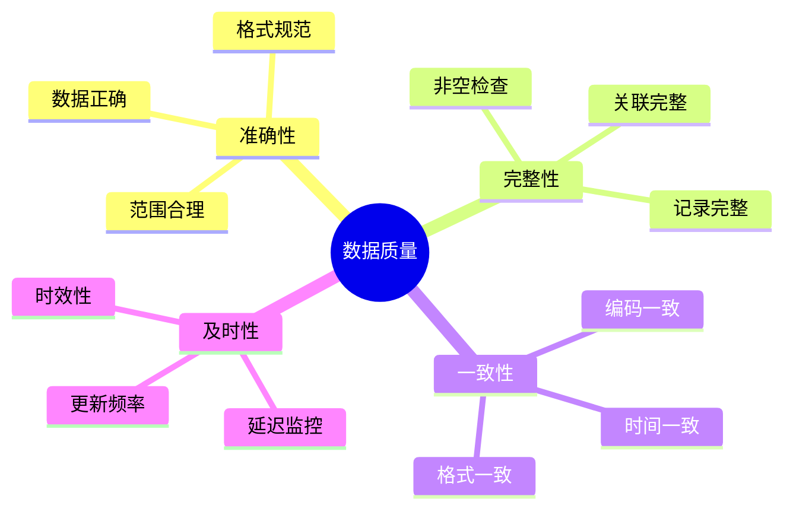
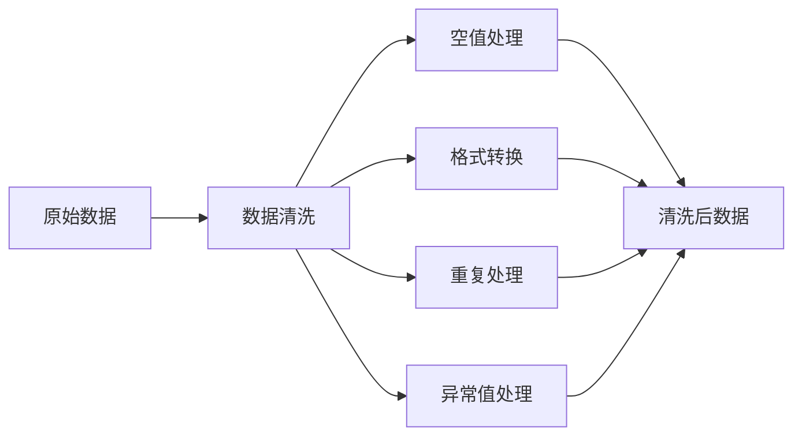
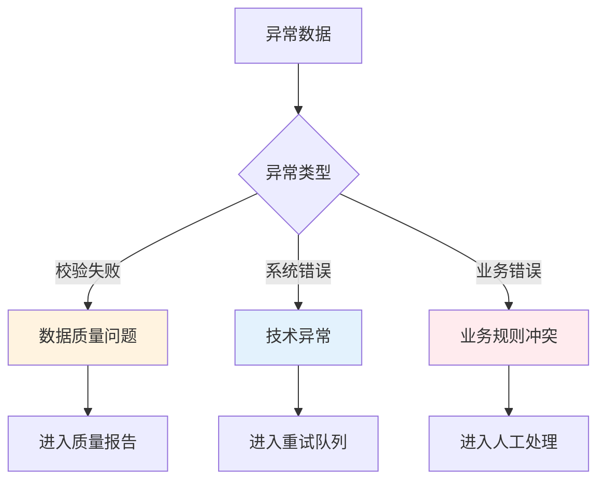
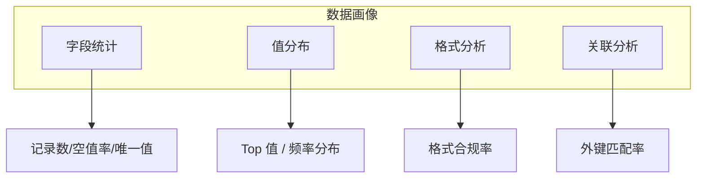
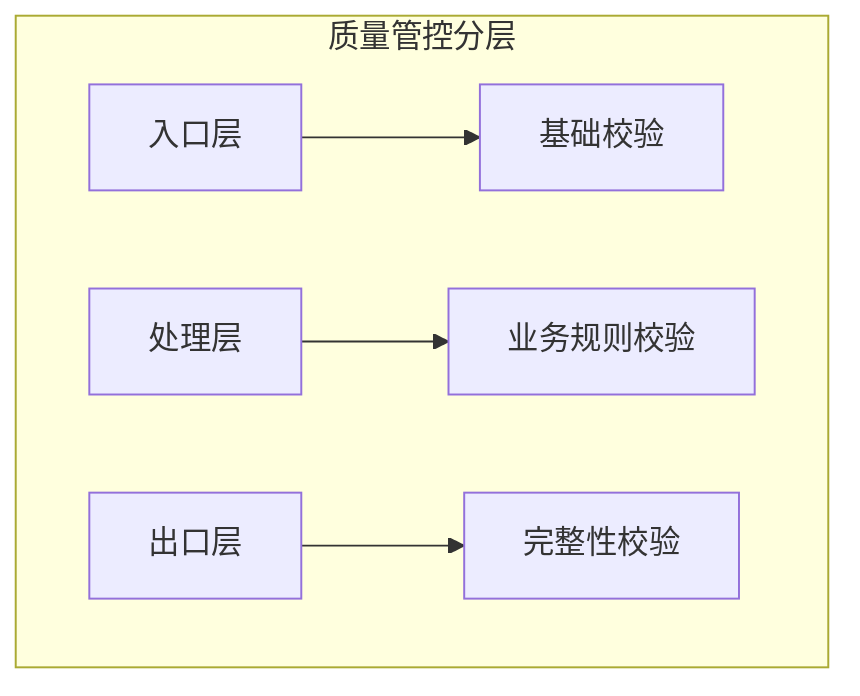

# 数据质量管理

数据质量管理帮助您监控和提升集成数据的准确性、完整性和一致性，确保数据可信可用。

## 数据质量概述

### 数据质量维度



### 质量评分

数据质量综合评分计算：

```text
质量总分 = 准确性得分 × 0.3 + 完整性得分 × 0.3 + 一致性得分 × 0.2 + 及时性得分 × 0.2
```

| 分数区间 | 等级 | 颜色 |
|---------|------|------|
| 95-100 | 优秀 | 绿色 |
| 85-94 | 良好 | 蓝色 |
| 70-84 | 合格 | 黄色 |
| < 70 | 不合格 | 红色 |

## 数据校验规则

### 基础校验规则

| 规则类型 | 说明 | 示例 |
|---------|------|------|
| 必填校验 | 字段必须有值 | 订单号不能为空 |
| 类型校验 | 数据类型正确 | 金额必须是数值 |
| 长度校验 | 字符串长度范围 | 手机号 11 位 |
| 范围校验 | 数值范围限制 | 数量大于 0 |
| 格式校验 | 正则表达式匹配 | 邮箱格式 |
| 枚举校验 | 值在指定集合中 | 状态只能是 A/B/C |

### 配置校验规则

```json
{
  "validationRules": [
    {
      "field": "orderNo",
      "rule": "required",
      "errorMessage": "订单号不能为空"
    },
    {
      "field": "amount",
      "rule": "range",
      "min": 0.01,
      "max": 999999999,
      "errorMessage": "金额必须在 0.01 到 999999999 之间"
    },
    {
      "field": "email",
      "rule": "pattern",
      "pattern": "^[\\w-]+(\\.[\\w-]+)*@[\\w-]+(\\.[\\w-]+)+$",
      "errorMessage": "邮箱格式不正确"
    }
  ]
}
```

## 数据清洗

### 清洗规则



### 清洗操作

| 操作 | 说明 | 示例 |
|-----|------|------|
| 去空格 | 去除前后空格 | `" abc " → "abc"` |
| 去重 | 删除重复记录 | 按主键去重 |
| 填充 | 空值填充默认值 | `null → 0` |
| 转换 | 格式统一转换 | `2024/1/1 → 2024-01-01` |
| 标准化 | 编码统一 | `男/M/1 → M` |
| 截断 | 超长截断 | 字符串超长截断 |

### 清洗配置

```json
{
  "cleanRules": [
    {
      "field": "customerName",
      "operation": "trim",
      "description": "去除客户名称前后空格"
    },
    {
      "field": "orderDate",
      "operation": "format",
      "sourceFormat": "yyyy/MM/dd",
      "targetFormat": "yyyy-MM-dd"
    },
    {
      "field": "quantity",
      "operation": "fillNull",
      "defaultValue": 0
    }
  ]
}
```

## 异常数据处理

### 异常分类



### 异常处理策略

| 策略 | 说明 | 适用场景 |
|-----|------|---------|
| 立即失败 | 发现异常立即停止 | 关键业务 |
| 跳过继续 | 跳过异常记录继续 | 非关键字段 |
| 标记处理 | 标记异常继续处理 | 事后分析 |
| 路由分流 | 异常数据走其他流程 | 特殊处理 |

### 异常数据管理

```json
{
  "exceptionHandling": {
    "strategy": "mark_and_continue",
    "retry": {
      "maxAttempts": 3,
      "retryInterval": 60000
    },
    "deadLetterQueue": {
      "enabled": true,
      "retentionDays": 30
    }
  }
}
```

## 质量监控

### 质量指标看板

实时监控数据质量指标：

| 指标 | 说明 | 目标值 |
|-----|------|-------|
| 校验通过率 | 通过校验的数据比例 | > 99% |
| 异常数据量 | 单位时间异常数据数量 | < 100/天 |
| 清洗成功率 | 数据清洗成功比例 | > 98% |
| 平均质量分 | 数据质量综合评分 | > 90 |

### 质量报告

定期生成数据质量报告：

```text
数据质量日报 - 2024-01-01
============================
总处理记录: 100,000
通过记录: 98,500 (98.5%)
异常记录: 1,500 (1.5%)
质量评分: 92.5

异常分布:
- 必填缺失: 800 (53.3%)
- 格式错误: 400 (26.7%)
- 范围超限: 200 (13.3%)
- 其他: 100 (6.7%)
```

## 数据剖析

### 数据画像

自动分析数据特征：



### 剖析结果

| 字段 | 类型 | 记录数 | 空值率 | 唯一值 | 质量评分 |
|-----|------|-------|-------|-------|---------|
| orderNo | String | 10000 | 0% | 10000 | 100 |
| customerName | String | 10000 | 2% | 5000 | 95 |
| amount | Decimal | 10000 | 0.5% | 8000 | 98 |
| orderDate | Date | 10000 | 1% | 365 | 96 |

## 质量规则库

### 预置规则

平台提供常用的质量规则模板：

| 规则模板 | 适用场景 |
|---------|---------|
| 手机号校验 | 验证手机号格式 |
| 身份证校验 | 验证身份证格式和校验码 |
| 邮箱校验 | 验证邮箱格式 |
| 金额校验 | 验证金额范围和精度 |
| 日期校验 | 验证日期格式和范围 |
| 编码校验 | 验证编码规则 |

### 自定义规则

支持自定义质量规则：

```javascript
// 自定义校验函数
function validate(data) {
  if (data.amount > data.creditLimit) {
    return {
      valid: false,
      message: "订单金额超过信用额度"
    };
  }
  return { valid: true };
}
```

## 质量告警

### 告警规则

配置数据质量告警：

```json
{
  "qualityAlerts": [
    {
      "name": "异常数据量告警",
      "condition": "exceptionCount > 100",
      "timeWindow": "1h",
      "severity": "high"
    },
    {
      "name": "质量分下降告警",
      "condition": "qualityScore < 80",
      "severity": "critical"
    }
  ]
}
```

### 告警通知

| 场景 | 通知方式 | 响应时间 |
|-----|---------|---------|
| 质量分 < 60 | 电话 + 短信 + 邮件 | 立即 |
| 质量分 < 80 | 邮件 + 钉钉 | 5 分钟 |
| 异常量突增 | 邮件 + 钉钉 | 15 分钟 |
| 日质量报告 | 邮件 | 每日 |

## 最佳实践

### 1. 分层质量管控



### 2. 渐进式质量提升

- **第一阶段**：基础校验（必填、类型、格式）
- **第二阶段**：业务规则校验（范围、关联、逻辑）
- **第三阶段**：高级校验（自定义规则、机器学习）

### 3. 质量问题闭环

```text
发现问题 → 分析原因 → 制定方案 → 实施改进 → 验证效果 → 标准化
    ↑                                                    |
    └──────────────────── 持续改进 ←─────────────────────┘
```

### 4. 数据质量 SLA

制定数据质量服务等级协议：

| 指标 | SLO | 惩罚措施 |
|-----|------|---------|
| 数据准确性 | ≥ 99.9% | 服务补偿 |
| 数据完整性 | ≥ 99.5% | 服务补偿 |
| 数据及时性 | 延迟 < 5 分钟 | 服务补偿 |

### 5. 质量责任体系

明确数据质量责任：

| 角色 | 质量责任 |
|-----|---------|
| 数据Owner | 定义质量标准 |
| 开发人员 | 实现质量规则 |
| 运维人员 | 监控质量指标 |
| 业务人员 | 验证数据质量 |
