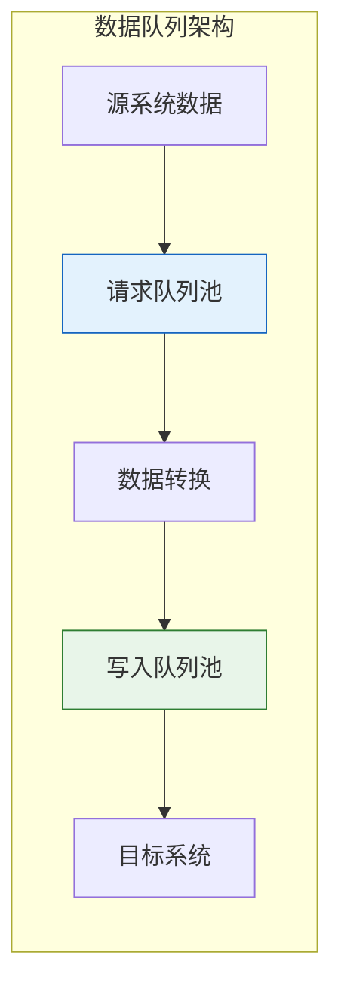
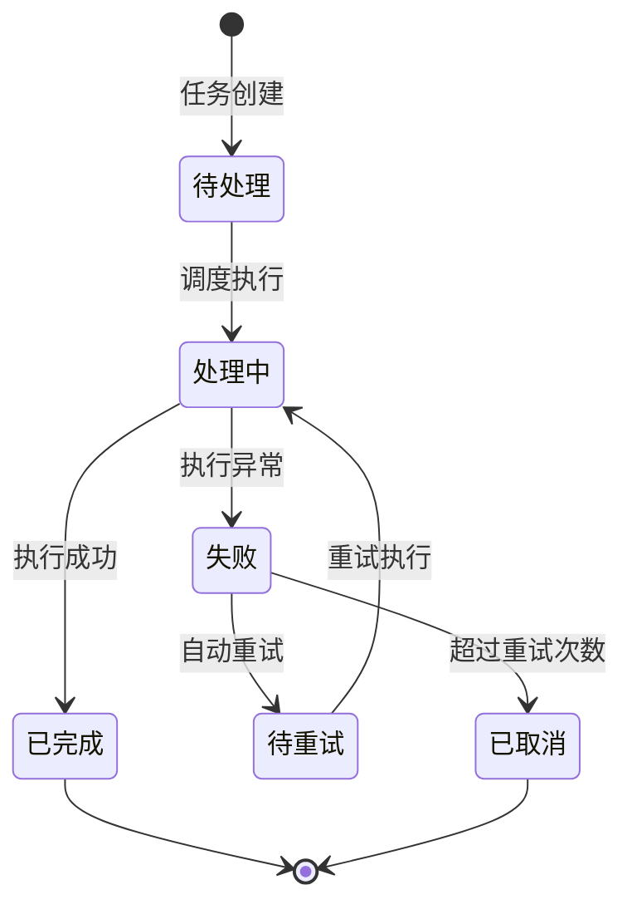
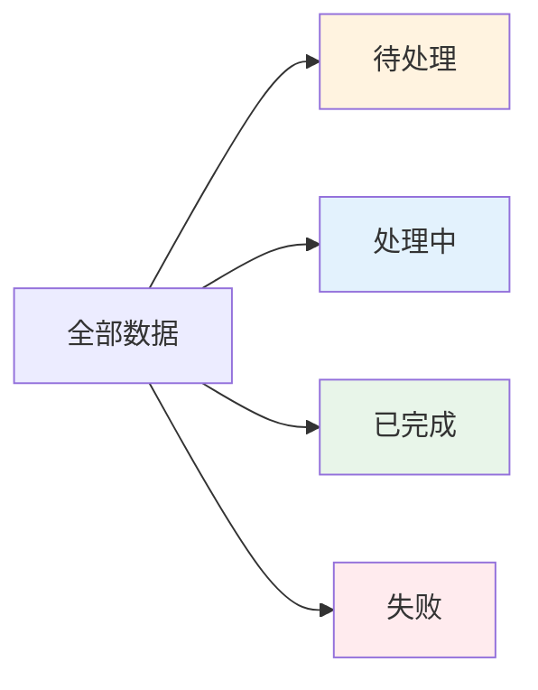
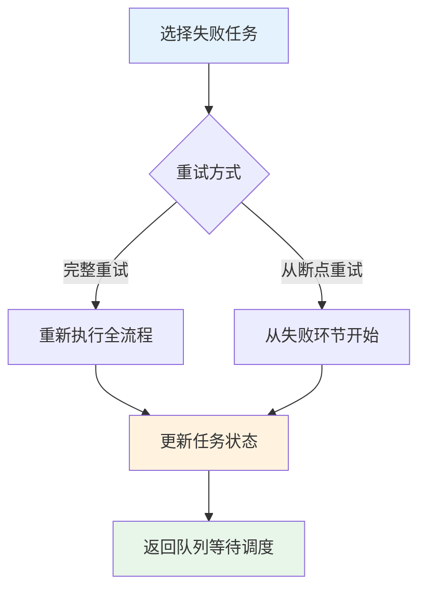
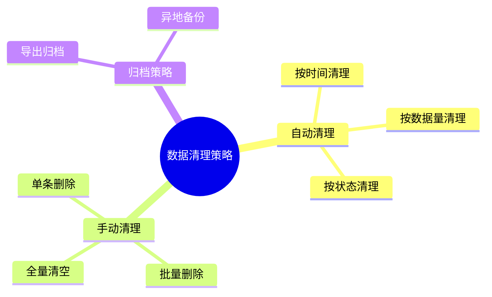
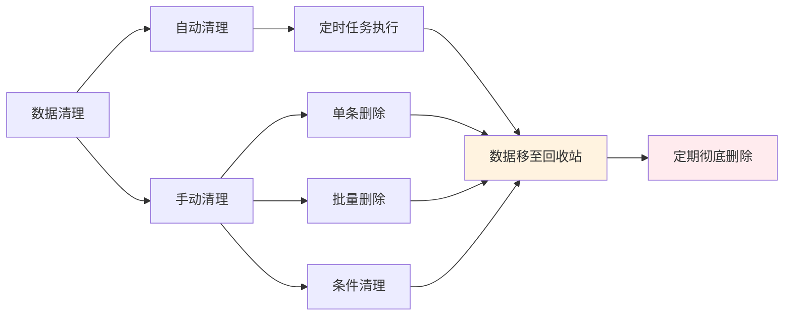
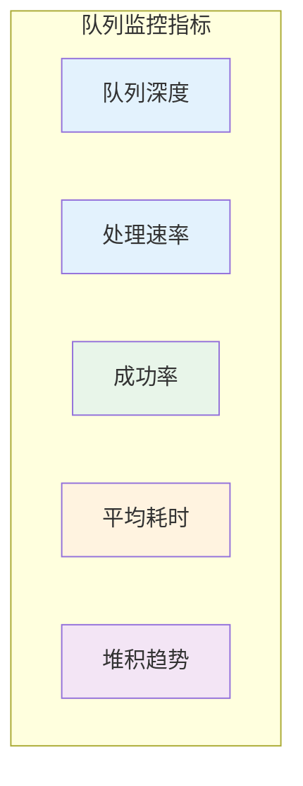
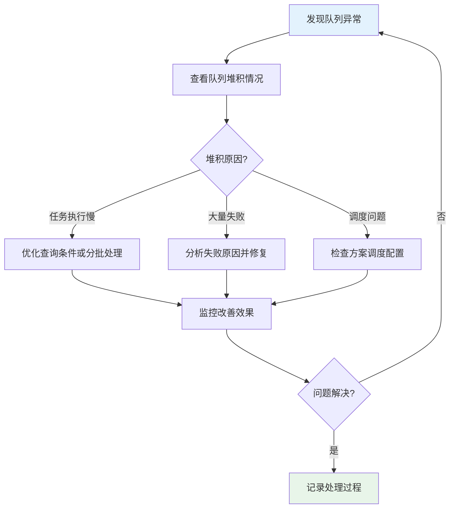

# 数据与队列管理

数据队列是轻易云 iPaaS 平台实现可靠数据同步的核心机制。通过双队列池架构（请求队列池和写入队列池），平台能够确保海量数据有序处理、不丢失、不重复。本文档详细介绍数据队列的概念、状态管理、失败重试、数据清理以及查询筛选等核心功能，帮助你全面掌握数据队列的管理方法，保障集成任务的稳定运行。

---

## 数据队列概述

### 什么是数据队列

数据队列是轻易云 iPaaS 平台用于暂存和管理数据同步任务的缓冲区机制。当集成方案启动后，所有数据查询和写入操作都会先进入队列池，由调度系统按序执行。



**双队列池设计：**

| 队列类型 | 用途 | 存储内容 |
|---------|------|---------|
| **请求队列池** | 存储从源系统查询数据的任务 | 查询参数、请求时间、响应数据 |
| **写入队列池** | 存储向目标系统写入数据的任务 | 转换后的数据、写入目标、执行状态 |

### 队列生命周期



### 队列状态说明

| 状态 | 说明 | 可执行操作 |
|-----|------|-----------|
| **待处理** | 任务已创建，等待调度执行 | 查看详情、取消任务 |
| **处理中** | 任务正在执行 | 查看进度、强制终止 |
| **已完成** | 任务执行成功 | 查看结果、导出数据 |
| **失败** | 任务执行失败 | 查看错误、手动重试 |
| **待重试** | 失败任务等待自动重试 | 查看重试次数、立即重试 |
| **已取消** | 任务被取消或超过重试次数 | 查看原因、重新创建 |

---

## 查看队列数据

### 进入队列管理页面

1. 登录轻易云 iPaaS 控制台
2. 进入**数据集成** > **集成方案**页面
3. 点击目标方案名称，进入方案详情页
4. 切换到**请求队列**或**写入队列**标签页

> [!TIP]
> 你也可以在方案列表页面，点击方案操作列的**队列**按钮，直接进入队列管理页面。

### 请求队列池管理

请求队列池存储从源系统查询数据的任务记录，展示以下信息：

| 字段 | 说明 | 示例 |
|-----|------|------|
| **任务 ID** | 队列任务的唯一标识 | `req_202603130001` |
| **请求时间** | 任务创建时间 | `2026-03-13 14:32:15` |
| **请求参数** | 查询使用的业务参数 | `{ "StartDate": "2026-03-01" }` |
| **响应状态** | 源系统响应状态 | 成功 / 失败 / 超时 |
| **数据条数** | 本次查询返回的数据记录数 | `1,234` 条 |
| **处理状态** | 当前任务状态 | 待处理 / 处理中 / 已完成 / 失败 |

#### 查看请求详情

1. 在请求队列列表中，点击目标任务的**查看详情**按钮
2. 在弹出的详情面板中，可查看：
   - 完整的请求参数（JSON 格式）
   - 源系统响应数据（分页展示）
   - 查询耗时统计
   - 异常错误信息（如执行失败）

### 写入队列池管理

写入队列池存储向目标系统写入数据的任务记录，展示以下信息：

| 字段 | 说明 | 示例 |
|-----|------|------|
| **任务 ID** | 队列任务的唯一标识 | `write_202603130001` |
| **关联请求** | 关联的请求队列任务 ID | `req_202603130001` |
| **写入时间** | 任务创建时间 | `2026-03-13 14:33:02` |
| **目标表** | 目标系统写入的数据对象 | `PurchaseOrder` |
| **写入条数** | 待写入的数据记录数 | `1,234` 条 |
| **成功条数** | 成功写入的记录数 | `1,200` 条 |
| **失败条数** | 写入失败的记录数 | `34` 条 |
| **处理状态** | 当前任务状态 | 待处理 / 处理中 / 已完成 / 失败 |

#### 查看写入详情

1. 在写入队列列表中，点击目标任务的**查看详情**按钮
2. 在详情面板中可查看：
   - 写入数据预览（前 100 条）
   - 失败记录清单及错误原因
   - 写入耗时统计
   - 目标系统响应信息

### 数据状态筛选

队列管理页面支持按数据状态快速筛选：



**筛选操作步骤：**

1. 在队列管理页面上方，找到**状态筛选**区域
2. 点击状态标签切换筛选条件：
   - **全部**：显示所有状态的任务
   - **待处理**：仅显示等待执行的任务
   - **处理中**：仅显示正在执行的任务
   - **已完成**：仅显示执行成功的任务
   - **失败**：仅显示执行失败的任务
3. 筛选结果实时更新在下方列表中

---

## 失败数据处理

### 失败原因分析

当队列任务执行失败时，系统会记录详细的错误信息。常见失败原因包括：

| 错误类型 | 可能原因 | 排查方向 |
|---------|---------|---------|
| **连接失败** | 网络中断、目标系统服务不可用 | 检查网络连接、服务状态 |
| **认证失败** | 凭证过期、权限不足 | 检查连接器配置、重新授权 |
| **数据格式错误** | 字段类型不匹配、必填字段为空 | 检查数据映射配置、源数据质量 |
| **业务规则冲突** | 唯一性约束、外键约束 | 检查目标系统业务规则、数据一致性 |
| **超时错误** | 数据量过大、系统响应慢 | 优化查询条件、分批处理 |

### 查看失败详情

1. 在队列列表中筛选**失败**状态
2. 点击失败任务的**查看详情**按钮
3. 在**错误信息**区域查看：
   - 错误码和错误描述
   - 异常堆栈信息（高级用户）
   - 失败发生的时间点
   - 失败前的最后操作记录

> [!WARNING]
> 对于涉及敏感信息的错误（如密码过期），错误描述中可能不会显示完整信息，请检查连接器配置页面获取详细提示。

### 手动重试失败数据

对于执行失败的任务，你可以手动触发重试：

**单条重试：**

1. 在失败任务列表中，找到目标任务
2. 点击操作列的**重试**按钮
3. 在确认对话框中，选择重试方式：
   - **完整重试**：重新执行完整流程
   - **从断点重试**：从失败环节开始执行
4. 点击**确认重试**

**批量重试：**

1. 在失败任务列表中，勾选需要重试的任务（支持全选）
2. 点击列表上方的**批量重试**按钮
3. 确认重试任务数量和方式
4. 点击**确认执行**



### 自动重试机制

轻易云 iPaaS 平台支持配置自动重试策略：

**配置步骤：**

1. 进入集成方案详情页
2. 切换到**高级设置**标签
3. 找到**重试策略**配置区域
4. 设置以下参数：

| 参数 | 说明 | 建议值 |
|-----|------|--------|
| **最大重试次数** | 任务失败后自动重试的最大次数 | 3 次 |
| **重试间隔** | 两次重试之间的等待时间 | 5 分钟 |
| **重试策略** | 重试时的执行策略 | 固定间隔 / 指数退避 |
| **可重试错误** | 哪些错误类型触发自动重试 | 连接超时 / 服务不可用 |

> [!IMPORTANT]
> 对于业务规则类错误（如数据重复、字段校验失败），建议不要配置自动重试，应先修复数据问题后再手动重试。

---

## 数据清理策略

### 清理策略概述

随着集成方案的运行，队列数据会持续增长。合理配置数据清理策略，可以有效控制存储成本，同时保留必要的历史记录用于审计和排查。



### 自动清理配置

**按时间清理：**

1. 进入集成方案详情页，切换到**数据管理**标签
2. 找到**自动清理**配置区域
3. 启用**按时间清理**开关
4. 设置保留时长：
   - 已完成数据：建议保留 7~30 天
   - 失败数据：建议保留 30~90 天
   - 待处理数据：建议保留 1~3 天

**按数据量清理：**

1. 启用**按数据量清理**开关
2. 设置队列最大容量：
   - 请求队列：建议 10 万~100 万条
   - 写入队列：建议 10 万~100 万条
3. 当队列超过容量时，系统会自动清理最早的历史数据

> [!CAUTION]
> 自动清理的数据将不可恢复，请确保已配置数据导出归档或备份策略。

### 手动清理操作

**单条删除：**

1. 在队列列表中找到目标记录
2. 点击操作列的**删除**按钮
3. 确认删除操作

**批量删除：**

1. 在队列列表中勾选需要删除的记录
2. 点击列表上方的**批量删除**按钮
3. 确认删除数量和操作

**按条件清理：**

1. 点击队列页面的**数据清理**按钮
2. 选择清理范围：
   - 按状态：如仅清理已完成数据
   - 按时间：如清理 30 天前的数据
   - 按方案：如清理指定方案的数据
3. 预览将要清理的数据量
4. 确认执行清理



### 数据归档导出

在清理数据前，建议先进行归档导出：

1. 在队列页面点击**导出数据**按钮
2. 选择导出范围：
   - 全部数据
   - 按状态筛选后的数据
   - 自定义时间范围
3. 选择导出格式：
   - **JSON**：完整数据结构，适合程序处理
   - **CSV**：表格格式，适合 Excel 分析
   - **Excel**：带格式表格，适合人工查阅
4. 点击**确认导出**，下载归档文件

---

## 自定义查询条件筛选

### 基础筛选条件

队列管理页面支持多种基础筛选条件：

| 筛选类型 | 说明 | 示例 |
|---------|------|------|
| **时间范围** | 按任务创建时间筛选 | 今天 / 最近 7 天 / 自定义范围 |
| **任务状态** | 按处理状态筛选 | 待处理 / 处理中 / 已完成 / 失败 |
| **数据条数** | 按涉及数据量筛选 | > 1000 条 / < 100 条 |
| **执行时长** | 按任务耗时筛选 | > 5 分钟 / < 1 分钟 |

**操作步骤：**

1. 在队列页面上方，点击**高级筛选**按钮
2. 在筛选面板中选择条件类型
3. 输入或选择筛选值
4. 点击**应用筛选**，列表实时更新

### 高级查询语法

对于复杂筛选需求，支持使用高级查询语法：

**语法规则：**

```text
# 按字段精确匹配
status:failed

# 按范围匹配
dataCount:>1000
createdAt:[2026-03-01 TO 2026-03-13]

# 多条件组合（AND）
status:failed AND retryCount:>3

# 多条件组合（OR）
status:failed OR status:cancelled

# 模糊匹配
errorMessage:*连接超时*
```

**常用字段对照：**

| 字段名 | 说明 | 类型 |
|-------|------|------|
| `taskId` | 任务 ID | 字符串 |
| `status` | 任务状态 | 枚举：pending/processing/completed/failed/cancelled |
| `createdAt` | 创建时间 | 日期时间 |
| `completedAt` | 完成时间 | 日期时间 |
| `dataCount` | 数据条数 | 数值 |
| `retryCount` | 重试次数 | 数值 |
| `errorCode` | 错误码 | 字符串 |
| `connectorId` | 连接器 ID | 字符串 |

### 保存常用筛选条件

对于频繁使用的筛选条件，可以保存为快捷筛选：

1. 配置好筛选条件后，点击**保存筛选**按钮
2. 输入筛选名称，如"近 7 天失败任务"
3. 点击**确认保存**
4. 保存后的筛选条件显示在**我的筛选**下拉菜单中，可快速应用

### 筛选结果操作

对筛选后的结果，支持批量操作：

| 操作 | 说明 | 适用场景 |
|-----|------|---------|
| **批量导出** | 导出筛选后的数据 | 数据归档、问题分析 |
| **批量重试** | 对筛选出的失败任务批量重试 | 批量修复失败数据 |
| **批量删除** | 删除筛选出的数据 | 数据清理 |
| **生成报表** | 基于筛选结果生成统计报表 | 运营分析 |

---

## 队列监控与告警

### 实时监控指标

在队列管理页面，可查看以下实时监控指标：



| 指标 | 说明 | 正常范围 |
|-----|------|---------|
| **队列深度** | 当前待处理任务数量 | < 1000 |
| **处理速率** | 每秒处理的任务数 | 根据业务而定 |
| **成功率** | 成功任务占比 | > 95% |
| **平均耗时** | 单任务的平均执行时间 | < 5 分钟 |
| **堆积趋势** | 队列增长速度 | 平稳或下降 |

### 配置队列告警

当队列出现异常情况时，及时告警可以帮助你快速响应：

1. 进入**监控告警**页面
2. 点击**新建告警规则**
3. 选择告警类型为**队列监控**
4. 配置触发条件：

| 条件类型 | 说明 | 建议阈值 |
|---------|------|---------|
| 队列堆积超过 | 待处理任务数超过阈值 | 1000 条 |
| 失败率超过 | 失败任务占比超过阈值 | 5% |
| 任务超时 | 任务执行时间超过阈值 | 30 分钟 |
| 连续失败 | 连续失败任务数超过阈值 | 10 次 |

5. 设置告警通知方式（邮件 / 短信 / 钉钉 / 企业微信）
6. 保存规则

---

## 最佳实践

### 队列管理建议

| 场景 | 建议做法 |
|-----|---------|
| **日常监控** | 每天查看队列堆积情况和失败任务 |
| **失败处理** | 及时分析失败原因，区分系统错误和数据错误 |
| **数据清理** | 配置自动清理策略，避免存储无限增长 |
| **性能优化** | 关注处理速率和耗时，及时优化慢查询 |

### 故障排查流程



### 性能优化建议

1. **合理设置分批大小**：单次查询数据量建议控制在 5000~10000 条
2. **优化查询条件**：使用索引字段作为过滤条件
3. **错峰调度**：避免多个方案在同一时间点触发
4. **监控慢查询**：定期检查执行时间过长的任务

---

## 常见问题

**Q: 队列中的数据会保留多久？**

A: 默认情况下，已完成的数据保留 30 天，失败数据保留 90 天。你可以在方案的**数据管理**设置中调整保留策略。

**Q: 为什么有些任务一直处于"待处理"状态？**

A: 可能原因包括：
- 方案未启动：只有运行中的方案才会调度队列任务
- 调度限制：达到并发执行上限，任务在排队等待
- 依赖阻塞：该任务依赖的前置任务尚未完成

**Q: 批量重试失败任务有什么限制？**

A: 单次批量重试最多支持 1000 条任务。如果失败任务较多，建议分批处理或使用自动重试机制。

**Q: 如何导出特定时间段的数据？**

A: 在队列页面使用**时间范围**筛选条件选择目标时间段，然后点击**导出数据**按钮即可。

**Q: 队列数据可以迁移到其他环境吗？**

A: 可以通过导出 JSON 格式数据，然后在目标环境使用 API 导入。但通常建议在新环境重新触发同步，而非迁移队列数据。

---

## 相关文档

| 文档 | 说明 |
|-----|------|
| [创建集成方案](./create-integration) | 学习如何创建和配置集成方案 |
| [启动与定时策略](./schedule-and-launch) | 掌握方案的启动、停止和调度配置 |
| [使用调试器](./debugger) | 使用调试工具排查数据问题 |
| [监控告警](./monitoring-alerts) | 配置运行监控和异常告警 |
| [日志管理](./log-management) | 查看和分析方案运行日志 |
