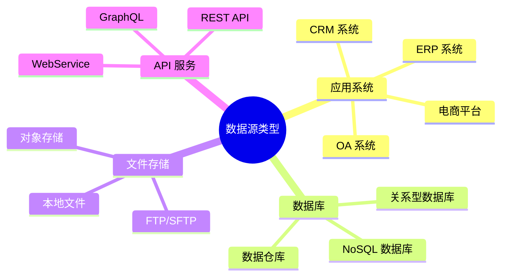
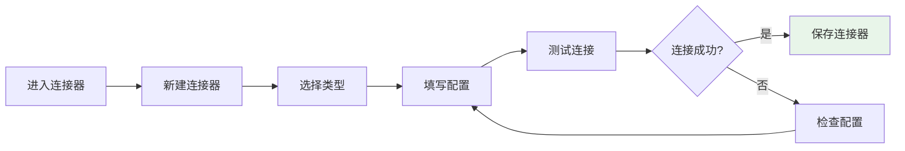
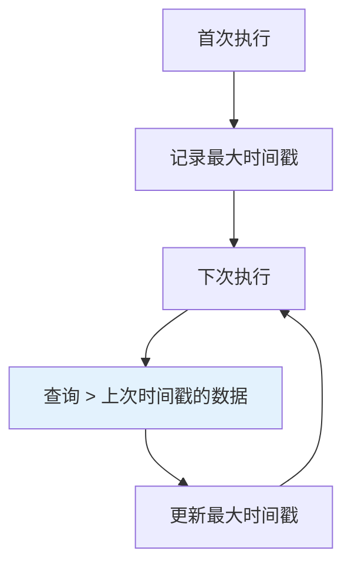
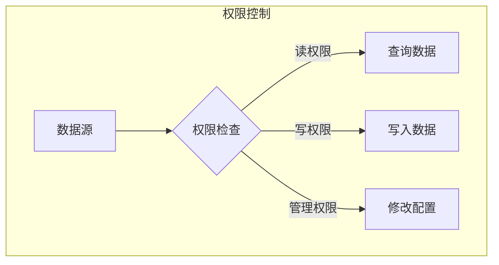

# 数据源管理

数据源是集成方案的数据输入端，本文档介绍如何在轻易云 iPaaS 中配置和管理数据源。

## 数据源类型

轻易云 iPaaS 支持多种类型的数据源：



### 支持的 ERP 数据源

| 系统 | 版本 | 连接方式 |
|-----|------|---------|
| 金蝶云星空 | 全部版本 | WebAPI、数据库 |
| 金蝶云星辰 | 全部版本 | OpenAPI |
| 用友 U8+ | V13+ | API、数据库 |
| 用友 NC | 全部版本 | NC API、数据库 |
| SAP | ECC、S/4HANA | RFC、IDoc、数据库 |
| Oracle EBS | R12+ | 数据库、API |

### 支持的数据库

| 数据库 | 版本 | 特性 |
|-------|------|------|
| MySQL | 5.6+ | CDC 支持 |
| PostgreSQL | 9.6+ | CDC 支持 |
| Oracle | 11g+ | CDC 支持 |
| SQL Server | 2012+ | CDC 支持 |
| MongoDB | 3.6+ | Change Streams |
| ClickHouse | 20+ | 大数据分析 |

## 配置数据源

### 新建数据源

1. 进入「连接器」页面
2. 点击「新建连接器」按钮
3. 选择数据源类型
4. 填写连接配置
5. 测试连接并保存



### 连接配置参数

#### 数据库连接

```json
{
  "host": "数据库主机地址",
  "port": 3306,
  "database": "数据库名称",
  "username": "用户名",
  "password": "密码",
  "charset": "utf8mb4",
  "connectionTimeout": 30000
}
```

#### API 连接

```json
{
  "baseUrl": "https://api.example.com",
  "authType": "oauth2",
  "clientId": "客户端ID",
  "clientSecret": "客户端密钥",
  "accessToken": "访问令牌",
  "timeout": 30000
}
```

## 数据获取方式

### 查询模式

| 模式 | 说明 | 适用场景 |
|-----|------|---------|
| 全量查询 | 每次查询全部数据 | 小数据量、初始化 |
| 增量查询 | 按时间戳或自增 ID 查询新增数据 | 大数据量、定时同步 |
| 分页查询 | 分批获取数据 | 超大数据量 |
| CDC 监听 | 监听数据库变更 | 实时同步 |

### 增量查询配置



**配置步骤**：

1. 选择增量字段（如 `update_time`、`id`）
2. 设置初始查询条件
3. 配置增量查询模板

示例 SQL：

```sql
SELECT * FROM orders 
WHERE update_time > '${lastSyncTime}' 
ORDER BY update_time ASC
```

### CDC 实时同步

CDC（Change Data Capture）可以实现数据的实时同步。

**支持的数据库**：

- MySQL（基于 binlog）
- PostgreSQL（基于逻辑复制）
- Oracle（基于 LogMiner）
- SQL Server（基于 CDC 表）

**MySQL CDC 配置要求**：

```ini
# MySQL 配置
binlog_format=ROW
binlog_row_image=FULL
server_id=1
log_bin=mysql-bin
```

## 数据源高级配置

### 连接池配置

```json
{
  "poolSize": 10,
  "maxIdleTime": 300000,
  "connectionTimeout": 30000,
  "idleTimeout": 600000,
  "maxLifetime": 1800000
}
```

**参数说明**：

| 参数 | 默认值 | 说明 |
|-----|-------|------|
| poolSize | 10 | 连接池大小 |
| connectionTimeout | 30000 | 连接超时时间（毫秒） |
| idleTimeout | 600000 | 空闲连接超时时间（毫秒） |
| maxLifetime | 1800000 | 连接最大生命周期（毫秒） |

### 重试机制

```json
{
  "retryEnabled": true,
  "maxRetries": 3,
  "retryInterval": 1000,
  "retryMultiplier": 2
}
```

## 数据源管理

### 连接健康检查

平台会自动检测数据源连接状态：

| 状态 | 说明 | 处理建议 |
|-----|------|---------|
| 正常 | 连接可用 | 无需处理 |
| 异常 | 连接失败 | 检查网络或配置 |
| 告警 | 响应缓慢 | 关注性能指标 |

### 数据源权限

可以设置数据源的访问权限：



### 数据源复用

配置好的数据源可以在多个方案中复用：

> [!TIP]
> 建议将常用的数据源（如生产环境 ERP）配置为共享连接器，避免重复配置。

## 故障排查

### 连接失败排查

| 现象 | 可能原因 | 解决方法 |
|-----|---------|---------|
| 连接超时 | 网络不通或防火墙限制 | 检查网络连通性 |
| 认证失败 | 用户名或密码错误 | 验证凭据正确性 |
| 权限不足 | 账号权限不够 | 检查数据库权限 |
| SSL 错误 | 证书问题 | 检查 SSL 配置 |

### 性能优化

**查询优化**：

1. 添加合适的索引
2. 优化查询条件
3. 使用分页查询
4. 调整连接池大小

**CDC 优化**：

1. 调整 binlog 保留时间
2. 优化监听表范围
3. 增加消费线程数

## 最佳实践

### 1. 命名规范

为数据源设置清晰的名称，便于识别：

```text
环境_系统_用途

例如：
- 生产_金蝶星空_订单同步
- 测试_用友U8_财务数据
```

### 2. 环境隔离

建议为不同环境配置独立的数据源：

- 开发环境
- 测试环境
- 生产环境

### 3. 安全配置

- 使用专用账号，避免使用管理员账号
- 定期更换密码
- 开启 SSL 加密连接
- 限制 IP 访问白名单

### 4. 监控告警

为重要数据源配置监控告警：

- 连接断开告警
- 查询性能告警
- 数据量异常告警
