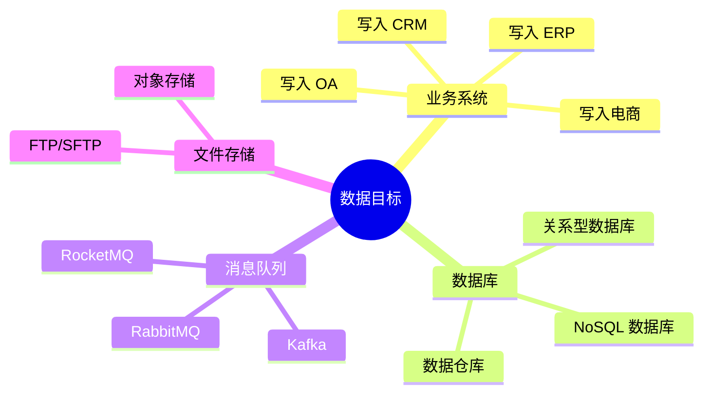
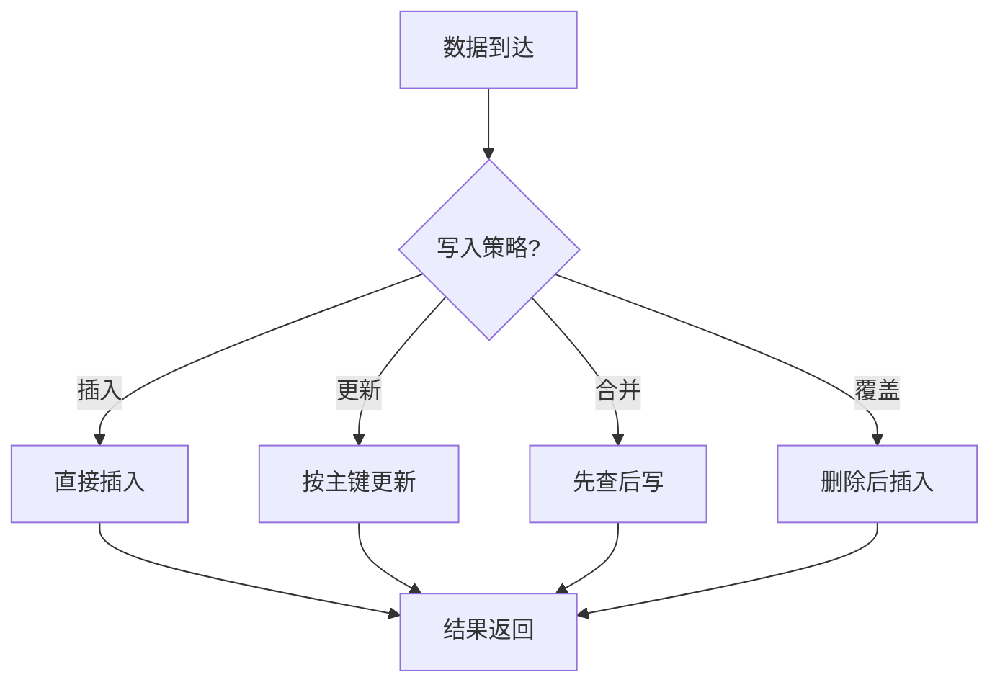
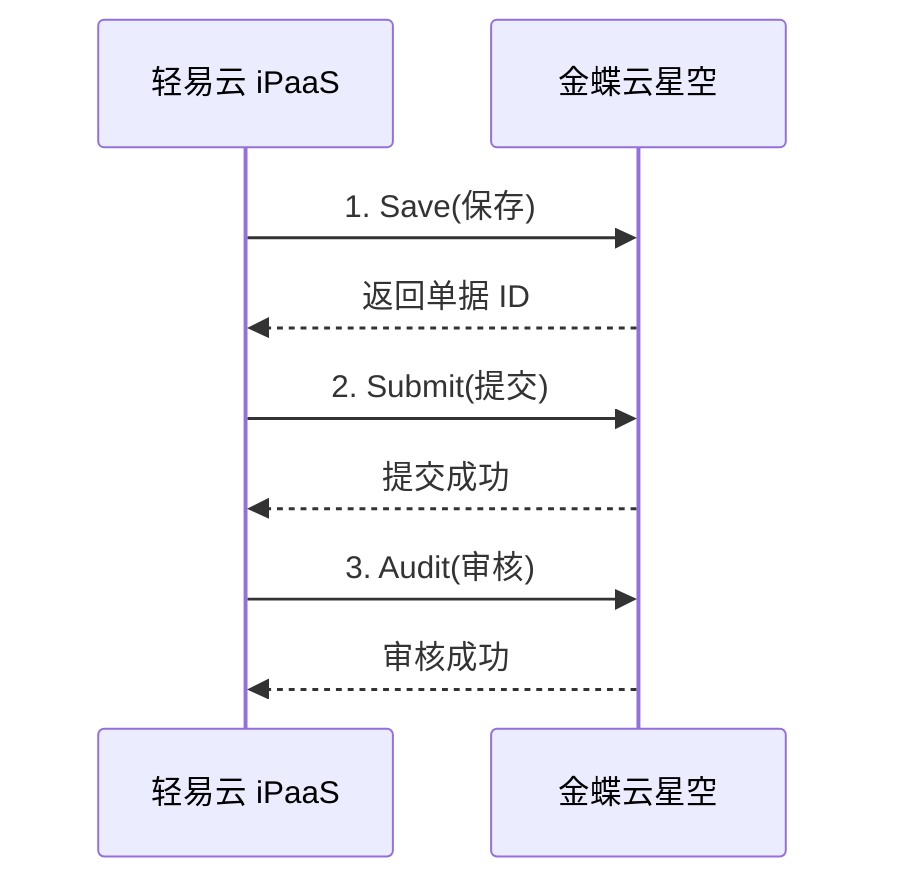
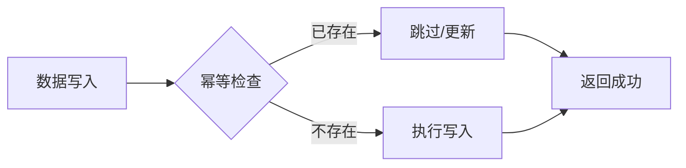
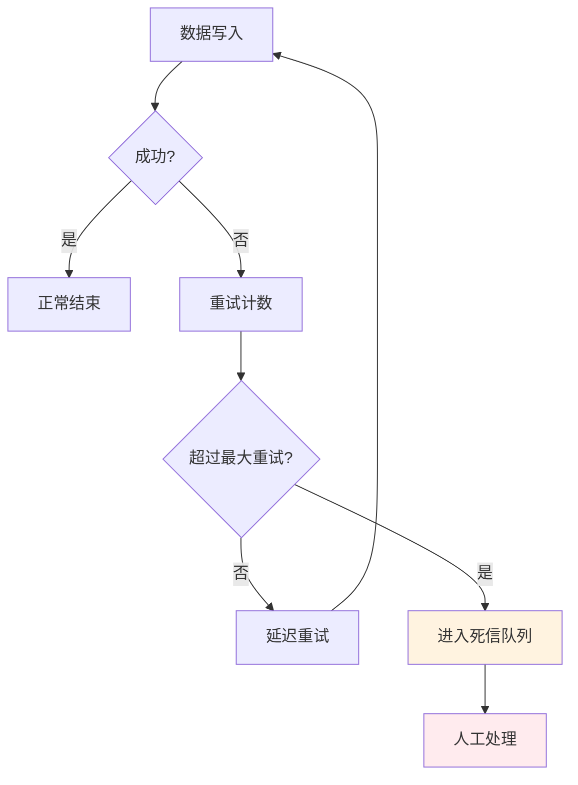
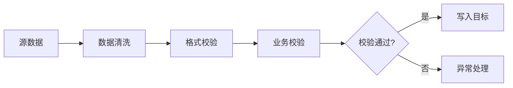

# 数据目标管理

数据目标是集成方案的数据输出端，本文档介绍如何在轻易云 iPaaS 中配置和管理数据目标。

## 数据目标类型

与数据源对应，轻易云 iPaaS 支持将数据写入多种目标系统：



## 写入模式

### 写入方式对比

| 写入方式 | 说明 | 优点 | 缺点 |
|---------|------|------|------|
| 单条写入 | 逐条写入数据 | 实时性强、错误定位准 | 性能较低 |
| 批量写入 | 累积一定数量后批量写入 | 性能高、减少网络开销 | 实时性稍差 |
| 异步写入 | 写入消息队列后异步处理 | 解耦、削峰填谷 | 复杂度增加 |

### 批量写入配置

```json
{
  "writeMode": "batch",
  "batchSize": 100,
  "flushInterval": 5000,
  "maxRetries": 3
}
```

**参数说明**：

| 参数 | 默认值 | 说明 |
|-----|-------|------|
| batchSize | 100 | 每批写入的记录数 |
| flushInterval | 5000 | 强制刷新间隔（毫秒） |
| maxRetries | 3 | 失败重试次数 |

## 写入策略

### 插入策略



**策略说明**：

| 策略 | 适用场景 | 注意事项 |
|-----|---------|---------|
| 插入 | 新数据追加 | 确保不会主键冲突 |
| 更新 | 数据状态变更 | 需要指定主键 |
| 合并 | 存在则更新，不存在则插入 | 需要查询判断 |
| 覆盖 | 全量替换 | 谨慎使用，可能丢失数据 |

### 主键映射

配置目标系统的主键映射：

```json
{
  "primaryKey": "FId",
  "mapping": {
    "sourceId": "FId",
    "sourceCode": "FNumber"
  }
}
```

## ERP 系统写入

### 金蝶云星空写入

金蝶云星空支持多种写入方式：

| 写入方式 | API | 适用单据 |
|---------|-----|---------|
| 保存接口 | Save | 所有单据 |
| 提交接口 | Submit | 需要审批的单据 |
| 审核接口 | Audit | 已提交的单据 |
| 反审核接口 | UnAudit | 已审核的单据 |

**标准写入流程**：



### 用友系统写入

用友系统写入配置：

```json
{
  "system": "yonyou-u8",
  "operation": "add",
  "voucherType": "销售订单",
  "verify": true
}
```

## 数据库写入

### SQL 写入模板

```sql
-- 插入
INSERT INTO target_table (col1, col2, col3) 
VALUES ('${value1}', '${value2}', '${value3}')

-- 更新
UPDATE target_table 
SET col2 = '${value2}', col3 = '${value3}' 
WHERE id = '${id}'

-- 合并（MySQL）
INSERT INTO target_table (id, col1, col2) 
VALUES ('${id}', '${value1}', '${value2}')
ON DUPLICATE KEY UPDATE 
col1 = VALUES(col1), col2 = VALUES(col2)
```

### 事务控制

```json
{
  "transactionEnabled": true,
  "transactionTimeout": 30000,
  "rollbackOnError": true
}
```

## 数据一致性保障

### 幂等性设计

确保重复执行不会产生副作用：



**幂等实现方式**：

1. **数据库唯一索引**：防止重复插入
2. **业务流水号**：使用源系统单号作为幂等键
3. **状态检查**：写入前检查数据状态

### 失败重试机制

```json
{
  "retryPolicy": {
    "maxAttempts": 3,
    "backoffStrategy": "exponential",
    "initialInterval": 1000,
    "maxInterval": 30000
  }
}
```

### 死信队列

处理多次重试仍失败的数据：



## 写入性能优化

### 批量优化

| 优化手段 | 效果 | 配置 |
|---------|------|------|
| 增大批量大小 | 提升吞吐量 | batchSize: 500-1000 |
| 异步写入 | 降低延迟 | 使用消息队列 |
| 连接池优化 | 减少连接开销 | poolSize: 20-50 |

### 并发控制

```json
{
  "concurrency": {
    "maxConcurrency": 10,
    "rateLimit": 100
  }
}
```

**参数说明**：

| 参数 | 说明 |
|-----|------|
| maxConcurrency | 最大并发数 |
| rateLimit | 每秒最大请求数 |

## 目标系统配置

### 连接器配置

与数据源类似，数据目标也需要配置连接器：

1. 进入「连接器」页面
2. 点击「新建连接器」
3. 选择目标系统类型
4. 填写连接配置
5. 测试连接并保存

### 写入权限配置

确保目标账号具有足够的写入权限：

| 目标系统 | 所需权限 |
|---------|---------|
| 金蝶云星空 | 单据新增、修改权限 |
| 用友 U8+ | 对应模块的写权限 |
| MySQL | INSERT、UPDATE 权限 |
| MongoDB | write 权限 |

## 监控与告警

### 写入监控指标

| 指标 | 说明 | 告警阈值建议 |
|-----|------|------------|
| 写入成功率 | 成功写入比例 | < 99% 告警 |
| 写入延迟 | 平均写入时间 | > 1s 告警 |
| 写入 QPS | 每秒写入量 | 根据容量设置 |
| 失败重试次数 | 单位时间内重试次数 | > 100 告警 |

### 写入异常处理

常见写入异常及处理：

| 异常类型 | 原因 | 处理方法 |
|---------|------|---------|
| 主键冲突 | 重复数据 | 启用幂等检查 |
| 外键约束 | 关联数据不存在 | 检查数据完整性 |
| 字段超长 | 数据超出字段限制 | 增加字段长度或截断 |
| 必填缺失 | 必填字段为空 | 补充默认值或校验 |

## 最佳实践

### 1. 写入前校验

在写入目标系统前进行数据校验：



### 2. 分批写入大表

对于超大数据量的写入，建议分批处理：

- 每批控制在 1000-5000 条
- 批次间设置适当间隔
- 监控目标系统负载

### 3. 写入结果回写

将写入结果回写到源系统或中间表：

```text
源系统 → 轻易云 iPaaS → 目标系统
              ↓
         写入结果回写 ←
```

便于追踪数据同步状态和异常处理。

### 4. 灰度发布

对于关键业务数据，建议采用灰度发布策略：

1. 先同步少量测试数据
2. 验证数据准确性
3. 逐步增加同步数据量
4. 全量发布并持续监控
