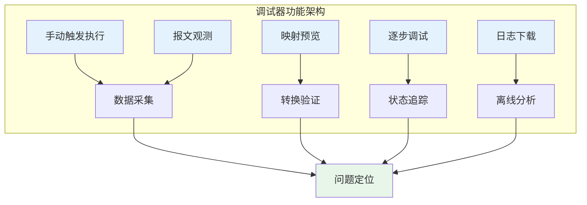
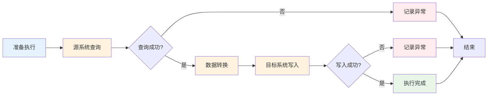
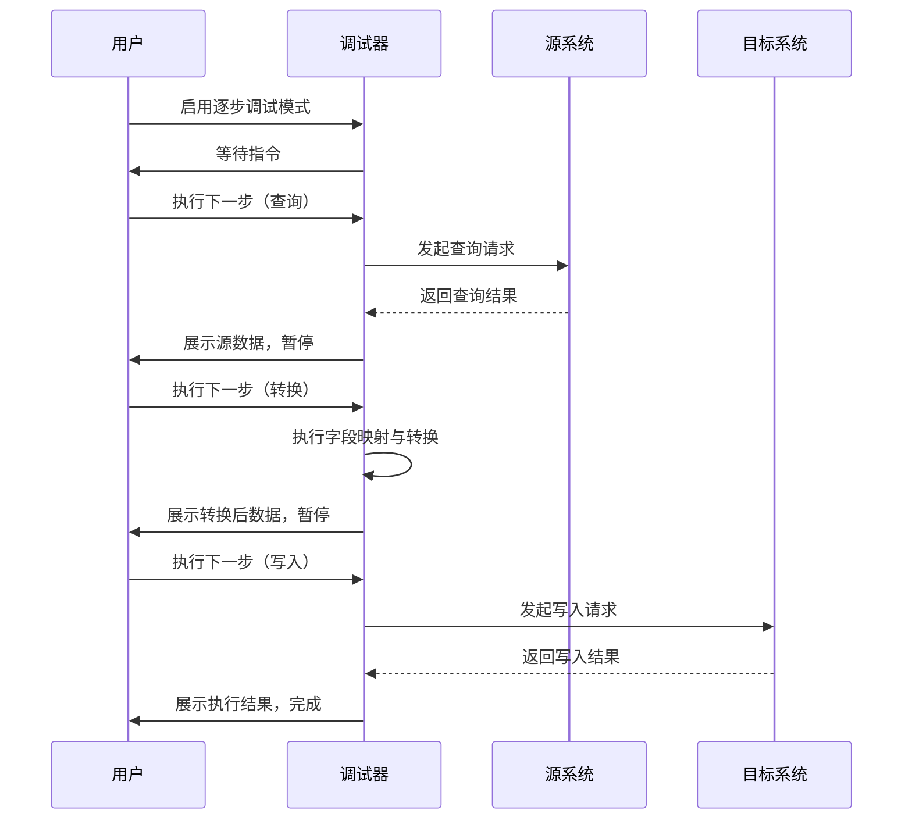
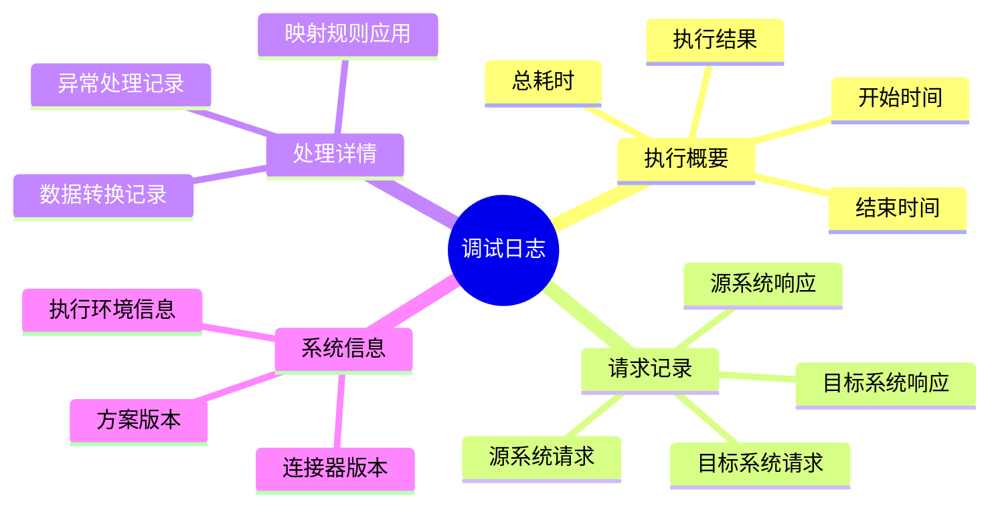
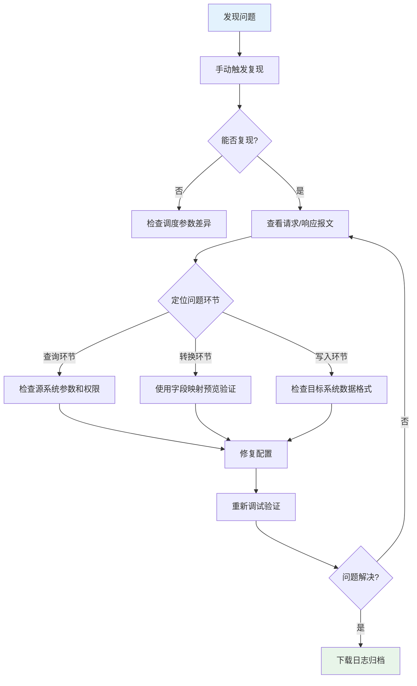

# 使用调试器

调试器是轻易云 iPaaS 平台提供的强大诊断工具，用于在集成方案开发、测试和联调阶段对数据流转过程进行精细化观测与控制。通过调试器，你可以手动触发集成方案执行、实时查看请求与响应报文、预览字段映射效果、启用逐步调试模式追踪数据变化，以及下载完整的调试日志用于离线分析。本文将详细介绍调试器的各项功能及其使用方法，帮助你快速定位和解决集成过程中的问题。

---

## 调试器概述

### 什么是调试器

调试器是集成方案开发与运维过程中的核心诊断工具，它提供了一整套数据观测与操控能力：

- **手动触发**：在任意时刻启动集成方案执行，无需等待定时调度
- **报文观测**：实时查看源系统请求的完整参数和目标系统返回的原始数据
- **映射预览**：在实际执行前预览字段映射转换的效果
- **逐步调试**：单步跟踪数据在各个环节的处理状态
- **日志下载**：导出详细调试日志用于问题分析和存档

### 适用场景

| 场景 | 调试器功能 | 价值 |
|------|-----------|------|
| 方案开发阶段 | 映射预览、手动触发 | 快速验证配置正确性 |
| 接口联调阶段 | 报文观测、逐步调试 | 定位接口兼容性问题 |
| 故障排查阶段 | 日志下载、报文对比 | 分析异常根因 |
| 性能优化阶段 | 逐段耗时分析 | 识别性能瓶颈 |

---

## 进入调试器

### 前置条件

使用调试器前，请确保：

1. **集成方案已保存** — 调试器基于已保存的方案配置运行
2. **连接器状态正常** — 源系统和目标系统的连接器已完成配置且测试通过
3. **具备调试权限** — 当前账号拥有该方案的调试操作权限

### 操作步骤

1. 登录轻易云 iPaaS 控制台
2. 进入**数据集成** > **集成方案**页面
3. 在方案列表中找到目标方案，点击**调试**按钮
4. 或先点击进入方案详情页，再点击右上角**调试器**入口

> [!TIP]
> 调试器支持对已启用和已禁用的方案进行调试。即使方案处于禁用状态，你仍可以使用调试器验证配置效果。

---

## 手动触发执行

手动触发是调试器最基础的功能，允许你在不依赖定时调度的情况下立即执行集成方案。

### 触发方式

调试器提供两种手动触发模式：

| 触发模式 | 说明 | 适用场景 |
|---------|------|---------|
| **完整执行** | 执行完整的集成流程：查询 → 转换 → 写入 | 验证端到端流程 |
| **单步触发** | 仅执行指定环节（仅查询 / 仅转换 / 仅写入） | 定位具体环节问题 |

### 操作步骤

1. 在调试器页面，确认**源系统**和**目标系统**连接器状态显示为正常
2. 选择触发模式：
   - 点击**完整执行**按钮运行全流程
   - 或点击**单步执行**下拉菜单选择具体环节
3. 如需指定测试数据，在**测试参数**区域输入过滤条件
4. 点击**开始调试**按钮

> [!NOTE]
> **测试参数**支持输入特定的业务参数，如单据编号、日期范围等，用于限定调试的数据范围。留空则表示使用方案默认参数。

### 执行过程观测

触发执行后，调试器会实时展示执行进度：

---

## 查看请求/响应报文

报文观测功能让你能够完整查看与源系统和目标系统交互的原始数据，是接口联调阶段的核心工具。

### 源系统请求报文

源系统请求报文展示了向源系统发起查询请求时的完整参数：

| 信息项 | 说明 | 示例 |
|-------|------|------|
| **请求 URL** | 实际调用的接口地址 | `https://api.kingdee.com/pur/purchaseorder/list` |
| **请求方法** | HTTP 方法 | `POST` / `GET` |
| **请求头** | 包含认证信息、内容类型等 | `Authorization: Bearer xxx` |
| **请求体** | 查询参数、过滤条件等 | `{ "StartDate": "2026-03-01" }` |
| **请求时间** | 请求发送的时间戳 | `2026-03-13 14:32:15.234` |

#### 查看步骤

1. 在调试器页面左侧，点击**源系统请求**页签
2. 在请求列表中，点击需要查看的请求记录
3. 右侧展示该请求的完整报文信息
4. 支持点击**复制**按钮复制原始报文内容

> [!TIP]
> 如果请求失败，重点关注**响应状态码**和**错误信息**字段，它们通常包含了问题的直接线索。

### 源系统响应报文

源系统响应报文展示了源系统返回的原始数据：

| 信息项 | 说明 |
|-------|------|
| **响应状态码** | HTTP 状态码，如 `200`、`401`、`500` |
| **响应头** | 服务器返回的元数据 |
| **响应体** | 查询结果数据，通常为 JSON/XML 格式 |
| **响应时间** | 从请求发送到收到响应的耗时 |
| **数据条数** | 本次查询返回的数据记录数量 |

### 目标系统请求报文

目标系统请求报文展示了向目标系统写入数据时的请求内容：

1. 在调试器页面左侧，点击**目标系统请求**页签
2. 查看向目标系统发送的写入请求详情
3. 对比源系统原始数据，验证转换逻辑是否符合预期

### 目标系统响应报文

目标系统响应报文展示了目标系统对写入操作的返回结果：

| 响应类型 | 说明 |
|---------|------|
| **成功响应** | 包含写入成功的记录标识，如单据编号、ID 等 |
| **失败响应** | 包含错误码和详细的错误描述 |
| **部分成功** | 批量写入时部分记录成功、部分失败的详细清单 |

> [!IMPORTANT]
> 当遇到目标系统写入失败时，务必同时检查**目标系统请求报文**（确认发送的数据是否正确）和**目标系统响应报文**（查看目标系统返回的具体错误信息）。

---

## 字段映射预览

字段映射预览功能允许你在实际执行集成方案前，预先查看源字段经过映射转换后的效果，大幅降低调试成本。

### 预览功能说明

字段映射预览会展示以下信息：

| 展示项 | 说明 |
|-------|------|
| **源字段值** | 从源系统获取的原始字段值 |
| **映射规则** | 该字段应用的映射关系和转换规则 |
| **目标字段值** | 经过映射转换后生成的值 |
| **转换状态** | 转换成功、失败或跳过 |

### 操作步骤

1. 在调试器页面，点击**字段映射预览**页签
2. 选择预览数据源：
   - **实时查询**：从源系统实时获取一条数据用于预览
   - **历史数据**：使用某次调试的历史数据
   - **模拟数据**：手动输入测试数据进行预览
3. 点击**加载数据**按钮
4. 在映射预览表格中查看各字段的转换效果

### 预览结果解读

预览结果表格包含以下列：

| 列名 | 说明 |
|------|------|
| **源字段** | 源系统的字段名称及原始值 |
| **映射关系** | 显示源字段与目标字段的对应关系 |
| **转换规则** | 应用的格式化、解析等转换规则 |
| **目标字段** | 目标系统的字段名称 |
| **转换结果** | 最终生成的目标值 |
| **状态** | 转换执行状态标识 |

> [!TIP]
> 当转换状态为**失败**时，将鼠标悬停在状态标识上可查看具体的错误原因，如数据类型不匹配、必填字段为空等。

---

## 逐步调试模式

逐步调试模式是调试器的核心高级功能，允许你以单步方式跟踪数据在集成流程中的每一个环节的变化。

### 逐步调试流程

### 启用逐步调试

1. 在调试器页面，开启**逐步调试**开关
2. 选择起始步骤：
   - **从查询开始**：完整跟踪全流程
   - **从转换开始**：跳过查询，使用已有数据进行转换调试
   - **从写入开始**：跳过查询和转换，直接测试写入逻辑
3. 点击**开始逐步调试**按钮

### 调试控制操作

在逐步调试过程中，你可以使用以下控制按钮：

| 按钮 | 功能 | 快捷键 |
|------|------|--------|
| **下一步** | 执行当前环节并进入下一环节 | `F10` |
| **跳过** | 跳过当前环节，直接进入下一环节 | `F11` |
| **继续** | 从当前环节开始自动执行至结束 | `F5` |
| **停止** | 终止调试会话 | `Shift+F5` |

### 断点设置

对于复杂方案，你可以在特定环节设置断点：

1. 在流程图视图中，点击环节节点右侧的**设置断点**图标
2. 当执行到该环节时，调试器会自动暂停
3. 支持设置条件断点，如"当数据条数 > 100 时暂停"

> [!NOTE]
> 断点设置在调试会话结束后会保留，方便重复调试同一问题场景。

### 变量观测

在逐步调试过程中，调试器提供变量观测面板：

| 变量类型 | 说明 |
|---------|------|
| **系统变量** | 平台预置变量，如当前时间、方案 ID 等 |
| **上下文变量** | 当前数据行的字段值 |
| **临时变量** | 转换过程中产生的中间结果 |
| **全局变量** | 方案级别的共享变量 |

---

## 调试日志下载

调试日志下载功能支持将完整的调试过程记录导出为文件，便于离线分析、问题归档和团队协作。

### 日志内容说明

下载的调试日志包含以下信息：

### 下载操作步骤

1. 在调试器页面，完成一次调试执行
2. 点击页面右上角的**下载日志**按钮
3. 选择日志格式：
   - **JSON 格式**：包含完整结构化数据，适合程序分析
   - **文本格式**：人类可读格式，适合人工阅读
   - **HTML 报告**：包含格式化展示和统计图表
4. 点击**确认下载**按钮

### 日志文件说明

| 格式 | 文件扩展名 | 适用场景 |
|------|-----------|---------|
| JSON | `.json` | 导入日志分析工具、程序化处理 |
| 文本 | `.log` / `.txt` | 文本编辑器查看、快速检索 |
| HTML | `.html` | 浏览器打开、团队分享、问题汇报 |

> [!TIP]
> 对于需要长期归档或提交给技术支持团队的调试记录，建议选择 **HTML 报告**格式，它包含最完整的可视化展示。

### 日志分析技巧

下载的日志文件中，重点关注以下信息：

| 关注项 | 分析方法 |
|-------|---------|
| **耗时分布** | 查看各环节时间戳，识别耗时最长的环节 |
| **数据变化** | 对比源数据和目标数据，验证转换逻辑 |
| **异常记录** | 搜索 `error`、`exception` 等关键词 |
| **参数变化** | 追踪变量在流程中的赋值变化 |

---

## 调试最佳实践

### 问题排查流程

遇到集成方案运行异常时，建议按以下流程使用调试器进行排查：

### 调试效率技巧

| 技巧 | 说明 |
|------|------|
| **使用测试参数限定范围** | 通过指定单据编号等条件，将调试数据限定在单条记录，加快调试速度 |
| **善用字段映射预览** | 在实际执行前先验证映射逻辑，避免反复触发完整执行 |
| **设置合理断点** | 在关键转换环节设置断点，快速定位问题 |
| **对比多次执行结果** | 对于偶发性问题，下载多次调试日志进行对比分析 |
| **利用历史数据** | 使用历史成功的请求数据进行回归测试 |

### 常见问题与解决方法

**Q: 调试器提示"连接器测试失败"**

A: 检查以下项目：
- 连接器配置是否正确（地址、端口、认证信息）
- 网络是否连通（是否有防火墙限制）
- 目标系统服务是否正常运行

**Q: 字段映射预览结果与实际执行不一致**

A: 可能原因：
- 预览使用的测试数据与实际数据格式不同
- 预览时未考虑上下文变量（如循环中的累计值）
- 实际执行时触发了异常处理分支

**Q: 调试日志下载后打开为空**

A: 排查步骤：
- 确认调试会话已成功执行完成
- 检查浏览器下载权限设置
- 尝试更换日志格式重新下载

**Q: 逐步调试模式下数据量过大导致卡顿**

A: 解决方法：
- 使用测试参数限定返回数据条数
- 在查询环节设置更精确的过滤条件
- 关闭不必要的变量观测项

---

## 下一步

- 了解如何[配置数据映射](./data-mapping)，建立源字段与目标字段的对应关系
- 学习[启动与定时策略](./schedule-and-launch)，掌握方案的自动化运行配置
- 查看[日志管理](./log-management)，了解生产环境的日志查看与分析方法
- 探索[监控告警](./monitoring-alerts)，建立完善的方案运行监控体系
