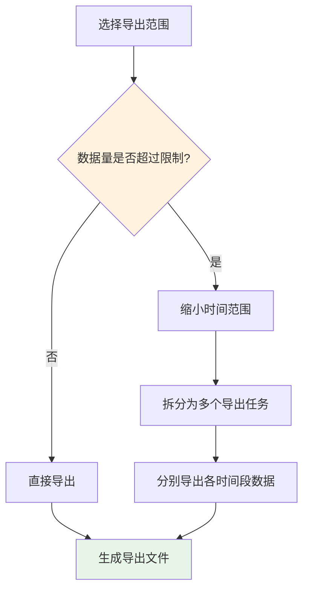
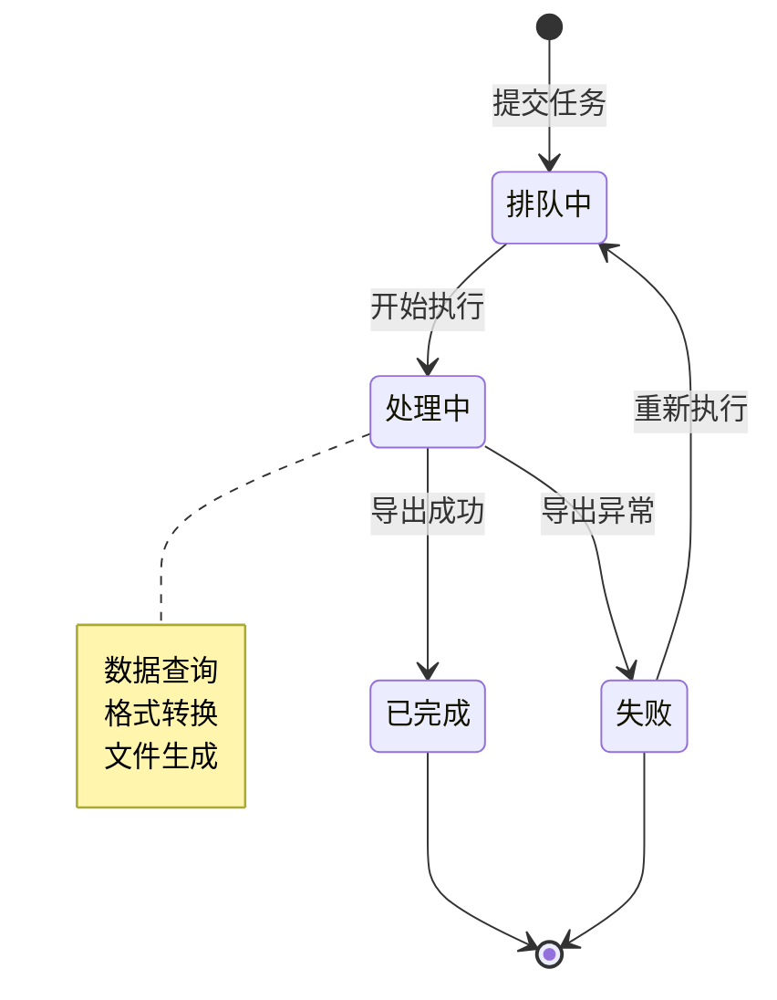

# 导出数据

轻易云 iPaaS 平台支持将集成方案的请求数据、写入结果以及历史记录导出为 Excel 或 CSV 格式，便于你进行离线分析、数据审计和报表制作。本文档详细介绍数据导出的完整流程，包括导出范围筛选、格式选择、行数限制配置以及定期导出设置。

---

## 导出功能概述

### 支持导出的数据类型

| 数据类型 | 说明 | 适用场景 |
|---------|------|---------|
| **请求数据** | 从源系统查询获取的原始数据 | 数据源稽核、数据质量分析 |
| **写入结果** | 向目标系统写入的数据及结果 | 同步结果确认、失败数据分析 |
| **队列数据** | 请求队列池和写入队列池的任务记录 | 任务执行审计、性能分析 |
| **日志数据** | 方案运行的详细日志记录 | 问题排查、运行审计 |

### 支持的导出格式

| 格式 | 扩展名 | 特点 | 适用场景 |
|-----|--------|------|---------|
| **Excel** | `.xlsx` | 支持多工作表、样式格式、数据验证 | 人工查阅、报表制作 |
| **CSV** | `.csv` | 纯文本格式、体积小、兼容性好 | 程序处理、大数据量导出 |
| **JSON** | `.json` | 完整数据结构、保留嵌套关系 | 数据迁移、API 对接 |

---

## 导出集成数据

### 从队列池导出数据

#### 操作步骤

1. 登录轻易云 iPaaS 控制台
2. 进入**数据集成** > **集成方案**页面
3. 点击目标方案名称，进入方案详情页
4. 切换到**请求队列**或**写入队列**标签页
5. 点击页面右上角的**导出数据**按钮
6. 在导出配置弹窗中完成以下设置：
   - **导出范围**：选择要导出的数据范围
   - **导出格式**：选择 Excel、CSV 或 JSON
   - **文件名**：自定义导出文件名（可选）
7. 点击**确认导出**，等待系统生成文件
8. 下载完成后，文件将自动保存到本地


### 导出范围筛选

#### 基础筛选条件

在导出前，你可以通过筛选条件精确控制要导出的数据范围：

| 筛选条件 | 说明 | 示例 |
|---------|------|------|
| **时间范围** | 按任务创建时间筛选 | 今天 / 最近 7 天 / 最近 30 天 / 自定义 |
| **任务状态** | 按处理状态筛选 | 待处理 / 处理中 / 已完成 / 失败 |
| **数据条数** | 按单次任务的数据量筛选 | > 1000 条 / < 100 条 |
| **关键词** | 按任务 ID 或错误信息筛选 | `req_20260313` |

**筛选操作步骤：**

1. 在队列页面上方，点击**筛选**按钮展开筛选面板
2. 选择**时间范围**：
   - 快速选项：今天、昨天、最近 7 天、最近 30 天
   - 自定义：选择起始日期和结束日期
3. 选择**任务状态**：勾选需要导出的状态（可多选）
4. 设置**数据条数**范围（可选）
5. 输入**关键词**进行模糊匹配（可选）
6. 点击**应用筛选**，列表将实时更新
7. 确认筛选结果后，点击**导出数据**按钮

#### 高级筛选语法

对于复杂筛选需求，支持使用高级查询语法：

```text
# 按状态和时间组合筛选
status:completed AND createdAt:[2026-03-01 TO 2026-03-13]

# 按数据量范围筛选
dataCount:>1000 AND dataCount:<5000

# 多状态组合
status:failed OR status:cancelled

# 按错误信息筛选
errorMessage:*连接超时*
```

> [!TIP]
> 筛选条件会同时影响列表展示和导出范围。建议先通过筛选查看数据量，确认后再执行导出。

---

## 导出格式详解

### Excel 格式导出

Excel 格式适合用于人工查阅和报表制作，支持以下特性：

**配置选项：**

| 选项 | 说明 | 建议值 |
|-----|------|--------|
| **工作表名称** | 自定义 Excel 工作表名称 | 默认为"Sheet1" |
| **表头样式** | 是否包含格式化表头 | 建议启用 |
| **日期格式** | 日期时间字段的显示格式 | `YYYY-MM-DD HH:mm:ss` |
| **数字格式** | 数值字段的小数位数 | 保留 2 位小数 |

**导出示例：**

| 任务 ID | 请求时间 | 数据条数 | 状态 | 错误信息 |
|---------|---------|---------|------|---------|
| req_202603130001 | 2026-03-13 14:32:15 | 1,234 | 已完成 | — |
| req_202603130002 | 2026-03-13 14:33:02 | 567 | 失败 | 连接超时 |

### CSV 格式导出

CSV 格式适合用于程序处理和大数据量导出，具有以下特点：

**配置选项：**

| 选项 | 说明 | 可选值 |
|-----|------|--------|
| **编码格式** | 文件字符编码 | UTF-8 / GBK |
| **分隔符** | 字段分隔符 | 逗号 / 分号 / 制表符 |
| **换行符** | 行结束符 | LF / CRLF |
| **包含表头** | 是否导出字段名作为首行 | 是 / 否 |

> [!NOTE]
> 建议 Windows 用户使用 GBK 编码以确保 Excel 打开时中文不乱码；Mac/Linux 用户使用 UTF-8 编码。

### JSON 格式导出

JSON 格式保留完整的数据结构，适合用于数据迁移和二次开发：

**配置选项：**

| 选项 | 说明 | 建议值 |
|-----|------|--------|
| **格式化输出** | 是否美化 JSON 格式（带缩进） | 是（便于阅读）|
| **包含元数据** | 是否包含导出时间、数据量等信息 | 是 |
| **数组封装** | 多条记录是否封装为数组 | 是 |

---

## 导出限制配置

### 最大行数限制

为避免导出任务影响系统性能，平台对单次导出设置了行数限制：

| 用户类型 | Excel 限制 | CSV 限制 | JSON 限制 |
|---------|-----------|---------|----------|
| **普通用户** | 10 万行 | 50 万行 | 50 万行 |
| **企业用户** | 50 万行 | 100 万行 | 100 万行 |

**处理超过限制的数据：**

当筛选结果超过导出限制时，可采用以下策略：

1. **缩小时间范围**：将导出任务拆分为多个时间段
2. **增加筛选条件**：通过状态、数据量等条件进一步过滤
3. **使用 CSV 格式**：相同限制下 CSV 文件体积更小、处理更快
4. **申请提升限额**：联系管理员调整账户的导出限额



### 导出频率限制

为防止滥用导出功能，平台对导出频率进行限制：

| 限制类型 | 说明 | 限制值 |
|---------|------|--------|
| **单用户并发** | 单个用户同时进行的导出任务数 | 最多 3 个 |
| **单用户频率** | 单个用户每分钟最多导出次数 | 最多 10 次 |
| **单方案频率** | 单个方案每分钟最多导出次数 | 最多 5 次 |

> [!WARNING]
> 超出频率限制时，系统将提示"导出过于频繁，请稍后再试"。请合理安排导出任务，避免影响其他用户。

---

## 定期导出设置

### 配置自动导出任务

轻易云 iPaaS 支持配置定期自动导出任务，适用于周期性数据归档和报表生成场景。

#### 操作步骤

1. 进入集成方案详情页
2. 切换到**数据管理**标签
3. 找到**定期导出**配置区域
4. 点击**新建导出任务**按钮
5. 配置导出任务参数：

**基础配置：**

| 参数 | 说明 | 示例 |
|-----|------|------|
| **任务名称** | 标识该导出任务 | "每日销售数据导出" |
| **导出范围** | 选择数据来源 | 请求队列 / 写入队列 |
| **导出格式** | 选择文件格式 | Excel / CSV / JSON |

**筛选配置：**

| 参数 | 说明 | 示例 |
|-----|------|------|
| **时间偏移** | 相对于执行时间的数据范围 | 导出"昨天"的数据 |
| **状态筛选** | 按任务状态筛选 | 仅导出"已完成"的数据 |
| **其他条件** | 自定义筛选条件 | 数据条数 > 100 |

**调度配置：**

| 参数 | 说明 | 示例 |
|-----|------|------|
| **执行周期** | 导出任务的执行频率 | 每天 / 每周 / 每月 / Cron 表达式 |
| **执行时间** | 任务触发时间 | 02:00（凌晨 2 点）|
| **时区** | 时间参考时区 | Asia/Shanghai |

**通知配置：**

| 参数 | 说明 | 示例 |
|-----|------|------|
| **通知方式** | 导出完成后的通知渠道 | 邮件 / 钉钉 / 企业微信 |
| **接收人** | 通知接收对象 | 数据管理员邮箱 |
| **失败告警** | 导出失败时是否告警 | 是 |

6. 点击**保存**完成任务创建

### Cron 表达式配置

对于复杂的调度需求，可以使用 Cron 表达式精确控制执行时间：

| Cron 表达式 | 说明 | 执行时间 |
|------------|------|---------|
| `0 0 2 * * ?` | 每天凌晨 2 点 | 02:00:00 |
| `0 30 9 * * MON` | 每周一上午 9:30 | 周一 09:30:00 |
| `0 0 1 1 * ?` | 每月 1 日凌晨 1 点 | 每月 1 日 01:00:00 |
| `0 */6 * * * ?` | 每 6 小时执行一次 | 00:00, 06:00, 12:00, 18:00 |

> [!TIP]
> Cron 表达式格式：`秒 分 时 日 月 周`。建议使用平台提供的 Cron 表达式生成器辅助配置。

### 导出文件存储

定期导出的文件支持以下存储方式：

| 存储方式 | 说明 | 保留期限 |
|---------|------|---------|
| **平台存储** | 文件保存在平台文件系统中 | 7~30 天可配置 |
| **对象存储** | 文件上传至 OSS / S3 / COS 等 | 按存储桶策略 |
| **FTP/SFTP** | 文件推送至指定 FTP 服务器 | 目标服务器管理 |
| **云盘同步** | 同步至企业网盘（钉钉/企业微信）| 按云盘策略 |

**配置存储路径：**

1. 在导出任务配置中，选择**存储方式**
2. 配置存储路径模板，支持变量替换：
   - `{date}`：当前日期（YYYYMMDD）
   - `{scheme}`：方案名称
   - `{type}`：数据类型（request/write）
   - `{timestamp}`：时间戳

示例路径模板：
```text
/datahub/export/{scheme}/{date}/{type}_{timestamp}.xlsx
```

实际生成路径：
```text
/datahub/export/销售订单同步/20260313/request_20260313020000.xlsx
```

---

## 导出数据管理

### 查看导出历史

1. 进入**数据集成** > **导出管理**页面
2. 查看所有导出任务的历史记录：

| 字段 | 说明 |
|-----|------|
| **任务 ID** | 导出任务的唯一标识 |
| **创建时间** | 导出任务发起时间 |
| **数据范围** | 导出的数据来源和筛选条件 |
| **文件格式** | Excel / CSV / JSON |
| **数据条数** | 实际导出的记录数 |
| **文件大小** | 导出文件的大小 |
| **状态** | 处理中 / 已完成 / 失败 |
| **操作** | 下载 / 删除 / 重新导出 |

### 导出任务状态



### 失败任务处理

当导出任务失败时，系统会记录失败原因：

| 失败原因 | 排查方法 |
|---------|---------|
| **数据量过大** | 缩小导出范围，分批次导出 |
| **存储空间不足** | 清理历史文件或扩大存储配额 |
| **网络异常** | 检查网络连接，稍后重试 |
| **权限不足** | 确认账户有数据访问权限 |
| **格式错误** | 检查字段映射配置 |

---

## 最佳实践

### 导出策略建议

| 场景 | 推荐做法 |
|-----|---------|
| **日常数据稽核** | 每天导出前一天的成功数据，保留 7 天 |
| **月度报表生成** | 每月 1 日凌晨导出上月全量数据 |
| **故障数据分析** | 按失败状态筛选，导出后及时分析处理 |
| **大数据量归档** | 使用 CSV 格式，按时间段拆分导出任务 |

### 性能优化建议

1. **避免高峰导出**：建议在业务低峰期（如凌晨）执行大数据量导出
2. **合理设置筛选**：先筛选再导出，减少无效数据处理
3. **选择合适格式**：大数据量优先选择 CSV 而非 Excel
4. **定期清理历史**：配置自动清理策略，避免存储无限增长

### 数据安全建议

> [!IMPORTANT]
> 导出的数据文件可能包含敏感信息，请注意以下安全事项：

1. **文件加密**：重要数据导出时启用文件密码保护
2. **访问控制**：限制导出文件的下载权限
3. **传输安全**：使用 SFTP 或 HTTPS 进行文件传输
4. **存储安全**：定期清理本地导出的敏感数据文件
5. **审计日志**：定期检查导出操作日志，发现异常及时处理

---

## 常见问题

**Q: 为什么导出按钮是灰色的无法点击？**

A: 可能原因包括：
- 当前用户没有该方案的导出权限
- 该方案下没有符合条件的数据
- 当前已有 3 个导出任务在执行中（并发限制）
- 当前用户已达到导出频率限制

**Q: 导出的 Excel 文件打开后中文乱码怎么办？**

A: 解决方法：
- 重新导出时选择 GBK 编码格式
- 或使用 CSV 格式导出后用 Excel 的"从文本/CSV"功能导入
- Mac 用户建议使用 Numbers 或文本编辑器打开 UTF-8 编码的 CSV

**Q: 如何导出超过 100 万行的数据？**

A: 由于性能考虑，单次导出限制为 100 万行。建议：
- 按时间范围拆分为多个导出任务
- 使用筛选条件分批导出
- 联系管理员申请临时提升限额

**Q: 定期导出任务失败了会重试吗？**

A: 定期导出任务支持配置重试策略：
- 默认重试 3 次，间隔 5 分钟
- 可在任务配置中调整重试参数
- 连续失败 5 次后任务将暂停，需人工介入

**Q: 导出的文件可以保留多久？**

A: 文件保留期限取决于存储方式：
- 平台默认存储：7~30 天可配置
- 对象存储：按存储桶生命周期策略
- 建议重要数据及时下载到本地备份

---

## 相关文档

| 文档 | 说明 |
|-----|------|
| [数据与队列管理](./data-queue-management) | 了解队列数据的查看和管理方法 |
| [使用调试器](./debugger) | 学习如何调试和查看数据详情 |
| [监控告警](./monitoring-alerts) | 配置导出任务的监控和告警 |
| [日志管理](./log-management) | 查看和分析系统运行日志 |
