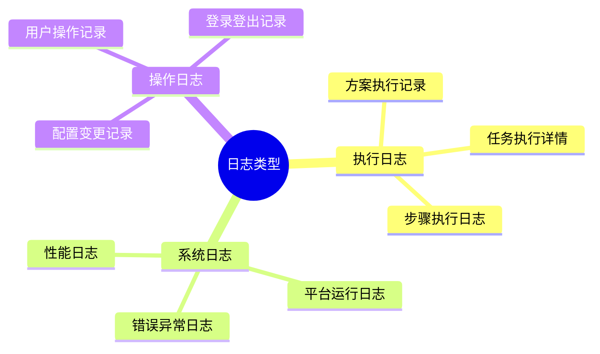
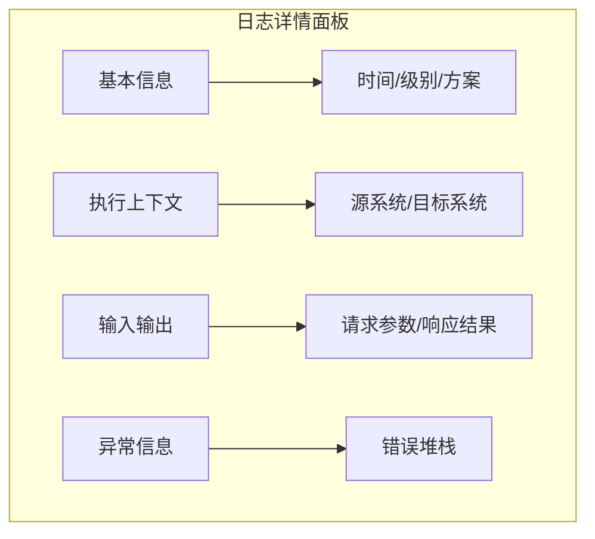
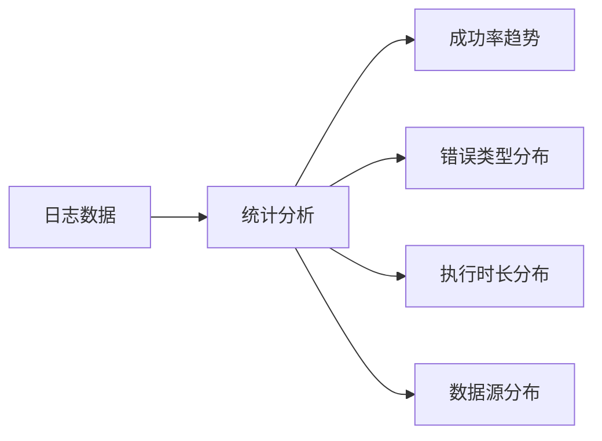
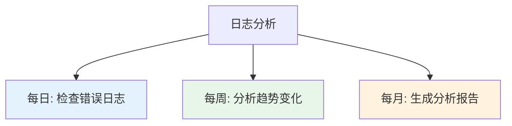

# 日志管理

日志管理模块帮助您查看、分析和管理集成方案的执行日志，便于问题排查和审计追踪。

## 日志概述

### 日志类型

轻易云 iPaaS 记录以下类型的日志：



### 日志内容

一条典型的执行日志包含：

```json
{
  "timestamp": "2024-01-01T12:00:00.000Z",
  "level": "INFO",
  "taskId": "task_123456",
  "schemeId": "scheme_abc",
  "schemeName": "订单同步",
  "message": "成功获取 100 条数据",
  "context": {
    "source": "金蝶云星空",
    "target": "旺店通",
    "recordCount": 100
  },
  "duration": 2500,
  "traceId": "trace_xyz789"
}
```

## 日志查看

### 日志查询界面

日志查询支持多种筛选条件：

| 筛选条件 | 说明 | 示例 |
|---------|------|------|
| 时间范围 | 日志产生的时间 | 最近 1 小时、今天、自定义 |
| 方案名称 | 集成方案名称 | 订单同步 |
| 任务 ID | 具体任务实例 | task_123456 |
| 日志级别 | 日志严重程度 | INFO、WARN、ERROR |
| 关键字 | 日志内容搜索 | timeout、success |

### 日志级别说明

| 级别 | 颜色 | 说明 | 使用场景 |
|-----|------|------|---------|
| DEBUG | 灰色 | 调试信息 | 开发调试 |
| INFO | 蓝色 | 普通信息 | 正常流程记录 |
| WARN | 黄色 | 警告信息 | 非致命异常 |
| ERROR | 红色 | 错误信息 | 执行失败 |
| FATAL | 深红 | 致命错误 | 系统级错误 |

### 日志详情

点击日志条目可查看详细信息：



## 日志分析

### 统计分析

提供多维度的日志统计：



### 错误分析

自动聚类分析错误日志：

| 错误类型 | 占比 | 趋势 |
|---------|------|------|
| 连接超时 | 45% | ↑ 上升 |
| 认证失败 | 30% | → 持平 |
| 数据格式错误 | 15% | ↓ 下降 |
| 其他 | 10% | → 持平 |

### 关联分析

追踪相关联的日志：

```text
traceId: trace_xyz789
├── [12:00:00] 任务开始执行
├── [12:00:01] 连接源系统成功
├── [12:00:02] 获取数据 100 条
├── [12:00:03] 数据转换完成
├── [12:00:05] 写入目标系统成功
└── [12:00:05] 任务执行成功
```

## 日志导出

### 导出方式

| 方式 | 说明 | 适用场景 |
|-----|------|---------|
| 即时导出 | 导出当前查询结果 | 小批量数据 |
| 定时导出 | 按周期自动导出 | 定期归档 |
| API 导出 | 通过 API 获取日志 | 系统集成 |

### 导出格式

支持多种导出格式：

- **JSON**：完整结构化数据
- **CSV**：表格形式，便于 Excel 分析
- **TXT**：纯文本格式

### 导出示例

```bash
# 导出最近 1 小时的错误日志
curl -X GET "https://api.qeasy.cloud/v1/logs/export" \
  -H "Authorization: Bearer token" \
  -d "startTime=2024-01-01T11:00:00Z" \
  -d "endTime=2024-01-01T12:00:00Z" \
  -d "level=ERROR" \
  -d "format=csv"
```

## 日志保留策略

### 自动清理

配置日志自动清理规则：

```json
{
  "retentionPolicy": {
    "DEBUG": "7d",
    "INFO": "30d",
    "WARN": "90d",
    "ERROR": "365d",
    "FATAL": "730d"
  }
}
```

### 归档存储

超过保留期的日志自动归档：

| 存储类型 | 保留时长 | 访问方式 |
|---------|---------|---------|
| 热存储 | 30 天 | 实时查询 |
| 温存储 | 90 天 | 延迟查询（秒级） |
| 冷存储 | 1 年 | 归档查询（分钟级） |

## 审计日志

### 操作审计

记录用户的所有操作：

```json
{
  "timestamp": "2024-01-01T12:00:00Z",
  "userId": "user_123",
  "username": "张三",
  "action": "SCHEME_UPDATE",
  "resourceType": "integration_scheme",
  "resourceId": "scheme_abc",
  "details": {
    "before": { "name": "旧名称" },
    "after": { "name": "新名称" }
  },
  "ip": "192.168.1.1",
  "userAgent": "Mozilla/5.0..."
}
```

### 审计事件类型

| 事件类型 | 说明 |
|---------|------|
| USER_LOGIN | 用户登录 |
| USER_LOGOUT | 用户登出 |
| SCHEME_CREATE | 创建方案 |
| SCHEME_UPDATE | 更新方案 |
| SCHEME_DELETE | 删除方案 |
| SCHEME_EXECUTE | 执行方案 |
| CONNECTOR_CREATE | 创建连接器 |
| CONNECTOR_UPDATE | 更新连接器 |
| CONFIG_CHANGE | 配置变更 |

## 日志告警

### 基于日志的告警

配置日志关键字告警：

```json
{
  "logAlertRules": [
    {
      "name": "数据库连接失败告警",
      "pattern": "Connection refused|Too many connections",
      "level": "ERROR",
      "threshold": 5,
      "timeWindow": "5m",
      "channels": ["email", "dingtalk"]
    }
  ]
}
```

### 告警配置参数

| 参数 | 说明 | 示例 |
|-----|------|------|
| pattern | 匹配模式 | 正则表达式 |
| level | 日志级别 | ERROR |
| threshold | 触发阈值 | 5 次 |
| timeWindow | 时间窗口 | 5 分钟 |

## 最佳实践

### 1. 日志规范

统一日志格式和内容规范：

```javascript
// 好的日志
logger.info("订单同步完成", {
  orderCount: 100,
  source: "kingdee",
  target: "wangdian",
  duration: 2500
});

// 避免这样的日志
logger.info("ok");
```

### 2. 敏感信息处理

日志中避免记录敏感信息：

| 敏感类型 | 处理方式 | 示例 |
|---------|---------|------|
| 密码 | 完全脱敏 | `******` |
| 手机号 | 部分脱敏 | `138****8000` |
| 身份证号 | 部分脱敏 | `110**********1234` |
| API Key | 完全脱敏 | `ak-******` |

### 3. 日志采样

高频任务可开启日志采样：

```json
{
  "logSampling": {
    "enabled": true,
    "rate": 0.1,
    "errorAlways": true
  }
}
```

**说明**：

- rate: 0.1 表示只记录 10% 的正常日志
- errorAlways: 错误日志始终记录

### 4. 日志分析周期

建议的分析检查周期：



### 5. 故障排查流程

基于日志的故障排查流程：

1. **定位时间范围**：根据问题发生时间缩小日志范围
2. **筛选错误级别**：重点关注 ERROR 和 FATAL 级别
3. **查找关键字**：搜索错误信息关键字
4. **追踪调用链**：通过 traceId 追踪完整调用链路
5. **分析上下文**：查看错误前后的相关日志
