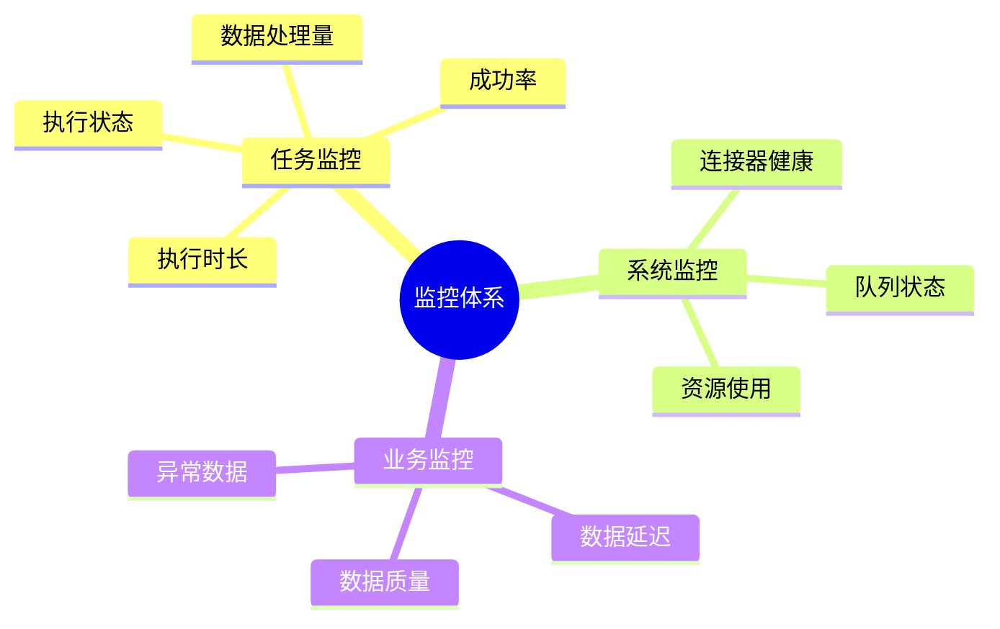
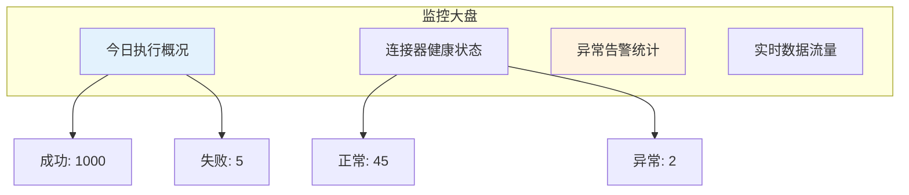
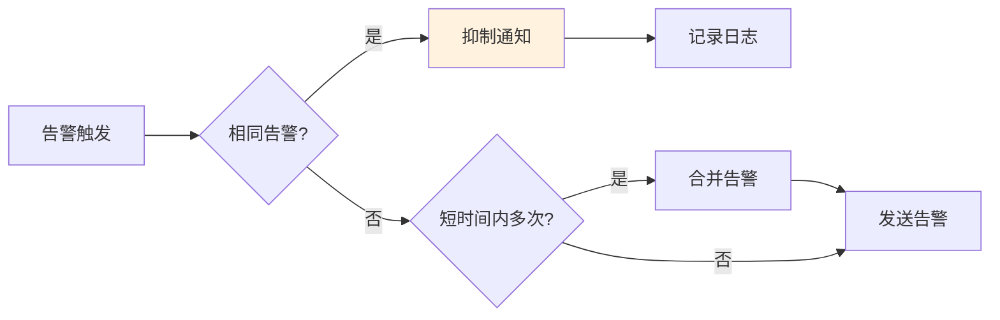
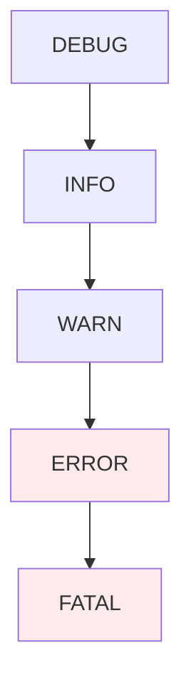
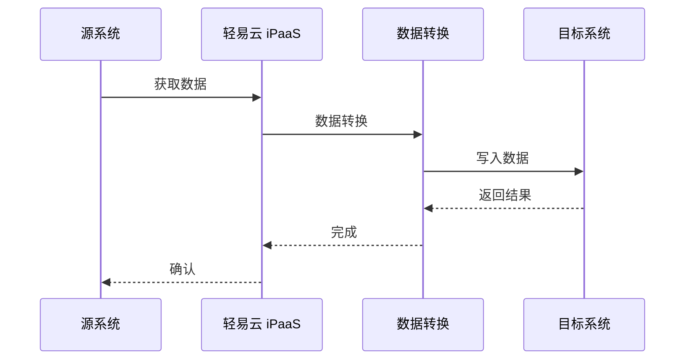
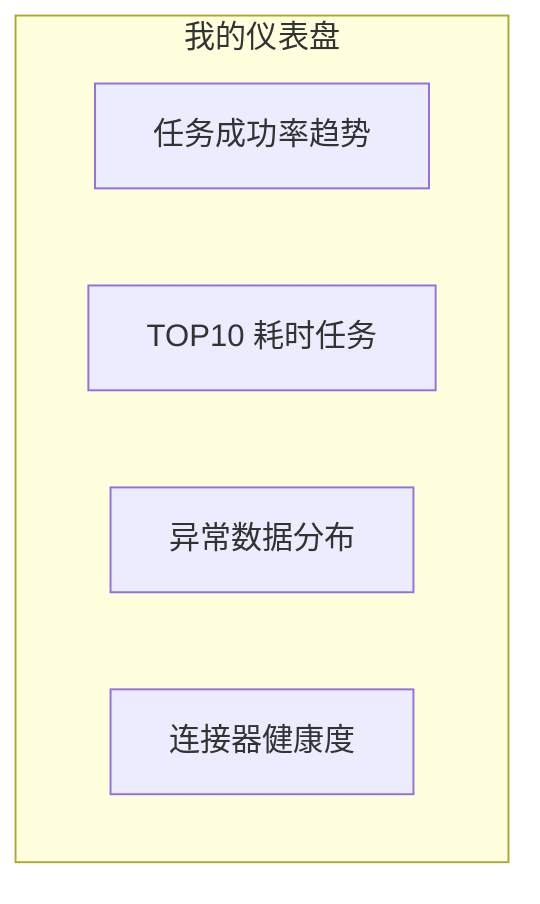
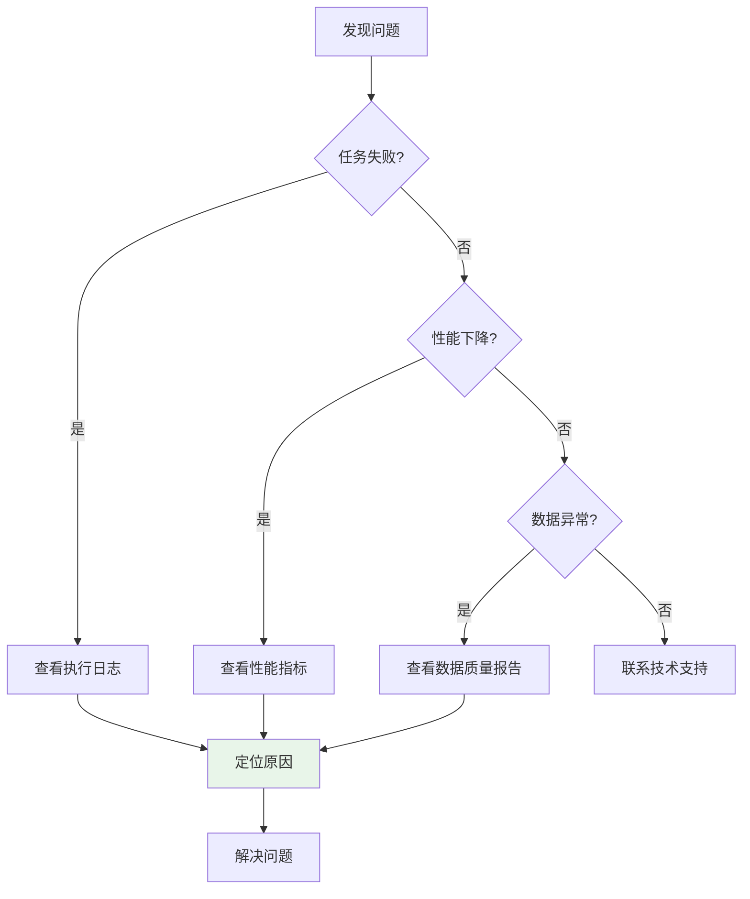
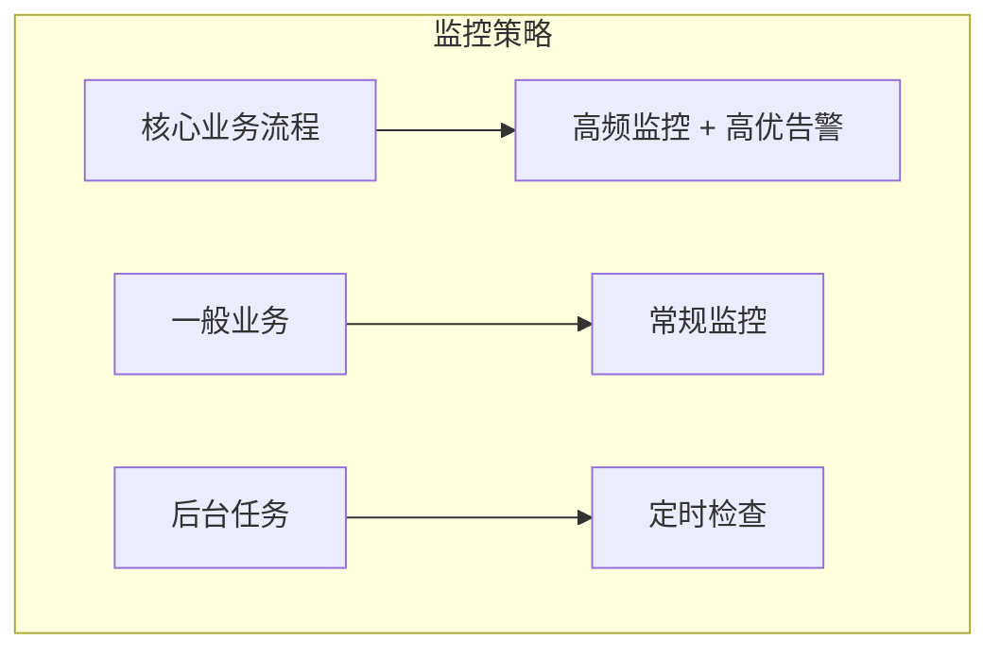

# 监控告警

监控告警模块帮助您实时掌握集成系统的运行状态，及时发现并处理问题。

## 监控概述

### 监控范围

轻易云 iPaaS 提供全方位的监控能力：



### 监控数据保留

| 数据类型 | 保留时长 | 说明 |
|---------|---------|------|
| 实时数据 | 7 天 | 秒级粒度 |
| 历史数据 | 90 天 | 分钟级粒度 |
| 归档数据 | 1 年 | 小时级粒度 |

## 实时监控

### 监控大盘

监控大盘提供全局视图：



### 关键指标

| 指标 | 说明 | 计算公式 |
|-----|------|---------|
| 任务成功率 | 成功任务占比 | 成功次数 / 总次数 × 100% |
| 平均执行时长 | 任务平均耗时 | 总耗时 / 任务数 |
| 吞吐量 | 单位时间处理量 | 处理记录数 / 时间 |
| 延迟时间 | 数据产生到处理的时间差 | 当前时间 - 数据时间 |

## 告警管理

### 告警规则

配置告警触发条件：

```json
{
  "alertRules": [
    {
      "name": "任务失败告警",
      "condition": "task_failed",
      "threshold": 1,
      "severity": "high"
    },
    {
      "name": "执行超时告警",
      "condition": "execution_timeout",
      "threshold": 3600,
      "severity": "medium"
    },
    {
      "name": "成功率下降",
      "condition": "success_rate",
      "threshold": 95,
      "timeWindow": "1h",
      "severity": "critical"
    }
  ]
}
```

### 告警级别

| 级别 | 颜色 | 响应时间 | 通知方式 |
|-----|------|---------|---------|
| P0-紧急 | 红色 | 立即 | 电话 + 短信 + 邮件 |
| P1-严重 | 橙色 | 5 分钟 | 短信 + 邮件 + 钉钉 |
| P2-一般 | 黄色 | 30 分钟 | 邮件 + 钉钉 |
| P3-提示 | 蓝色 | 4 小时 | 邮件 |

### 告警收敛

防止告警风暴：



**收敛策略**：

| 策略 | 说明 |
|-----|------|
| 时间抑制 | 相同告警 5 分钟内只发一次 |
| 数量抑制 | 同类型告警超过 10 条合并发送 |
| 升级策略 | 长时间未处理升级告警级别 |

## 通知渠道

### 支持的渠道

| 渠道 | 配置方式 | 适用场景 |
|-----|---------|---------|
| 邮件 | SMTP 配置 | 正式通知、报表 |
| 短信 | 短信网关 | 紧急告警 |
| 钉钉 | 群机器人 | 团队通知 |
| 企业微信 | 群机器人 | 企业通知 |
| 飞书 | 群机器人 | 协作通知 |
| Webhook | 自定义地址 | 系统集成 |

### 钉钉通知配置

1. 在钉钉群中添加「自定义机器人」
2. 获取 Webhook 地址
3. 在轻易云控制台配置：

```json
{
  "channel": "dingtalk",
  "config": {
    "webhook": "https://oapi.dingtalk.com/robot/send?access_token=xxx",
    "secret": "签名密钥",
    "atMobiles": ["13800138000"],
    "isAtAll": false
  }
}
```

## 日志管理

### 日志类型

| 类型 | 内容 | 级别 |
|-----|------|------|
| 执行日志 | 任务执行过程 | INFO/ERROR |
| 调试日志 | 调试信息 | DEBUG |
| 系统日志 | 平台运行日志 | INFO/WARN/ERROR |
| 操作日志 | 用户操作记录 | INFO |

### 日志查询

支持多维度日志查询：

```text
时间范围: 2024-01-01 至 2024-01-31
任务名称: 订单同步
执行状态: 失败
关键字: timeout
```

### 日志级别



| 级别 | 说明 | 输出 |
|-----|------|------|
| DEBUG | 调试信息 | 开发环境 |
| INFO | 普通信息 | 默认 |
| WARN | 警告信息 | 默认 |
| ERROR | 错误信息 | 默认 |
| FATAL | 致命错误 | 默认 |

## 链路追踪

### 调用链分析

追踪数据在集成流程中的完整路径：



### 性能分析

识别性能瓶颈：

| 阶段 | 耗时 | 占比 |
|-----|------|------|
| 数据获取 | 2s | 20% |
| 数据转换 | 5s | 50% |
| 数据写入 | 3s | 30% |

## 仪表盘

### 自定义仪表盘

创建个性化的监控视图：



### 图表类型

| 类型 | 适用场景 |
|-----|---------|
| 折线图 | 趋势变化 |
| 柱状图 | 数值对比 |
| 饼图 | 占比分布 |
| 表格 | 详细数据 |
| 热力图 | 时间分布 |

## 故障排查

### 常见问题排查



### 排查工具

| 工具 | 用途 |
|-----|------|
| 执行日志 | 查看详细执行过程 |
| 链路追踪 | 分析数据流转 |
| 性能分析 | 定位性能瓶颈 |
| 数据采样 | 查看具体数据 |

## 最佳实践

### 1. 告警策略

- **分层告警**：不同级别问题用不同方式通知
- **避免噪音**：合理设置阈值，避免告警疲劳
- **及时响应**：建立告警响应 SLA

### 2. 监控范围



### 3. 日志规范

- 统一日志格式
- 包含关键上下文信息
- 敏感信息脱敏
- 合理设置日志级别

### 4. 持续优化

- 定期 review 告警规则
- 优化无效告警
- 完善监控覆盖
- 更新仪表盘
