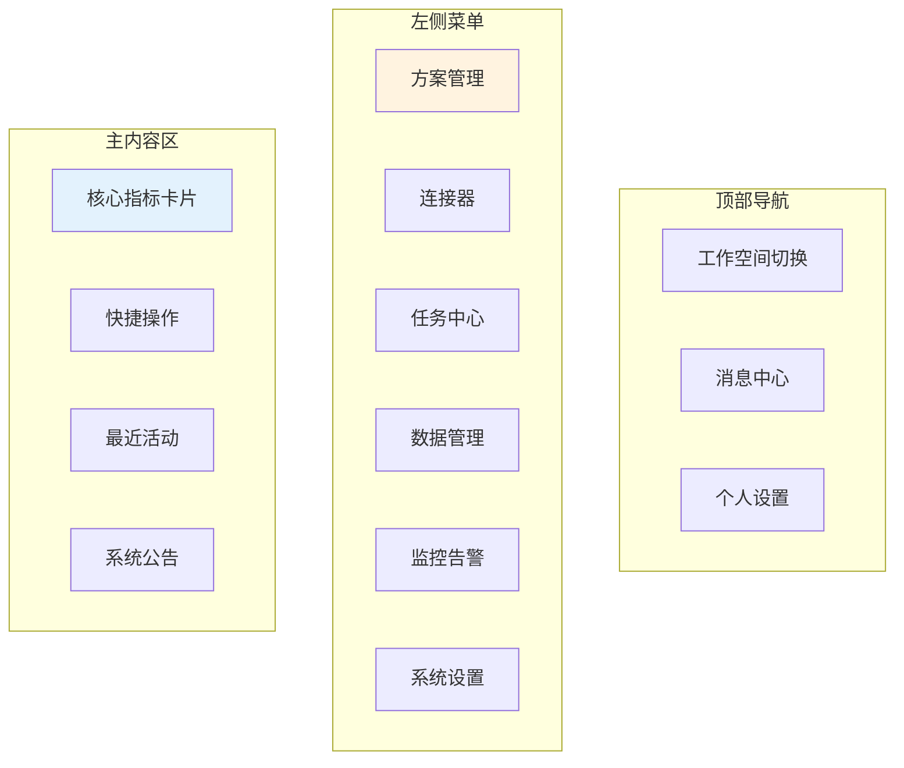
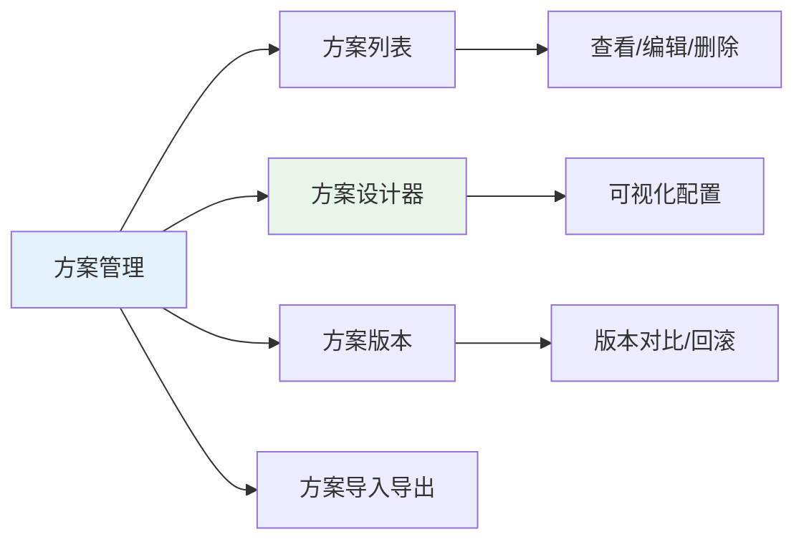
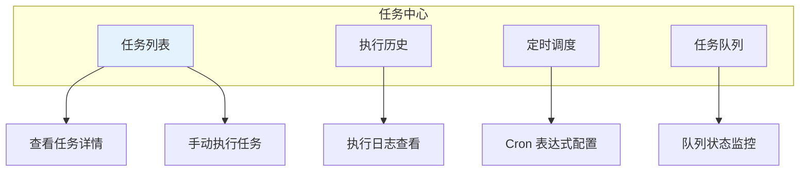
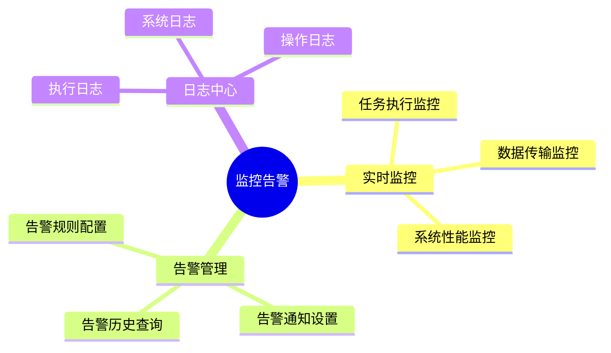

# 平台总览

本文档介绍轻易云 iPaaS 平台的核心功能模块和操作界面，帮助您快速了解平台的全貌。

## 控制台首页

登录轻易云 iPaaS 后，您将看到控制台首页，这里展示了您工作空间的核心指标和快捷入口。

### 首页布局



### 核心指标

首页展示以下关键指标：

| 指标 | 说明 | 更新频率 |
|-----|------|---------|
| 运行中方案数 | 当前启用的集成方案数量 | 实时 |
| 今日任务执行次数 | 当天成功执行的任务次数 | 实时 |
| 今日数据传输量 | 当天传输的数据记录数 | 实时 |
| 异常告警数 | 待处理的异常告警数量 | 实时 |
| 连接器健康度 | 已配置连接器的可用比例 | 5 分钟 |

## 功能模块

### 方案管理

方案管理是轻易云 iPaaS 的核心功能，用于创建、配置和管理集成方案。



**主要功能**：

- 创建新方案
- 编辑方案配置
- 启停方案
- 查看方案执行历史
- 方案版本管理
- 批量导入导出

### 连接器

连接器用于建立与外部系统的连接，是数据集成的基础。

**连接器管理功能**：

| 功能 | 说明 |
|-----|------|
| 连接器列表 | 查看已配置的所有连接器 |
| 新建连接器 | 添加新的系统连接 |
| 连接测试 | 验证连接配置是否正确 |
| 凭证管理 | 管理 API Key、密码等敏感信息 |
| 连接监控 | 查看连接状态和性能指标 |

### 任务中心

任务中心用于管理和监控所有集成任务的执行情况。



**任务状态说明**：

| 状态 | 颜色 | 说明 |
|-----|------|------|
| 等待中 | 灰色 | 任务已提交，等待执行 |
| 执行中 | 蓝色 | 任务正在运行 |
| 成功 | 绿色 | 任务执行成功 |
| 失败 | 红色 | 任务执行失败 |
| 部分成功 | 橙色 | 部分数据处理成功 |
| 已取消 | 灰色 | 任务被手动取消 |

### 数据管理

数据管理模块提供数据查询、调试和异常处理功能。

**功能列表**：

- **数据查询**：查看源系统和目标系统的数据
- **数据调试**：单条数据调试和批量调试
- **异常数据**：查看和处理异常数据
- **数据队列**：管理数据暂存队列
- **数据导出**：导出集成数据

### 监控告警

监控告警模块帮助您实时掌握集成系统的运行状态。



## 设计器界面

方案设计器是配置集成方案的核心工具，采用可视化拖拽方式。

### 设计器布局

```text
┌─────────────────────────────────────────────────────────────┐
│  工具栏：保存、发布、调试、导入、导出                          │
├──────────┬──────────────────────────────────┬───────────────┤
│          │                                  │               │
│  组件库   │         画布区域                  │   属性面板    │
│          │                                  │               │
│ - 连接器  │    ┌──────────────────┐         │ - 基础信息    │
│ - 转换器  │    │   源系统连接器    │         │ - 连接配置    │
│ - 处理器  │    └────────┬─────────┘         │ - 字段映射    │
│          │             │                    │ - 转换规则    │
│          │             ▼                    │ - 高级设置    │
│          │    ┌──────────────────┐         │               │
│          │    │   数据转换处理器  │         │               │
│          │    └────────┬─────────┘         │               │
│          │             │                    │               │
│          │             ▼                    │               │
│          │    ┌──────────────────┐         │               │
│          │    │   目标系统连接器  │         │               │
│          │    └──────────────────┘         │               │
│          │                                  │               │
└──────────┴──────────────────────────────────┴───────────────┘
```

### 组件类型

| 组件类型 | 说明 | 示例 |
|---------|------|------|
| 源连接器 | 数据来源 | 金蝶云星空、MySQL、API |
| 目标连接器 | 数据去向 | 用友 U8+、MongoDB、钉钉 |
| 转换器 | 数据处理 | 字段映射、值格式化、过滤器 |
| 路由 | 流程控制 | 条件分支、并行处理、聚合 |

## 快捷操作

### 常用快捷键

| 快捷键 | 功能 | 说明 |
|-------|------|------|
| Ctrl + S | 保存方案 | 保存当前方案 |
| Ctrl + D | 调试运行 | 调试当前方案 |
| Ctrl + Z | 撤销 | 撤销上一步操作 |
| Ctrl + Y | 重做 | 重做上一步操作 |
| Delete | 删除 | 删除选中的组件 |

### 快捷入口

控制台首页提供以下快捷操作：

- **创建方案**：快速进入方案设计器
- **添加连接器**：快速添加新的系统连接
- **查看告警**：快速查看待处理告警
- **执行记录**：快速查看最近执行的任务

## 个人设置

### 账号信息

在「个人设置」中，您可以管理：

- 基本信息（头像、昵称、手机号）
- 密码修改
- 第三方账号绑定
- 登录历史查看

### 通知设置

配置接收通知的方式：

| 通知类型 | 邮件 | 短信 | 站内信 |
|---------|------|------|-------|
| 任务失败 | ✅ | ✅ | ✅ |
| 系统告警 | ✅ | ✅ | ✅ |
| 方案执行完成 | ✅ | — | ✅ |
| 系统公告 | ✅ | — | ✅ |

## 工作空间管理

### 工作空间设置

作为工作空间管理员，您可以：

- 修改工作空间信息
- 管理成员和权限
- 配置资源配额
- 查看使用统计

### 成员管理

支持的角色类型：

| 角色 | 权限 | 适用对象 |
|-----|------|---------|
| 管理员 | 全部权限 | 技术负责人 |
| 开发者 | 方案管理、连接器配置 | 开发人员 |
| 运维 | 任务监控、告警处理 | 运维人员 |
| 只读 | 查看权限 | 业务人员 |

## 帮助与支持

平台内置多种帮助资源：

- **操作引导**：首次使用时的分步引导
- **帮助文档**：内置完整的产品文档
- **视频教程**：快速上手的视频资源
- **在线客服**：7×24 小时在线支持

> [!TIP]
> 点击页面右下角的「帮助」按钮，可以快速访问帮助文档或联系在线客服。
