# 流程编排

流程编排是轻易云 iPaaS 的高级功能，支持设计复杂的集成流程，实现多系统、多步骤的业务协同。

## 流程编排概述

### 什么是流程编排

流程编排（Process Orchestration）是指将多个独立的集成任务按照业务逻辑组织成完整的业务流程，实现：

- **顺序执行**：按预定顺序执行多个任务
- **条件分支**：根据条件选择不同的执行路径
- **并行处理**：同时执行多个独立的任务
- **循环迭代**：重复执行某个任务直到满足条件

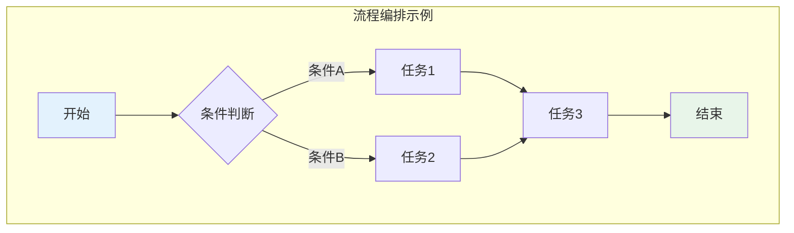

### 应用场景

| 场景 | 说明 | 示例 |
|-----|------|------|
| 订单全链路 | 从下单到发货的完整流程 | 订单 → 库存 → 发货 → 财务 |
| 审批流程 | 多级审批的业务流程 | 提交 → 部门审批 → 财务审批 → 归档 |
| 数据加工 | 多阶段数据处理 | 采集 → 清洗 → 转换 → 分析 |
| 异常处理 | 故障恢复流程 | 检测 → 告警 → 处理 → 恢复 |

## 流程设计基础

### 流程组件

轻易云 iPaaS 提供以下流程组件：

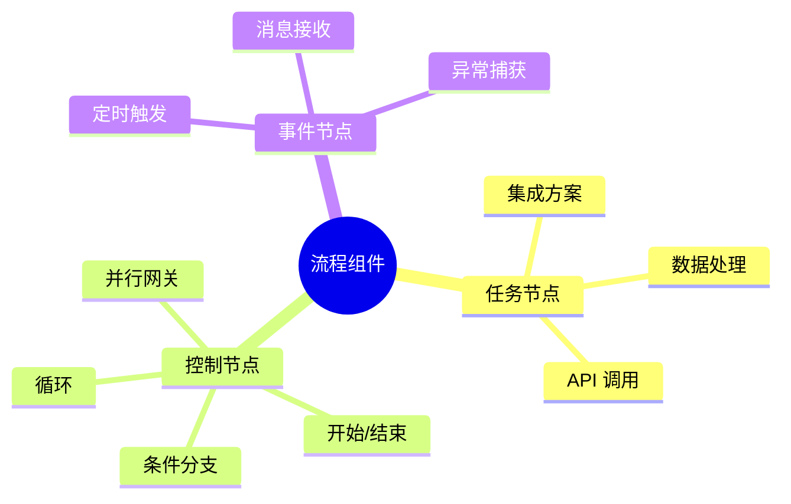

### 流程变量

流程变量用于在流程的不同节点间传递数据：

```javascript
// 定义变量
var orderId = context.getVariable("orderId");
var amount = context.getVariable("amount");

// 设置变量
context.setVariable("status", "success");
context.setVariable("result", resultData);
```

**变量作用域**：

| 作用域 | 说明 | 生命周期 |
|-------|------|---------|
| 全局变量 | 整个流程可见 | 流程执行期间 |
| 节点变量 | 当前节点可见 | 节点执行期间 |
| 临时变量 | 临时计算使用 | 单次使用 |

## 流程控制模式

### 顺序执行

最基本的流程模式，按顺序执行一系列任务：

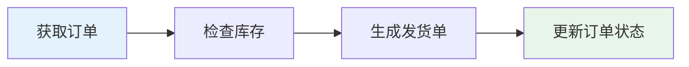

### 条件分支

根据条件判断执行不同的分支：

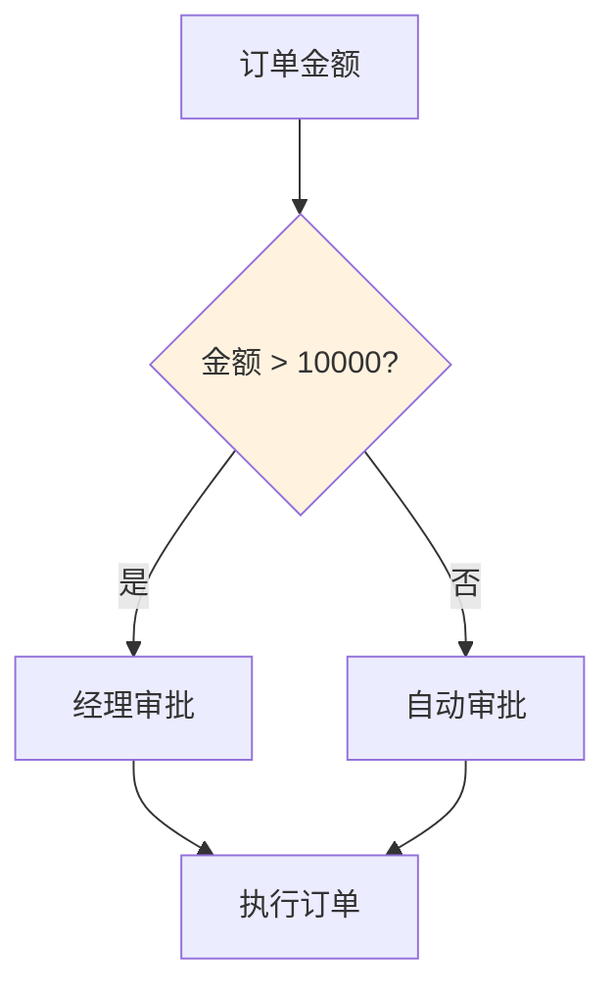

**条件表达式示例**：

```javascript
// 简单条件
amount > 10000

// 复合条件
amount > 10000 && status == 'pending'

// 包含判断
category in ['A', 'B', 'C']

// 正则匹配
/^VIP/.test(customerLevel)
```

### 并行处理

同时执行多个独立的任务：

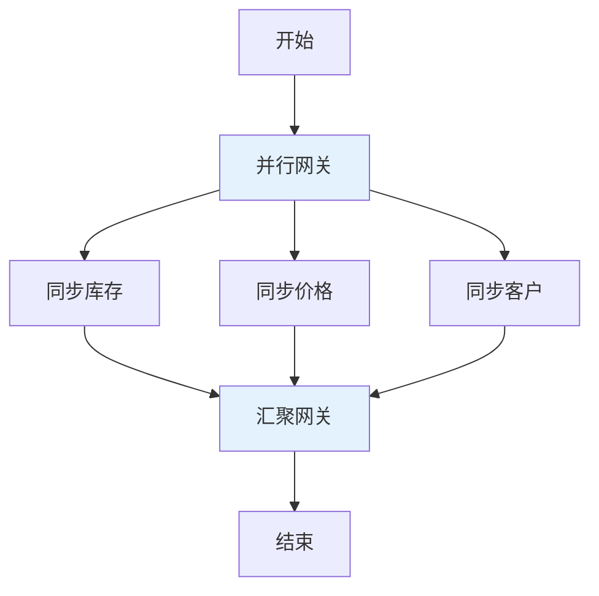

**汇聚策略**：

| 策略 | 说明 |
|-----|------|
| 全部完成 | 等待所有分支完成 |
| 任意完成 | 任一分支完成即继续 |
| 数量完成 | 指定数量的分支完成 |

### 循环迭代

重复执行某个任务直到满足条件：

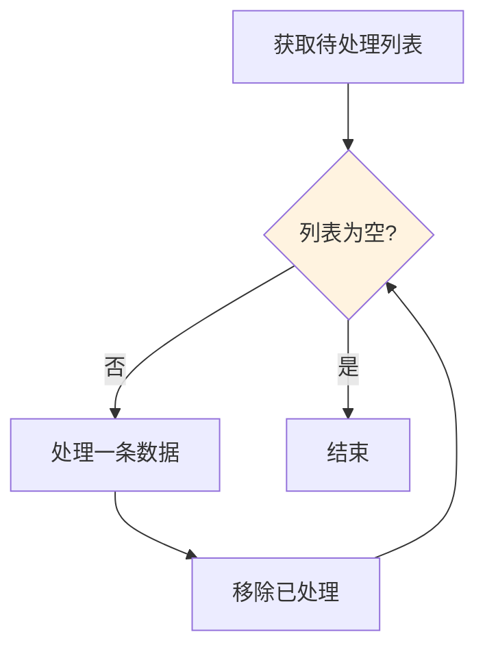

**循环类型**：

| 类型 | 说明 | 示例 |
|-----|------|------|
| For 循环 | 固定次数循环 | 处理 10 页数据 |
| While 循环 | 条件循环 | 直到无数据为止 |
| ForEach 循环 | 遍历集合 | 处理列表中的每个元素 |

## 异常处理

### 异常捕获

在流程中设置异常处理节点：

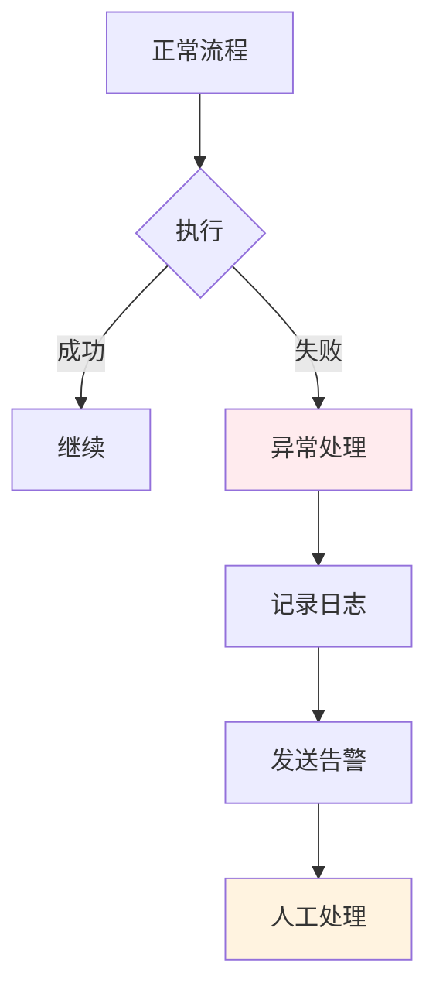

### 补偿机制

对于已执行的操作进行回滚：

```javascript
// 正向操作
context.execute("创建订单");

try {
    context.execute("扣减库存");
    context.execute("扣减余额");
} catch (error) {
    // 补偿操作
    context.execute("恢复库存");
    context.execute("恢复余额");
    throw error;
}
```

## 子流程

### 子流程调用

将复杂的流程拆分为多个可复用的子流程：

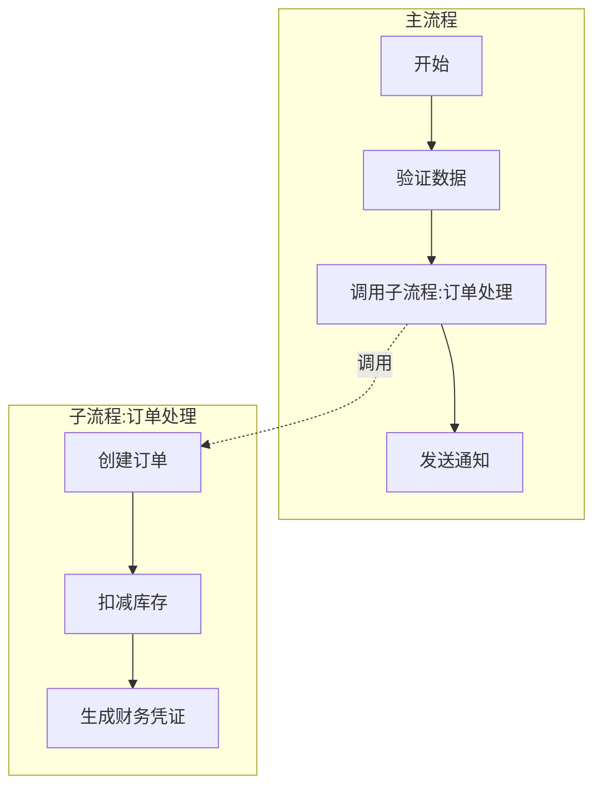

**子流程优势**：

- **复用性**：多处调用同一子流程
- **可维护性**：修改一处，全局生效
- **可读性**：主流程更简洁

## 事件驱动

### 定时触发

按预定时间触发流程：

```json
{
  "triggerType": "scheduler",
  "cron": "0 0 2 * * ?",
  "description": "每天凌晨 2 点执行"
}
```

### 消息触发

接收消息触发流程执行：

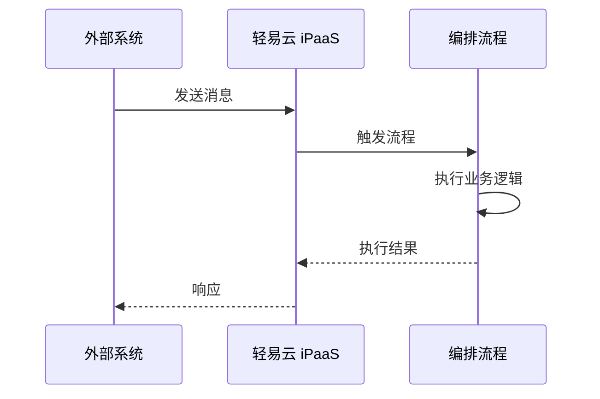

## 流程监控

### 执行状态跟踪

实时监控流程执行状态：

| 状态 | 颜色 | 说明 |
|-----|------|------|
| 等待 | 灰色 | 等待触发条件 |
| 运行 | 蓝色 | 正在执行 |
| 成功 | 绿色 | 执行成功 |
| 失败 | 红色 | 执行失败 |
| 暂停 | 黄色 | 人工暂停 |

### 流程实例管理

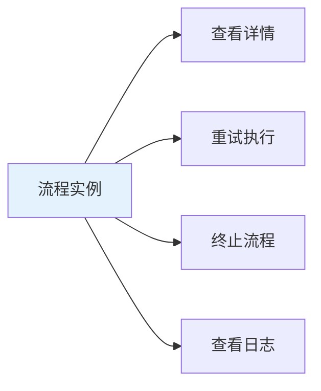

## 最佳实践

### 1. 流程拆分原则

- 单一职责：每个流程只做一件事
- 适度粒度：既不过大也不过小
- 可复用性：提取公共子流程

### 2. 异常处理策略

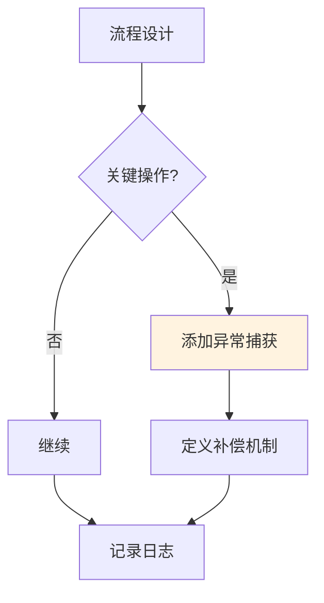

### 3. 性能优化

- 合理使用并行网关提高吞吐量
- 设置适当的超时时间
- 避免不必要的循环
- 使用异步方式处理非关键路径

### 4. 版本管理

- 流程变更前创建版本备份
- 使用灰度发布验证新流程
- 保留历史版本便于回滚

## 示例：订单处理流程

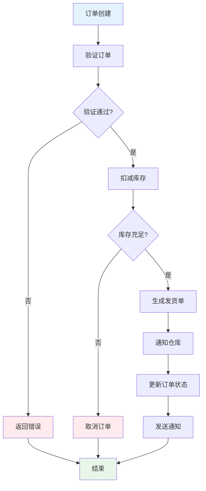

这个示例展示了订单处理的完整流程，包括：

- 数据验证
- 条件判断
- 库存检查
- 异常处理
- 状态更新
- 通知发送
