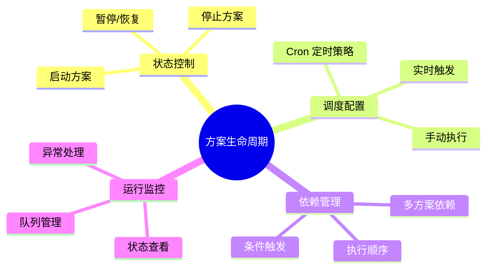
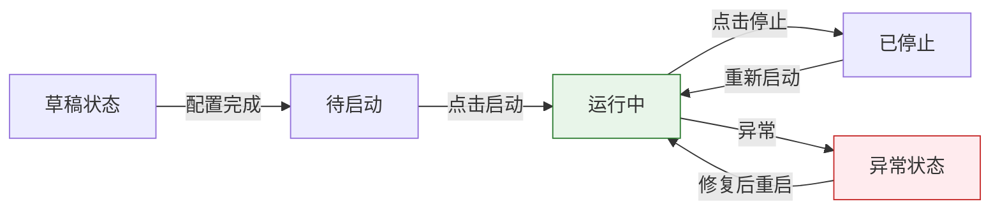
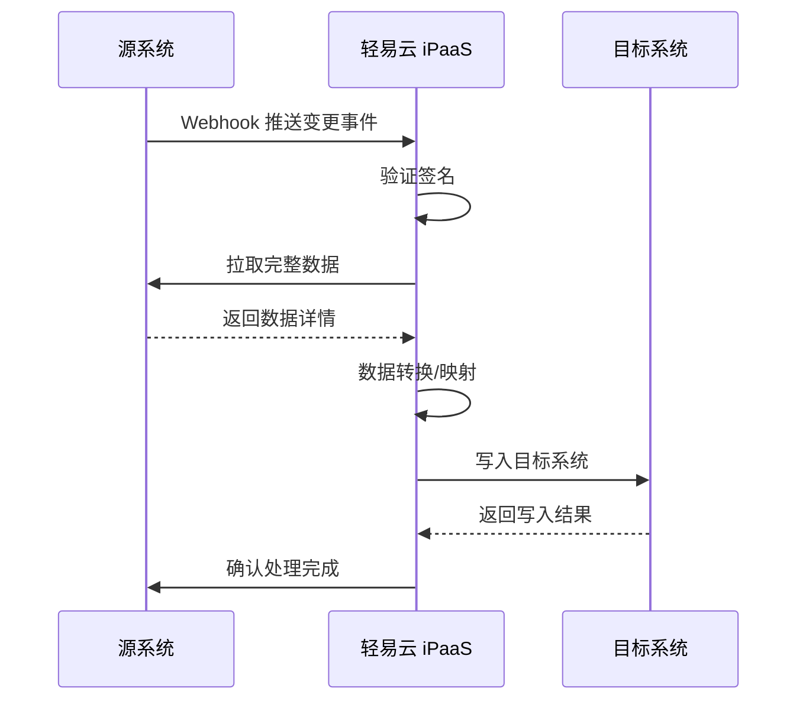
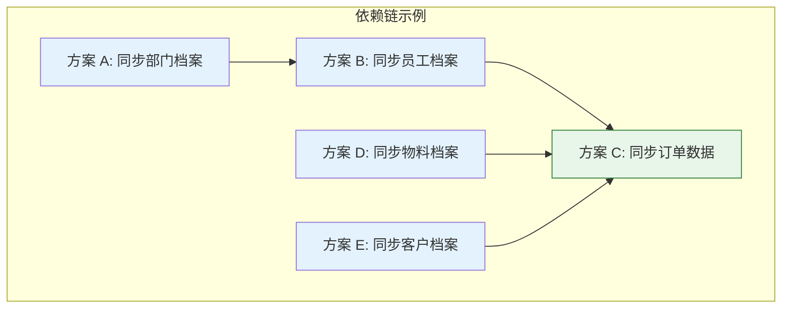
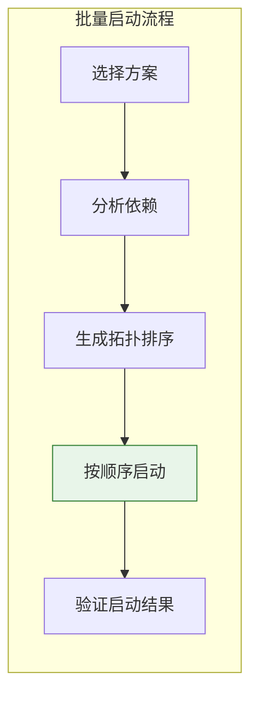
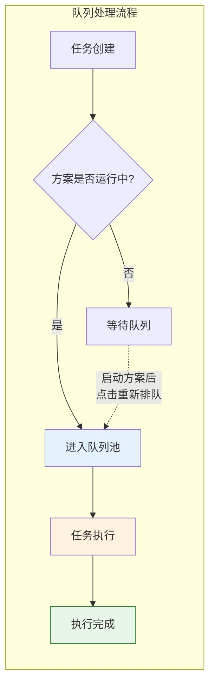

# 启动与定时策略配置

本文档详细介绍如何启动和停止集成方案、配置定时调度策略，以及监控方案运行状态。掌握这些操作后，你可以灵活控制数据同步任务的执行时机和频率，确保业务数据按需流转。

---

## 功能概述

集成方案的生命周期管理包含以下核心能力：



---

## 启动与停止方案

### 方案启动

集成方案创建完成后，需要手动启动才能开始执行数据同步任务。

> [!IMPORTANT]
> 方案启动后，表头信息（如方案名称、源/目标平台类型）将不再支持修改，但表体的平台配置信息可以继续修改，修改后会刷新正在运行的缓存数据。

**启动步骤：**

1. 进入**集成方案**列表页面
2. 找到目标方案，点击操作列的**启动**按钮
3. 系统弹出确认对话框，显示方案的调度配置信息
4. 点击**确认启动**，方案状态变为「运行中」



### 方案停止

当需要暂停数据同步或进行配置调整时，可以停止运行中的方案。

**停止步骤：**

1. 在方案列表中找到运行中的方案
2. 点击操作列的**停止**按钮
3. 选择停止方式：
   - **立即停止**：中断当前正在执行的任务
   - ** graceful 停止**：等待当前批次完成后停止
4. 点击**确认停止**

> [!WARNING]
> 立即停止可能导致数据不一致，建议在非业务高峰期使用。graceful 停止会等待当前批次处理完成，更加安全。

### 启动前检查清单

在启动方案前，请确认以下事项：

| 检查项 | 说明 | 验证方式 |
|-------|------|---------|
| 连接器状态 | 源/目标平台连接器已配置且连接正常 | 查看连接器列表状态图标 |
| 字段映射 | 已配置源字段与目标字段的映射关系 | 进入方案详情查看映射配置 |
| 主键字段 | 源平台已配置主键字段 | 查看源平台配置页 |
| 调度策略 | 已设置定时策略或实时触发 | 查看调度配置页 |
| 请求参数 | 已配置必要的查询参数默认值 | 查看源平台请求参数配置 |

---

## 定时策略配置

轻易云 iPaaS 使用 Cron 表达式定义定时调度策略，支持灵活的同步频率配置。

### Cron 表达式语法

Cron 表达式由 5 个时间字段组成，格式如下：

```text
┌───────────── 分钟 (0 - 59)
│ ┌───────────── 小时 (0 - 23)
│ │ ┌───────────── 日期 (1 - 31)
│ │ │ ┌───────────── 月份 (1 - 12)
│ │ │ │ ┌───────────── 星期 (0 - 6, 0 表示星期日)
│ │ │ │ │
│ │ │ │ │
* * * * *
```

**特殊字符说明：**

| 字符 | 含义 | 示例 |
|-----|------|------|
| `*` | 匹配任意值 | `* * * * *` 表示每分钟执行 |
| `,` | 列出多个值 | `0 9,12 * * *` 表示 9 点和 12 点执行 |
| `-` | 定义范围 | `0 9-17 * * *` 表示 9 点到 17 点每小时执行 |
| `/` | 指定步长 | `*/5 * * * *` 表示每 5 分钟执行 |
| `?` | 不指定值（用于日期和星期互斥） | `0 0 1 * ?` 表示每月 1 号执行 |

### 常用配置示例

| Cron 表达式 | 执行频率说明 |
|------------|-------------|
| `*/5 * * * *` | 每 5 分钟执行一次 |
| `0 * * * *` | 每小时整点执行 |
| `0 */2 * * *` | 每 2 小时执行一次 |
| `0 9,18 * * *` | 每天 9:00 和 18:00 执行 |
| `0 9-18 * * 1-5` | 工作日 9:00 至 18:00 每小时执行 |
| `0 0 * * 0` | 每周日零点执行 |
| `0 0 1 * *` | 每月 1 号零点执行 |
| `0 30 2 * * 1` | 每周一 2:30 执行 |

### 配置步骤

1. 进入集成方案详情页，切换到**调度配置**标签
2. 选择调度类型为**定时调度**
3. 在 Cron 表达式输入框中填写表达式
4. 点击**验证表达式**，系统将显示下次执行时间
5. 点击**保存**完成配置

> [!TIP]
> 可以使用在线工具验证 Cron 表达式：[https://tool.lu/crontab](https://tool.lu/crontab)

---

## 实时触发配置

除了定时调度，轻易云 iPaaS 还支持实时触发模式，适用于对数据实时性要求较高的场景。

### 触发方式对比

| 触发方式 | 适用场景 | 延迟 | 资源占用 |
|---------|---------|------|---------|
| 定时调度 | 周期性批量同步 | 分钟级 | 低 |
| Webhook 实时触发 | 事件驱动型同步 | 秒级 | 中 |
| CDC 实时同步 | 数据库变更捕获 | 毫秒级 | 高 |

### Webhook 实时触发

通过接收源系统的 Webhook 推送实现实时触发。

**配置步骤：**

1. 在方案调度配置中选择**实时触发**
2. 选择触发类型为**Webhook**
3. 系统生成唯一的 Webhook URL
4. 在源系统配置 Webhook 回调地址
5. 配置触发事件类型（如数据创建、更新、删除）



> [!NOTE]
> Webhook 触发要求源系统支持事件推送机制。如不支持，请使用定时调度或 CDC 模式。

### CDC 实时同步

CDC（Change Data Capture，变更数据捕获）通过监听数据库日志实现数据变更的实时捕获。

**前置条件：**

- 源数据库支持 Binlog/MySQL、WAL/PostgreSQL 等日志机制
- 已开启数据库日志功能
- 配置数据库读取权限

**配置步骤：**

1. 在方案调度配置中选择**实时触发**
2. 选择触发类型为**CDC**
3. 配置 CDC 连接器参数（日志位置、监听表等）
4. 设置初始同步策略（全量 + 增量 / 仅增量）
5. 启动 CDC 监听任务

> [!IMPORTANT]
> CDC 模式为高级功能，需要额外的服务器资源。详细配置请参考 [CDC 实时同步](../advanced/cdc-realtime)。

---

## 多方案依赖与启动顺序

在复杂业务场景中，多个集成方案之间可能存在依赖关系，需要按照特定顺序执行。

### 依赖场景示例



### 配置方案依赖

1. 进入方案详情页，切换到**高级设置**标签
2. 找到**执行依赖**配置区域
3. 点击**添加依赖方案**
4. 选择前置方案（可多选）
5. 配置依赖条件：
   - **成功完成**：前置方案执行成功后才执行本方案
   - **任意状态**：前置方案执行结束后即执行（无论成功与否）
6. 保存配置

### 批量启动策略

当多个方案存在依赖关系时，建议使用批量启动功能：

**操作步骤：**

1. 在方案列表勾选需要启动的方案
2. 点击**批量启动**按钮
3. 系统分析方案依赖关系，自动生成启动顺序
4. 确认启动顺序无误后，点击**确认启动**



### 依赖循环检测

系统会自动检测方案间的循环依赖，如发现循环依赖将阻止启动并提示错误。

> [!WARNING]
> 避免配置循环依赖（如 A 依赖 B，B 依赖 C，C 又依赖 A），这会导致调度系统无法正常运行。

---

## 运行状态监控

### 方案状态说明

| 状态 | 说明 | 可执行操作 |
|-----|------|-----------|
| 草稿 | 方案创建中，尚未配置完成 | 编辑、删除 |
| 待启动 | 配置完成，等待启动 | 启动、编辑 |
| 运行中 | 方案正常运行 | 停止、查看日志 |
| 已停止 | 方案已手动停止 | 启动、编辑 |
| 异常 | 运行中出现错误 | 查看日志、重启 |
| 调度暂停 | 定时调度被临时暂停 | 恢复调度 |

### 队列池管理

方案启动后，数据任务进入队列池等待处理。在方案未启动时，队列中的任务不会真正进入队列池排队。

**队列池类型：**

| 队列类型 | 用途 | 查看路径 |
|---------|------|---------|
| 请求队列池 | 存储源系统数据查询任务 | 方案详情 → 请求队列 |
| 写入队列池 | 存储目标系统写入任务 | 方案详情 → 写入队列 |

**重新排队操作：**

当方案启动后，如发现队列中有未处理的任务，可以执行重新排队：

1. 进入方案详情页
2. 切换到**请求队列**或**写入队列**标签
3. 点击**重新排队**按钮
4. 系统将激活队列中的任务，使其进入执行流程



### 实时监控指标

在方案详情页的**运行监控**标签中，可查看以下指标：

| 指标 | 说明 | 正常范围 |
|-----|------|---------|
| 今日请求数 | 当天发起的源系统查询次数 | 根据业务而定 |
| 今日写入数 | 当天成功写入目标系统的记录数 | 根据业务而定 |
| 成功率 | 数据写入成功比例 | > 95% |
| 平均耗时 | 单次同步任务的平均执行时间 | < 5 分钟 |
| 队列堆积 | 待处理任务数量 | < 100 |

### 异常告警配置

为及时发现运行异常，建议配置告警规则：

1. 进入**监控告警**页面
2. 点击**新建告警规则**
3. 选择关联的集成方案
4. 配置触发条件：
   - 任务失败次数 > N 次
   - 队列堆积 > N 条
   - 任务耗时 > N 分钟
5. 设置告警通知方式（邮件/短信/钉钉）
6. 保存规则

---

## 最佳实践

### 定时策略设计建议

| 数据类型 | 建议频率 | 说明 |
|---------|---------|------|
| 基础档案 | 每天 1-2 次 | 部门、员工、物料等变化频率低 |
| 业务单据 | 每 5-15 分钟 | 订单、出入库等业务数据 |
| 实时库存 | 每分钟或实时 | 库存变化频繁，建议 CDC 模式 |
| 财务凭证 | 每天 1 次（夜间） | 避开业务高峰期 |

### 高可用配置

- **避免集中调度**：多个方案的执行时间错开，避免整点集中触发
- **设置超时控制**：为单个任务设置最大执行时间，防止死锁
- **配置重试策略**：失败任务自动重试，最大重试次数建议 3 次
- **监控队列深度**：队列堆积超过阈值时及时扩容或优化

### 故障排查

**方案启动失败：**

1. 检查连接器状态是否正常
2. 查看方案配置是否完整
3. 检查调度配置是否正确
4. 查看系统日志获取详细错误信息

**任务执行失败：**

1. 进入方案详情查看错误日志
2. 检查源系统连接状态
3. 检查数据映射是否存在字段类型不匹配
4. 验证请求参数是否正确

---

## 常见问题

**Q: 方案启动后多久会开始执行第一次同步？**

A: 取决于调度配置。如果是定时调度，将按照 Cron 表达式的下次执行时间触发；如果是实时触发，启动后立即开始监听变更。

**Q: 可以临时暂停定时调度而不停止方案吗？**

A: 可以。在方案详情页的调度配置中，点击**暂停调度**按钮。暂停期间方案保持运行状态，但不会触发新的同步任务。

**Q: 多个方案配置相同的执行时间会有冲突吗？**

A: 系统支持并发执行，但建议将方案执行时间错开，避免对源/目标系统造成瞬时压力。

**Q: 如何查看历史执行记录？**

A: 进入方案详情页，切换到**执行历史**标签，可查看每次执行的开始时间、结束时间、处理记录数、执行结果等详细信息。

---

## 相关文档

| 文档 | 说明 |
|-----|------|
| [创建集成方案](./create-integration) | 学习如何创建和配置集成方案 |
| [源平台配置](./source-platform-config) | 配置数据查询参数和主键字段 |
| [目标平台配置](./target-platform-config) | 配置数据写入规则和映射关系 |
| [监控告警](./monitoring-alerts) | 配置运行监控和异常告警 |
| [CDC 实时同步](../advanced/cdc-realtime) | 了解 CDC 实时同步的高级配置 |
