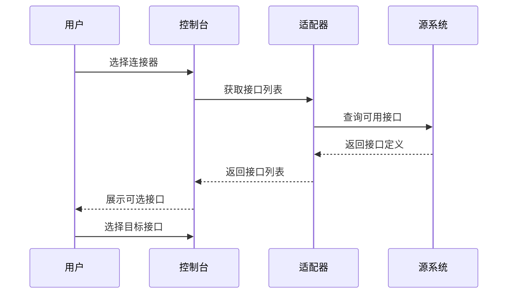
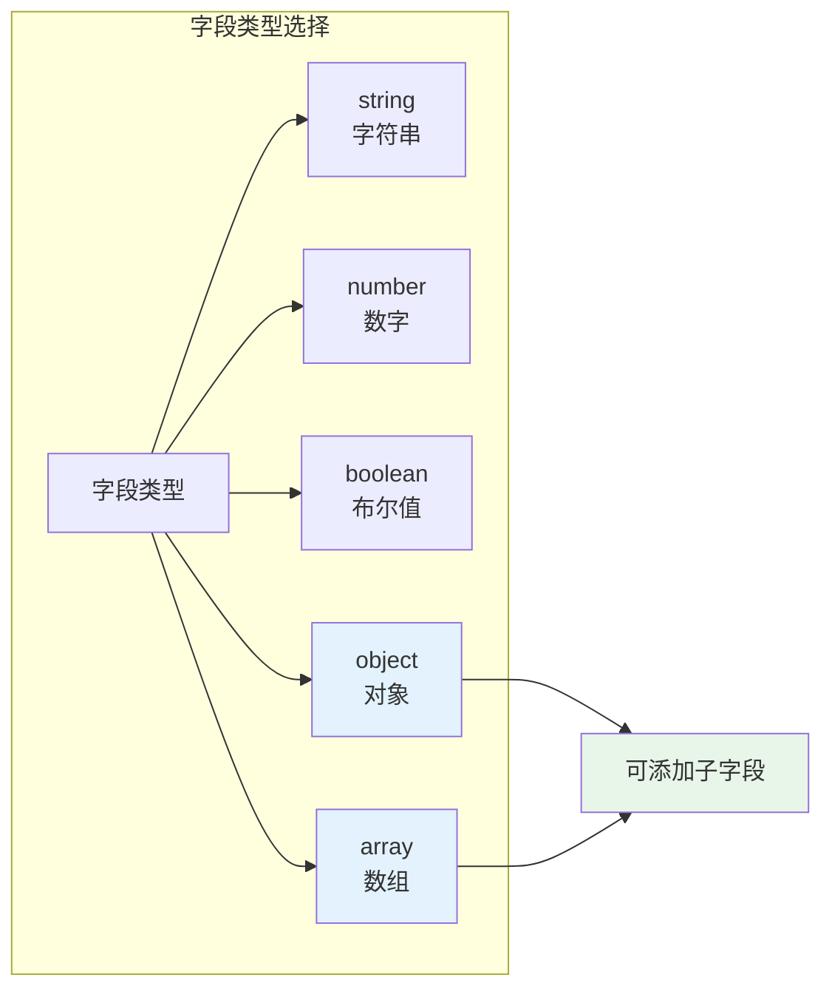
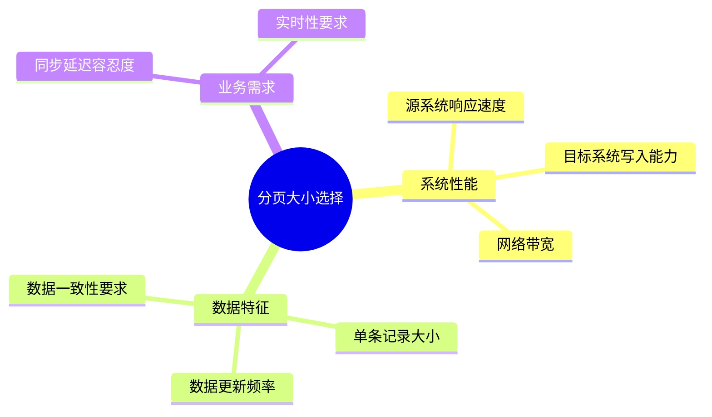
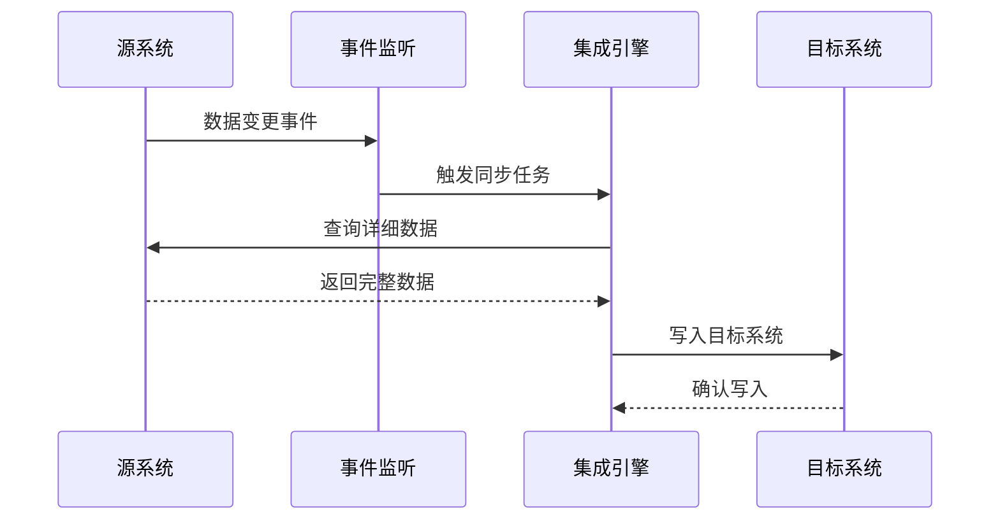
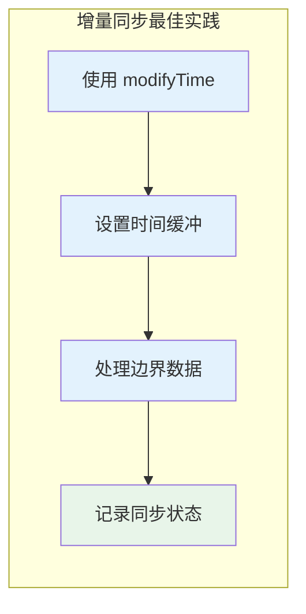

# 源平台配置

源平台配置定义了集成方案如何从源业务系统中获取数据。通过配置数据接口、请求参数、分页策略、过滤条件和触发时机，你可以精确控制数据的查询范围和同步行为。本文将详细介绍源平台侧的各项配置项及其使用方法。

---

## 前置条件

在开始源平台配置前，请确保已完成以下准备工作：

1. **集成方案已创建** — 已完成基本信息和源/目标系统的选择
2. **源系统连接器已配置** — 连接器已测试通过，接口可用
3. **了解源系统数据结构** — 熟悉源系统的数据模型和接口规范

> [!IMPORTANT]
> 如果尚未创建集成方案，请先参考[新建集成方案](./create-integration)完成方案创建。

---

## 源平台配置概述

### 配置页面结构

在集成方案详情页面中，点击**源平台配置**页签进入配置界面。该页面包含以下区域：

| 区域 | 功能说明 |
|------|----------|
| **接口选择** | 选择源系统的查询接口 |
| **参数配置** | 配置请求参数、分页参数、过滤条件 |
| **触发配置** | 设置数据同步的触发方式 |
| **高级选项** | 配置 ID/Number 映射、数据拍扁等高级功能 |


### 四大参数类型

源平台配置涉及四类核心参数：

| 参数类型 | 用途 | 典型示例 |
|----------|------|----------|
| **请求参数**（requestParams） | 业务查询条件 | 日期范围、部门编码、物料编号 |
| **其他请求参数**（otherRequestParams） | 系统级参数 | 分页标识、单据状态、接口版本 |
| **响应参数**（responseParams） | 返回的业务数据字段 | 订单号、客户名称、金额 |
| **其他响应参数**（otherResponseParams） | 系统级返回信息 | 状态码、消息、总记录数 |

> [!NOTE]
> 请求参数与其他请求参数的划分依据各平台适配器的设计而定，最终都将合并为完整的请求体发送到源系统。

---

## 选择数据接口

### 接口类型说明

源平台接口必须是**查询接口**类型，用于从源系统读取数据。根据触发方式的不同，支持的接口类型有所差异：

| 接口类型 | 适用场景 | 特点 |
|----------|----------|------|
| **标准查询接口** | 定时同步场景 | 支持分页查询、条件过滤 |
| **实时事件接口** | 实时同步场景 | 基于事件触发，响应即时 |
| **Webhook 接收接口** | 被动接收推送 | 等待源系统主动推送数据 |

### 接口选择步骤

1. 在**源平台配置**页面，找到**数据接口**选择框
2. 下拉列表展示当前连接器下所有可用的查询接口
3. 根据业务需求选择相应的接口（如「采购订单查询」、「库存查询」等）



> [!WARNING]
> 如果接口列表为空，请检查：
> - 所选连接器是否已配置查询接口
> - 连接器授权是否有效
> - 当前账号是否有接口访问权限

### 接口元数据加载

选择接口后，系统会自动加载接口的元数据：

- **输入参数**：接口支持的查询条件字段
- **输出参数**：接口返回的数据字段结构
- **数据类型**：各字段的数据类型定义
- **必填标识**：标识哪些参数为必填项

---

## 请求参数配置

### 参数配置方式

源平台支持两种参数配置视图：

| 视图模式 | 适用场景 | 特点 |
|----------|----------|------|
| **配置视图** | 可视化配置 | 表单方式填写，支持变量选择器 |
| **源码视图** | 高级配置 | JSON 格式，支持复杂嵌套结构 |

> [!TIP]
> 建议在**配置视图**中完成大部分配置，仅在需要设置特殊参数时切换到**源码视图**。

### 新增查询字段

1. 在配置视图中，从左侧字段树选择上级节点（object 或 array 类型支持添加子字段）
2. 点击**新增字段**按钮
3. 在弹出的表单中填写字段信息：
   - **所属分组**：选择字段所属的分组（请求参数/其他请求参数/响应参数/其他响应参数）
   - **字段名称**：英文标识，需与接口定义一致
   - **字段类型**：选择 string、number、boolean、object、array 等类型
   - **默认值**（可选）：固定值或动态变量



### 字段值配置

选中左侧字段树中的字段后，可在右侧配置字段值：

#### 固定值

直接输入静态值，适用于不随执行变化的参数：

```json
{
  "billType": "PO",
  "status": "APPROVED"
}
```

#### 动态变量

使用变量选择器选择动态值，支持以下变量类型：

| 变量类型 | 说明 | 示例 |
|----------|------|------|
| **系统变量** | 平台内置变量 | `{{$now}}`、 `{{$date}}`、 `{{$datetime}}` |
| **方案变量** | 集成方案级别变量 | `{{schemeId}}`、 `{{runId}}` |
| **全局变量** | 工作空间共享变量 | `{{global.companyCode}}` |
| **上次执行时间** | 上一次成功执行的时间 | `{{$lastExecuteTime}}` |

动态变量使用双大括号 `{{}}` 包裹，支持管道符 `|` 进行格式化：

```json
{{$lastExecuteTime|format:"yyyy-MM-dd HH:mm:ss"}}
{{$date|addDays:-1|format:"yyyy-MM-dd"}}
```

> [!TIP]
> 更多格式化选项请参考[变量与参数](./variables-parameters)文档。

### 删除字段

1. 在左侧字段树中选中需要删除的字段
2. 点击**删除**按钮
3. 确认删除操作

> [!WARNING]
> 删除操作仅影响界面显示，必须点击**保存**按钮才能将变更提交到后端。

---

## 分页策略

### 分页模式选择

当源系统数据量较大时，需要配置分页策略以避免单次查询数据量过大：

| 分页模式 | 适用场景 | 配置说明 |
|----------|----------|----------|
| **无分页** | 数据量小且接口不支持分页 | 一次性查询全部数据 |
| **偏移量分页** | 传统分页接口 | 配置 pageSize 和 pageNumber |
| **游标分页** | 大数据量高效查询 | 使用游标（cursor）进行分页 |

### 偏移量分页配置

对于常见的页码分页接口，配置以下参数：

| 参数 | 说明 | 典型值 |
|------|------|--------|
| **pageSize** | 每页记录数 | 100、500、1000 |
| **pageNumber** | 当前页码 | 从 1 或 0 开始 |
| **totalField** | 总记录数字段 | `total`、`totalCount` |

配置示例（金蝶云星空）：

```json
{
  "requestParams": {
    "FormId": "PUR_POOrder",
    "FilterString": "FDate >= '{{$lastExecuteTime|format:'yyyy-MM-dd'}}'",
    "FieldKeys": "FBillNo,FDate,FSupplierID",
    "TopRowCount": 0,
    "Limit": 500,
    "StartRow": 0
  }
}
```

### 游标分页配置

对于支持游标分页的接口：

| 参数 | 说明 | 配置方式 |
|------|------|----------|
| **cursor** | 游标值 | 使用 `{{$cursor}}` 变量 |
| **hasMore** | 是否有下一页 | 在响应映射中配置 |
| **nextCursor** | 下一页游标 | 从响应中提取 |

### 分页大小建议

分页大小的设置需要权衡以下因素：



| 数据规模 | 建议分页大小 | 说明 |
|----------|--------------|------|
| < 1 万条 | 无分页或 1000 | 小数据量可一次性处理 |
| 1 万 ~ 10 万条 | 500 ~ 1000 | 平衡性能与内存占用 |
| 10 万 ~ 100 万条 | 200 ~ 500 | 减少单次处理压力 |
| > 100 万条 | 100 ~ 200 | 配合增量策略使用 |

---

## 过滤条件

### 过滤条件类型

过滤条件用于筛选需要同步的数据，支持以下类型：

| 条件类型 | 适用场景 | 示例 |
|----------|----------|------|
| **时间范围** | 增量同步 | 创建时间 > 上次执行时间 |
| **状态过滤** | 业务状态筛选 | 单据状态 = 已审核 |
| **范围条件** | 数值/日期范围 | 金额在 1000 ~ 10000 之间 |
| **匹配条件** | 精确匹配 | 部门编码 = 'SALES001' |
| **组合条件** | 复杂逻辑 | (A AND B) OR (C AND D) |

### 增量同步过滤

最常用的过滤策略是基于时间的增量同步：

```json
{
  "requestParams": {
    "FilterString": "FCreateDate >= '{{$lastExecuteTime|format:'yyyy-MM-dd HH:mm:ss'}}'"
  }
}
```

支持的增量字段：

| 字段类型 | 说明 | 示例 |
|----------|------|------|
| 创建时间 | 基于数据创建时间 | `createTime`、`FCreateDate` |
| 修改时间 | 基于数据更新时间 | `modifyTime`、`FModifyDate` |
| 自增 ID | 基于主键递增 | `id > {{$lastMaxId}}` |

### 高级筛选配置

在源码视图中，可以配置更复杂的筛选逻辑：

```json
{
  "requestParams": {
    "FilterString": "(FBillStatus = 'B' AND FDate >= '{{$date|addDays:-7|format:'yyyy-MM-dd'}}') OR (FBillStatus = 'A' AND FDate >= '{{$date|addDays:-1|format:'yyyy-MM-dd'}}')"
  }
}
```

> [!CAUTION]
> 复杂过滤条件可能影响查询性能，建议在源系统数据库中为过滤字段建立索引。

### 金蝶云星空特殊处理

金蝶云星空的部分查询操作需要特殊处理：

```json
{
  "requestParams": {
    "FormId": "BD_MATERIAL",
    "FilterString": "FMaterialId.FNumber like '10%'",
    "FieldKeys": "FMaterialId.FNumber,FName,FSpecification"
  },
  "otherRequestParams": {
    "FormId": "BD_MATERIAL"
  }
}
```

> [!NOTE]
> 更多金蝶云星空的特殊配置请参考[金蝶云星空连接器](../connectors/erp/kingdee-cloud-galaxy)。

---

## 触发时机

### 触发方式选择

源平台数据的获取触发方式由集成方案的类型决定：

| 方案类型 | 触发方式 | 适用场景 |
|----------|----------|----------|
| **定时同步** | 按预设时间周期触发 | 周期性数据同步 |
| **实时同步** | 基于事件实时触发 | 即时性要求高的场景 |
| **Webhook 推送** | 被动接收源系统推送 | 源系统支持主动推送 |

### 定时同步配置

对于定时同步方案，在方案详情页面的**任务调度**页签配置触发规则：

| 调度类型 | 配置示例 | 说明 |
|----------|----------|------|
| **固定频率** | 每 5 分钟 | 按固定间隔执行 |
| **Cron 表达式** | `0 0 2 * * ?` | 每天凌晨 2 点执行 |
| **指定时间** | 每天 8:00、12:00、18:00 | 多个固定时间点 |

定时同步下的源平台参数配置要点：

1. **增量时间变量**：使用 `{{$lastExecuteTime}}` 确保只获取新增/变更数据
2. **时间窗口**：设置合理的查询时间范围，避免数据遗漏
3. **超时设置**：确保单次查询超时时间小于调度间隔

```json
{
  "requestParams": {
    "startTime": "{{$lastExecuteTime|format:'yyyy-MM-dd HH:mm:ss'}}",
    "endTime": "{{$now|format:'yyyy-MM-dd HH:mm:ss'}}"
  }
}
```

### 实时同步配置

实时同步方案通过监听源系统的事件来触发数据获取：



实时同步下的源平台参数特点：

- **事件标识**：通过事件获取数据的主键或标识
- **即时查询**：根据事件中的 ID 立即查询详情
- **并发控制**：需要配置合理的并发策略

### Webhook 触发配置

当源系统支持 Webhook 推送时，可配置 Webhook 接收端点：

1. 在**开发者** > **Webhook 配置**中创建接收端点
2. 在源平台配置中选择对应的 Webhook
3. 配置 Webhook 数据到请求参数的映射关系

Webhook 数据映射示例：

```json
{
  "requestParams": {
    "billNo": "{{webhook.body.billNo}}",
    "eventType": "{{webhook.headers.X-Event-Type}}"
  }
}
```

---

## 高级配置

### ID 与 Number 配置

**ID** 和 **Number** 是源数据的主键标识配置：

| 字段 | 用途 | 配置要求 |
|------|------|----------|
| **ID** | 数据唯一标识 | 必须配置，用于去重和关联 |
| **Number** | 业务编码显示 | 用于前端展示，可选 |

配置示例（源码视图）：

```json
{
  "id": "{{response.FBillNo}}",
  "number": "{{response.FBillNo}}-{{response.FEntryID}}"
}
```

> [!IMPORTANT]
> ID 配置必须确保唯一性，否则会导致数据覆盖或重复。

### 主键检查（idCheck）

`idCheck` 参数控制是否开启主键重复检查：

| 配置值 | 行为 | 适用场景 |
|--------|------|----------|
| `true`（默认） | 自动排除重复数据 | 增量同步，避免重复处理 |
| `false` | 允许覆盖已有数据 | 全量同步，需要更新历史数据 |

### 数据拍扁（beatFlat）

当源数据包含嵌套数组结构时，可使用拍扁功能将多维数据展开为平铺结构：

**原始数据：**

```json
{
  "orderNo": "SO20210001",
  "customer": "CUST001",
  "details": [
    { "product": "P001", "qty": 10 },
    { "product": "P002", "qty": 20 }
  ]
}
```

**拍扁配置：**

```json
{
  "beatFlat": ["details"]
}
```

**拍扁后数据：**

```json
[
  {
    "orderNo": "SO20210001",
    "customer": "CUST001",
    "details_product": "P001",
    "details_qty": 10,
    "_id": "SO20210001-0"
  },
  {
    "orderNo": "SO20210001",
    "customer": "CUST001",
    "details_product": "P002",
    "details_qty": 20,
    "_id": "SO20210001-1"
  }
]
```

> [!NOTE]
> 拍扁后主键会自动添加行号后缀（如 `-0`、`-1`）以确保唯一性。

---

## 配置保存与验证

### 保存配置

完成所有配置后，点击**保存**按钮提交配置：

1. 系统会校验参数格式的正确性
2. 检查必填参数是否已配置
3. 验证变量引用是否有效

> [!WARNING]
> 在**配置视图**与**源码视图**之间切换时，页面会刷新加载数据。切换前务必先点击**保存**，否则未保存的配置将丢失。

### 配置测试

保存后建议进行配置测试：

1. 点击**测试查询**按钮
2. 系统执行一次实际的接口调用
3. 查看返回的数据样本，验证配置是否正确

### 调试器使用

对于复杂的配置，可以使用调试器进行深度排查：

1. 在方案详情页面切换到**调试器**页签
2. 选择要调试的指令（如源平台查询）
3. 查看完整的请求和响应详情
4. 根据调试结果调整配置

> [!TIP]
> 调试器功能主要面向运维和开发人员，可以查看请求报文、响应报文和中间处理结果。

---

## 最佳实践

### 增量同步策略



1. **优先使用修改时间**：相比创建时间，修改时间能捕获数据变更
2. **设置时间缓冲**：查询条件使用 `>=` 并向前缓冲几分钟，避免数据遗漏
3. **处理边界数据**：对于同时被修改的多条数据，确保全部获取
4. **记录同步状态**：通过日志和监控跟踪每次同步的数据范围

### 性能优化建议

| 优化项 | 建议 | 效果 |
|--------|------|------|
| **分页大小** | 根据数据特征调整 | 减少内存占用 |
| **查询字段** | 只查询需要的字段 | 减少网络传输 |
| **过滤条件** | 优先在源系统过滤 | 减少无效数据处理 |
| **索引优化** | 确保过滤字段有索引 | 加速查询速度 |

### 常见配置模式

**模式一：全量初始化 + 增量同步**

```json
{
  "requestParams": {
    "startTime": "{{$isFirstRun ? '2000-01-01' : $lastExecuteTime|format:'yyyy-MM-dd HH:mm:ss'}}"
  }
}
```

**模式二：状态驱动同步**

```json
{
  "requestParams": {
    "status": "PENDING",
    "syncFlag": "N"
  }
}
```

**模式三：分页 + 增量结合**

```json
{
  "requestParams": {
    "pageSize": 500,
    "pageNumber": "{{$pageNumber}}",
    "updateTimeStart": "{{$lastExecuteTime}}"
  }
}
```

---

## 常见问题

**Q: 为什么测试查询返回空数据？**

A: 可能原因：
- 过滤条件过于严格，无匹配数据
- 时间变量格式与源系统要求不一致
- 源系统确实无新数据产生
- 接口权限不足，无法访问数据

**Q: 如何避免数据重复同步？**

A: 建议措施：
- 确保 `idCheck` 设置为 `true`
- 使用准确的增量字段（如 modifyTime）
- 配置合理的时间缓冲区间
- 定期检查同步日志，排查异常情况

**Q: 分页查询如何配置才能确保不遗漏数据？**

A: 注意事项：
- 分页查询期间避免源数据变更
- 使用稳定的排序字段（如自增 ID）
- 考虑数据变更导致的数据位移问题
- 对于高并发场景，建议使用游标分页

**Q: 定时同步和实时同步如何选择？**

A: 决策参考：
- 数据实时性要求 < 5 分钟：选择实时同步
- 数据量大且变化频率低：选择定时同步
- 源系统支持 Webhook：可考虑实时推送
- 业务对延迟容忍度高：优先选择定时同步（资源利用率更高）

**Q: 配置视图和源码视图的数据为什么不一致？**

A: 可能原因：
- 切换视图前未保存配置
- 源码视图中存在配置视图不支持的复杂结构
- 缓存问题，建议刷新页面后重新加载

---

## 下一步

- 了解[目标平台配置](./target-platform-config)，完成数据写入侧的参数设置（本文档已可用）
- 学习[数据映射](./data-mapping)，建立源字段与目标字段的对应关系
- 探索[变量与参数](./variables-parameters)的更多高级用法
- 查看[监控告警](./monitoring-alerts)，掌握数据同步的运行状态监控
