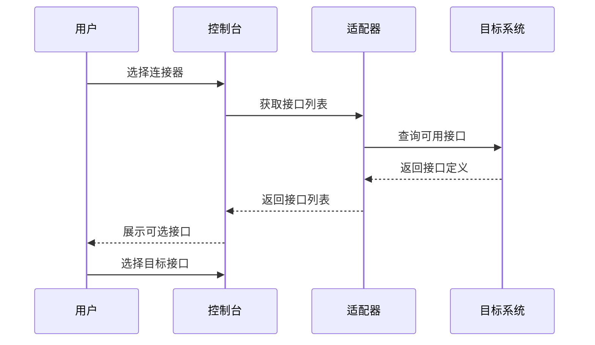
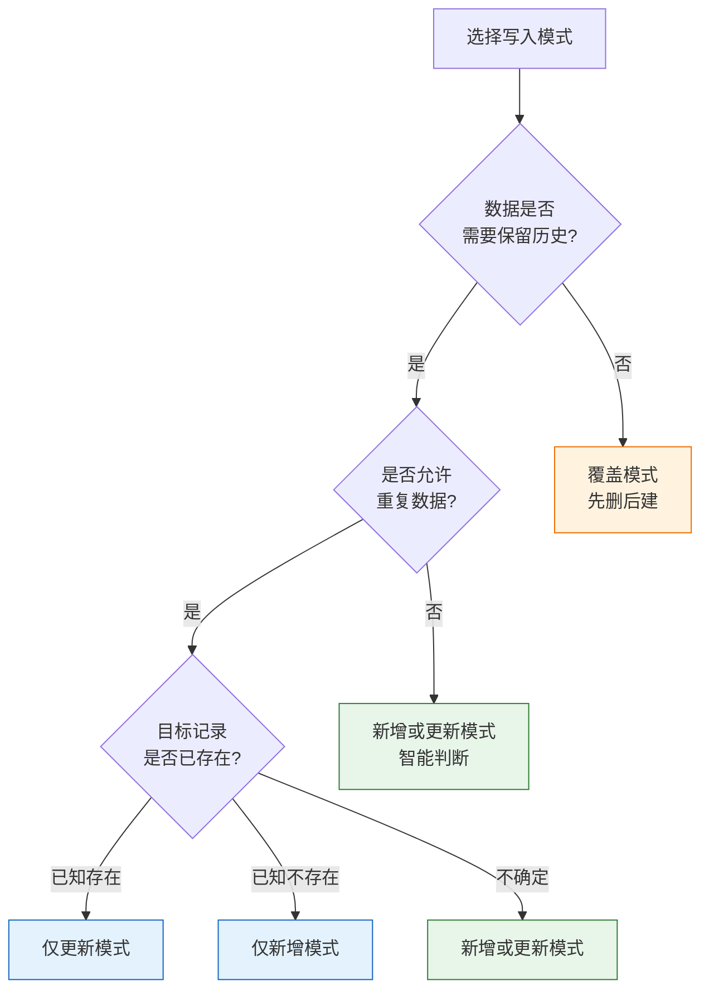
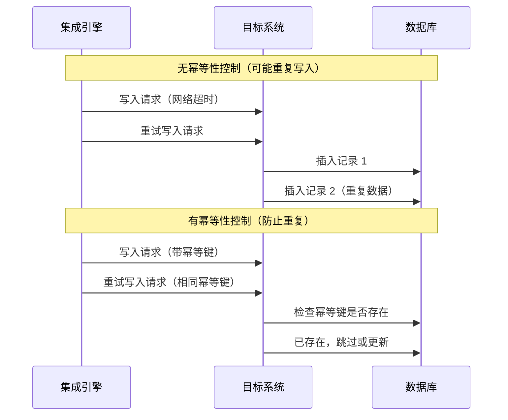
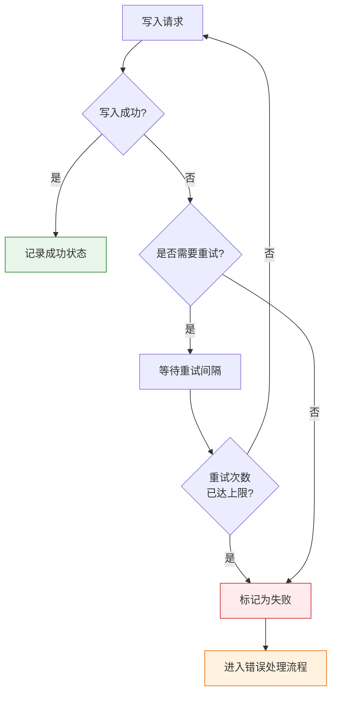
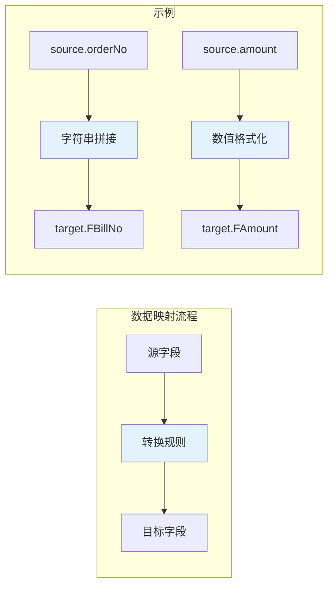
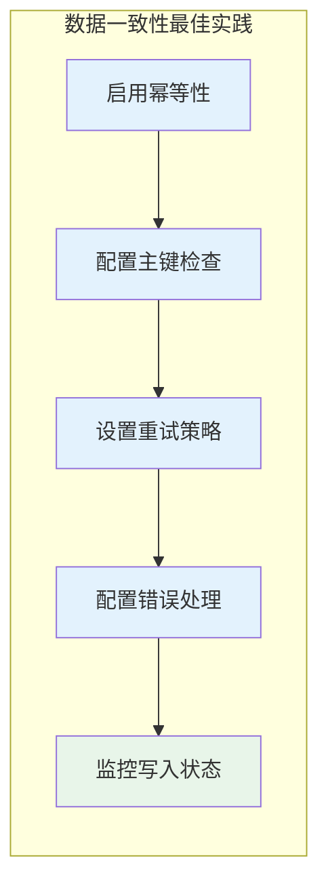

# 目标平台配置

目标平台配置定义了集成方案如何将数据写入目标业务系统。通过配置写入接口、请求参数、数据映射关系和写入策略，你可以精确控制数据在目标系统中的落地方式和业务行为。本文将详细介绍目标平台侧的各项配置项及其使用方法。

---

## 前置条件

在开始目标平台配置前，请确保已完成以下准备工作：

1. **集成方案已创建** — 已完成基本信息和源/目标系统的选择
2. **目标系统连接器已配置** — 连接器已测试通过，接口可用
3. **已完成源平台配置** — 了解源数据的结构和字段含义
4. **了解目标系统数据结构** — 熟悉目标系统的数据模型和接口规范

> [!IMPORTANT]
> 如果尚未完成源平台配置，请先参考[源平台配置](./source-platform-config)完成配置。

---

## 目标平台配置概述

### 配置页面结构

在集成方案详情页面中，点击**目标平台配置**页签进入配置界面。该页面包含以下核心区域：

| 区域 | 功能说明 |
|------|----------|
| **接口选择** | 选择目标系统的写入接口 |
| **参数配置** | 配置请求参数、写入模式、幂等性策略 |
| **数据映射** | 建立源字段与目标字段的对应关系 |
| **高级选项** | 配置值解析器、自定义函数、特殊操作 |


### 核心配置要素

目标平台配置涉及以下核心要素：

| 配置要素 | 用途 | 关键决策点 |
|----------|------|------------|
| **写入接口** | 调用目标系统的 API 接口 | 新增/更新/删除接口的选择 |
| **写入模式** | 数据写入的业务行为 | 仅新增、仅更新、新增或更新 |
| **幂等性** | 防止重复写入的机制 | 基于业务主键的重复判断 |
| **重试策略** | 失败后的自动重试逻辑 | 重试次数、间隔、退避策略 |
| **错误处理** | 异常数据的处理方式 | 忽略错误、终止任务、记录日志 |

---

## 选择写入接口

### 接口类型说明

目标平台接口必须是**写入接口**类型，用于向目标系统创建或更新数据。根据业务操作的不同，写入接口可分为以下类型：

| 接口类型 | 业务含义 | 典型场景 |
|----------|----------|----------|
| **新增接口** | 创建新记录 | 新订单同步、新增物料 |
| **更新接口** | 修改已有记录 | 订单状态更新、库存调整 |
| **保存接口** | 新增或更新（智能判断） | 基础资料同步、客户信息维护 |
| **删除接口** | 删除已有记录 | 数据清理、作废单据 |
| **批量接口** | 一次性处理多条记录 | 大批量数据导入 |

### 接口选择步骤

1. 在**目标平台配置**页面，找到**数据接口**选择框
2. 下拉列表展示当前连接器下所有可用的写入接口
3. 根据业务需求选择相应的接口（如「采购订单保存」、「库存更新」等）



> [!TIP]
> 部分连接器提供「保存」类接口，可根据数据是否存在自动判断是新增还是更新，简化配置复杂度。

---

## 写入模式配置

### 写入模式类型

写入模式决定了数据到达目标系统后的处理方式：

| 写入模式 | 行为说明 | 适用场景 |
|----------|----------|----------|
| **仅新增** | 只创建新记录，已有记录报错或跳过 | 订单同步、业务单据导入 |
| **仅更新** | 只修改已有记录，不存在则报错或跳过 | 状态更新、数量调整 |
| **新增或更新** | 不存在则创建，存在则更新 | 基础资料同步、主数据维护 |
| **覆盖** | 先删除已有记录，再创建新记录 | 全量同步场景 |
| **智能匹配** | 根据配置规则自动判断操作类型 | 复杂业务场景 |

### 模式选择建议



### 模式配置示例

**金蝶云星空示例：**

```json
{
  "requestParams": {
    "Creator": "Administrator",
    "NeedUpDateFields": ["FQty", "FPrice"]
  },
  "writeMode": "upsert",
  "idField": "FBillNo"
}
```

**用友 NC 示例：**

```json
{
  "requestParams": {
    "billtype": "D3",
    "operation": "save"
  },
  "writeMode": "insert_only",
  "errorOnDuplicate": true
}
```

---

## 幂等性配置

### 什么是幂等性

幂等性是指同一操作执行多次与执行一次的效果相同。在数据集成场景中，幂等性配置用于防止因网络超时、任务重试等原因导致的数据重复写入。



### 幂等性策略

轻易云 iPaaS 支持以下幂等性策略：

| 策略 | 行为 | 适用场景 |
|------|------|----------|
| **业务主键去重** | 基于业务主键判断记录是否存在 | 有明确业务主键的场景 |
| **系统 ID 映射** | 通过 ID 映射表关联源与目标记录 | 需要追踪数据血缘的场景 |
| **请求签名** | 基于请求内容生成唯一签名 | 完全相同的请求去重 |
| **时间窗口去重** | 在短时间内相同数据只处理一次 | 高频实时同步场景 |

### 业务主键配置

最常用的幂等性配置方式是基于业务主键：

1. **配置主键字段**

   在目标平台配置中指定用于判断重复的业务主键：

   ```json
   {
     "idempotency": {
       "enabled": true,
       "keyField": "FBillNo",
       "strategy": "upsert"
     }
   }
   ```

2. **主键字段映射**

   确保源数据中有对应的字段值映射到目标主键：

   ```json
   {
     "fieldMapping": {
       "FBillNo": "{{source.orderNo}}"
     }
   }
   ```

3. **重复数据处理策略**

   | 策略 | 行为 |
   |------|------|
   | `skip` | 跳过重复记录，继续处理其他数据 |
   | `update` | 更新已有记录（默认推荐） |
   | `error` | 报错并终止当前批次处理 |
   | `ignore` | 静默忽略，不做任何操作 |

### 多字段联合主键

当单字段无法唯一标识记录时，可配置联合主键：

```json
{
  "idempotency": {
    "enabled": true,
    "keyFields": ["FOrgId", "FBillNo"],
    "keySeparator": "-",
    "strategy": "update"
  }
}
```

> [!IMPORTANT]
> 联合主键会按顺序拼接各字段值，使用 `keySeparator` 指定的分隔符。请确保拼接后的字符串在业务上具有唯一性。

---

## 请求参数配置

### 基本字段配置

目标平台的字段值可以直接输入固定值，也可以从源平台响应参数中动态获取。

#### 固定值配置

对于不随数据变化的参数，直接输入固定值：

```json
{
  "requestParams": {
    "FBillTypeID": "PO",
    "FBusinessType": "CG",
    "FDate": "{{$date|format:'yyyy-MM-dd'}}"
  }
}
```

#### 动态值配置

点击**源平台响应参数**选择框，可以搜索并选择源平台的响应参数：

```json
{
  "requestParams": {
    "FSupplierID": "{{source.supplierCode}}",
    "FMaterialID": "{{source.materialNo}}",
    "FQty": "{{source.quantity}}"
  }
}
```

> [!NOTE]
> 源平台响应参数来自于源平台的配置界面。即使源平台配置中没有显式添加某个字段，只要接口本身有数据返回，仍可直接使用该字段作为动态值。

### 表体数组字段配置

当目标字段是一个表体数组时，需要特殊配置方式：

#### 指定数组 Key

在字段配置中指定源数据的表体 key，指定时不需要使用 `{{}}` 动态符号：

```json
{
  "requestParams": {
    "FEntity": "source.details"
  }
}
```

#### 表体子字段配置

配置表体的子字段时，使用如下格式：

```json
{
  "fieldMapping": {
    "FEntity_FMaterialID": "{{source.details.materialNo}}",
    "FEntity_FQty": "{{source.details.quantity}}",
    "FEntity_FPrice": "{{source.details.price}}"
  }
}
```

或者使用嵌套结构：

```json
{
  "requestParams": {
    "FEntity": {
      "FMaterialID": "{{source.details.materialNo}}",
      "FQty": "{{source.details.quantity}}"
    }
  }
}
```

### 嵌套对象配置

对于复杂的目标数据结构，支持多级嵌套配置：

```json
{
  "requestParams": {
    "FHead": {
      "FBillNo": "{{source.orderNo}}",
      "FDate": "{{source.orderDate}}"
    },
    "FEntry": [
      {
        "FMaterialID": "{{source.items.materialNo}}",
        "FQty": "{{source.items.qty}}"
      }
    ]
  }
}
```

---

## 失败重试策略

### 重试机制概述

当写入目标系统失败时，平台支持自动重试机制，提高数据写入的成功率。



### 重试策略配置

| 配置项 | 说明 | 建议值 |
|--------|------|--------|
| **最大重试次数** | 失败后最多重试的次数 | 3 ~ 5 次 |
| **重试间隔** | 每次重试之间的等待时间 | 5 ~ 30 秒 |
| **退避策略** | 重试间隔的增长方式 | 固定 / 线性 / 指数退避 |
| **可重试错误** | 哪些错误码触发重试 | 5xx 错误、超时错误 |

### 退避策略类型

| 策略 | 行为 | 适用场景 |
|------|------|----------|
| **固定间隔** | 每次重试间隔相同 | 临时性网络波动 |
| **线性增长** | 间隔时间线性增加（如 5s、10s、15s） | 服务端负载较高 |
| **指数退避** | 间隔时间指数增长（如 5s、10s、20s） | 服务端限流场景 |

### 配置示例

```json
{
  "retryPolicy": {
    "maxRetries": 3,
    "initialInterval": 5000,
    "backoffStrategy": "exponential",
    "multiplier": 2,
    "maxInterval": 60000,
    "retryableErrors": ["ECONNRESET", "ETIMEDOUT", "500", "502", "503"]
  }
}
```

### 重试注意事项

> [!WARNING]
> 1. **幂等性要求**：启用重试前务必确认写入接口具有幂等性，否则可能导致数据重复
> 2. **超时设置**：重试间隔应小于接口超时时间，避免请求堆积
> 3. **错误分类**：仅对临时性错误（网络超时、服务端繁忙）启用重试，业务错误（参数非法、权限不足）不应重试

---

## 错误忽略规则

### 错误处理策略

当写入操作失败且重试耗尽后，需要决定如何处理这些错误数据：

| 处理策略 | 行为 | 适用场景 |
|----------|------|----------|
| **立即终止** | 停止当前批次所有数据处理 | 数据一致性要求高的场景 |
| **跳过并记录** | 忽略错误，继续处理下一条，记录错误日志 | 允许部分失败的批量场景 |
| **进入死信队列** | 将失败数据移入死信队列，后续人工处理 | 重要数据需要人工干预 |
| **回调通知** | 调用外部接口通知业务系统 | 需要实时感知失败的场景 |

### 错误忽略规则配置

可以配置特定错误码的忽略规则：

```json
{
  "errorHandling": {
    "strategy": "continue_on_error",
    "ignoreRules": [
      {
        "errorCode": "REPEAT",
        "errorMessage": "单据已存在",
        "action": "ignore"
      },
      {
        "errorCode": "INVALID_STATUS",
        "action": "log_and_continue"
      }
    ],
    "maxErrorCount": 10,
    "errorRateThreshold": 0.1
  }
}
```

### 常见可忽略错误

| 错误类型 | 错误码示例 | 建议处理 |
|----------|------------|----------|
| 重复数据 | `REPEAT`、`DUPLICATE` | 忽略或更新 |
| 已审核/已关闭 | `ALREADY_APPROVED` | 忽略 |
| 数据不存在 | `NOT_FOUND` | 记录日志 |
| 参数缺失 | `MISSING_FIELD` | 不忽略，需修复配置 |
| 权限不足 | `NO_PERMISSION` | 不忽略，需检查授权 |

### 错误阈值控制

为防止错误数据过多影响整体同步质量，可设置错误阈值：

| 阈值类型 | 说明 | 示例 |
|----------|------|------|
| **绝对数量** | 累计错误数达到上限即终止 | 错误数 >= 10 时终止 |
| **错误率** | 错误比例达到上限即终止 | 错误率 >= 10% 时终止 |
| **连续错误** | 连续失败数达到上限即终止 | 连续 5 条失败时终止 |

```json
{
  "errorHandling": {
    "abortOnErrorCount": 100,
    "abortOnErrorRate": 0.2,
    "abortOnConsecutiveErrors": 5
  }
}
```

---

## 数据映射配置

### 启用数据映射

点击**启用映射**后可以开始配置数据的映射关系。数据映射定义了源平台字段与目标平台字段之间的对应关系和转换规则。



> [!TIP]
> 关于数据映射关系的详细维护方法，请参考[数据映射](./data-mapping)章节。

### 映射类型

| 映射类型 | 说明 | 示例 |
|----------|------|------|
| **直接映射** | 字段值一对一传递 | `source.name` → `target.FName` |
| **常量映射** | 固定值 | `"PO"` → `target.FBillType` |
| **表达式映射** | 使用表达式计算 | `{{source.qty * source.price}}` → `target.FAmount` |
| **查找映射** | 通过查找表转换 | 源编码 → 目标编码 |
| **条件映射** | 根据条件选择不同值 | IF-ELSE 逻辑 |

---

## 值解析器与自定义函数

### 启用值解析器

值解析器用于对输出的值进行更复杂的格式化处理操作，在金蝶等 ERP 系统的集成中经常被应用到。

### 自定义函数

对于高度定制化的转换需求，可以使用自定义函数。自定义函数支持使用 JavaScript 编写复杂的转换逻辑。

> [!TIP]
> 关于自定义函数的详细使用方法，请参考[进阶应用 - 自定义函数](../advanced/custom-scripts)章节。

### 联查关系型数据

当需要根据源数据联查其他关联数据时，可以配置关系型数据查询：

> [!TIP]
> 关于联查关系型数据的详细配置方法，请参考[进阶应用 - 联查关系型数据](../advanced/data-transformation)章节。

---

## 目标平台特殊操作

### 金蝶基础资料分配组织

金蝶云星空的基础资料同步后需要进行组织分配操作。在目标平台源码配置中增加以下项目：

```json
{
  "distributionOrg": "100016,100017,100018,100019"
}
```

> [!IMPORTANT]
> 注意这里的数据使用的是**组织 ID**，而不是组织编码。

金蝶的多组织编码可以通过直接 SQL 报表进行查询：

```sql
SELECT * FROM T_ORG_Organizations
```

### 其他 ERP 特殊配置

| ERP 系统 | 特殊配置项 | 说明 |
|----------|------------|------|
| **用友 NC** | 组织编码 | 需要传入组织编码参数 |
| **用友 U8** | 账套号 | 指定目标账套 |
| **畅捷通 T+** | 账套名称 | 账套标识配置 |
| **SAP** | 客户端号 | Client Number |

---

## 配置保存与验证

### 保存配置

完成所有配置后，点击**保存**按钮提交配置：

1. 系统会校验参数格式的正确性
2. 检查必填参数是否已配置
3. 验证映射字段是否存在于源数据

> [!WARNING]
> 在**配置视图**与**源码视图**之间切换时，页面会刷新加载数据。切换前务必先点击**保存**，否则未保存的配置将丢失。

### 测试写入

保存后建议进行写入测试：

1. 点击**测试写入**按钮
2. 系统执行一次实际的写入调用
3. 查看返回结果，验证配置是否正确
4. 检查目标系统是否成功创建/更新数据

### 调试与验证

使用调试器查看完整的请求和响应：

1. 在方案详情页面切换到**调试器**页签
2. 选择**目标平台写入**指令
3. 查看完整的请求报文和响应报文
4. 根据返回结果调整配置

---

## 最佳实践

### 写入性能优化

| 优化项 | 建议 | 效果 |
|--------|------|------|
| **批量写入** | 尽量使用批量接口，减少 API 调用次数 | 提升吞吐量 5 ~ 10 倍 |
| **分批处理** | 大批量数据分多批次写入 | 避免内存溢出和超时 |
| **字段精简** | 只写入必要字段 | 减少网络传输和数据处理 |
| **异步写入** | 非关键数据使用异步方式 | 降低响应延迟 |

### 数据一致性保障



1. **始终启用幂等性**：防止网络重试导致的数据重复
2. **配置合理的主键**：确保业务主键能唯一标识记录
3. **设置重试策略**：对临时性错误进行自动重试
4. **监控错误日志**：及时发现并处理写入异常

### 常见配置模式

**模式一：基础资料同步（新增或更新）**

```json
{
  "writeMode": "upsert",
  "idempotency": {
    "enabled": true,
    "keyField": "FNumber",
    "strategy": "update"
  },
  "retryPolicy": {
    "maxRetries": 3,
    "initialInterval": 5000
  }
}
```

**模式二：业务单据同步（仅新增）**

```json
{
  "writeMode": "insert_only",
  "idempotency": {
    "enabled": true,
    "keyField": "FBillNo",
    "strategy": "error"
  },
  "errorHandling": {
    "strategy": "continue_on_error",
    "ignoreRules": [
      {"errorCode": "REPEAT", "action": "ignore"}
    ]
  }
}
```

**模式三：状态更新（仅更新）**

```json
{
  "writeMode": "update_only",
  "idempotency": {
    "enabled": true,
    "keyField": "FBillNo",
    "strategy": "update"
  },
  "retryPolicy": {
    "maxRetries": 5,
    "backoffStrategy": "exponential"
  }
}
```

---

## 常见问题

**Q: 如何避免数据重复写入？**

A: 建议采取以下措施：
- 启用幂等性配置，设置正确的业务主键
- 选择合适的主键策略（`update` 或 `skip`）
- 确保源数据的主键值稳定不变
- 在目标系统中建立唯一索引作为最后防线

**Q: 写入失败如何排查？**

A: 排查步骤：
1. 在调试器中查看完整的请求报文
2. 检查响应报文中的错误码和错误信息
3. 确认目标系统的接口权限和状态
4. 验证请求参数的格式和取值是否符合规范
5. 检查网络连接是否稳定

**Q: 大批量数据写入时性能差怎么办？**

A: 优化建议：
- 使用批量写入接口替代单条写入
- 调整分页大小，找到最佳批次规模（通常 100 ~ 500 条）
- 关闭不必要的返回值，减少数据传输
- 在业务低峰期执行大批量同步
- 考虑使用异步写入模式

**Q: 目标系统返回成功但数据未生效？**

A: 可能原因：
- 数据被目标系统的业务规则拦截（如必填校验、状态校验）
- 写入后触发了目标系统的审批流程，数据处于待审核状态
- 写入到错误的组织/账套/业务单元
- 目标系统有缓存机制，数据尚未刷新

**Q: 如何处理部分成功、部分失败的批量写入？**

A: 处理方式：
- 配置错误忽略规则，允许部分失败继续处理
- 设置错误阈值，当失败比例过高时终止任务
- 启用死信队列，将失败数据单独存储以便后续处理
- 在监控中关注失败数据详情，针对性修复问题

---

## 下一步

- 了解[数据映射](./data-mapping)，建立源字段与目标字段的详细对应关系
- 学习[任务调度](./task-scheduling)，配置数据同步的执行计划
- 探索[监控告警](./monitoring-alerts)，掌握数据同步的运行状态监控
- 查看[日志管理](./log-management)，了解如何排查同步异常
