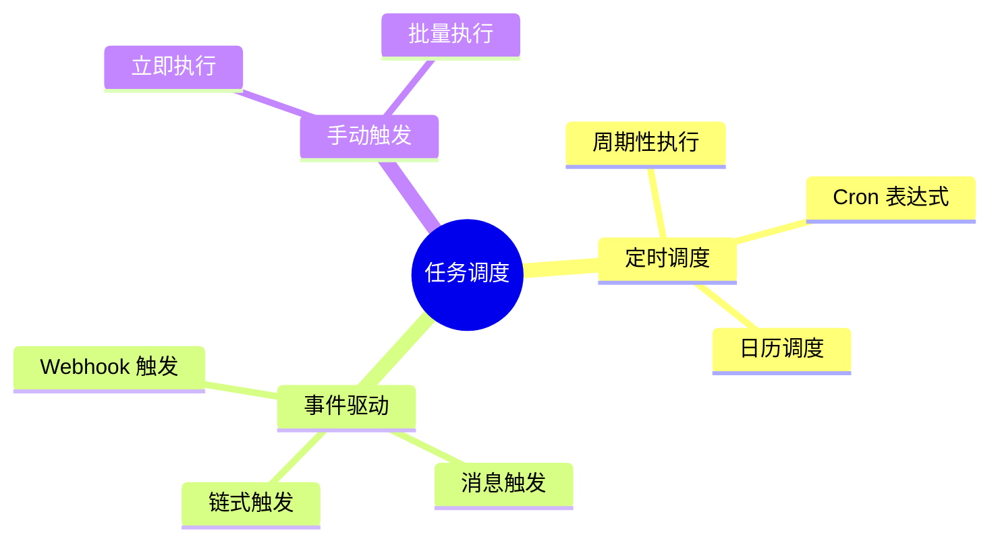
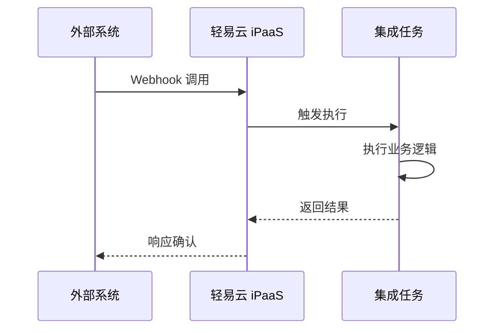
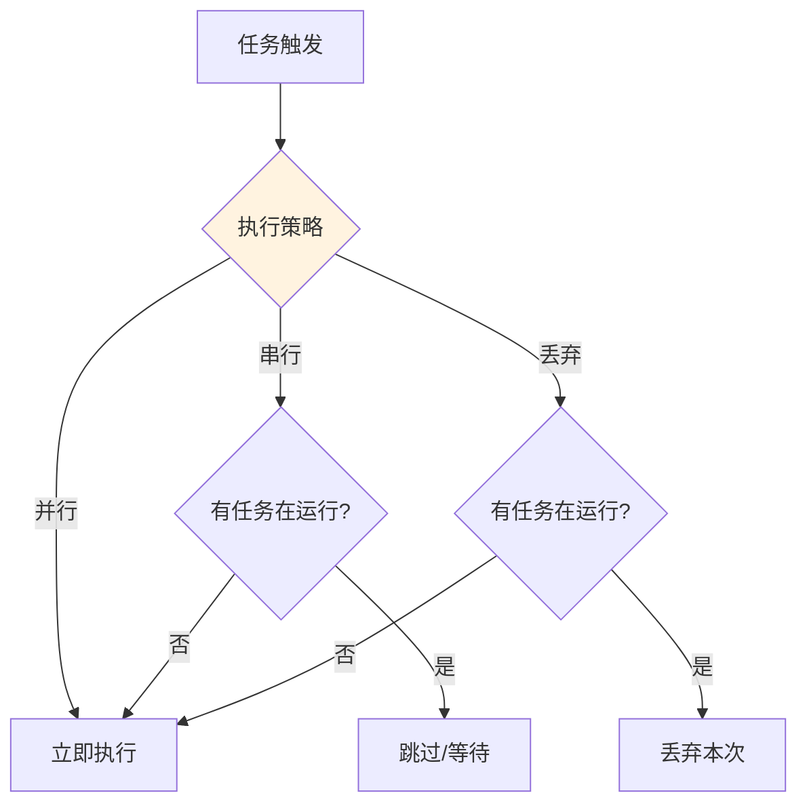
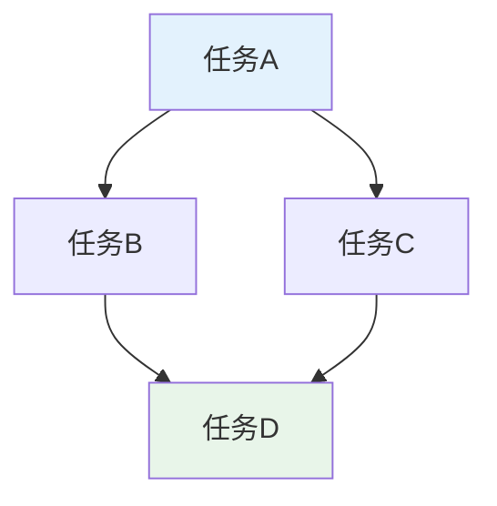
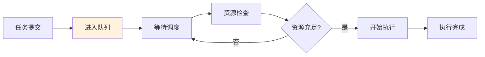
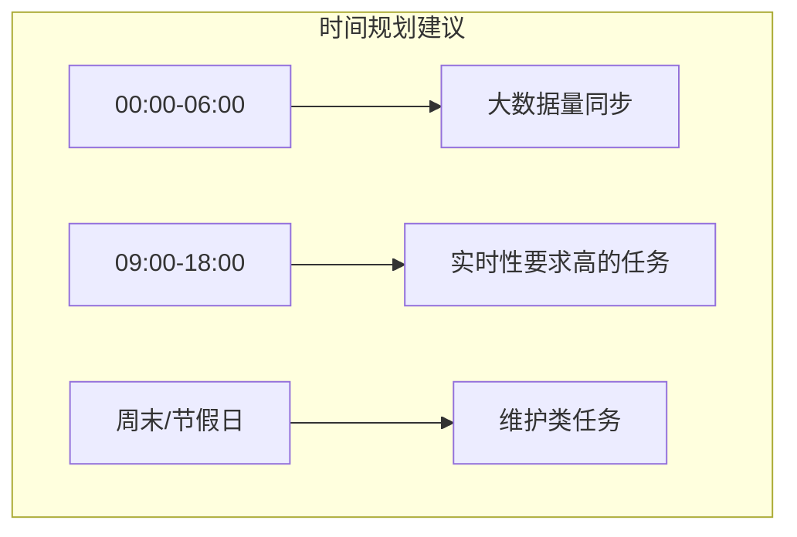

# 任务调度

任务调度是轻易云 iPaaS 的核心功能之一，用于控制集成方案的执行时机和频率。

## 调度模式

轻易云 iPaaS 支持多种任务调度模式：



### 定时调度

按照预设的时间规则自动执行：

| 调度类型 | 说明 | 示例 |
|---------|------|------|
| 固定频率 | 每隔固定时间执行 | 每 5 分钟 |
| 固定延迟 | 上次完成后延迟执行 | 完成后 10 分钟 |
| Cron 表达式 | 复杂时间规则 | 每天凌晨 2 点 |

### 事件驱动

由外部事件触发执行：



### 手动触发

由用户手动触发执行：

- 单条执行：执行一次任务
- 批量执行：同时执行多个任务
- 调试执行：带断点的测试执行

## Cron 表达式

Cron 表达式是定时调度的核心配置方式。

### Cron 语法

```text
┌───────────── 秒 (0-59)
│ ┌───────────── 分钟 (0-59)
│ │ ┌───────────── 小时 (0-23)
│ │ │ ┌───────────── 日期 (1-31)
│ │ │ │ ┌───────────── 月份 (1-12)
│ │ │ │ │ ┌───────────── 星期 (0-7, 0 和 7 都表示周日)
│ │ │ │ │ │
* * * * * *
```

### 常用表达式示例

| 表达式 | 说明 |
|-------|------|
| `0 0 * * * *` | 每小时执行 |
| `0 0 0 * * *` | 每天凌晨执行 |
| `0 0 2 * * *` | 每天凌晨 2 点执行 |
| `0 0 0 * * 1` | 每周一凌晨执行 |
| `0 0 0 1 * *` | 每月 1 号凌晨执行 |
| `0 */5 * * * *` | 每 5 分钟执行 |
| `0 0 9-18 * * 1-5` | 工作日 9 点到 18 点每小时执行 |

### 特殊字符

| 字符 | 含义 | 示例 |
|-----|------|------|
| `*` | 任意值 | 每分钟 |
| `?` | 不指定 | 用于日期或星期 |
| `-` | 范围 | `10-12` 表示 10、11、12 |
| `,` | 列表 | `MON,WED,FRI` |
| `/` | 增量 | `0/5` 从 0 开始，每 5 个单位 |
| `L` | 最后 | 月份的最后一天 |
| `W` | 工作日 | 最近的工作日 |

## 调度策略

### 执行策略



| 策略 | 说明 | 适用场景 |
|-----|------|---------|
| 并行 | 新任务立即执行，不管旧任务 | 无状态、幂等操作 |
| 串行-跳过 | 有任务在运行则跳过本次 | 定时数据同步 |
| 串行-等待 | 有任务在运行则排队等待 | 顺序敏感的操作 |
| 丢弃 | 有任务在运行则丢弃本次 | 实时性要求不高 |

### 重试策略

任务失败时的自动重试配置：

```json
{
  "retry": {
    "maxAttempts": 3,
    "retryInterval": 60000,
    "retryMultiplier": 2,
    "maxRetryInterval": 300000
  }
}
```

**重试参数说明**：

| 参数 | 默认值 | 说明 |
|-----|-------|------|
| maxAttempts | 3 | 最大重试次数 |
| retryInterval | 60000 | 初始重试间隔（毫秒） |
| retryMultiplier | 2 | 重试间隔倍数 |
| maxRetryInterval | 300000 | 最大重试间隔（毫秒） |

### 超时控制

防止任务长时间占用资源：

```json
{
  "timeout": {
    "executionTimeout": 3600000,
    "terminationGracePeriod": 60000
  }
}
```

## 任务依赖

### 依赖关系

设置任务间的依赖关系，确保执行顺序：



**依赖类型**：

| 类型 | 说明 |
|-----|------|
| 强依赖 | 前置任务必须成功 |
| 弱依赖 | 前置任务完成即可，不论成败 |
| 条件依赖 | 满足特定条件才执行 |

### 依赖配置

```json
{
  "dependencies": [
    {
      "taskId": "task-a",
      "type": "strong"
    },
    {
      "taskId": "task-b",
      "type": "weak"
    }
  ]
}
```

## 调度日历

### 工作日历

定义工作日和非工作日：

```json
{
  "calendar": {
    "workdays": [1, 2, 3, 4, 5],
    "holidays": ["2024-01-01", "2024-02-10"],
    "workdays": ["2024-02-04"]
  }
}
```

### 日历调度

基于日历的调度规则：

| 规则 | 说明 |
|-----|------|
| 仅工作日 | 只在工作日执行 |
| 跳过节假日 | 节假日自动跳过 |
| 补班日执行 | 调休工作日正常执行 |

## 任务队列

### 队列管理

任务队列用于管理待执行的任务：



### 优先级设置

设置任务执行优先级：

| 优先级 | 数值 | 说明 |
|-------|------|------|
| 最高 | 10 | 紧急任务 |
| 高 | 7 | 重要任务 |
| 普通 | 5 | 常规任务 |
| 低 | 3 | 后台任务 |
| 最低 | 1 | 归档任务 |

## 监控与告警

### 调度监控

监控任务调度状态：

| 指标 | 说明 |
|-----|------|
| 调度成功率 | 成功调度次数 / 总调度次数 |
| 平均等待时间 | 任务从触发到执行的平均等待时间 |
| 队列深度 | 待执行任务的数量 |
| 资源利用率 | 执行资源的占用比例 |

### 告警配置

设置调度异常告警：

```json
{
  "alerts": [
    {
      "condition": "failed",
      "channels": ["email", "dingtalk"]
    },
    {
      "condition": "timeout",
      "threshold": 3600,
      "channels": ["email"]
    },
    {
      "condition": "queue_depth",
      "threshold": 100,
      "channels": ["dingtalk"]
    }
  ]
}
```

## 最佳实践

### 1. 调度时间规划



**建议**：

- 避免在业务高峰期执行大数据量同步
- 合理分散调度时间，避免集中触发
- 考虑目标系统的负载能力

### 2. 容错设计

- 设置合理的超时时间
- 配置失败重试机制
- 设计补偿措施
- 保留失败记录便于排查

### 3. 资源管理

- 限制并发任务数量
- 设置任务优先级
- 监控资源使用情况
- 及时调整配置

### 4. 日志记录

记录完整的调度日志：

```text
[2024-01-01 02:00:00] INFO: 任务触发
[2024-01-01 02:00:01] INFO: 开始执行
[2024-01-01 02:00:30] INFO: 执行成功，处理 1000 条数据
[2024-01-01 02:00:31] INFO: 任务完成
```
