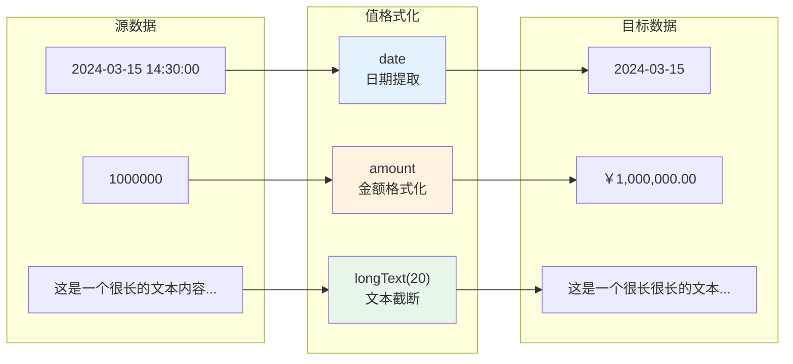
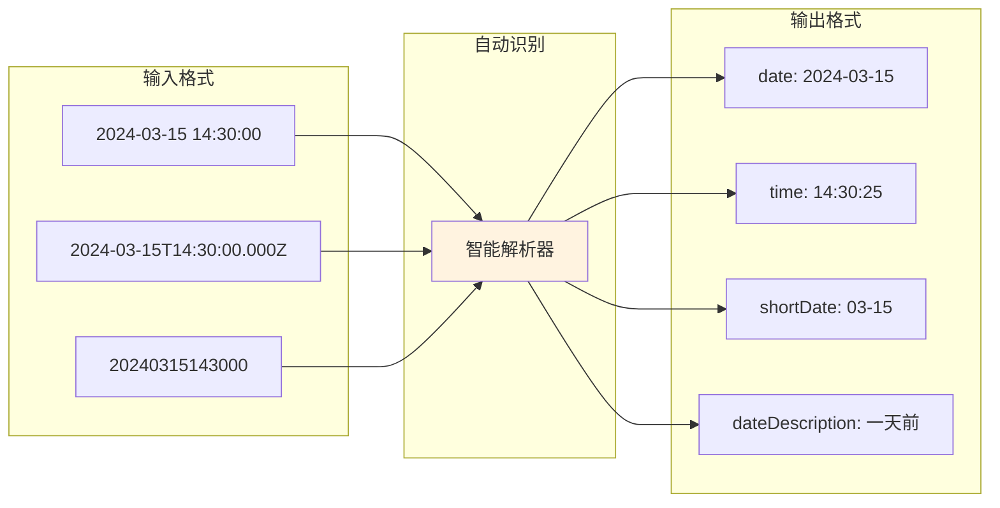
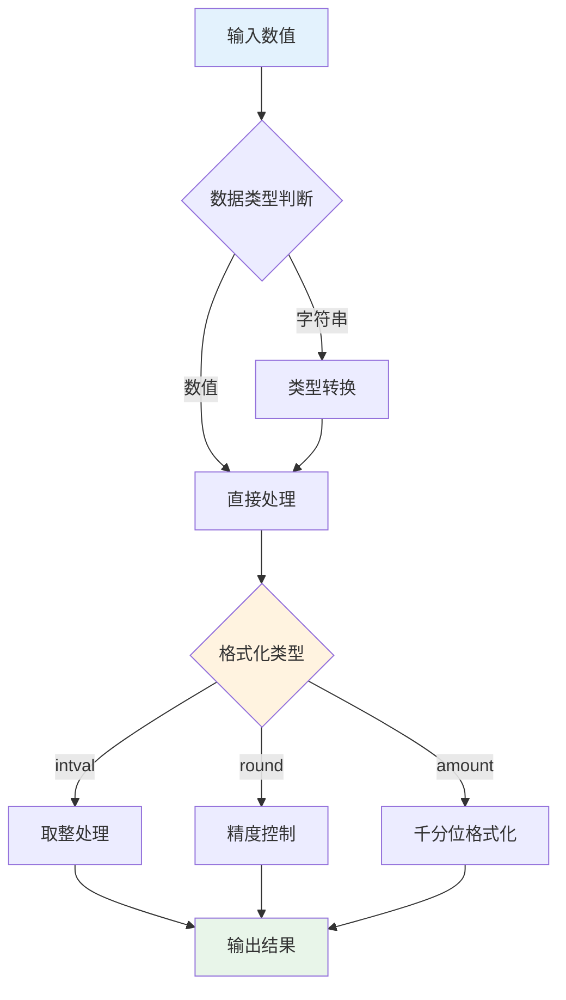
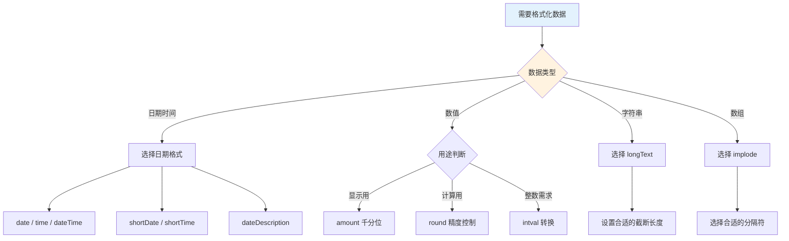

# 值格式化

值格式化是轻易云 iPaaS 平台提供的数据转换功能，用于在数据集成过程中对字段值进行标准化处理。通过内置的格式化规则，你可以轻松实现日期格式转换、字符串处理、数值运算等操作，无需编写复杂的自定义函数即可完成常见的数据转换需求。

---

## 值格式化概述

在系统对接过程中，不同系统对数据格式的要求往往存在差异。例如，源系统返回的日期时间格式为 `YYYYMMDD HH:MM:SS`，而目标系统要求 `YYYY-MM-DD` 格式；或者源系统的金额字段为普通数值，目标系统需要显示为千分位格式。值格式化功能正是为解决这类问题而设计。



### 使用场景

| 场景类型 | 说明 | 示例 |
|---------|------|------|
| **日期格式转换** | 将日期时间转换为不同格式 | 长日期 → 短日期 |
| **字符串处理** | 截取、拼接或转换文本内容 | 长文本摘要显示 |
| **数值格式化** | 数值精度控制、千分位显示 | 金额格式化 |
| **数据类型转换** | 字符串与数值之间的转换 | 字符串 → 整数 |
| **数组处理** | 将数组转换为字符串表示 | 多值字段合并 |

### 与自定义函数的区别

| 特性 | 值格式化 | 自定义函数 |
|------|---------|-----------|
| **使用难度** | 简单，选择预设格式即可 | 需要编写表达式 |
| **灵活性** | 固定的格式化规则 | 支持复杂业务逻辑 |
| **性能** | 系统内置优化，执行效率高 | 取决于表达式复杂度 |
| **适用场景** | 通用的数据格式转换 | 复杂的计算和条件判断 |

> [!TIP]
> 对于简单的格式转换需求，优先使用值格式化；对于需要复杂计算、条件判断或多表关联的场景，请使用[自定义函数](../advanced/custom-scripts)。

---

## 配置值格式化

在集成方案的目标平台配置中，可以通过以下步骤为字段添加格式化规则：

### 配置步骤

1. 进入集成方案的**目标平台配置**页面
2. 在**字段映射**区域，找到需要格式化的目标字段
3. 点击字段的**格式化**选项（或选择映射类型为「值格式化」）
4. 在格式化配置中选择**源字段**
5. 选择**格式化类型**（如 date、amount 等）
6. 根据所选类型配置**参数**（如需要）
7. 设置**输出字段**（新生成的字段名称）
8. 点击**保存**

### 配置结构

值格式化的配置采用 JSON 数组格式，每个格式化规则包含以下字段：

```json
{
  "formatResponse": [
    {
      "old": "源字段路径",
      "new": "新字段名称",
      "format": "格式化类型(参数)"
    }
  ]
}
```

| 字段 | 类型 | 必填 | 说明 |
|------|------|------|------|
| `old` | string | ✅ | 源数据中的字段路径，支持点符号访问嵌套字段 |
| `new` | string | ✅ | 格式化后生成的新字段名称 |
| `format` | string | ✅ | 格式化类型，可包含参数，如 `round(2)` |

---

## 日期格式转换

日期格式转换用于将日期时间数据转换为不同的显示格式，支持提取日期部分、时间部分，或转换为文本描述。

### 支持的日期格式

| 格式类型 | 格式标识 | 输出示例 | 说明 |
|---------|---------|---------|------|
| **日期** | `date` | `2024-03-15` | 标准日期格式 YYYY-MM-DD |
| **时间** | `time` | `14:30:25` | 完整时间格式 HH:MM:SS |
| **日期时间** | `dateTime` | `2024-03-15 14:30` | 日期 + 时间（不含秒） |
| **短日期** | `shortDate` | `03-15` | 月-日格式 MM-DD |
| **短时间** | `shortTime` | `14:30` | 时:分格式 HH:MM |
| **短日期时间** | `shortDateTime` | `03-15 14:30` | 短日期 + 短时间 |
| **文本描述** | `dateDescription` | `一天前` | 相对时间的文本描述 |

### 日期格式化示例

**示例一：提取日期部分**

源字段 `delivery_date` 值为 `2024-03-15 14:30:00`，需要提取日期部分：

```json
{
  "formatResponse": [
    {
      "old": "delivery_date",
      "new": "delivery_date_short",
      "format": "date"
    }
  ]
}
```

输出结果：`delivery_date_short = "2024-03-15"`

**示例二：获取短日期**

源字段 `order_date` 值为 `2024-03-15`，转换为短日期格式：

```json
{
  "formatResponse": [
    {
      "old": "order_date",
      "new": "order_date_mmdd",
      "format": "shortDate"
    }
  ]
}
```

输出结果：`order_date_mmdd = "03-15"`

**示例三：相对时间描述**

源字段 `create_time` 值为过去的某个时间，转换为文本描述：

```json
{
  "formatResponse": [
    {
      "old": "create_time",
      "new": "create_time_desc",
      "format": "dateDescription"
    }
  ]
}
```

输出结果：根据时间差返回 `刚刚`、`一分钟前`、`一小时前`、`一天前`、`一周前`、`一个月前`、`一年前` 等文本。

### 日期格式对照表



> [!NOTE]
> 系统支持自动识别多种日期时间输入格式，包括 ISO 8601、Unix 时间戳、常见字符串格式等。如果自动识别失败，建议先使用自定义函数进行预处理。

---

## 字符串处理

字符串处理功能用于对文本数据进行截取、补全或格式转换。

### 支持的字符串格式

| 格式类型 | 格式标识 | 参数 | 输出示例 | 说明 |
|---------|---------|------|---------|------|
| **长文本截断** | `longText` | 字符数（默认 15） | `这是一个很长很长的文本...` | 超出部分显示省略号 |

### 字符串处理示例

**示例：长文本摘要**

源字段 `description` 值为 `"这是一个很长很长的文本内容，包含了详细的产品描述信息"`，需要截取前 15 个字符：

```json
{
  "formatResponse": [
    {
      "old": "description",
      "new": "description_summary",
      "format": "longText(15)"
    }
  ]
}
```

输出结果：`description_summary = "这是一个很长很长的文本..."`

**示例：调整截断长度**

```json
{
  "formatResponse": [
    {
      "old": "remark",
      "new": "remark_short",
      "format": "longText(10)"
    }
  ]
}
```

输出结果：截取前 10 个字符，超出部分显示 `...`

> [!TIP]
> 长文本截断功能适用于列表展示、报表摘要等场景。如果文本长度未超过指定参数，将原样返回不做截断。

---

## 数值运算

数值运算功能用于对数值数据进行精度控制、类型转换等处理。

### 支持的数值格式

| 格式类型 | 格式标识 | 参数 | 输出示例 | 说明 |
|---------|---------|------|---------|------|
| **整数转换** | `intval` | 无 | `100` | 将字符串或浮点数转换为整数 |
| **浮点精度** | `round` | 小数位数（默认 2） | `1234.56` | 控制小数点后保留位数 |
| **金额千分位** | `amount` | 无 | `￥1,000,000.00` | 格式化为千分位金额显示 |

### 数值运算示例

**示例一：金额千分位格式化**

源字段 `total_amount` 值为 `1000000`，格式化为千分位金额：

```json
{
  "formatResponse": [
    {
      "old": "total_amount",
      "new": "total_amount_formatted",
      "format": "amount"
    }
  ]
}
```

输出结果：`total_amount_formatted = "￥1,000,000.00"`

**示例二：浮点数精度控制**

源字段 `unit_price` 值为 `19.9956`，保留 2 位小数：

```json
{
  "formatResponse": [
    {
      "old": "unit_price",
      "new": "unit_price_rounded",
      "format": "round(2)"
    }
  ]
}
```

输出结果：`unit_price_rounded = 20.00`

**示例三：整数转换**

源字段 `quantity` 值为 `"10.8"`（字符串类型），转换为整数：

```json
{
  "formatResponse": [
    {
      "old": "quantity",
      "new": "quantity_int",
      "format": "intval"
    }
  ]
}
```

输出结果：`quantity_int = 10`

### 数值处理流程



> [!WARNING]
> `intval` 采用截断方式取整（直接舍弃小数部分），如需四舍五入请使用 `round(0)`。

---

## 数组处理

数组处理功能用于将数组类型的数据转换为字符串表示，便于在目标系统中存储或展示。

### 支持的数组格式

| 格式类型 | 格式标识 | 参数 | 输出示例 | 说明 |
|---------|---------|------|---------|------|
| **数组转文本** | `implode` | 分隔符（默认逗号） | `value1,value2,value3` | 将数组合并为字符串 |

### 数组处理示例

**示例一：默认逗号分隔**

源字段 `tags` 值为 `["重要", "紧急", "客户投诉"]`，合并为字符串：

```json
{
  "formatResponse": [
    {
      "old": "tags",
      "new": "tags_string",
      "format": "implode"
    }
  ]
}
```

输出结果：`tags_string = "重要,紧急,客户投诉"`

**示例二：自定义分隔符**

源字段 `product_codes` 值为 `["P001", "P002", "P003"]`，使用竖线分隔：

```json
{
  "formatResponse": [
    {
      "old": "product_codes",
      "new": "product_codes_joined",
      "format": "implode('|')"
    }
  ]
}
```

输出结果：`product_codes_joined = "P001|P002|P003"`

**示例三：空格分隔**

```json
{
  "formatResponse": [
    {
      "old": "keywords",
      "new": "keywords_text",
      "format": "implode(' ')"
    }
  ]
}
```

输出结果：数组元素用空格连接

> [!NOTE]
> `implode` 格式仅处理一维数组。如果数组元素为对象，系统会自动调用 `toString()` 方法或提取对象的标识字段。

---

## 综合配置示例

以下是一个综合使用多种值格式化规则的示例：

```json
{
  "formatResponse": [
    {
      "old": "delivery_statusInfo.delivery_date",
      "new": "delivery_date_formatted",
      "format": "date"
    },
    {
      "old": "delivery_statusInfo.delivery_time",
      "new": "delivery_time_formatted",
      "format": "time"
    },
    {
      "old": "order_total",
      "new": "order_total_display",
      "format": "amount"
    },
    {
      "old": "unit_price",
      "new": "unit_price_fixed",
      "format": "round(2)"
    },
    {
      "old": "product_description",
      "new": "product_summary",
      "format": "longText(20)"
    },
    {
      "old": "category_tags",
      "new": "category_tags_str",
      "format": "implode(',')"
    }
  ]
}
```

### 数据转换效果

| 源字段 | 源值 | 目标字段 | 目标值 |
|--------|------|---------|--------|
| `delivery_date` | `2024-03-15 14:30:00` | `delivery_date_formatted` | `2024-03-15` |
| `delivery_time` | `2024-03-15 14:30:00` | `delivery_time_formatted` | `14:30:25` |
| `order_total` | `158000.50` | `order_total_display` | `￥158,000.50` |
| `unit_price` | `19.999` | `unit_price_fixed` | `20.00` |
| `product_description` | `这是一段很长的产品描述文本内容` | `product_summary` | `这是一段很长的产品描述文...` |
| `category_tags` | `["电子", "手机", "旗舰"]` | `category_tags_str` | `电子,手机,旗舰` |

---

## 最佳实践

### 选择合适的格式化方式



### 性能优化建议

1. **批量格式化**：尽量在一次请求中配置多个格式化规则，减少系统调用次数
2. **避免冗余**：如果源数据已经符合目标格式，无需添加格式化规则
3. **合理使用参数**：`longText` 和 `round` 的参数根据实际业务需求设置，避免过度处理

### 常见问题排查

| 问题现象 | 可能原因 | 解决方案 |
|---------|---------|---------|
| 日期格式化失败 | 输入格式无法识别 | 检查源数据格式，必要时使用自定义函数预处理 |
| 金额格式化异常 | 源数据包含非数字字符 | 先清理数据中的货币符号和千分位逗号 |
| 数组合并结果为空 | 数组为空或元素非字符串 | 添加空值判断或前置处理 |
| intval 结果不符合预期 | 字符串包含非数字字符 | 先使用正则表达式提取数字部分 |

---

## 下一步

- 了解[数据映射](./data-mapping)，学习字段映射的更多高级用法
- 探索[自定义函数](../advanced/custom-scripts)，处理更复杂的转换逻辑
- 查看[调试器使用指南](./debugger)，排查值格式化过程中的问题
- 学习[目标平台配置](./target-platform-config)，掌握更多数据写入技巧
