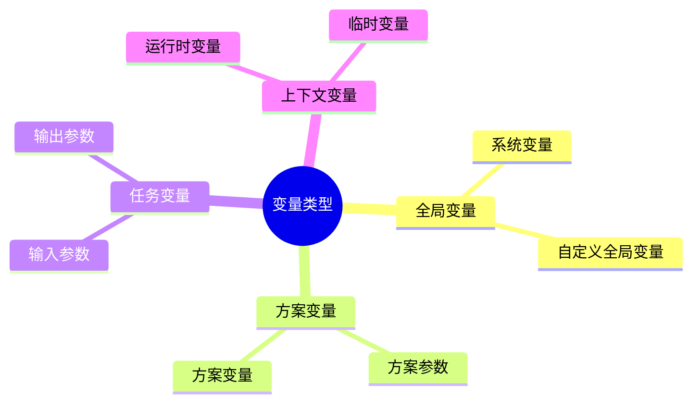
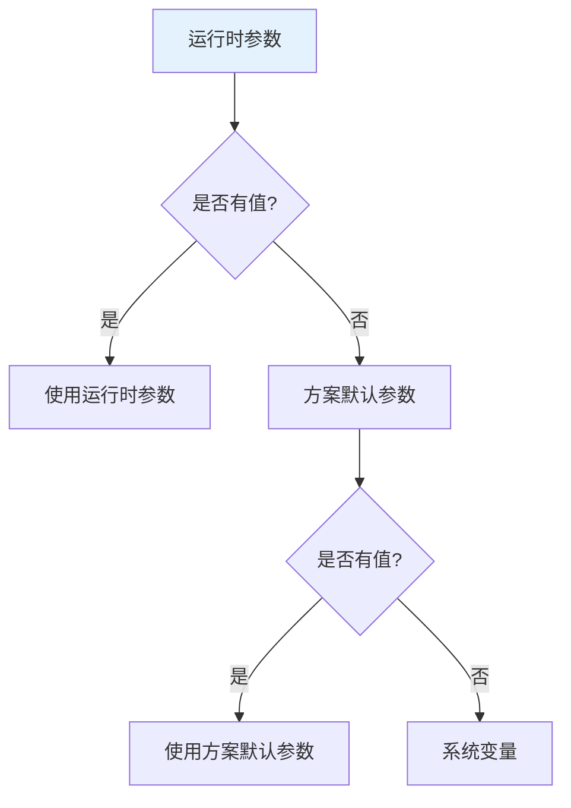
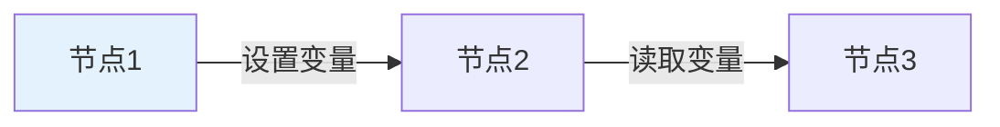
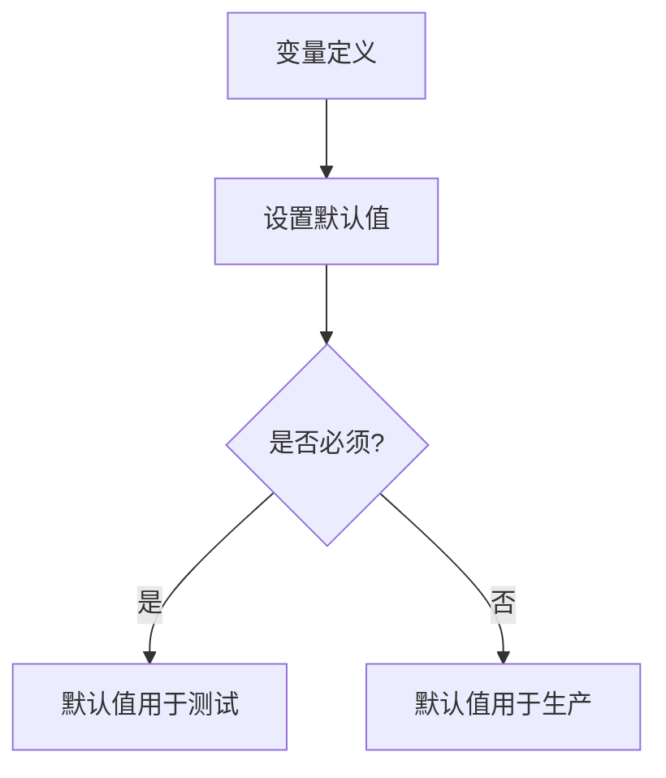

# 变量与参数

变量与参数是轻易云 iPaaS 中实现动态配置和数据传递的重要机制，本文档介绍其使用方法和最佳实践。

## 变量概述

### 变量类型



### 变量作用域

| 作用域 | 可见范围 | 生命周期 |
|-------|---------|---------|
| 全局 | 所有方案 | 长期有效 |
| 工作空间 | 当前空间所有方案 | 长期有效 |
| 方案 | 当前方案 | 方案存在期间 |
| 任务 | 当前任务执行 | 任务执行期间 |
| 节点 | 当前节点 | 节点执行期间 |

## 系统变量

### 内置系统变量

轻易云 iPaaS 提供以下内置变量：

| 变量名 | 说明 | 示例值 |
|-------|------|-------|
| `${system.currentTime}` | 当前时间 | `2024-01-01 12:00:00` |
| `${system.currentDate}` | 当前日期 | `2024-01-01` |
| `${system.timestamp}` | 时间戳 | `1704096000000` |
| `${system.taskId}` | 当前任务 ID | `task_abc123` |
| `${system.schemeId}` | 当前方案 ID | `scheme_xyz789` |
| `${system.workspaceId}` | 工作空间 ID | `ws_123456` |

### 时间变量

```mermaid
flowchart LR
    A[时间变量] --> B[当前时间]
    A --> C[相对时间]
    A --> D[时间格式化]

    B --> E[now()]
    C --> F[today()-1d]
    D --> G[yyyy-MM-dd]
```

**时间表达式**：

| 表达式 | 说明 | 示例结果 |
|-------|------|---------|
| `${now()}` | 当前时间 | `2024-01-01 12:30:45` |
| `${today()}` | 今天日期 | `2024-01-01` |
| `${today(-1)}` | 昨天 | `2023-12-31` |
| `${today(1)}` | 明天 | `2024-01-02` |
| `${now().format('yyyy-MM-dd')}` | 格式化 | `2024-01-01` |
| `${now().add('day', -7)}` | 7 天前 | `2023-12-25 12:30:45` |

## 自定义变量

### 定义变量

在方案中定义自定义变量：

```json
{
  "variables": [
    {
      "name": "syncDate",
      "type": "string",
      "defaultValue": "${today()}",
      "description": "同步日期"
    },
    {
      "name": "batchSize",
      "type": "number",
      "defaultValue": 100,
      "description": "每批处理数量"
    },
    {
      "name": "isFullSync",
      "type": "boolean",
      "defaultValue": false,
      "description": "是否全量同步"
    }
  ]
}
```

### 变量类型

| 类型 | 说明 | 示例 |
|-----|------|------|
| string | 字符串 | `"hello"` |
| number | 数值 | `123.45` |
| boolean | 布尔 | `true` / `false` |
| date | 日期 | `"2024-01-01"` |
| datetime | 日期时间 | `"2024-01-01 12:00:00"` |
| array | 数组 | `["a", "b", "c"]` |
| object | 对象 | `{"key": "value"}` |

## 变量引用

### 引用语法

使用 `${}` 语法引用变量：

```sql
-- SQL 中使用变量
SELECT * FROM orders 
WHERE create_time >= '${syncDate}' 
LIMIT ${batchSize}
```

```json
// JSON 中使用变量
{
  "orderDate": "${syncDate}",
  "pageSize": ${batchSize},
  "isFull": ${isFullSync}
}
```

### 变量运算

支持简单的变量运算：

| 表达式 | 说明 | 示例 |
|-------|------|------|
| `${a + b}` | 加法 | `${batchSize + 50}` |
| `${a - b}` | 减法 | `${pageNum - 1}` |
| `${a * b}` | 乘法 | `${price * quantity}` |
| `${a / b}` | 除法 | `${total / count}` |
| `${a % b}` | 取模 | `${index % 10}` |
| `${a == b}` | 等于 | `${status == 'success'}` |
| `${a != b}` | 不等于 | `${code != 0}` |

### 函数调用

使用内置函数处理变量：

```text
${string.upper(customerName)}           // 转大写
${string.lower(email)}                  // 转小写
${string.trim(address)}                 // 去空格
${string.substring(orderNo, 0, 8)}      // 截取
${math.round(amount, 2)}                // 四舍五入
${date.format(createTime, 'yyyy-MM-dd')} // 日期格式化
```

## 动态参数

### 运行时参数

任务执行时可以传入动态参数：

```bash
# API 调用传入参数
curl -X POST "https://api.qeasy.cloud/v1/tasks/execute" \
  -H "Content-Type: application/json" \
  -d '{
    "schemeId": "scheme_abc",
    "parameters": {
      "syncDate": "2024-01-01",
      "isFullSync": true
    }
  }'
```

### 参数优先级

参数值的优先级（从高到低）：



## 上下文传递

### 节点间传递

在流程编排中传递上下文：



**设置上下文**：

```javascript
// 在节点中设置变量
context.setVariable("totalAmount", 1000);
context.setVariable("recordCount", 50);
```

**读取上下文**：

```javascript
// 在后续节点中读取变量
var total = context.getVariable("totalAmount");
var count = context.getVariable("recordCount");
```

### 跨方案传递

通过链式触发传递参数：

```json
{
  "chainTrigger": {
    "targetSchemeId": "scheme_def",
    "parameters": {
      "parentTaskId": "${system.taskId}",
      "processedCount": "${recordCount}"
    }
  }
}
```

## 参数模板

### 模板定义

定义可复用的参数模板：

```json
{
  "templates": {
    "dateRange": {
      "startDate": "${today(-7)}",
      "endDate": "${today()}"
    },
    "pagination": {
      "pageSize": 100,
      "pageNum": 1
    }
  }
}
```

### 模板引用

```json
{
  "parameters": {
    "$ref": "dateRange",
    "status": "pending"
  }
}
```

## 加密参数

### 敏感参数处理

对于敏感参数（密码、API Key 等），使用加密存储：

```json
{
  "variables": [
    {
      "name": "apiSecret",
      "type": "string",
      "encrypted": true,
      "description": "API 密钥"
    }
  ]
}
```

### 使用加密参数

加密参数在使用时自动解密：

```text
Authorization: Bearer ${apiSecret}
```

> [!WARNING]
> 加密参数的值在日志中会显示为 `******`，请注意不要在代码中打印敏感信息。

## 最佳实践

### 1. 命名规范

使用清晰、有意义的变量名：

| 好的命名 | 不好的命名 |
|---------|-----------|
| `syncDate` | `d` |
| `orderCount` | `n` |
| `customerName` | `name` |
| `isFullSync` | `flag` |

### 2. 类型明确

明确定义变量类型，避免隐式转换：

```json
{
  "name": "amount",
  "type": "number",  // 明确指定为数值类型
  "defaultValue": 0
}
```

### 3. 默认值设置

为变量设置合理的默认值：



### 4. 参数校验

对输入参数进行校验：

```json
{
  "variables": [
    {
      "name": "pageSize",
      "type": "number",
      "defaultValue": 100,
      "validation": {
        "min": 1,
        "max": 1000
      }
    }
  ]
}
```

### 5. 文档说明

为变量添加清晰的描述：

```json
{
  "name": "syncMode",
  "type": "string",
  "defaultValue": "incremental",
  "description": "同步模式：incremental(增量)、full(全量)",
  "enum": ["incremental", "full"]
}
```

## 调试技巧

### 变量查看

在调试模式下查看变量值：

```text
[调试] 当前变量值:
- syncDate: "2024-01-01"
- batchSize: 100
- isFullSync: false
- recordCount: 50
```

### 变量追踪

开启变量追踪，记录变量变化：

```ini
[12:00:00] syncDate = "2024-01-01"
[12:00:01] recordCount = 0
[12:00:02] recordCount = 50
[12:00:03] totalAmount = 12500.50
```
