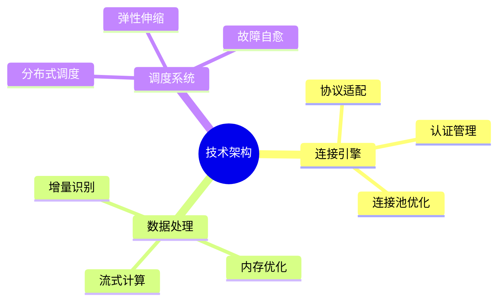
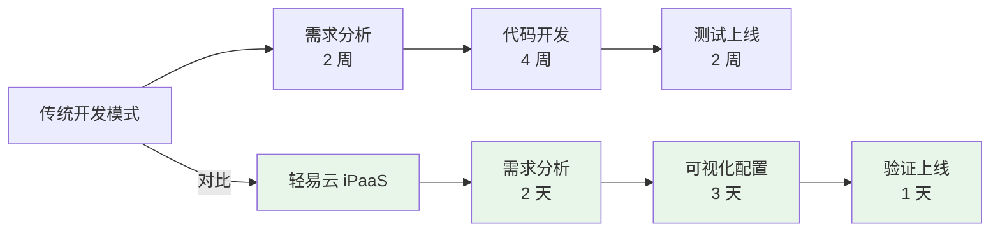
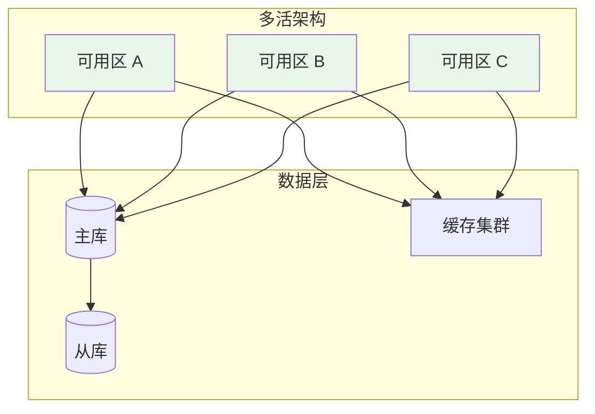
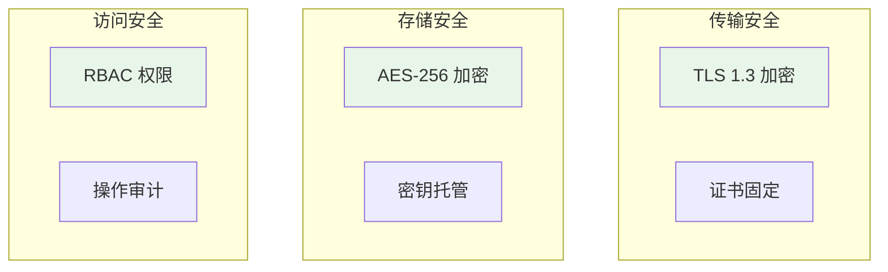

# 产品优势

轻易云 iPaaS 凭借领先的技术架构和丰富的实践经验，在企业数据集成领域具有显著优势。

## 全栈自研，技术领先

### 核心技术栈

### 性能指标

| 指标 | 性能数据 | 行业对比 |
|-----|---------|---------|
| 日数据处理能力 | 10 亿+ 条 | 领先 3 倍 |
| 单任务峰值吞吐 | 50 万条/分钟 | 领先 2 倍 |
| 平均响应延迟 | < 100 ms | 领先 50% |
| 系统可用性 | 99.99% | 行业领先 |

## 开箱即用，快速上线

### 预置连接器生态

- **500+** 预置连接器，覆盖主流企业应用
- **50+** ERP 系统深度适配
- **40+** 电商平台专用连接器
- **每周更新**，持续扩展连接器生态

### 低代码设计

传统开发一个集成接口需要 8 周，使用轻易云 iPaaS 仅需 1 周，**效率提升 8 倍**。

## 深度适配，业务理解

### 行业know-how沉淀

| 行业 | 解决方案数量 | 典型客户 |
|-----|------------|---------|
| 制造业 | 100+ | 世宗自动化、蔚蓝科技 |
| 零售业 | 80+ | 比柔、北通、摩杭 |
| 电商 | 120+ | 广州创信永、鑫宁项 |
| 医药 | 30+ | 谊安医疗、新涛 |

### 深度业务场景支持

- **金蝶系列**：支持金蝶云星空、云星辰、星瀚、K3 WISE、EAS 等全系产品深度集成
- **用友系列**：支持用友 NC、U8+、U9、YonSuite、BIP 等全系产品深度集成
- **电商平台**：支持旺店通、聚水潭、管易云等电商系统库存、订单、售后全链路集成

## 稳定可靠，企业级品质

### 高可用架构

### 容灾能力

- **RPO = 0**：数据零丢失
- **RTO < 5 分钟**：故障快速恢复
- **自动故障转移**：无需人工干预
- **定期容灾演练**：验证恢复能力

## 灵活扩展，满足个性需求

### 扩展能力矩阵

| 扩展类型 | 实现方式 | 难度 |
|---------|---------|-----|
| API 接入 | RESTful 连接器配置 | ⭐ 低 |
| 数据转换 | 可视化转换规则 | ⭐ 低 |
| 逻辑定制 | Python 脚本 | ⭐⭐ 中 |
| 连接器开发 | Java SDK | ⭐⭐⭐ 高 |
| 插件开发 | 插件框架 | ⭐⭐⭐ 高 |

### 自定义连接器

当预置连接器无法满足需求时，可以通过以下方式扩展：

1. **RESTful API 连接器**：配置方式接入，无需编码
2. **Python 适配器**：编写 Python 脚本实现复杂逻辑
3. **Java SDK 开发**：企业级连接器开发，支持复杂协议

## 安全保障，合规可信

### 安全认证

- **ISO 27001**：信息安全管理体系认证
- **等保三级**：通过国家信息安全等级保护认证
- **SOC 2 Type II**：服务组织控制报告

### 数据安全机制

## 专业服务，全程护航

### 服务体系

| 服务类型 | 内容 | 响应时效 |
|---------|------|---------|
| 在线客服 | 产品使用咨询 | 7×24 小时 |
| 技术支持 | 技术问题排查 | 工作日 8 小时内 |
| 专属客户成功 | 方案设计与优化 | 预约制 |
| 培训服务 | 产品使用培训 | 按需安排 |

### 社区生态

- **文档中心**：完整的产品文档和最佳实践
- **开发者社区**：开发者交流、问题讨论
- **视频教程**：从入门到精通的系列课程
- **模板市场**：开箱即用的集成方案模板

## 成本优势

### TCO 对比分析

| 成本项 | 自研集成平台 | 轻易云 iPaaS |
|-------|------------|-------------|
| 研发成本 | 200 万+ | 0 |
| 服务器成本 | 30 万/年 | 按需付费 |
| 运维人员 | 3~5 人 | 0 |
| 升级维护 | 持续投入 | 平台统一升级 |
| **3 年 TCO** | **350 万+** | **30 万起** |

使用轻易云 iPaaS，**3 年可节省成本 90% 以上**。
