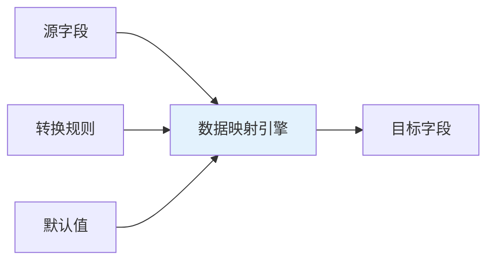
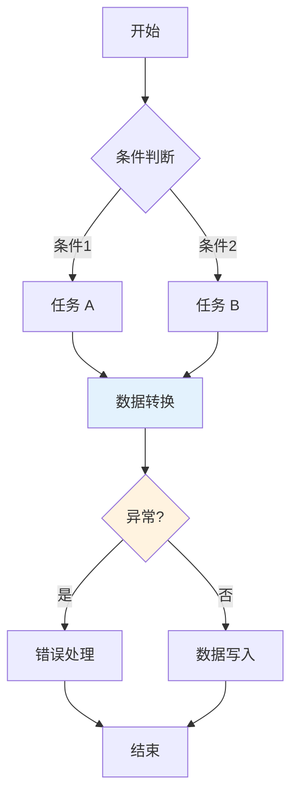
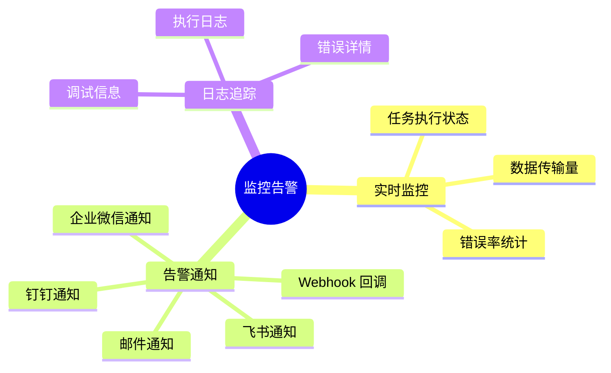
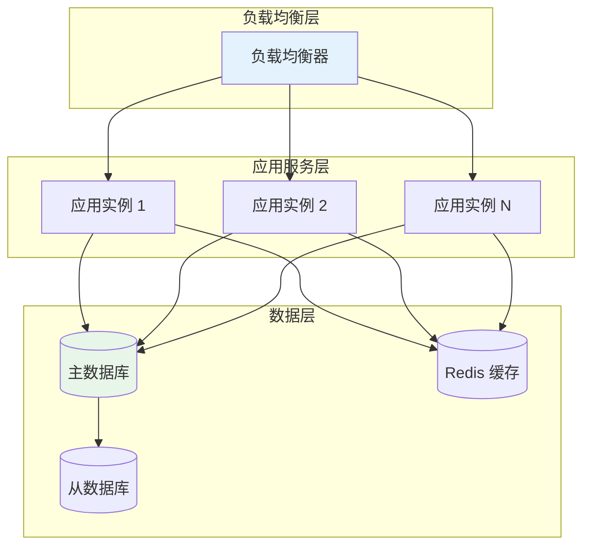

# 核心能力

轻易云 iPaaS 提供全栈式的数据集成能力，覆盖从数据采集、转换、传输到监控运维的完整生命周期。

## 连接能力

### 多类型连接器支持

平台预置 500+ 连接器，覆盖主流的企业应用系统：

| 类别 | 代表系统 | 连接器数量 |
|-----|---------|-----------|
| ERP 系统 | 金蝶、用友、SAP、Oracle | 50+ |
| OA 协同 | 钉钉、飞书、企业微信、泛微 | 30+ |
| 电商平台 | 旺店通、聚水潭、管易云 | 40+ |
| 数据库 | MySQL、Oracle、SQL Server、MongoDB | 20+ |
| SaaS 应用 | Salesforce、HubSpot、Moka | 60+ |

### 自定义连接器开发

当预置连接器无法满足需求时，开发者可以通过以下方式扩展：

- **RESTful API 连接器**：通过配置方式接入任意 REST API
- **Python 适配器**：使用 Python 脚本实现复杂的数据处理逻辑
- **Java 适配器 SDK**：基于 SDK 开发企业级连接器

## 数据处理能力

### 可视化数据映射

通过拖拽方式完成源数据到目标数据的字段映射：

支持的转换操作包括：

- 数据类型转换（字符串、数值、日期等）
- 字符串处理（截取、拼接、替换、正则匹配）
- 数值计算（四则运算、聚合、取整）
- 日期格式化与计算
- 条件判断与分支处理
- 自定义函数扩展

### 数据质量保障

- **数据校验**：必填字段、格式校验、范围校验
- **数据清洗**：去重、空值处理、异常值标记
- **数据补全**：关联查询、默认值填充

## 集成编排能力

### 流程编排

支持复杂的集成流程设计：

### 触发机制

| 触发类型 | 说明 | 适用场景 |
|---------|------|---------|
| 定时触发 | 按 Cron 表达式执行 | 周期性数据同步 |
| Webhook | 接收外部系统事件 | 实时事件响应 |
| 手动触发 | 用户手动执行 | 测试、补数 |
| 链式触发 | 方案执行后触发其他方案 | 业务流程编排 |

## 调度与运维能力

### 任务调度

- **优先级管理**：为不同任务设置执行优先级
- **并发控制**：限制同时运行的任务数量
- **失败重试**：自动重试失败的作业，支持自定义重试策略
- **任务依赖**：设置任务间的依赖关系，确保执行顺序

### 监控告警

## 安全与合规

### 数据安全

- **传输加密**：全链路 HTTPS/TLS 加密
- **存储加密**：敏感数据加密存储
- **密钥管理**：集成凭证统一托管，支持自动轮换

### 访问控制

- **权限管理**：基于角色的访问控制（RBAC）
- **操作审计**：完整的操作日志记录
- **IP 白名单**：限制访问来源 IP

## 高可用架构

- **多可用区部署**：服务跨可用区部署，单点故障自动切换
- **数据备份**：定期数据备份，支持时间点恢复
- **容灾演练**：定期进行故障演练，验证恢复能力

## 扩展与定制

### 开放 API

平台提供完整的 OpenAPI，支持：

- 连接器管理
- 集成方案管理
- 任务执行控制
- 监控数据查询

### 插件机制

支持通过插件扩展平台能力：

- 自定义数据处理器
- 自定义告警通道
- 自定义报表
