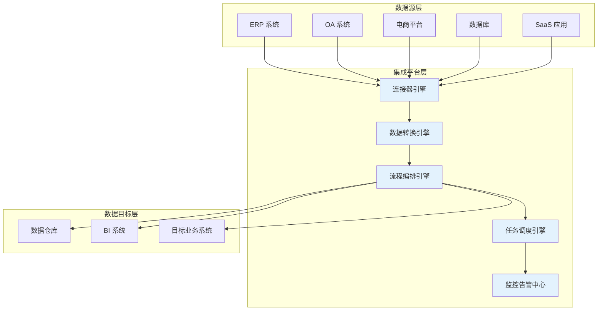

# 平台概览

轻易云 iPaaS 是一款企业级数据集成平台，帮助企业快速实现异构系统之间的数据打通与业务协同。通过可视化的集成设计器、丰富的预置连接器以及灵活的调度机制，企业可以在不改动原有系统的基础上，实现 ERP、CRM、OA、电商平台、数据库等多种应用系统的无缝集成。

## 产品定位

轻易云 iPaaS 定位于企业数字化转型的基础设施，致力于解决以下核心问题：

- **数据孤岛**：打通分散在不同系统中的数据，实现统一治理
- **集成复杂**：降低系统集成的技术门槛，让业务人员也能参与集成设计
- **维护困难**：提供可视化的监控运维能力，降低集成系统的运维成本
- **扩展受限**：支持自定义连接器开发，满足个性化集成需求

## 核心架构

## 产品形态

轻易云 iPaaS 提供两种部署形态，满足不同规模企业的需求：

| 部署形态 | 适用场景 | 特点 |
|---------|---------|------|
| 公有云 SaaS | 中小型企业、快速验证 | 即开即用、按量计费、免运维 |
| 私有化部署 | 大型企业、数据敏感场景 | 数据本地存储、定制开发、独立运维 |

## 典型应用场景

### 1. ERP 与电商平台集成
实现金蝶、用友等 ERP 系统与旺店通、聚水潭等电商平台的数据双向同步，确保订单、库存、商品信息实时一致。

### 2. OA 审批与财务系统联动
将钉钉、飞书等 OA 系统的审批流程与金蝶、用友等财务系统打通，实现报销、付款等业务的自动化处理。

### 3. 数据仓库构建
将分散在各类业务系统中的数据抽取、转换、加载到数据仓库，为数据分析和决策支持提供统一的数据基础。

### 4. 云原生应用集成
对接各类云原生服务和 API，构建灵活的业务中台和数据中台架构。

## 开始使用

> [!TIP]
> 初次使用轻易云 iPaaS？建议从 [快速开始](../quick-start/introduction) 章节开始，5 分钟即可完成第一个集成方案的配置。

如需了解平台的核心功能特性，请继续阅读 [核心能力](./capabilities) 章节。
