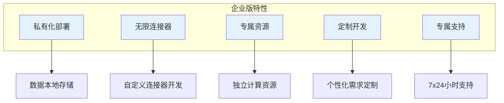

# 试用与购买

轻易云 iPaaS 提供灵活的定价方案，满足不同规模企业的需求。从免费试用到企业级私有化部署，总有一种方案适合您。

## 产品版本

| 版本 | 适用对象 | 核心特点 |
|-----|---------|---------|
| 免费试用版 | 初次体验用户 | 14 天免费试用，完整功能 |
| 基础版 | 小微企业和个人 | 按需付费，即开即用 |
| 专业版 | 成长型企业 | 更多连接器、更高并发 |
| 企业版 | 中大型企业 | 私有化部署、专属支持 |

## 公有云定价

### 基础版

适合小微企业和个人开发者，按使用量付费：

| 计费项 | 价格 | 说明 |
|-------|------|------|
| 数据流量 | ¥0.1/千条 | 按实际传输数据量计费 |
| 连接器 | 免费 | 基础连接器免费使用 |
| 任务执行 | ¥0.01/次 | 按任务执行次数计费 |
| 存储空间 | ¥0.5/GB/月 | 日志和暂存数据存储 |

> [!TIP]
> 新用户注册即送 ¥100 代金券，可用于抵扣首月费用。

### 专业版

适合成长型企业，提供更强大的功能和更高的配额：

| 套餐 | 月费 | 包含资源 |
|-----|------|---------|
| 专业版 S | ¥999/月 | 100万条数据流量、50个连接器、5个并发任务 |
| 专业版 M | ¥2,999/月 | 500万条数据流量、100个连接器、20个并发任务 |
| 专业版 L | ¥5,999/月 | 2000万条数据流量、200个连接器、50个并发任务 |

专业版额外权益：

- 优先技术支持（工作日 4 小时响应）
- 专属客户成功经理
- 免费培训服务（2 次/年）
- 数据保留 90 天

### 企业版

适合中大型企业和对数据安全有特殊要求的客户：



企业版报价需根据具体需求评估，请联系销售团队获取专属方案。

## 私有化部署

### 部署方式

| 部署方式 | 适用场景 | 起步价 |
|---------|---------|-------|
| 单机部署 | 小型企业、POC 验证 | ¥50,000/年 |
| 高可用部署 | 中型企业、生产环境 | ¥150,000/年 |
| 分布式部署 | 大型企业、海量数据 | ¥300,000/年 |

### 私有化部署优势

- **数据安全**：数据完全存储在本地，物理隔离
- **自主可控**：完全掌控系统运行环境和升级节奏
- **深度定制**：支持深度二次开发和功能定制
- **合规要求**：满足金融、政府等行业合规要求

## Lite 集成方案包

针对常见集成场景，我们提供开箱即用的 Lite 集成方案包：

| 方案包 | 原价 | 特惠价 | 包含内容 |
|-------|------|-------|---------|
| 电商财务一体化 | ¥15,999 | ¥9,999 | 旺店通/聚水潭 + 金蝶/用友 |
| OA 审批集成 | ¥9,999 | ¥5,999 | 钉钉/飞书 + 金蝶/用友 |
| CRM 集成 | ¥12,999 | ¥7,999 | 纷享销客/销售易 + ERP |
| MES 集成 | ¥19,999 | ¥12,999 | MES + ERP + 数据仓库 |

> [!NOTE]
> Lite 方案包价格包含首年服务费，次年续费享 5 折优惠。

## 费用计算示例

### 示例一：小微企业

某小微企业需要将旺店通订单同步到金蝶云星空：

- 日均订单量：500 单
- 月数据量：15,000 条
- 选择基础版

费用估算：

```text
数据流量费用：15,000 × ¥0.1/千条 = ¥1.5
任务执行费用：30天 × ¥0.01 × 4次 = ¥1.2
月费用合计：约 ¥3 元
```

### 示例二：中型电商

某中型电商企业需要多平台订单聚合：

- 日均订单量：10,000 单
- 月数据量：300,000 条
- 选择专业版 M

费用：¥2,999/月（套餐内资源充足，无需额外付费）

## 如何购买

### 在线购买

1. 访问 [轻易云官网](https://www.qeasy.cloud)
2. 注册账号并登录控制台
3. 进入「费用中心」选择套餐
4. 在线支付，即时开通

### 联系销售

如需企业版或私有化部署，请通过以下方式联系我们：

| 联系方式 | 详情 |
|---------|------|
| 销售热线 | 400-XXX-XXXX |
| 邮箱 | sales@qeasy.cloud |
| 在线咨询 | 官网右下角在线客服 |

### 付款方式

- 在线支付：支付宝、微信支付、银联
- 对公转账：支持企业银行转账
- 合同付款：企业版支持先签合同后付款

## 退款政策

- 公有云版本：购买 7 天内未使用可申请全额退款
- 私有化部署：按照合同约定执行
- 特殊说明：已使用的资源费用不予退还

## 常见问题

**Q: 免费试用期结束后如何续费？**

A: 试用期结束前 3 天会发送提醒邮件，您可以在控制台直接升级到付费版本，数据会自动保留。

**Q: 可以随时升级或降级套餐吗？**

A: 是的，您可以随时在控制台调整套餐，费用按实际使用天数比例计算。

**Q: 超出套餐配额如何计费？**

A: 超出部分按照基础版单价计费，费用会在次月账单中体现。

**Q: 是否有年度优惠？**

A: 选择年付可享受 8.5 折优惠，企业版还可根据采购规模获得更大折扣。
