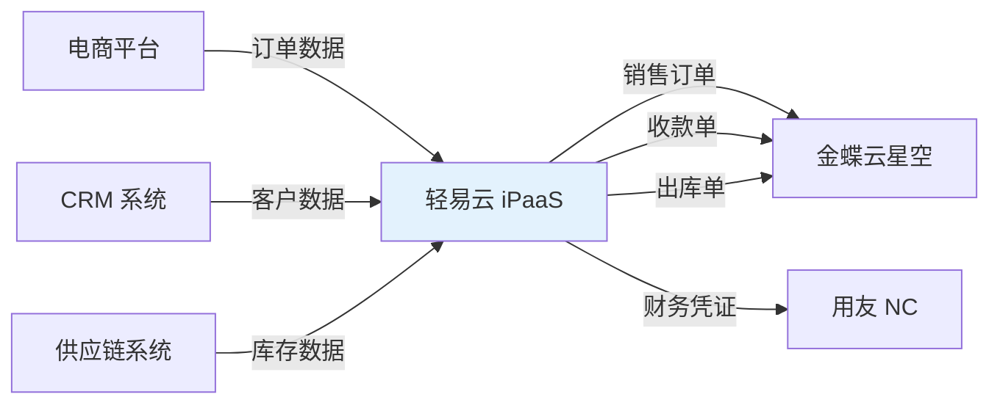
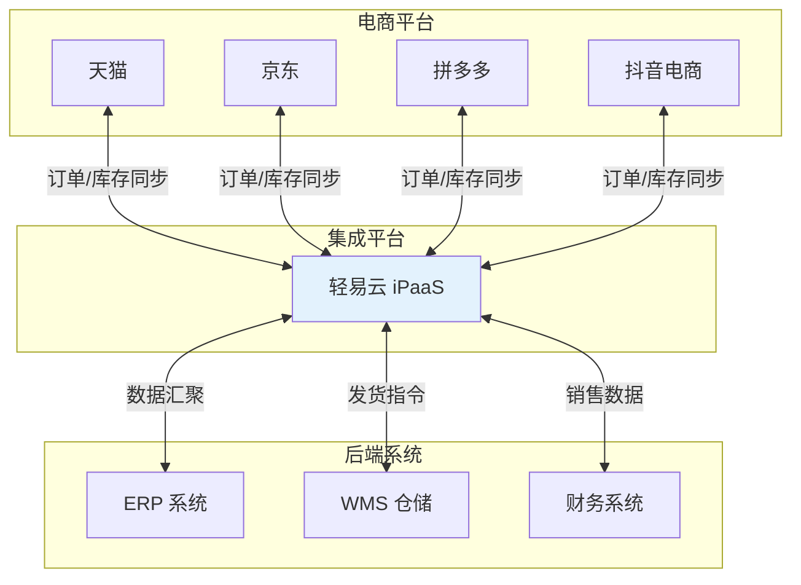
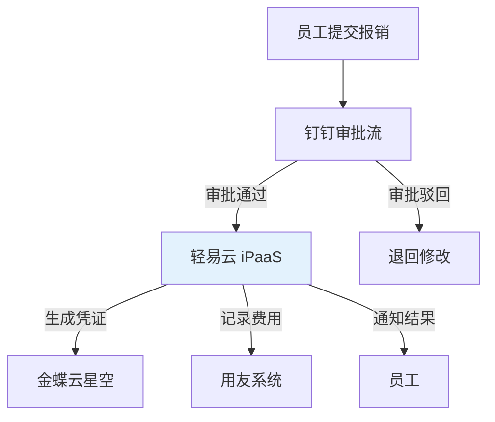
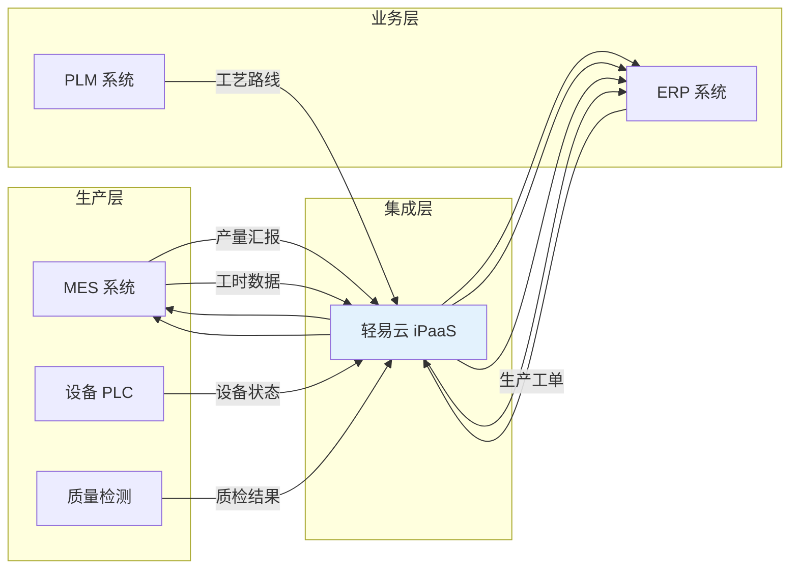
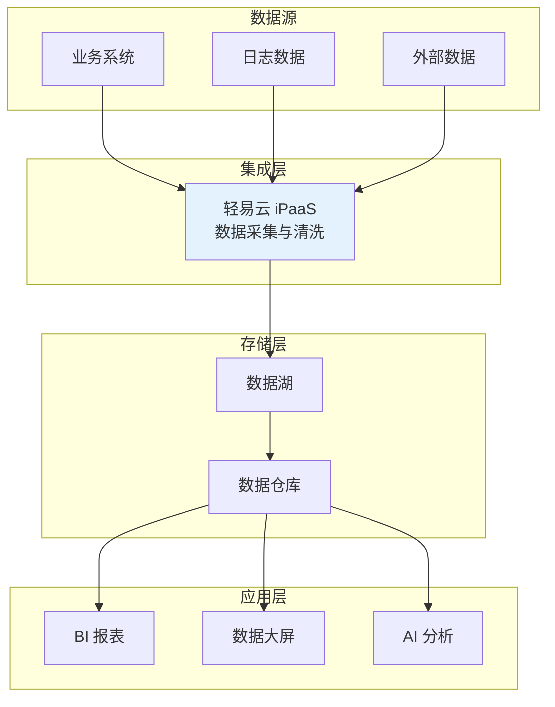
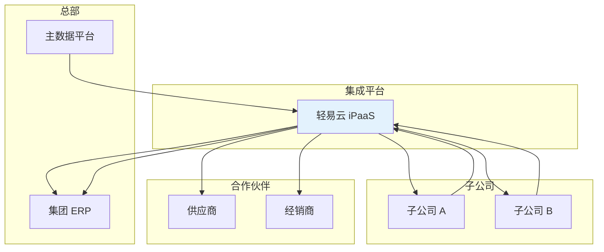

# 应用场景

轻易云 iPaaS 广泛应用于企业数字化转型的各种场景，帮助企业打破系统壁垒，实现数据驱动的业务协同。

## 业财一体化

### 场景描述

将业务系统（电商、CRM、供应链）与财务系统（ERP）打通，实现业务数据自动入账，财务数据实时反馈业务。

### 典型流程

### 应用效果

- 订单到收款周期缩短 60%
- 财务对账效率提升 80%
- 人工录入错误率降低 95%

## 多电商平台统一管理

### 场景描述

企业在天猫、京东、拼多多、抖音等多个电商平台开店，需要统一管理商品、库存、订单。

### 集成架构

### 核心功能

| 功能模块 | 说明 |
|---------|------|
| 商品同步 | 统一管理多平台商品信息、价格、库存 |
| 订单聚合 | 汇聚多平台订单，统一处理发货 |
| 库存分配 | 智能分配多平台库存，防止超卖 |
| 售后管理 | 统一处理退款、退货、换货 |

## 钉钉/飞书审批集成

### 场景描述

将钉钉或飞书的审批流程与企业 ERP 系统集成，实现移动审批、财务自动记账。

### 典型审批场景

### 支持的业务类型

- 费用报销
- 付款申请
- 采购申请
- 合同审批
- 借款还款

## MES 与 ERP 集成

### 场景描述

制造企业将 MES（制造执行系统）与 ERP 系统打通，实现生产数据与业务数据的实时同步。

### 数据流向

### 集成价值

- 生产进度实时可见
- 成本核算精确到工单
- 质量追溯全程可查
- 计划排产更加精准

## 数据中台建设

### 场景描述

构建企业级数据中台，整合分散在各业务系统的数据，为数据分析和决策提供支撑。

### 架构设计

### 实施步骤

1. **数据摸底**：梳理企业现有数据源
2. **标准制定**：建立统一的数据标准和规范
3. **采集接入**：通过连接器接入各数据源
4. **清洗转换**：数据质量治理和标准化处理
5. **模型构建**：建立维度模型和指标体系
6. **服务开放**：通过 API 对外提供数据服务

## 云原生应用集成

### 场景描述

企业采用微服务架构和云原生技术，需要灵活、弹性的集成能力支撑业务创新。

### 技术特性

| 特性 | 说明 |
|-----|------|
| 事件驱动 | 基于事件总线的异步集成 |
| API 网关 | 统一入口、流量控制、安全防护 |
| 容器化部署 | 支持 Kubernetes 编排 |
| 弹性伸缩 | 根据负载自动扩缩容 |

## 跨组织协同

### 场景描述

集团型企业需要实现总部与子公司、上下游合作伙伴之间的数据协同。

### 协同模式

### 核心能力

- **主数据分发**：统一客户、供应商、物料等主数据
- **订单协同**：采购订单、销售订单跨组织流转
- **库存共享**：多级库存可视，优化库存配置
- **财务合并**：自动化的报表合并与抵消
