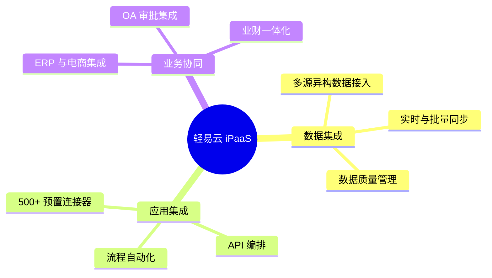
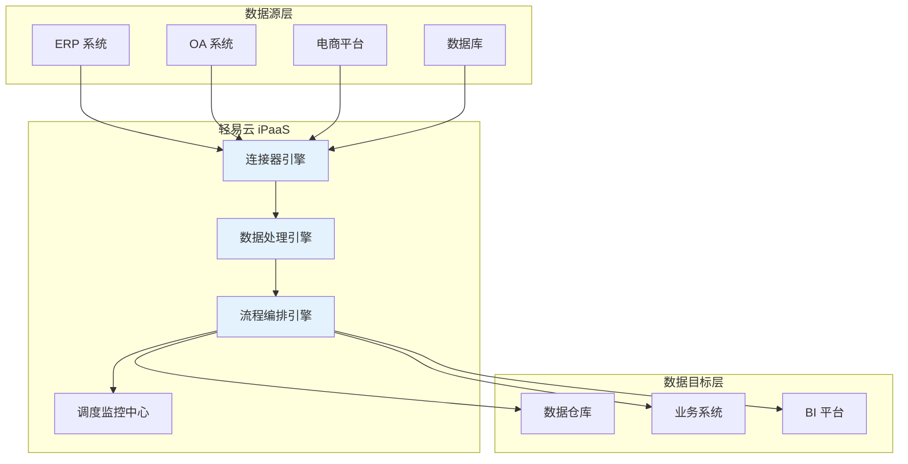

# 产品概览

轻易云 iPaaS 是企业级数据集成平台，帮助企业快速实现异构系统之间的数据打通与业务协同。

## 核心能力

## 产品架构

## 快速导航

| 模块 | 说明 | 链接 |
|-----|------|------|
| 产品介绍 | 了解产品定位、能力和优势 | [查看详情](./introduction/overview) |
| 快速开始 | 5 分钟上手，创建第一个集成方案 | [立即开始](./quick-start/introduction) |
| 使用指南 | 详细的功能使用说明 | [查看指南](./guide) |
| 连接器 | 已支持的 500+ 系统连接 | [查看连接器](./connectors) |
| 解决方案 | 行业场景解决方案 | [查看方案](./solutions) |
| API 参考 | 完整的 OpenAPI 文档 | [查看 API](./api-reference) |

## 开始使用

> [!TIP]
> 初次使用轻易云 iPaaS？建议从 [快速开始](./quick-start/introduction) 章节开始。

### 1. 注册账号

访问 [轻易云官网](https://www.qeasy.cloud) 注册账号。

### 2. 创建连接器

配置与您的业务系统的连接。

### 3. 设计集成方案

使用可视化设计器配置数据映射和转换规则。

### 4. 运行监控

启动方案并监控执行状态。
