# 轻易云 DataHub 产品概览

轻易云 DataHub 是企业级 iPaaS（Integration Platform as a Service）数据集成平台，致力于帮助企业打破数据孤岛，实现异构系统间的数据无缝流转与业务高效协同。通过可视化配置、低代码开发模式，企业可在数小时内完成传统需要数周才能实现的系统对接工作。

> [!NOTE]
> 本文介绍轻易云 DataHub 的核心定位、技术架构与关键概念。如需快速上手实践，请参阅[快速开始](../quick-start/)章节。

## 产品定位

### 解决的核心问题

在企业数字化转型过程中，数据分散在不同系统中形成"数据孤岛"是普遍挑战：

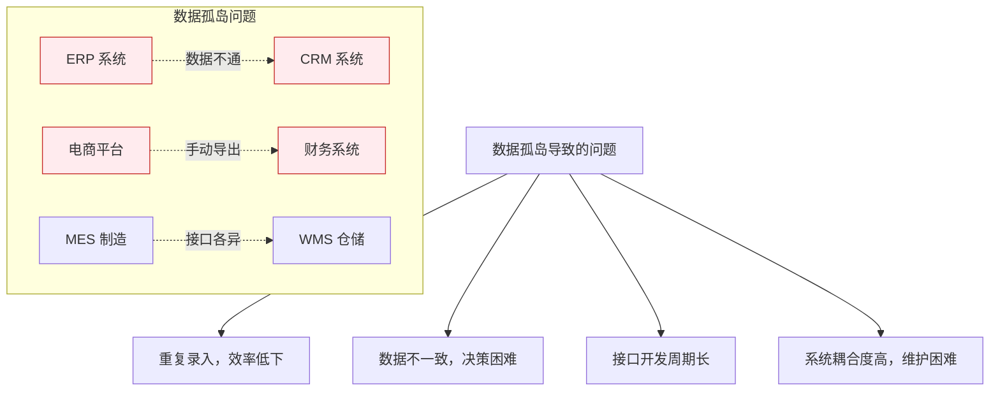

轻易云 DataHub 作为专业的数据集成中间件，提供一站式的解决方案：

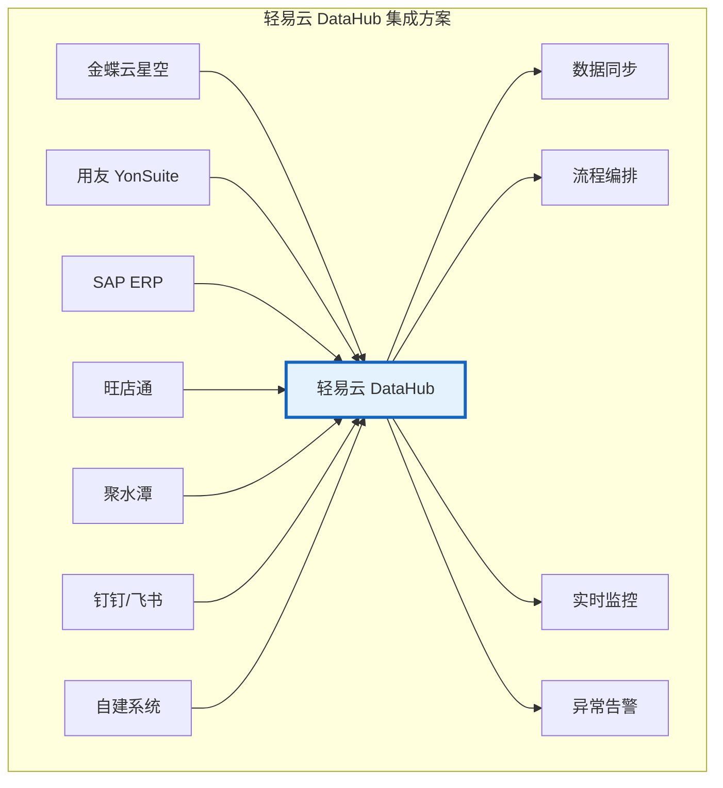

### 目标用户场景

| 场景类型 | 典型用户 | 核心诉求 |
|----------|----------|----------|
| **业财一体化** | 财务部门、CFO | 业务数据自动同步至财务系统，实现账实相符 |
| **供应链协同** | 采购、供应链部门 | 供应商系统与内部 ERP 实时对接，提升响应速度 |
| **全渠道零售** | 电商运营、IT 部门 | 多电商平台订单统一处理，库存实时同步 |
| **智能制造** | 生产管理、IT 部门 | MES 与 ERP 数据互通，实现柔性生产 |
| **SaaS 集成** | 企业 IT、系统集成商 | 快速连接多个云应用，构建统一数据底座 |

## 技术架构

### 整体架构

轻易云 DataHub 采用云原生分布式架构，具备高可用、弹性伸缩、安全隔离等特性：

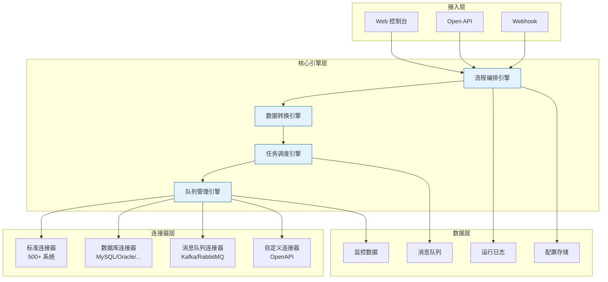

### 数据处理流程

数据在轻易云 DataHub 中的完整生命周期如下：

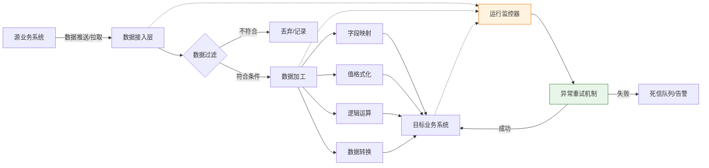

### 性能指标

| 指标项 | 规格说明 |
|--------|----------|
| 并发处理 | 支持万级 QPS，水平弹性扩展 |
| 数据吞吐量 | 单节点可达 60 MB/s |
| 延迟表现 | 平均端到端延迟 < 100 ms |
| 连接器数量 | 500+ 预置连接器，覆盖主流企业应用 |
| API 资产 | 超过 400 万+ 预置 API 接口 |
| 可用性保障 | 99.9% SLA，多可用区部署 |

## 核心概念

理解以下核心概念是熟练使用轻易云 DataHub 的基础：

### 连接器（Connector）

连接器是轻易云 DataHub 与外部系统进行通信的桥梁，用于管理连接配置和认证信息。

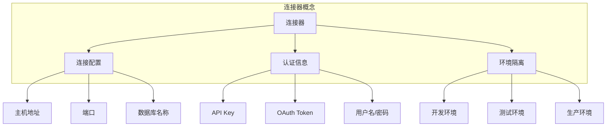

> [!TIP]
> 建议为开发、测试、生产环境分别创建独立的连接器，通过环境变量或配置切换，避免误操作影响生产数据。

连接器支持的环境类型：

| 环境 | 标识 | 用途 |
|------|------|------|
| 开发环境 | `env_development` | 接口调试、方案开发 |
| 测试环境 | `env_test` | 集成测试、UAT 验证 |
| 生产环境 | `env_production` | 正式业务运行 |

### 集成方案（Strategy）

集成方案是轻易云 DataHub 的核心单元，定义了数据从源系统到目标系统的完整流转规则。

一个集成方案包含以下要素：

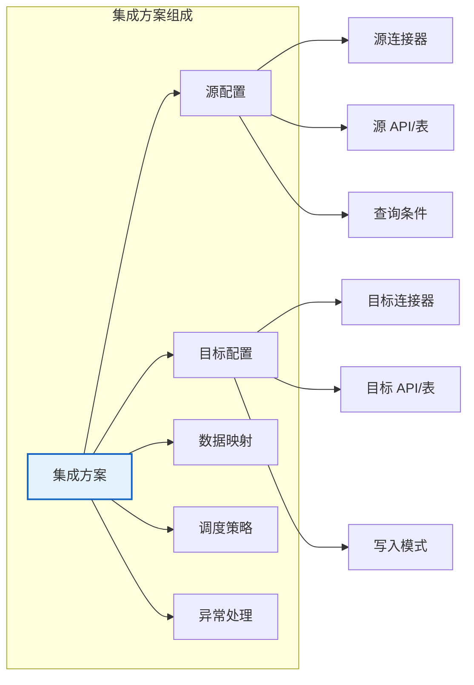

典型集成方案示例：

| 方案名称 | 源系统 | 目标系统 | 同步内容 |
|----------|--------|----------|----------|
| 销售订单同步 | 天猫/京东 | ERP | 订单信息、客户信息 |
| 库存实时同步 | ERP | 电商平台 | 可用库存数量 |
| 财务凭证对接 | 业务系统 | 财务系统 | 会计凭证、科目余额 |
| 主数据分发 | MDM | 各业务系统 | 物料、客户、供应商主数据 |

### 数据映射（Data Mapping）

数据映射定义了源数据字段与目标数据字段之间的对应关系，是数据集成的关键环节。

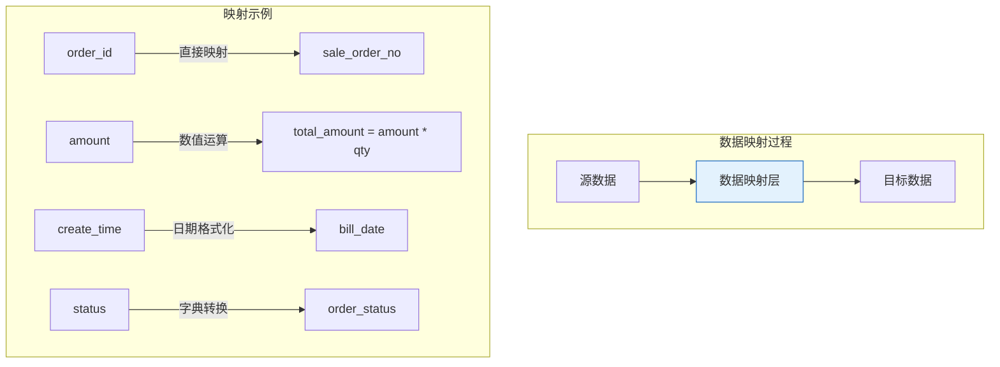

数据映射支持的操作类型：

| 操作类型 | 说明 | 示例 |
|----------|------|------|
| 直接映射 | 字段一对一传递 | `user_id` → `user_id` |
| 常量赋值 | 固定值填充 | 设置为 `"QEASY"` |
| 字段拼接 | 多字段组合 | `first_name + " " + last_name` |
| 数值运算 | 数学计算 | `price * quantity` |
| 条件判断 | 逻辑分支 | `IF(status=1, "有效", "无效")` |
| 字典转换 | 枚举映射 | `1→启用, 0→禁用` |
| 日期格式化 | 时间转换 | `2024-01-01` → `2024/01/01` |

### 值格式化（Value Formatter）

值格式化器用于对字段值进行精细化处理，确保数据符合目标系统的要求。

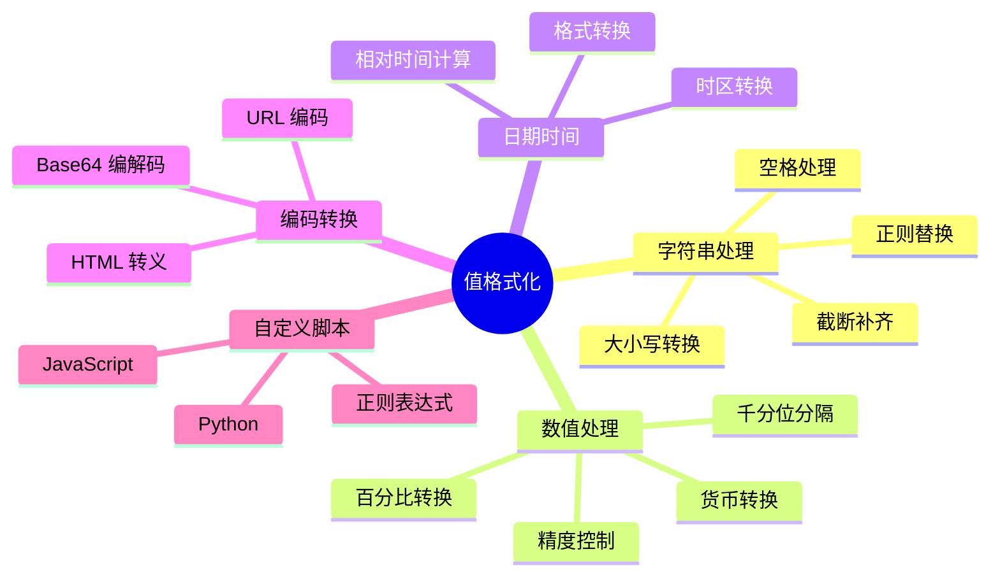

> [!NOTE]
> 值格式化支持内置函数和自定义脚本两种方式。内置函数开箱即用，自定义脚本适合复杂的业务逻辑处理。

### 队列（Queue）

队列是轻易云 DataHub 实现异步处理、流量削峰的核心机制。

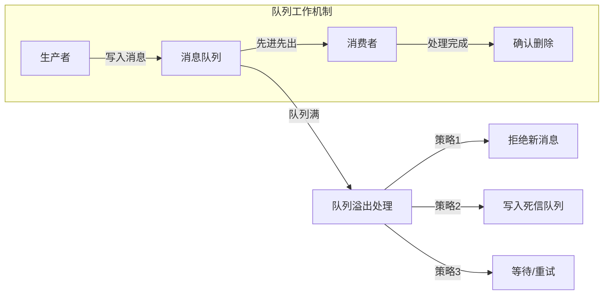

队列的核心特性：

| 特性 | 说明 |
|------|------|
| **先进先出（FIFO）** | 保证消息处理的时序性 |
| **有界队列** | 设置最大容量，防止内存溢出 |
| **持久化** | 支持消息落盘，服务重启不丢失 |
| **优先级** | 支持消息优先级，重要任务优先处理 |
| **重试机制** | 失败自动重试，支持指数退避策略 |

> [!IMPORTANT]
> 合理设置队列大小是性能调优的关键。队列过小会导致请求被拒绝，队列过大可能引起长时间等待。建议根据业务峰值和系统处理能力进行压测后设置。

## 差异化优势

### 与传统 ETL 工具对比

| 对比维度 | 传统 ETL 工具 | 轻易云 DataHub |
|----------|---------------|----------------|
| **部署模式** | 本地部署，需维护服务器 | SaaS/私有化部署，即开即用 |
| **开发方式** | 编写复杂脚本，周期长 | 可视化配置，数小时上线 |
| **系统对接** | 需自行开发连接器 | 500+ 预置连接器，开箱即用 |
| **实时性** | 多为批量处理，T+1 延迟 | 支持实时 CDC，秒级同步 |
| **扩展性** | 垂直扩展，受限于单机 | 云原生架构，水平弹性扩展 |
| **运维成本** | 需专业 DBA/运维团队 | 托管式服务，免运维 |

### 与主流 iPaaS 平台对比

| 对比维度 | 轻易云 DataHub | 国内某云 iPaaS | 国际某知名 iPaaS |
|----------|----------------|----------------|------------------|
| **本土化** | 深度适配金蝶、用友等国产 ERP | 一般 | 较弱 |
| **连接器** | 500+，专注国内企业应用 | 300+ | 1000+，偏重国外应用 |
| **实时 CDC** | 原生支持，配置简单 | 需额外配置 | 企业版支持 |
| **私有化部署** | 支持，灵活交付 | 限制较多 | 企业版高价 |
| **实施服务** | 原厂专业团队支持 | 依赖合作伙伴 | 远程支持为主 |
| **性价比** | 按需付费，透明定价 | 阶梯定价 | 按量计费，成本较高 |

### 核心竞争优势

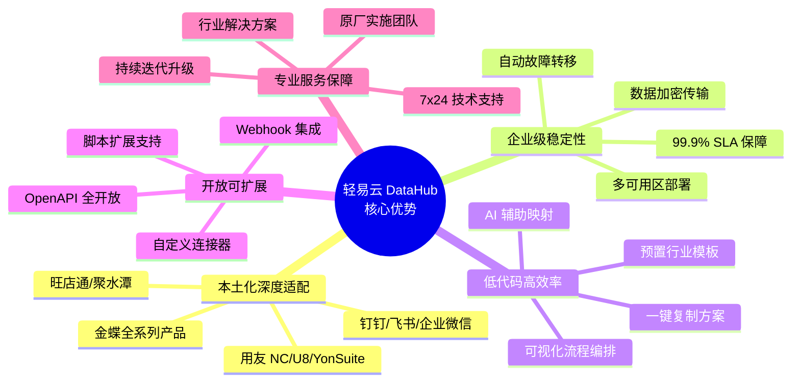

## 典型应用场景

### 场景一：电商订单履约

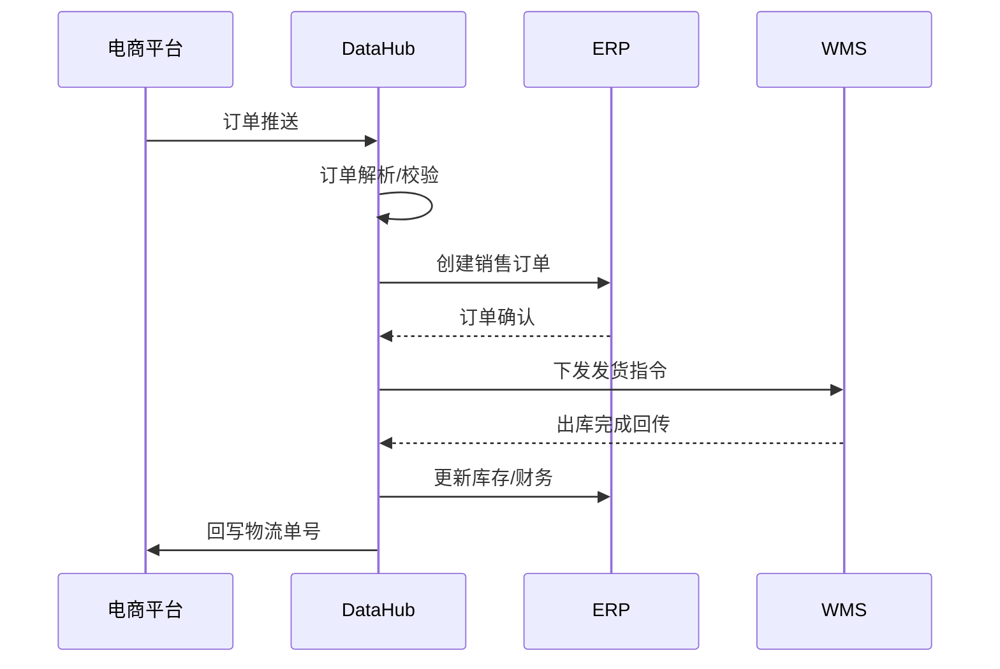

**方案价值**：订单处理时效从小时级缩短至分钟级，人工录入错误率降低 95%。

### 场景二：业财一体化

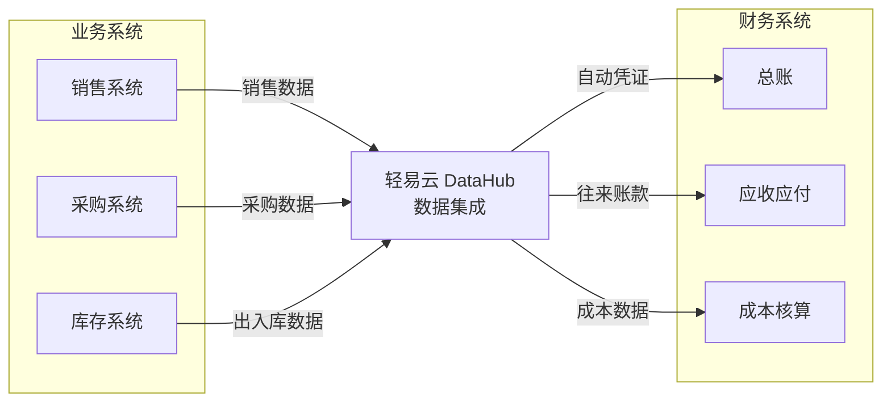

**方案价值**：财务结账周期从 7 天缩短至 1 天，账实相符率达到 100%。

### 场景三：供应链协同

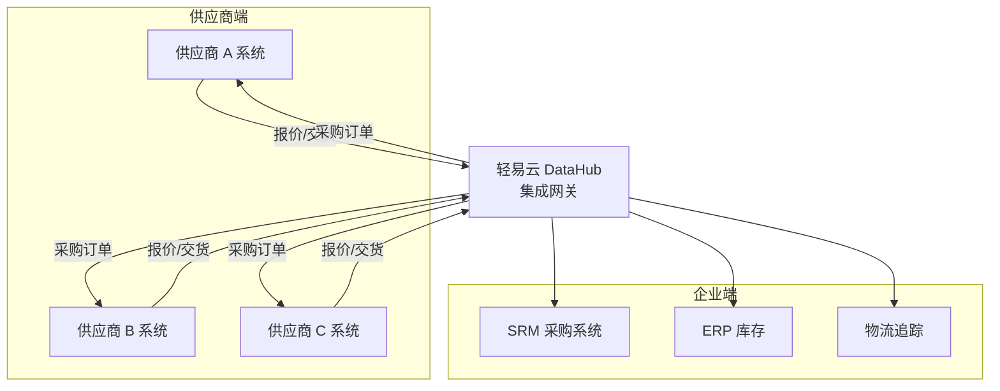

**方案价值**：采购订单响应速度提升 3 倍，库存周转率提升 20%。

## 快速开始

> [!TIP]
> 建议按以下路径快速上手轻易云 DataHub：

1. **了解产品**：阅读本文档，理解核心概念
2. **账号准备**：注册轻易云账号，获取访问权限
3. **创建连接器**：配置源系统和目标系统的连接信息
4. **配置方案**：创建第一个集成方案，完成数据映射
5. **测试运行**：在开发环境测试验证
6. **上线生产**：切换至生产连接器，启动调度任务

如需详细的操作指导，请参阅：

- [快速开始指南](../quick-start/) — 5 分钟完成第一个集成方案
- [连接器配置](../guide/configure-connector) — 详细讲解各类连接器的配置方法
- [数据映射指南](../guide/data-mapping/) — 深入理解数据转换与映射规则
- [解决方案](../solutions/README) — 行业解决方案与实施建议

## 相关资源

| 资源类型 | 链接 | 说明 |
|----------|------|------|
| 产品官网 | https://www.qeasy.cloud | 了解产品动态与客户案例 |
| 在线演示 | https://www.qeasy.cloud/demo | 预约一对一产品演示 |
| 技术支持 | https://www.qeasy.cloud/contact | 联系集成顾问获取帮助 |
| API 文档 | ../api-reference/ | OpenAPI 接口详细说明 |

---

> [!NOTE]
> 本文档最后更新于 2026-03-13。如发现内容有误或需要补充，欢迎通过「在 GitHub 上编辑」提交改进建议。
