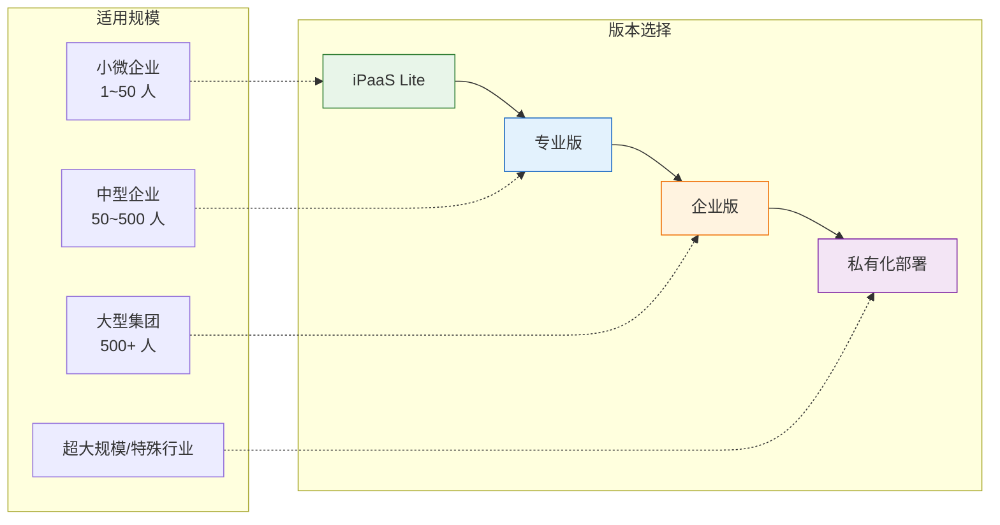
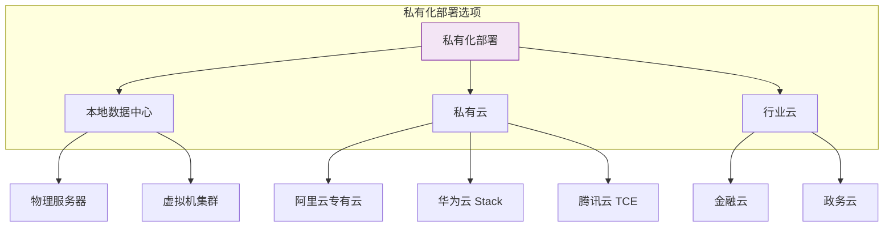
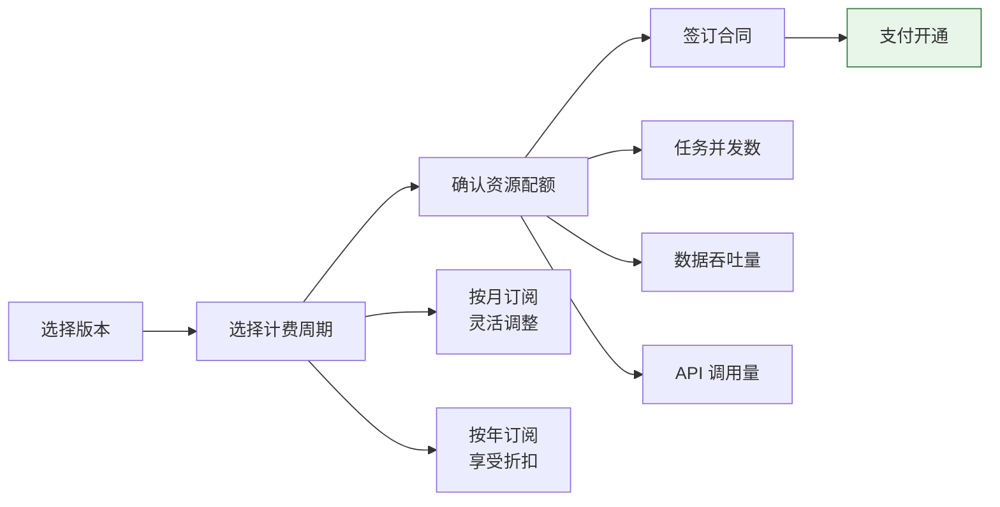

# 试用与购买指南

本文介绍轻易云 iPaaS 各版本的功能差异、适用场景，以及如何申请试用和购买。通过阅读本文，你可以根据自身业务需求选择合适的产品版本。

> [!NOTE]
> 轻易云 iPaaS 提供灵活的版本选择，从适合小微企业的 Lite 版到支持大型集团的企业版，满足不同规模企业的数据集成需求。

## 版本概览

轻易云 iPaaS 目前提供四个版本，覆盖从基础数据对接到企业级全域集成的完整场景：

### 版本对比一览

| 功能维度 | Lite 版 | 专业版 | 企业版 | 私有化部署 |
|----------|---------|--------|--------|------------|
| **适用对象** | 小微企业、初创团队 | 中型企业、成长型企业 | 大型集团、多组织企业 | 金融机构、政府部门、大型企业 |
| **连接器数量** | 50+ 常用连接器 | 200+ 标准连接器 | 500+ 全量连接器 | 不限，支持定制开发 |
| **并发任务数** | 5 个 | 20 个 | 不限 | 按硬件配置 |
| **数据吞吐量** | 10 GB/月 | 100 GB/月 | 不限 | 不限 |
| **API 调用量** | 1 万次/月 | 10 万次/月 | 100 万次/月起 | 不限 |
| **实时 CDC** | — | ✅ | ✅ | ✅ |
| **自定义脚本** | — | ✅ | ✅ | ✅ |
| **多租户管理** | — | — | ✅ | ✅ |
| **专属客户经理** | — | — | ✅ | ✅ |
| **SLA 保障** | 99.5% | 99.9% | 99.95% | 可定制 |

> [!TIP]
> 不确定选择哪个版本？建议先申请专业版试用，根据实际使用情况再决定最终版本。

## 版本详细介绍

### Lite 版

Lite 版是轻易云 iPaaS 的入门版本，专为预算有限、集成需求简单的小微企业和初创团队设计。

**核心功能**：

- 50+ 常用预置连接器（金蝶、用友、钉钉、企业微信等）
- 可视化流程编排与基础数据映射
- 定时任务调度（最小间隔 5 分钟）
- 基础运行监控与告警
- Web 控制台访问

**适用场景**：

- 单一业务系统与财务系统的数据对接
- 小型电商企业的订单同步
- 初创公司的基础数据整合

**限制说明**：

> [!WARNING]
> Lite 版不支持实时 CDC 同步、自定义脚本开发，且数据吞吐量受限（10 GB/月）。如需更高性能或高级功能，请考虑升级至专业版。

### 专业版

专业版是轻易云 iPaaS 的主力版本，适合有复杂集成需求的中型企业，提供完整的 iPaaS 能力。

**核心功能**：

- 200+ 标准连接器，覆盖主流企业应用
- 实时 CDC（Change Data Capture）同步
- 自定义脚本支持（JavaScript/Python）
- 高级数据转换与格式化
- 队列管理与流量控制
- 多渠道告警（钉钉、飞书、企业微信、短信）
- API 开放平台

**适用场景**：

- 多系统间实时数据同步（如 MES 与 ERP）
- 电商平台与仓储系统的订单履约
- 业财一体化数据对接
- SaaS 应用间的自动化流程

**性能规格**：

| 指标 | 规格 |
|------|------|
| 并发任务 | 20 个 |
| 数据吞吐量 | 100 GB/月 |
| API 调用 | 10 万次/月 |
| 同步延迟 | 平均 < 100 ms |

### 企业版

企业版面向大型集团和复杂组织架构，提供全方位的数据集成能力与专业服务支持。

**核心功能**：

- 500+ 全量连接器，持续更新
- 不限并发任务与数据吞吐量
- 多租户管理与权限隔离
- 私有连接与专有网络支持
- 专属技术支持与实施顾问
- 定制化培训与最佳实践指导
- 优先功能迭代与早期试用

**适用场景**：

- 集团型企业多组织数据整合
- 跨国企业的全球化数据治理
- 高频交易场景的实时数据同步
- 大规模异构系统统一集成平台

**增值服务**：

- 专属客户成功经理
- 7×24 小时技术支持热线
- 原厂实施团队驻场支持
- 定期健康检查与优化建议

### 私有化部署

私有化部署版本将轻易云 iPaaS 完整部署在企业自有基础设施上，满足数据合规与自主可控要求。

**部署方式**：

**核心优势**：

- **数据完全自主可控**：数据不出企业网络边界
- **灵活定制扩展**：支持深度定制开发
- **与现有 IT 架构深度融合**：对接企业 IAM、监控、日志系统
- **长期成本优化**：大规模场景下 TCO 更低

**适用行业**：

- 银行、证券、保险等金融机构
- 政府机关与公共服务部门
- 军工、能源等关键基础设施
- 对数据主权有严格要求的外资企业

> [!IMPORTANT]
> 私有化部署需要企业具备一定的技术运维能力，或选购轻易云的原厂运维服务。部署周期通常为 2~4 周，具体取决于环境复杂度。

## 申请试用

### 试用政策

轻易云 iPaaS 提供 **14 天全功能免费试用**，试用期间可享受专业版的全部功能：

- 200+ 标准连接器无限制使用
- 实时 CDC 同步功能
- 自定义脚本开发
- 最高 10 GB 数据吞吐量
- 专业技术支持

### 申请步骤

1. **访问官网注册**

   访问 [轻易云官网](https://www.qeasy.cloud)，点击右上角「免费试用」按钮。

2. **填写企业信息**

   提交企业名称、联系人、手机号等基本信息。系统会自动发送验证码进行手机号验证。

3. **选择试用场景**

   根据你的集成需求选择对应场景（可多选）：

   - ERP 与财务系统对接
   - 电商平台订单同步
   - 生产系统 MES 集成
   - 办公系统 OA 协同
   - 自定义开发需求

4. **等待审核开通**

   提交申请后，系统会在 10 分钟内完成自动审核。审核通过后会收到短信和邮件通知。

5. **登录控制台**

   使用注册手机号登录 [轻易云控制台](https://www.qeasy.cloud/console)，即可开始使用。

> [!TIP]
> 如需延长试用期或申请更大资源配额，请联系专属顾问：
> - 电话咨询：181-7571-6035
> - 在线咨询：[官网在线客服](https://www.qeasy.cloud/contact)

### 试用期间支持

试用期间，你可获得以下支持资源：

| 支持类型 | 内容 | 获取方式 |
|----------|------|----------|
| 产品文档 | 完整的用户手册与 API 文档 | [帮助中心](https://www.qeasy.cloud/docs) |
| 视频教程 | 入门到精通的系列课程 | 控制台内嵌视频 |
| 社区问答 | 用户交流与技术问答 | [社区论坛](https://bbs.qeasy.cloud) |
| 在线客服 | 工作日 9:00~18:00 在线支持 | 控制台右下角 |
| 技术顾问 | 一对一方案咨询（预约制） | 400 电话或邮件 |

## 购买流程

### 定价方式

轻易云 iPaaS 采用灵活的订阅制定价，支持按月或按年付费：

**计费说明**：

- **按月订阅**：适合业务波动较大或短期项目，可随时升降级
- **按年订阅**：享受 8.5 折优惠，适合长期稳定使用
- **超出套餐**：数据流量或 API 调用超出套餐部分按量计费

> [!NOTE]
> 具体价格因版本配置和资源配额而异。获取详细报价请通过以下方式联系销售团队：
> - 电话咨询：181-7571-6035
> - 邮件咨询：sales@qeasy.cloud
> - [在线询价](https://www.qeasy.cloud/contact)

### 购买步骤

1. **需求评估**

   与轻易云解决方案顾问沟通，明确以下需求：
   - 需要对接的系统清单
   - 数据同步的频率与量级
   - 实时性要求
   - 安全合规要求

2. **方案报价**

   顾问会根据需求提供：
   - 推荐版本与配置
   - 详细报价单
   - 实施周期预估
   - 可选的增值服务

3. **合同签订**

   确认合作意向后签订服务合同，合同包含：
   - 服务范围与 SLA 承诺
   - 费用明细与付款方式
   - 数据安全与保密条款
   - 售后服务与技术支持条款

4. **服务开通**

   合同签订并支付后，1 个工作日内完成：
   - 生产环境开通
   - 初始账号与权限配置
   - 专属客户群建立
   - 实施计划制定

5. **项目实施**

   专业实施团队协助完成：
   - 系统环境调研
   - 集成方案设计
   - 连接器配置
   - 数据映射开发
   - 测试与上线

### 付款方式

支持多种付款方式：

| 付款方式 | 说明 | 到账时间 |
|----------|------|----------|
| 银行转账 | 对公账户转账 | 1~3 个工作日 |
| 在线支付 | 支付宝、微信支付 | 即时到账 |
| 信用卡 | 支持企业信用卡 | 即时到账 |

> [!IMPORTANT]
> 开具增值税专用发票请提供完整的企业开票信息。电子发票将在付款后 3 个工作日内发送至指定邮箱。

## 增值服务

除基础版本订阅外，轻易云还提供以下增值服务：

### 实施服务包

| 服务包类型 | 内容 | 适合场景 |
|------------|------|----------|
| **标准实施** | 5 个集成方案配置、基础培训 | 需求明确的中小型项目 |
| **深度实施** | 20 个集成方案、定制开发、完整培训 | 复杂系统对接项目 |
| **驻场实施** | 原厂工程师驻场支持、全程项目管理 | 大型集团项目 |

### 运维服务包

| 服务等级 | 响应时间 | 服务内容 |
|----------|----------|----------|
| **标准支持** | 工作日 8 小时内 | 在线工单、邮件支持 |
| **高级支持** | 7×24 小时，2 小时内响应 | 电话支持、远程协助 |
| **专属支持** | 7×24 小时，30 分钟内响应 | 专属客户成功经理、现场支持 |

### 培训认证

- **管理员培训**：平台配置与运维管理（1 天）
- **开发工程师培训**：高级开发与最佳实践（2 天）
- **架构师认证**：企业级集成架构设计（3 天）

## 常见问题

### 试用到期后会怎样？

试用到期后，如无付费订阅：
- 集成方案将暂停运行
- 数据保留 30 天，期间可随时付费恢复
- 30 天后数据将被清除

### 可以降级或升级版本吗？

可以。轻易云支持灵活的版本调整：
- **升级**：随时升级，即时生效，按剩余周期补差价
- **降级**：在订阅周期结束时生效

### 私有化部署的最低配置要求？

私有化部署的最低硬件要求：

| 组件 | 最低配置 | 推荐配置 |
|------|----------|----------|
| 应用服务器 | 4 核 8 GB | 8 核 16 GB |
| 数据库服务器 | 4 核 8 GB | 8 核 16 GB |
| 存储空间 | 100 GB SSD | 500 GB SSD |
| 网络带宽 | 100 Mbps | 1 Gbps |

### 如何获取技术支持？

| 渠道 | 联系方式 | 响应时间 |
|------|----------|----------|
| 在线工单 | 控制台提交 | 工作日 4 小时内 |
| 电话支持 | 181-7571-6035 | 工作日 9:00~18:00 |
| 紧急热线 | 企业版专享 | 7×24 小时 |
| 社区论坛 | [bbs.qeasy.cloud](https://bbs.qeasy.cloud) | 社区互助 |

### 数据安全如何保障？

轻易云通过以下措施保障数据安全：

- **传输加密**：全站 HTTPS，支持 TLS 1.3
- **存储加密**：敏感数据 AES-256 加密存储
- **网络隔离**：生产环境与开发测试环境物理隔离
- **访问控制**：细粒度权限管理，支持 MFA 多因素认证
- **审计日志**：完整操作审计，支持日志导出
- **合规认证**：ISO 27001、等保三级认证

## 下一步

- [快速开始](../quick-start/first-integration) — 5 分钟创建第一个集成方案
- [平台简介](../quick-start/introduction) — 了解轻易云 iPaaS 核心概念
- [联系销售](https://www.qeasy.cloud/contact) — 获取定制化方案与报价
