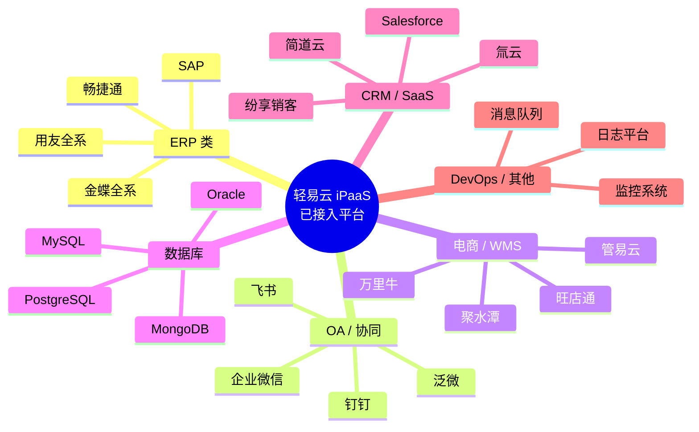

# 已接入平台总览

轻易云 iPaaS 集成平台已深度集成超过 **500+** 主流企业应用系统，涵盖 **80+** 厂商的 **86** 个系统平台，提供超过 **400 万+** 标准 API 接口。本文档按系统类别整理已接入的平台列表，帮助您快速了解平台覆盖范围并查找所需的连接器文档。

> [!NOTE]
> 平台持续扩充中，如需接入未列出的系统，可通过[自定义连接器](../developer/custom-connector)功能快速扩展，或联系我们的[技术支持团队](https://www.qeasy.cloud/contact)评估接入计划。

## 平台分类概览

## ERP 系统

轻易云对国产 ERP 系统提供深度适配，支持与金蝶、用友等主流 ERP 的无缝对接。

| 平台名称 | 厂商 | 适用场景 | 连接器文档 |
|----------|------|----------|------------|
| **金蝶云星空** | 金蝶软件 | 中大型集团企业财务/供应链/制造管理 | [查看详情](../connectors/erp/kingdee-cloud-galaxy) |
| **金蝶云苍穹** | 金蝶软件 | 超大型企业数字化平台 | [查看详情](../connectors/erp/kingdee-cloud-cosmos) |
| **金蝶 KIS** | 金蝶软件 | 小微企业财务业务一体化 | [查看详情](../connectors/erp/kingdee-kis) |
| **金蝶 EAS** | 金蝶软件 | 大型集团管控平台 | [查看详情](../connectors/erp/kingdee-eas) |
| **用友 NC** | 用友网络 | 大型企业集团管控 | [查看详情](../connectors/erp/yonyou-nc) |
| **用友 U8** | 用友网络 | 中型企业 ERP 管理 | [查看详情](../connectors/erp/yonyou-u8) |
| **用友 U9** | 用友网络 | 离散制造企业管理 | [查看详情](../connectors/erp/yonyou-u9) |
| **用友 YonSuite** | 用友网络 | 成长型企业云 ERP | [查看详情](../connectors/erp/yonyou-yonsuite) |
| **畅捷通 T+** | 畅捷通 | 商贸企业进销存管理 | [查看详情](../connectors/erp/chanjet-tplus) |
| **畅捷通好会计** | 畅捷通 | 小微企业云财务 | [查看详情](../connectors/erp/chanjet-accounting) |
| **SAP ERP** | SAP | 跨国企业资源规划 | [查看详情](../connectors/erp/sap) |

> [!TIP]
> ERP 连接器支持凭证自动生成、科目余额同步、供应链数据对接等深度集成功能。详细配置请参考各连接器的专用文档。

## OA 与协同办公

支持主流企业协同平台，实现组织架构同步、审批流程对接、消息通知集成。

| 平台名称 | 类型 | 核心功能 | 连接器文档 |
|----------|------|----------|------------|
| **钉钉** | 企业协同 | 组织架构同步、审批流对接、消息推送 | [查看详情](../connectors/oa/dingtalk) |
| **飞书** | 企业协同 | 用户同步、审批集成、机器人通知 | [查看详情](../connectors/oa/lark) |
| **企业微信** | 企业协同 | 通讯录同步、应用消息、审批数据 | [查看详情](../connectors/oa/wecom) |
| **泛微 e-cology** | 专业 OA | 流程引擎对接、表单数据同步 | [查看详情](../connectors/oa/weaver-ecology) |
| **泛微 e-office** | 中小企业 OA | 协同办公数据集成 | [查看详情](../connectors/oa/weaver-eoffice) |
| **蓝凌 EKP** | 知识管理 | 知识文档、流程审批集成 | [查看详情](../connectors/oa/landray-ekp) |
| **致远 OA** | 协同管理 | 流程数据、公文交换对接 | [查看详情](../connectors/oa/seeyon-oa) |
| **道一云** | 低代码平台 | 表单数据、业务应用集成 | [查看详情](../connectors/oa/do1) |

## 电商与 WMS 系统

覆盖国内主流电商平台和仓储管理系统，支持订单履约、库存同步、物流追踪全链路集成。

| 平台名称 | 类型 | 适用场景 | 连接器文档 |
|----------|------|----------|------------|
| **旺店通** | ERP / WMS | 电商订单管理、仓储作业 | [查看详情](../connectors/ecommerce/wangdiantong) |
| **聚水潭** | ERP / WMS | 电商 SaaS 管理、多平台订单 | [查看详情](../connectors/ecommerce/jushuitan) |
| **万里牛** | ERP / WMS | 跨境电商、多仓管理 | [查看详情](../connectors/ecommerce/wanliniu) |
| **管易云** | 电商 ERP | 全渠道订单、库存管理 | [查看详情](../connectors/ecommerce/guanyiyun) |
| **易仓** | 跨境 WMS | 海外仓管理、跨境物流 | [查看详情](../connectors/ecommerce/yicang) |
| **快麦** | 电商 ERP | 直播电商、店铺管理 | [查看详情](../connectors/ecommerce/kuaimai) |
| **网店管家** | 电商 ERP | 多平台店铺统一管理 | [查看详情](../connectors/ecommerce/wangdianguanjia) |
| **网店精灵** | 电商工具 | 店铺运营辅助工具 | [查看详情](../connectors/ecommerce/wangdianjingling) |

> [!IMPORTANT]
> 电商类连接器已预置主流电商平台（淘宝、天猫、京东、拼多多、抖音电商等）的 API 对接能力，可实现订单自动抓取、库存实时同步、物流信息回写。

## 数据库与数据存储

支持关系型数据库、NoSQL 数据库、消息队列等多种数据源的接入。

| 平台名称 | 类型 | 适用场景 | 连接器文档 |
|----------|------|----------|------------|
| **MySQL** | 关系型数据库 | 业务数据存储、主从同步 | [查看详情](../connectors/database/mysql) |
| **PostgreSQL** | 关系型数据库 | 企业级数据存储、地理信息 | [查看详情](../connectors/database/postgresql) |
| **Oracle** | 关系型数据库 | 大型企业核心业务系统 | [查看详情](../connectors/database/oracle) |
| **SQL Server** | 关系型数据库 | Windows 环境数据存储 | [查看详情](../connectors/database/sqlserver) |
| **MongoDB** | NoSQL 数据库 | 文档存储、大数据场景 | [查看详情](../connectors/database/mongodb) |
| **Redis** | 内存数据库 | 缓存、会话存储、实时计算 | [查看详情](../connectors/database/redis) |
| **Elasticsearch** | 搜索引擎 | 日志分析、全文检索 | [查看详情](../connectors/database/elasticsearch) |
| **ClickHouse** | 列式数据库 | 大数据分析、OLAP 场景 | [查看详情](../connectors/database/clickhouse) |
| **Kafka** | 消息队列 | 实时流处理、事件驱动 | [查看详情](../connectors/database/kafka) |

> [!TIP]
> 数据库连接器支持 CDC（变更数据捕获）实时同步，可在秒级捕获源库变更并同步至目标系统，无需全量抽取。

## CRM 与其他 SaaS

覆盖客户关系管理、人力资源、低代码平台等多种 SaaS 应用。

| 平台名称 | 类型 | 适用场景 | 连接器文档 |
|----------|------|----------|------------|
| **Salesforce** | CRM | 全球领先的客户管理平台 | [查看详情](../connectors/crm/salesforce) |
| **纷享销客** | CRM | 国产化营销服一体化 | [查看详情](../connectors/crm/fenxiangxiaoke) |
| **销售易** | CRM | 企业级销售管理 | [查看详情](../connectors/crm/xiaoshouyi) |
| **简道云** | 低代码平台 | 零代码业务应用构建 | [查看详情](../connectors/crm/jiandaoyun) |
| **氚云** | 低代码平台 | 企业数字化应用搭建 | [查看详情](../connectors/crm/chuanyun) |
| **销帮帮** | CRM | 中小企业销售管理 | [查看详情](../connectors/crm/xiaobangbang) |
| **Moka** | HR SaaS | 招聘管理系统 | [查看详情](../connectors/crm/moka) |
| **北森** | HR SaaS | 一体化人才管理 | [查看详情](../connectors/crm/beisen) |
| **HubSpot** | 营销自动化 | 海外营销获客管理 | [查看详情](../connectors/crm/hubspot) |
| **Outreach** | 销售参与 | 销售自动化外联 | [查看详情](../connectors/crm/outreach) |

## 如何查找连接器文档

### 方式一：按系统类别浏览

根据您的业务系统类型，在上文分类列表中找到对应的平台，点击「查看详情」链接即可进入该连接器的详细配置文档。

### 方式二：使用文档搜索

在页面顶部的搜索框中输入系统名称（如「金蝶」「旺店通」），快速定位到对应的连接器文档。

### 方式三：查看连接器索引

访问以下索引页面获取完整连接器列表：

- [ERP 连接器概览](../connectors/erp/) — 企业资源规划系统
- [OA 连接器概览](../connectors/oa/) — 协同办公系统
- [电商连接器概览](../connectors/ecommerce/) — 电商平台与 WMS
- [数据库连接器概览](../connectors/database/) — 数据存储与消息队列
- [CRM 连接器概览](../connectors/crm/) — 客户关系管理与 SaaS

### 方式四：联系技术支持

如未找到您需要的系统，可通过以下方式获取帮助：

| 渠道 | 联系方式 | 响应时间 |
|------|----------|----------|
| 在线客服 | [官网在线咨询](https://www.qeasy.cloud/contact) | 工作日 9:00-18:00 |
| 电话咨询 | 181-7571-6035 | 工作日 9:00-18:00 |
| 邮件支持 | support@qeasy.cloud | 24 小时内响应 |

## 接入计划与路线图

轻易云持续扩充连接器生态，以下是近期计划接入的系统：

| 系统名称 | 类型 | 计划上线时间 | 状态 |
|----------|------|--------------|------|
| 金蝶云星辰 | 云 ERP | 已上线 | ✅ 可用 |
| 用友 BIP | 大型 ERP | 已上线 | ✅ 可用 |
| 领星 ERP | 跨境电商 | 已上线 | ✅ 可用 |
| 马帮 ERP | 跨境电商 | 已上线 | ✅ 可用 |
| 千牛工作台 | 电商运营 | 已上线 | ✅ 可用 |

> [!NOTE]
> 如需了解特定系统的接入进度，或希望优先支持某款软件，请通过技术支持渠道反馈您的需求。

## 相关资源

| 资源类型 | 链接 | 说明 |
|----------|------|------|
| 连接器开发指南 | [自定义连接器](../developer/custom-connector) | 学习如何开发自定义连接器 |
| 集成方案示例 | [标准方案](../standard-schemes/) | 查看预置的行业集成模板 |
| 技术支持 | [联系我们](https://www.qeasy.cloud/contact) | 获取专业的集成顾问服务 |
| 产品演示 | [预约演示](https://www.qeasy.cloud/demo) | 一对一产品功能演示 |

---

> [!NOTE]
> 本文档最后更新于 2026-03-13。平台接入情况可能随时更新，请以控制台实际展示的连接器列表为准。
