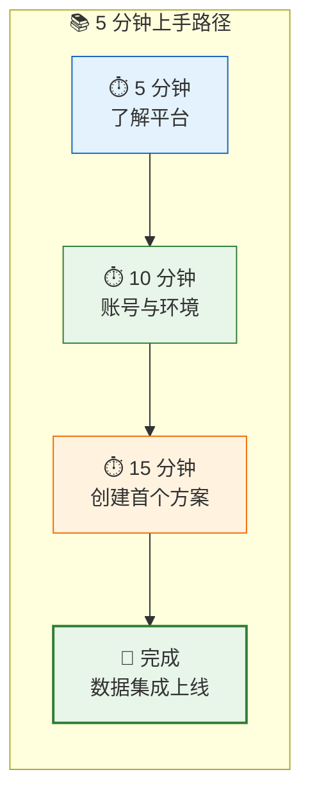
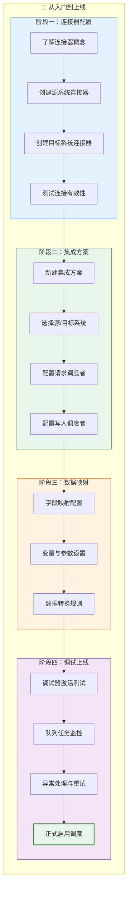

# 快速开始

欢迎来到轻易云 iPaaS 集成平台！本章将帮助你在 5 分钟内了解平台核心价值，并在 30 分钟内完成从账号注册到第一个集成流程的完整上手体验。无需编程背景，通过可视化配置即可实现企业级数据集成。

## 本章概览

快速开始章节采用「渐进式学习」设计理念，从概念理解到实际操作，带你循序渐进掌握轻易云 iPaaS 的核心能力。

| 章节 | 预计时间 | 目标成果 |
|------|----------|----------|
| [平台简介](./introduction) | 5 分钟 | 理解 iPaaS 核心价值与平台定位 |
| [账号注册](./registration) | 5 分钟 | 完成企业账号注册与工作空间创建 |
| [环境配置](./environment-setup) | 5 分钟 | 配置开发/测试/生产环境连接器 |
| [第一个集成流程](./first-integration) 🔥 | 15 分钟 | 创建并运行端到端数据同步任务 |
| [快速入门视频](./video-tutorials) | 按需 | 通过视频教程加深理解 |

> [!TIP]
> 建议按照上述顺序阅读，预计总耗时约 30 分钟。如果你有特定需求，也可以直接跳转到感兴趣的章节。

## 学习路线图

轻易云 iPaaS 的学习遵循「连接器配置 → 集成方案 → 数据映射 → 调试上线」的主线流程。掌握这一主线，即可应对绝大多数企业集成场景。

### 阶段一：连接器配置

连接器是轻易云 iPaaS 与外部系统建立连接的桥梁。每个连接器对应一个具体的业务系统（如金蝶云星空、MySQL 数据库、钉钉等），包含连接地址、认证信息等配置。

**核心能力**：
- 支持 500+ 主流系统一键对接
- 开发/测试/生产环境隔离
- 连接健康状态实时监控

**学习重点**：
- 理解连接器的概念与作用
- 掌握不同类型系统的连接参数配置
- 学会测试连接与故障排查

> [!IMPORTANT]
> 连接器配置是数据集成的基础，务必确保连接测试通过后再进行后续步骤。

### 阶段二：集成方案

集成方案是轻易云 iPaaS 的核心概念，代表一个完整的业务数据流转策略。每个集成方案定义了「数据从哪里来 → 经过什么处理 → 到哪里去」的完整链路。

**核心能力**：
- 可视化流程编排
- 源/目标系统灵活组合
- 丰富的官方模板复用

**学习重点**：
- 理解集成方案的组成结构
- 掌握请求调度者与写入调度者的配置
- 学会使用官方模板加速配置

### 阶段三：数据映射

数据映射决定了源系统数据如何转换为目标系统可识别的格式。轻易云 iPaaS 提供强大的可视化映射工具，支持字段映射、变量替换、函数转换等高级功能。

**核心能力**：
- 拖拽式字段映射
- 内置丰富函数库
- 支持动态变量与静态值混合

**学习重点**：
- 掌握字段映射的基本操作
- 理解变量（如 `{{lastSyncTime}}`）的使用场景
- 学会使用函数进行数据转换

### 阶段四：调试上线

调试是确保集成方案正确运行的关键环节。轻易云 iPaaS 提供强大的调试器工具，支持手动激活任务、查看原始数据、监控队列状态等功能。

**核心能力**：
- 命令行调试器（`ds` / `dt` 快捷命令）
- 队列任务实时监控
- 异常自动重试与告警

**学习重点**：
- 掌握调试器的基本命令
- 理解队列池的工作原理
- 学会排查常见问题

## 核心概念速览

在开始实践之前，建议先熟悉以下核心概念：

| 概念 | 说明 | 类比理解 |
|------|------|----------|
| **连接器** | 与外部系统建立连接的配置 | 类似数据库连接串 |
| **集成方案** | 数据流转的完整策略定义 | 类似数据处理 Pipeline |
| **请求调度者** | 从源系统获取数据的配置 | 数据输入端 |
| **写入调度者** | 向目标系统写入数据的配置 | 数据输出端 |
| **队列池** | 任务排队与执行的缓冲机制 | 类似消息队列 |
| **数据映射** | 字段转换与数据加工规则 | 数据转换层 |

## 下一步

准备好开始了吗？建议你按照以下顺序进行：

1. **了解平台** → 阅读 [平台简介](./introduction)，理解 iPaaS 的核心价值
2. **准备工作** → 完成 [账号注册](./registration) 和 [环境配置](./environment-setup)
3. **动手实践** → 跟随 [第一个集成流程](./first-integration) 完成端到端集成
4. **深入学习** → 查看 [使用指南](../guide/) 掌握更多高级功能

> [!NOTE]
> 如果在学习过程中遇到问题，可以先查阅 [FAQ](../faq) 或联系技术支持获取帮助。
