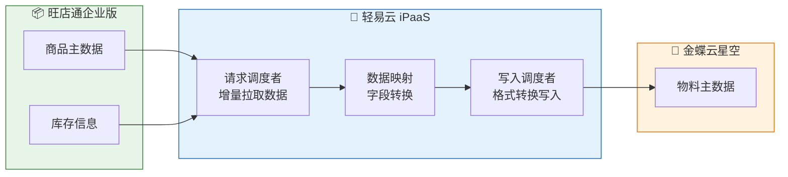
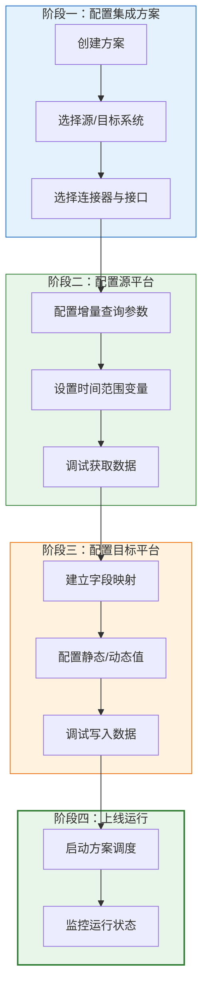

# 第一个集成流程

本教程将带你从零开始，在轻易云 iPaaS 平台上完成第一个完整的集成方案配置。通过本教程，你将学会如何打通「旺店通 → 金蝶云星空」的商品数据同步链路，掌握从源系统数据获取、数据映射转换到目标系统写入的完整流程。预计学习时长约 15 分钟。

## 前置准备

在开始之前，请确保已完成以下准备工作：

| 准备项 | 说明 | 参考文档 |
|--------|------|----------|
| 平台账号 | 已完成轻易云 iPaaS 账号注册 | [账号注册](./registration) |
| 环境配置 | 了解连接器的概念与配置方法 | [环境配置](./environment-setup) |
| 源系统连接 | 旺店通企业版/管易云等电商系统的 API 连接信息 | — |
| 目标系统连接 | 金蝶云星空的 API 连接信息 | — |

> [!TIP]
> 如果你还没有准备好系统的连接信息，可以先使用轻易云提供的测试环境进行学习。

## 场景说明

本教程实现以下业务场景：



**数据流向**：旺店通企业版商品数据 → 轻易云数据转换 → 金蝶云星空物料主数据

**同步策略**：基于「修改时间」增量同步，只拉取自上次同步以来发生变更的数据

## 步骤一：创建集成方案

集成方案是数据流转的完整策略定义，包含源系统、目标系统、数据映射规则等核心配置。

### 1.1 进入集成方案管理

登录轻易云 iPaaS 平台，进入【集成中心】→【集成方案】，点击右上角的「新增集成方案」按钮。

### 1.2 填写基础信息

在创建页面填写以下基础信息：

| 配置项 | 示例值 | 说明 |
|--------|--------|------|
| 方案编码 | `WDT_TO_KD_PRODUCT` | 唯一标识，建议使用英文+下划线命名 |
| 方案名称 | 旺店通商品同步金蝶 | 便于识别的显示名称 |

> [!IMPORTANT]
> 方案编码一旦创建后不可修改，建议使用有意义的命名规则，如 `源系统_TO_目标系统_业务类型`。

### 1.3 选择源系统与目标系统

分别配置接入系统和目标系统：

**接入系统（源）配置**：
- **接入系统**：选择「旺店通企业版」（或「管易云」等其他电商系统）
- **连接器**：选择已配置好的旺店通连接器
- **调用接口**：选择「商品查询接口」（或类似的数据查询接口）

**目标系统配置**：
- **目标系统**：选择「金蝶云星空」
- **连接器**：选择已配置好的金蝶云连接器
- **调用接口**：选择「物料保存接口」或「批量保存物料」


### 1.4 应用官方模板（可选）

如果该集成方案在轻易云官方模板库中有记录，系统会提示是否使用模板。官方模板已预置常用字段映射，可大幅缩短配置时间。

- 点击「使用模板」可自动加载预设配置
- 点击「跳过」将创建空白方案，从零开始配置

> [!TIP]
> 对于常用系统对接场景，建议优先使用官方模板，再根据实际业务需求进行微调。

点击「提交」完成集成方案创建。

## 步骤二：配置源平台（请求调度者）

请求调度者负责从源系统获取数据。配置内容包括查询参数、增量条件、分页设置等。

### 2.1 进入源平台配置页签

进入集成方案详情页面，点击顶部【源平台配置】页签，开始配置查询参数。


### 2.2 配置增量查询参数

为实现增量数据同步，需要配置时间范围参数。本教程使用「修改时间」作为增量字段。

#### 配置开始时间

1. 在左侧树形选择器中，找到并选择【修改时间开始段】字段
2. 点击「变量选择器」，选择系统变量【上一次同步时间】
3. 该变量格式为 `{{lastSyncTime}}`，表示上次成功同步的时间点

```text
变量表达式：{{lastSyncTime}}
含义：自动引用上次同步完成的时间戳
```

> [!NOTE]
> 调试时可在页面上方手动修改「上一次同步时间」的值，正式运行时该时间会随每次执行自动更新。

#### 配置结束时间

1. 选择【修改时间结束段】字段
2. 点击「变量选择器」，选择系统变量【当前时间】或填写 `{{CURRENT_TIME}}`

这样配置后，每次执行将自动获取「上次同步时间」到「当前时间」之间发生变更的数据。


### 2.3 保存配置

参数配置完成后，点击「保存」按钮。注意区分两个保存按钮：

- **参数保存**：仅保存当前字段的参数配置
- **方案保存**：保存整个集成方案的所有变更

> [!WARNING]
> 建议全部字段配置完成后再统一保存，避免遗漏。保存后建议点击「返回」查看完整配置列表。

## 步骤三：调试获取源数据

配置完成后，使用调试器手动激活请求调度者，验证能否正确获取源系统数据。

### 3.1 进入调试器页签

点击顶部【调试器】页签，进入命令行调试界面。

### 3.2 使用调试命令

调试器支持多种命令，输入 `help` 可查看完整帮助信息。常用命令包括：

| 命令 | 简写 | 功能说明 |
|------|------|----------|
| `dispatch-source` | `ds` | 激活请求调度者，生成请求队列任务 |
| `dispatch-target` | `dt` | 激活写入调度者，生成写入队列任务 |
| `help` | — | 显示帮助信息 |

输入 `ds` 或 `dispatch-source` 命令激活请求调度者：

激活成功后，将返回 `status: true` 的响应信息，表示已成功生成【请求队列任务】等待执行。

### 3.3 激活请求队列获取数据

调试生成的队列任务不会自动运行，需要手工激活。

1. 进入【请求队列池】页签
2. 找到刚才生成的队列任务
3. 点击「激活」按钮执行数据拉取

> [!TIP]
> 调试人员可在此处修改队列参数，如调整时间范围、分页大小等，便于测试不同场景。

### 3.4 查看原始数据

队列执行完成后，可在【原始数据管理】页签查看从源系统获取的数据。

- 检查数据条数是否符合预期
- 查看关键字段（商品编码、名称、库存等）的值是否正确
- 确认增量条件是否生效（数据时间范围是否正确）

## 步骤四：配置目标平台（写入调度者）

写入调度者负责将源数据转换后写入目标系统。核心配置是建立源系统字段与目标系统字段的映射关系。

### 4.1 进入目标平台配置页签

点击顶部【目标平台配置】页签，进入字段映射配置界面。

### 4.2 配置字段映射

#### 选择源字段

在【源平台响应参数】区域，选择源系统返回的字段。选中后，该字段的值将被填入上方的【属性值】输入框。

> [!NOTE]
> 属性值使用 `{{字段名}}` 的格式表示动态变量，系统会在执行时自动替换为实际值。

#### 配置目标字段映射

根据金蝶云星空物料主数据的要求，配置以下常用字段映射：

| 目标字段 | 属性值配置 | 说明 |
|----------|------------|------|
| 创建组织 | `100` | 固定值，金蝶组织编码 |
| 使用组织 | `100` | 固定值，金蝶组织编码 |
| 物料编码 | `{{goods_no}}` | 映射旺店通商品编码 |
| 物料名称 | `{{goods_name}}` | 映射旺店通商品名称 |
| 基本.物料属性 | `1` | 固定值，1 表示自制 |
| 基本.基本单位 | `Pcs` | 固定值，计量单位 |
| 基本.存货类别 | `CHLB05_SYS` | 固定值，存货类别编码 |

> [!TIP]
> 属性值支持动态变量与静态文本的组合，如 `{{goods_name}}_{{spec_no}}` 可将商品名称和规格拼接。

#### 动态与静态值组合

【属性值】配置支持灵活的写法：

- **纯动态值**：`{{goods_name}}`
- **纯静态值**：`100`
- **混合模式**：`{{goods_name}}-{{spec_name}}`
- **函数处理**：支持高级函数与解析器（详见 [数据映射](../guide/data-mapping) 章节）

### 4.3 保存映射配置

字段映射配置完成后，点击「保存」按钮保存配置。

## 步骤五：调试写入目标系统

### 5.1 激活写入调度者

返回【调试器】页签，输入 `dt` 或 `dispatch-target` 命令激活写入调度者：

激活成功后，将生成【写入队列任务】。

### 5.2 激活写入队列

1. 进入【写入队列池】页签
2. 找到生成的写入队列任务
3. 点击「激活」按钮执行数据写入

### 5.3 验证写入结果

写入队列执行完成后：

1. 在【写入队列池】查看执行状态，确认是否显示「成功」
2. 登录金蝶云星空系统，检查物料主数据是否已正确创建
3. 核对关键字段（编码、名称、单位等）是否与源数据一致

> [!CAUTION]
> 首次调试建议先在金蝶测试账套执行，确认数据无误后再写入生产环境。

## 步骤六：启动正式运行

调试完成后，将集成方案切换到正式运行模式。

### 6.1 启用方案调度

1. 返回集成方案详情页面
2. 点击右上角「启动」按钮
3. 在弹窗中确认调度周期（如每 5 分钟执行一次）

### 6.2 监控运行状态

方案启动后，可在【监控中心】查看实时运行状态：

| 监控项 | 说明 |
|--------|------|
| 最近执行时间 | 显示上次成功运行的时间 |
| 执行结果统计 | 成功/失败的数据条数 |
| 异常告警 | 失败任务会触发告警通知 |

> [!TIP]
> 本仓库当前未附带本教程对应的后台截图，但不影响按照步骤完成配置与验证。

> [!IMPORTANT]
> 建议启动后的前几次执行密切关注运行日志，确保增量同步逻辑正常工作。

## 完整流程回顾



## 常见问题

### Q1: 调试时返回空数据怎么办？

检查以下几点：
- 确认「上一次同步时间」设置是否合理（如果设置得比实际数据修改时间晚，将查不到数据）
- 检查源系统的 API 权限是否已正确授权
- 查看调试日志中的 API 响应详情

### Q2: 数据写入金蝶失败如何处理？

- 在【写入队列池】查看具体错误信息
- 常见原因：必填字段未映射、数据格式不匹配、金蝶业务规则校验失败
- 根据错误提示调整字段映射或数据转换规则

### Q3: 如何实现更复杂的字段转换？

轻易云 iPaaS 支持丰富的函数库，如：
- 字符串处理：`SUBSTR`, `REPLACE`, `CONCAT`
- 日期转换：`DATE_FORMAT`, `TIMESTAMP`
- 条件判断：`IF`, `CASE`

详见 [数据映射](../guide/data-mapping) 文档。

## 下一步

完成本教程后，你已经掌握了轻易云 iPaaS 的基础集成能力。建议继续学习：

1. **[数据映射](../guide/data-mapping)** — 深入了解高级转换函数与复杂映射场景
2. **[流程编排](../guide/process-orchestration)** — 学习多步骤、条件分支等复杂流程配置
3. **[监控告警](../guide/monitoring-alerts)** — 掌握运行监控与异常处理机制
4. **[标准方案](../standard-schemes/)** — 探索更多开箱即用的行业集成方案

> [!TIP]
> 如果在实践过程中遇到问题，欢迎查阅 [FAQ](../faq) 或联系技术支持获取帮助。
