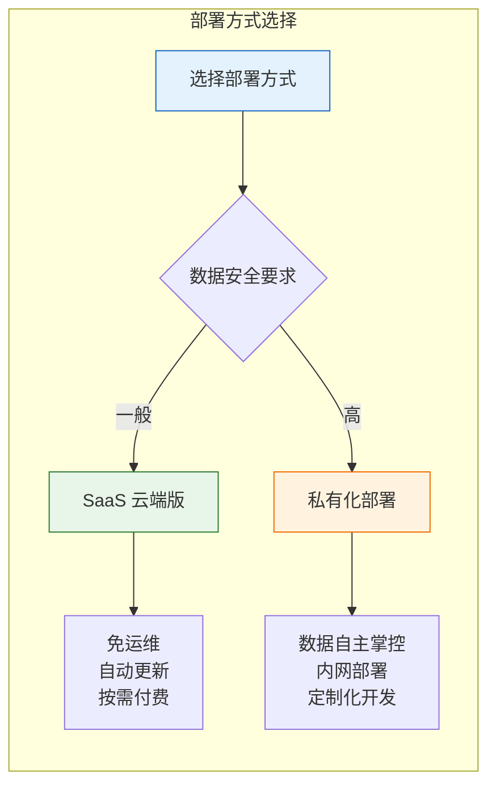

# 安装部署

本文档详细介绍轻易云 iPaaS 平台的两种部署方式：SaaS 云端版本和私有化部署版本。SaaS 版适合快速上手和小规模试用，私有化部署适合对数据安全有严格要求的中大型企业。

> [!TIP]
> 首次体验推荐选择 SaaS 版，5 分钟即可完成注册并开始使用。如需私有化部署，请联系官方获取技术支持。

## 部署方式概览



| 对比项 | SaaS 云端版 | 私有化部署 |
|--------|-------------|------------|
| 部署周期 | 5 分钟注册即用 | 1~3 个工作日 |
| 运维成本 | 无需运维 | 需专人维护 |
| 数据存储 | 云端托管 | 本地服务器 |
| 适用场景 | 中小型企业试用 | 大型企业对数据安全要求高 |
| 费用模式 | 按量付费/订阅制 | 一次性授权 + 年费 |
| 定制化 | 标准功能 | 支持深度定制 |

## SaaS 版注册登录

### 注册账号

1. 访问轻易云官网：[https://www.qeasy.cloud](https://www.qeasy.cloud)
2. 点击右上角**免费注册**按钮
3. 填写企业信息：
   - 企业名称（将作为工作空间标识）
   - 联系人姓名
   - 手机号码（用于接收验证码）
   - 邮箱地址
4. 设置登录密码（至少 8 位，包含大小写字母和数字）
5. 阅读并同意《服务协议》和《隐私政策》
6. 点击**立即注册**

> [!NOTE]
> 一个手机号只能注册一个企业账号。如需创建多个工作空间，请联系客服开通多租户权限。

### 登录控制台

注册完成后，你可以通过以下方式登录：

**方式一：账号密码登录**
1. 访问 [https://www.qeasy.cloud/login](https://www.qeasy.cloud/login)
2. 输入注册时的手机号/邮箱和密码
3. 完成图形验证码验证
4. 点击**登录**

**方式二：短信验证码登录**
1. 在登录页切换至**短信登录**标签
2. 输入注册手机号
3. 点击**获取验证码**
4. 输入收到的 6 位验证码
5. 点击**登录**

### 初始化工作空间

首次登录后，系统会引导你完成工作空间初始化：


1. **创建团队**：填写团队名称，邀请成员（可选）
2. **选择行业**：选择所属行业（制造、零售、电商等），系统将推荐对应模板
3. **设置数据偏好**：选择主要数据源类型和目标系统
4. **完成引导**：进入控制台主界面

> [!IMPORTANT]
> 初始化完成后，建议立即前往**个人中心** → **账号安全**，开启两步验证以增强账号安全性。

## 私有化部署

私有化部署分为 V1 标准版（单租户）和 V2 企业版（多租户），请根据企业规模选择合适的版本。

### 版本选择建议

| 版本 | 适用规模 | 核心特性 |
|------|----------|----------|
| V1 标准版 | 单一企业 | 单租户架构，部署简单，成本较低 |
| V2 企业版 | 集团/多组织 | 多租户架构，资源隔离，集中管理 |

### 环境要求

#### 硬件配置

根据日数据量选择合适的服务器配置：

| 日数据量 | CPU | 内存 | 带宽 | 数据盘 | 推荐场景 |
|----------|-----|------|------|--------|----------|
| 500~5,000 条 | 4 核 | 8 GB | 3 Mbps | 100 GB | 小型企业试用 |
| 5,000~20,000 条 | 8 核 | 16 GB | 6 Mbps | 200 GB | 中型企业 |
| 20,000~100,000 条 | 8 核 | 16 GB | 10 Mbps | 300 GB | 大型企业 |
| 100,000~500,000 条 | 8 核 | 32 GB | 15 Mbps | 400 GB | 超大规模 |
| 500,000 条以上 | 16 核 | 32 GB | 20 Mbps | 500 GB | 集团型企业 |

> [!NOTE]
> 以上配置为单服务器部署建议。生产环境建议将应用程序与数据库拆分部署，以获得更好的性能和稳定性。

#### 软件环境

| 组件 | V1 标准版要求 | V2 企业版要求 | 说明 |
|------|---------------|---------------|------|
| 操作系统 | CentOS 7.x x64 | CentOS 7.9 x64 | 暂不支持 Windows Server |
| Web 服务 | Nginx 1.18+ | Nginx 2.24+ | 兼容 Apache |
| PHP | 7.4+ | 7.4+ | 需 CLI 模式支持 |
| MySQL | 5.7+ | 5.7+ | 基础数据存储 |
| MongoDB | 4.0+ | 6.0+ | 核心数据缓存 |
| Redis | 5.0+ | 7.0+ | 队列与缓存 |

#### 网络端口

部署前请确保以下端口未被占用：

| 端口 | 用途 | 说明 |
|------|------|------|
| 80 | HTTP 服务 | Web 访问入口 |
| 443 | HTTPS 服务 | 加密 Web 访问 |
| 3306 | MySQL | 数据库服务 |
| 27017 | MongoDB | 文档数据库 |
| 6379 | Redis | 缓存服务 |
| 8888 | 宝塔面板（可选） | 服务器管理 |

> [!WARNING]
> 生产环境必须修改 SSH 默认 22 端口和宝塔默认 8888 端口，使用随机高位端口替代，以增强安全性。

### V1 标准版部署

V1 标准版采用单租户架构，适合单一企业独立使用。

#### 步骤一：环境准备

**1. 安装宝塔面板**

```bash
yum install -y wget && wget -O install.sh https://download.bt.cn/install/install_6.0.sh && sh install.sh ed8484bec
```

> [!NOTE]
> 若下载链接失效，请访问 [bt.cn](https://www.bt.cn) 获取最新安装脚本。

**2. 通过宝塔安装必要组件**

在宝塔面板中安装以下组件：

- [x] Nginx 1.20+
- [x] PHP 7.4
- [x] MySQL 5.7
- [x] Redis 6.2+
- [x] MongoDB 4.4+

**3. 配置 PHP 环境**

在宝塔面板 → PHP 7.4 设置中：

**禁用函数**（需取消勾选）：
- `putenv`
- `proc_open`
- `pcntl_alarm`
- `pcntl_signal`
- `pcntl_signal_dispatch`
- `system`
- `mkdir`

**安装扩展**：
- `fileinfo`
- `mongodb`
- `redis`
- `opcache`
- `pcntl`

**4. 安装加密模块**

```bash
cd /www/wwwroot/
wget https://vc-1305182502.cos.ap-guangzhou.myqcloud.com/tgz/datahub-mod.zip
unzip datahub-mod.zip
mv php-beast-master datahub-mod
cd datahub-mod
phpize
./configure --with-php-config=/www/server/php/74/bin/php-config
sudo make && make install

# 添加到 php.ini
echo "extension=beast.so" >> /www/server/php/74/etc/php-cli.ini
echo "extension=beast.so" >> /www/server/php/74/etc/php.ini
```

> [!IMPORTANT]
> 修改 php.ini 后必须重启 PHP-FPM 服务才能生效。

#### 步骤二：部署应用

**1. 拉取代码**

```bash
cd /www/wwwroot
git clone https://git.code.tencent.com/vincentpp/cla.git datahub-service
cd datahub-service
```

**2. 安装依赖**

```bash
composer install
```

**3. 配置环境变量**

```bash
cp .env.example .env
vim .env
```

关键配置项：

```ini
# 系统路径
APP_SYSTEM_PATH=/www/wwwroot/datahub-service

# 数据库配置
DB_HOST=localhost
DB_PORT=3306
DB_DATABASE=datahub
DB_USERNAME=root
DB_PASSWORD=your_password

# MongoDB 配置
MONGO_HOST=localhost
MONGO_PORT=27017
MONGO_DATABASE=datahub

# Redis 配置
REDIS_HOST=localhost
REDIS_PORT=6379
```

**4. 初始化数据库**

```bash
php artisan migrate
php artisan key:generate
php artisan passport:install --uuids
php artisan db:seed

# 设置目录权限
chmod -R 777 storage
chmod -R 777 public/export
```

**5. 清空测试数据**

```sql
TRUNCATE TABLE dh_exchange_strategy_error_jobs;
TRUNCATE TABLE dh_exchange_strategy_export_jobs;
TRUNCATE TABLE dh_exchange_strategy_throwable;
TRUNCATE TABLE dh_lessee_activity;
TRUNCATE TABLE dh_open_api_debug;
TRUNCATE TABLE failed_jobs;
TRUNCATE TABLE oauth_access_tokens;
```

#### 步骤三：配置 Web 服务

**1. 设置运行目录**

在宝塔 → 网站 → 添加站点：
- 运行目录设置为 `public`
- PHP 版本选择 7.4

**2. 配置伪静态**

```nginx
location / {
    try_files $uri $uri/ /index.php$is_args$query_string;
}
```

**3. 配置前端资源**

根据客户 IP 修改前端项目 `.env.production`：

```bash
npm run build:prod
```

将构建后的前端文件上传至 `datahub-service/public` 目录。

#### 步骤四：启动服务

**1. 配置 Crontab**

```bash
crontab -e
```

添加以下内容：

```bash
* * * * * cd /www/wwwroot/datahub-service && php artisan schedule:run >> /dev/null 2>&1
```

**2. 配置 Supervisor**

安装 Supervisor：

```bash
yum install epel-release
yum install -y supervisor
systemctl enable supervisord
systemctl start supervisord
```

创建配置文件 `/etc/supervisord.d/export.ini`：

```ini
[program:export]
command=php artisan queue:work --queue=export --tries=0 --sleep=5
directory=/www/wwwroot/datahub-service/
autorestart=true
startsecs=3
startretries=3
stdout_logfile=/www/server/panel/plugin/supervisor/log/export.out.log
stderr_logfile=/www/server/panel/plugin/supervisor/log/export.err.log
stdout_logfile_maxbytes=2MB
stderr_logfile_maxbytes=2MB
user=root
priority=999
numprocs=1
process_name=%(program_name)s_%(process_num)02d
```

加载配置：

```bash
sudo supervisorctl reread
sudo supervisorctl update
```

### V2 企业版部署

V2 企业版支持多租户架构，适合集团型企业或多组织场景。

#### 前置条件

相比 V1，V2 需要额外准备：

1. **磁盘挂载**：建议将数据目录独立挂载到数据盘
2. **Git 密钥**：配置访问私有仓库的 SSH 密钥
3. **服务器安全加固**：修改默认端口、禁用 root 密码登录

#### 磁盘挂载

```bash
# 查看未挂载磁盘
fdisk -l

# 分区
fdisk /dev/vdb
# 依次输入: n -> p -> 1 -> 回车 -> 回车 -> w

# 格式化
mkfs.ext4 /dev/vdb1

# 创建挂载点并挂载
mkdir /www
mount /dev/vdb1 /www

# 配置开机自动挂载
blkid  # 获取 UUID
vim /etc/fstab
# 添加: UUID=xxx /www ext4 defaults 0 0
```

#### 部署流程

V2 部署流程与 V1 类似，主要差异：

**1. 代码拉取**

```bash
cd /www/wwwroot
git clone git@codeup.aliyun.com:63b64ab32670e1dfed5ff6fd/DataPlatform/deploy.git
```

**2. 模块安装**

下载 V2 专用加密模块：

```bash
wget https://vc-1305182502.cos.ap-guangzhou.myqcloud.com/tgz/sce/datahub-mod-v2.2.1.zip
```

**3. 授权激活**

```bash
cd /www/wwwroot/deploy/tools
chmod +x cache.sh deploy.sh license.sh machinecode update.sh

# 获取机器码
./machinecode

# 提交机器码获取授权码后
./license.sh
# 输入授权码完成激活
```

**4. 创建租户**

```bash
php artisan create:lessee
```

按提示输入租户信息，创建后在数据库 `dh_lessee` 表中设置授权有效期。

**5. 配置多租户守护进程**

为每个租户配置独立的队列进程：

```ini
[program:tenant-uuid]
process_name=%(program_name)s_%(process_num)02d
command=php /www/wwwroot/deploy/artisan queue:work --queue=tenant-uuid --sleep=15 --tries=0
autostart=true
autorestart=true
user=root
numprocs=1
redirect_stderr=true
stdout_logfile=/home/www/queue-tenant.log
```

#### Crontab 配置（V2）

```text
* * * * * php /www/wwwroot/deploy/dispatcher/dispatcher-0 schedule:run >> /dev/null 2>&1
* * * * * php /www/wwwroot/deploy/dispatcher/dispatcher-1 schedule:run >> /dev/null 2>&1
0 8-20/2 * * * php /www/wwwroot/deploy/artisan count:datahub >> /dev/null 2>&1
0 0 * * * php /www/wwwroot/deploy/artisan clear:data >> /dev/null 2>&1
10 7,12,18 * * 1-5 php /www/wwwroot/deploy/artisan ops:health >> /dev/null 2>&1
```

### MongoDB 优化配置

编辑 MongoDB 配置文件（通常位于 `/www/server/mongodb/config.conf`）：

```yaml
storage:
  dbPath: /www/server/mongodb/data
  directoryPerDB: true
  wiredTiger:
    engineConfig:
      cacheSizeGB: 4  # 根据服务器内存调整，建议设置为物理内存的 50%
```

重启 MongoDB 生效：

```bash
systemctl restart mongodb
```

### 系统优化

**1. 文件句柄数调整**

```bash
vim /etc/security/limits.conf
```

添加：

```text
root soft nofile 65535
root hard nofile 65535
* soft nofile 65535
* hard nofile 65535
```

**2. 重启生效**

```bash
sudo systemctl restart systemd-logind
```

## SQL Server 低版本扩展安装

对于需要连接 SQL Server 2008/2012 等低版本数据库的场景，需要安装 ODBC 13 驱动和兼容库。

### 安装 ODBC 13

**1. 获取驱动文件**

从已部署的环境中复制 `/opt/microsoft/msodbcsql` 目录到新服务器。

**2. 检查依赖**

```bash
ldd /opt/microsoft/msodbcsql/lib64/libmsodbcsql-13.1.so.9.2 | grep "not found"
```

**3. 安装 OpenSSL 1.0 兼容库**

```bash
# 下载 OpenSSL 1.0.2u
tar -xzf openssl-1.0.2u.tar.gz
cd openssl-1.0.2u

# 编译安装
./config --prefix=/opt/openssl --openssldir=/opt/openssl shared
make
sudo make install
```

**4. 创建符号链接**

```bash
sudo ln -sf /opt/openssl/lib/libssl.so.1.0.0 /lib/x86_64-linux-gnu/libssl.so.10
sudo ln -sf /opt/openssl/lib/libcrypto.so.1.0.0 /lib/x86_64-linux-gnu/libcrypto.so.10
sudo ln -sf /opt/openssl/lib/libssl.so.1.0.0 /lib/x86_64-linux-gnu/libssl.so.1.0.0
sudo ln -sf /opt/openssl/lib/libcrypto.so.1.0.0 /lib/x86_64-linux-gnu/libcrypto.so.1.0.0
```

**5. 更新库缓存**

```bash
sudo ldconfig
```

**6. 设置环境变量**

```bash
export LD_LIBRARY_PATH=/opt/openssl/lib:$LD_LIBRARY_PATH
```

**7. 测试连接**

```bash
isql -v SQLServer13 用户名 密码
```

> [!NOTE]
> SQL Server 2016 及以上版本无需此步骤，系统自带的 ODBC 17/18 即可正常连接。

## 验证部署

### 健康检查命令

```bash
# 检查队列状态
php artisan queue:status

# 测试数据库连接
php artisan db:monitor

# 调试命令
php artisan dispatch:datahub {方案ID} --source  # 调度源请求
php artisan dispatch:datahub {方案ID} --target  # 调度目标写入
```

### 访问测试

1. 浏览器访问服务器 IP 或域名
2. 确认登录页面正常显示
3. 使用默认账号登录（默认账号请联系技术支持获取）
4. 创建测试连接器，验证连接功能正常

## 常见问题

### Q: 安装过程中提示权限不足？

确保使用 root 用户执行安装命令，或配置 sudo 免密权限：

```bash
chmod -R 777 /www/wwwroot/datahub-service/storage
chmod -R 777 /www/wwwroot/datahub-service/public/export
```

### Q: MongoDB 启动失败？

检查数据目录权限和数据文件完整性：

```bash
chown -R mongodb:mongodb /www/server/mongodb/data
mongod --dbpath /www/server/mongodb/data --repair
```

### Q: 队列任务不执行？

检查 Supervisor 状态和队列进程：

```bash
supervisorctl status
supervisorctl restart all
```

### Q: 如何更新到最新版本？

SaaS 版自动更新，私有化部署执行：

```bash
cd /www/wwwroot/datahub-service
git pull origin main
composer install
php artisan migrate
php artisan config:cache
php artisan route:cache
```

## 下一步

- [账号注册](./registration) - 了解详细的账号注册与团队管理
- [环境配置](./environment-setup) - 配置数据源连接与开发环境
- [第一个集成流程](./first-integration) - 创建你的首个数据集成方案

如需技术支持，请联系：

- 电话咨询：19301379948
- 在线咨询：[https://www.qeasy.cloud/contact](https://www.qeasy.cloud/contact)
