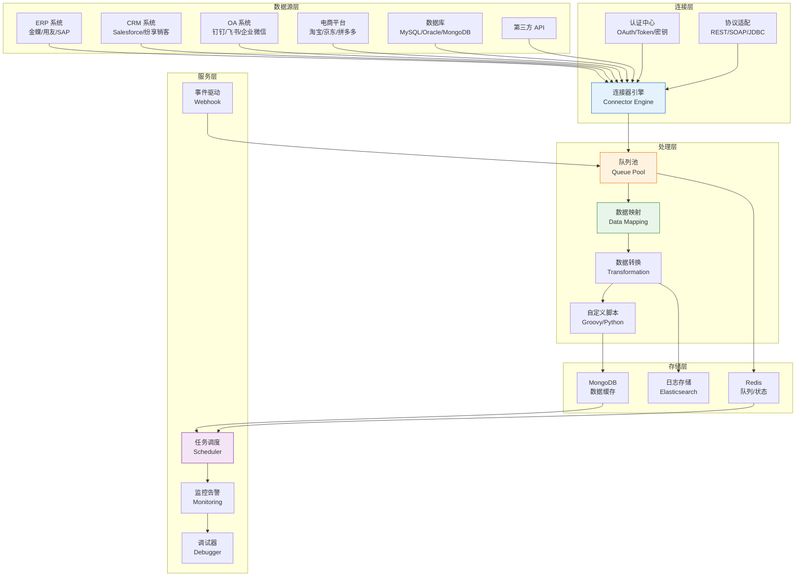
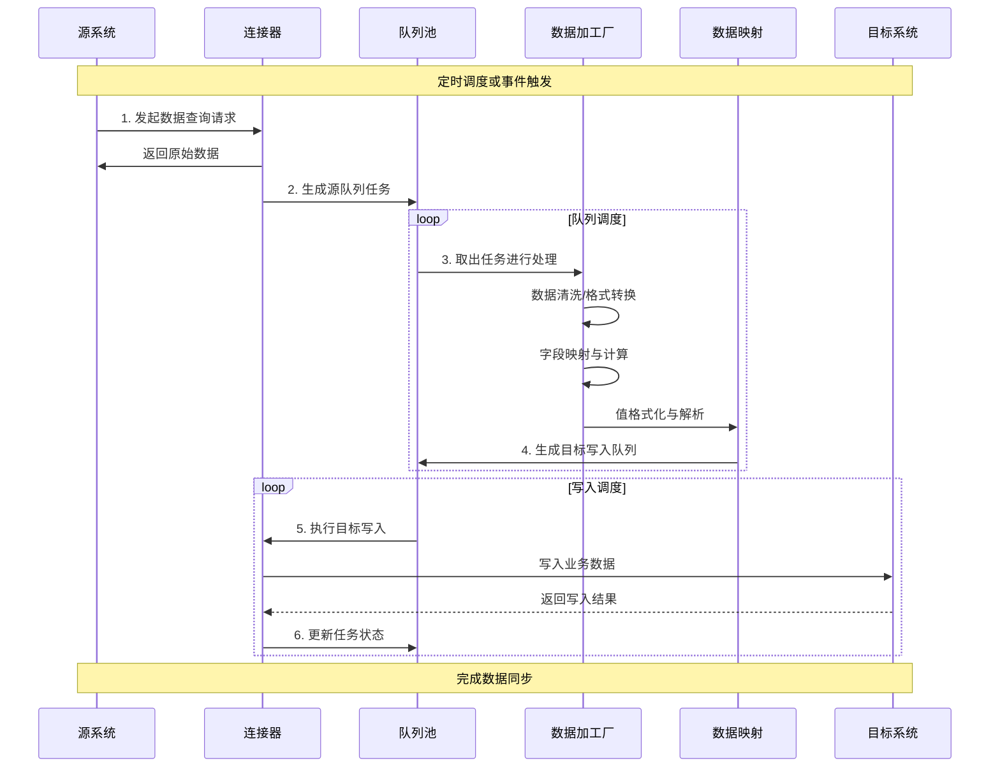
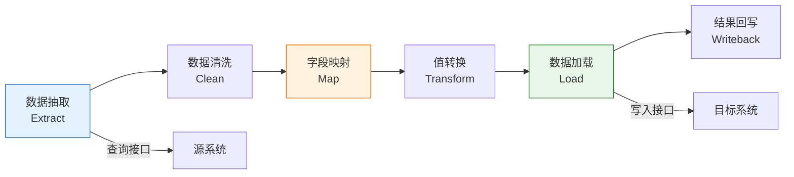
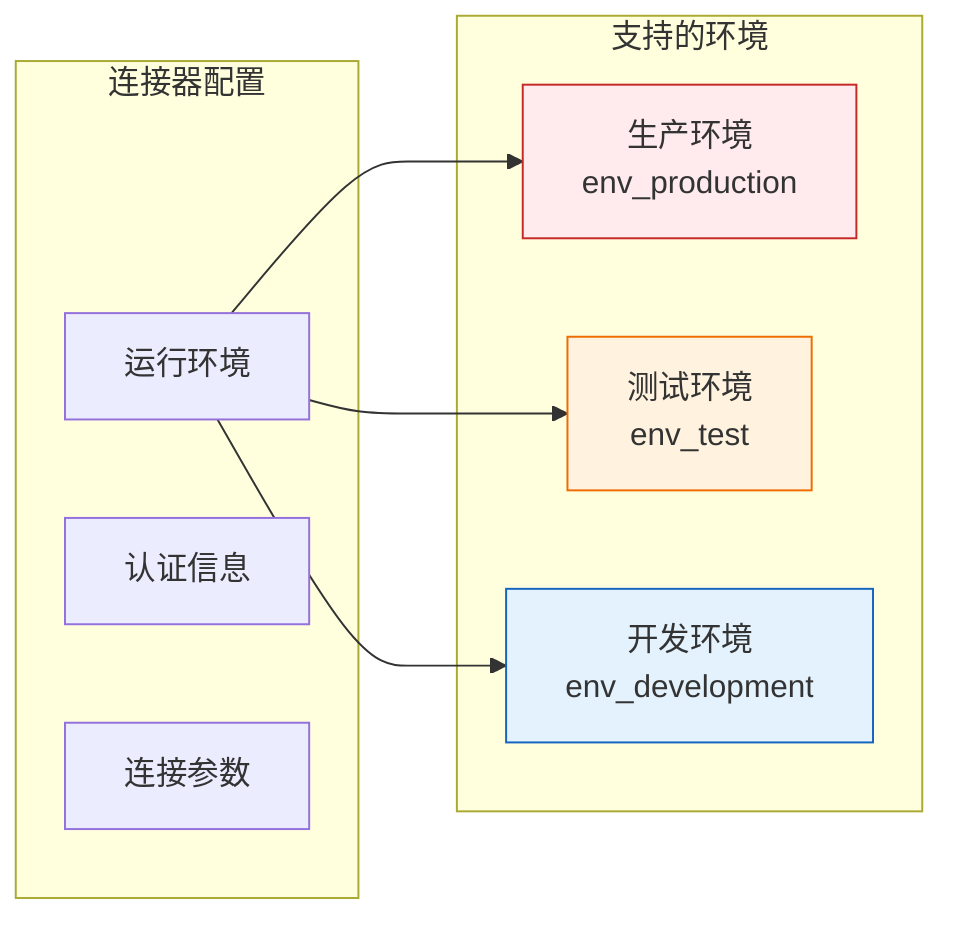
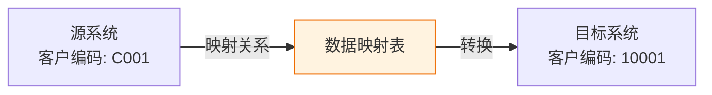
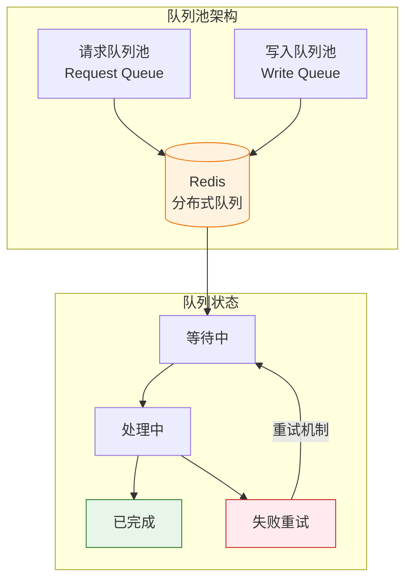
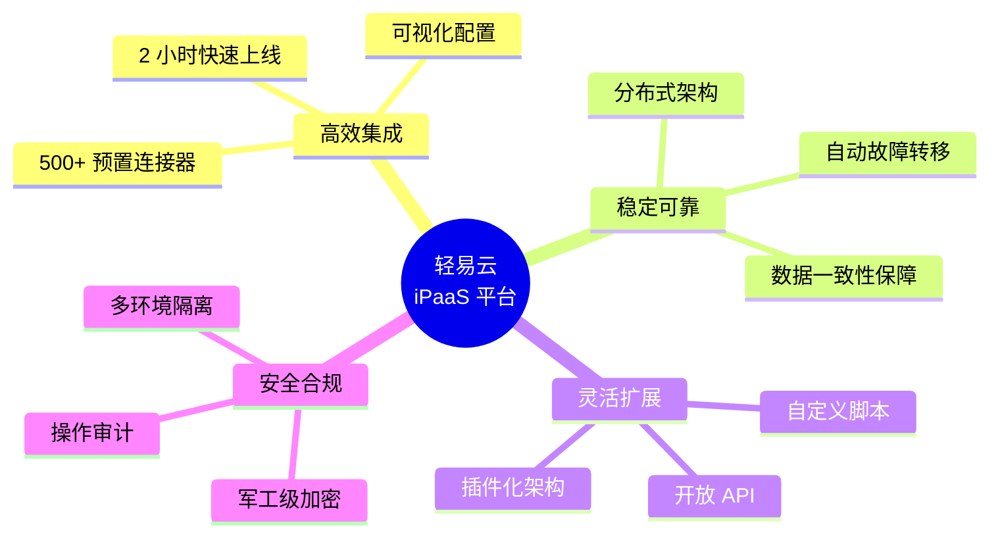

# 平台简介

轻易云 iPaaS 集成平台是一款企业级数据集成与流程自动化平台，致力于帮助企业打破数据孤岛，实现异构系统间的无缝连接与数据实时同步。平台采用云原生架构设计，支持可视化配置、低代码开发，让复杂的系统集成变得简单高效。

通过轻易云，你可以轻松连接 ERP、CRM、OA、电商平台、数据库等 500+ 主流系统，构建企业级的数据集成解决方案。无论是制造业的 MES 与 ERP 对接、零售业的电商与财务系统同步，还是 SaaS 应用之间的数据流转，轻易云都能提供稳定、安全、高效的集成能力。

## 平台架构

轻易云 iPaaS 采用分层架构设计，从底层数据源到上层应用服务，形成完整的数据集成生态体系。



### 核心组件说明

| 组件 | 功能描述 | 技术特点 |
|------|----------|----------|
| 连接器引擎 | 统一管理各类系统连接 | 支持 500+ 系统，标准化接口定义 |
| 队列池 | 任务调度与负载均衡 | 基于 Redis 的高性能队列，支持优先级 |
| 数据映射 | 字段映射与值转换 | 可视化配置，支持复杂嵌套结构 |
| 数据缓存 | 中间数据存储 | MongoDB 文档存储，支持海量数据 |
| 调试器 | 方案调试与问题定位 | 实时日志、单步调试、命令行工具 |

## 数据流向

轻易云的数据集成遵循标准的 ETL（Extract-Transform-Load）流程，同时支持实时 CDC（Change Data Capture）模式，满足不同业务场景的需求。



### 数据处理流程



1. **数据抽取（Extract）**：通过连接器从源系统获取数据，支持全量同步和增量同步两种模式
2. **数据清洗（Clean）**：对原始数据进行过滤、去重、验证，确保数据质量
3. **字段映射（Map）**：将源系统字段映射到目标系统字段，支持一对一、一对多、多对一映射
4. **值转换（Transform）**：对字段值进行格式化、计算、解析等处理
5. **数据加载（Load）**：将处理后的数据写入目标系统
6. **结果回写（Writeback）**：将写入结果回传至源系统或数据管理模块

## 核心术语表

### 连接器（Connector）

连接器是轻易云平台与外部系统建立通信的桥梁，用于配置和管理与特定系统的连接信息。



连接器支持多环境隔离，你可以分别为开发、测试、生产环境配置不同的连接参数，确保数据安全。在方案正式上线前，务必切换至生产环境。

### 集成方案（Integration Strategy）

集成方案是轻易云平台的核心概念，代表一种具体的业务数据对接策略。每个方案定义了从哪个源系统获取数据、如何处理数据、最终写入哪个目标系统的完整流程。

> [!TIP]
> 一个集成方案对应一种业务场景，例如：
> - 金蝶云星空 → 旺店通：销售订单同步
> - 钉钉审批 → 金蝶云星空：费用报销单对接
> - MySQL → MongoDB：数据归档迁移

### 数据映射（Data Mapping）

数据映射用于解决不同系统间基础数据编码不一致的问题。当源系统的「客户编码」与目标系统的「客户编码」存在差异时，通过数据映射关系实现准确转换。



数据映射支持 Excel 批量导入，格式如下：

| 源值 | 源标签 | 目标值 | 目标标签 |
|------|--------|--------|----------|
| C001 | 张三科技 | 10001 | 张三科技有限公司 |
| C002 | 李四贸易 | 10002 | 李四贸易有限公司 |

### 值格式化（Value Formatter）

值格式化用于对字段值进行格式转换和处理，满足目标系统的数据格式要求。

支持的标准格式类型：

| 格式类型 | 说明 | 示例 |
|----------|------|------|
| `date` | 日期格式 | `2024-03-15` |
| `dateTime` | 日期时间格式 | `2024-03-15 14:30:00` |
| `amount` | 金额千分位 | `¥1,000.00` |
| `intval` | 整数转换 | `100` |
| `round(2)` | 浮点精度控制 | `99.99` |
| `implode(',')` | 数组转字符串 | `a,b,c` |

```json
{
  "formatResponse": [
    {
      "old": "delivery_date",
      "new": "formatted_date",
      "format": "date"
    }
  ]
}
```

### 队列（Queue）

队列是轻易云平台实现异步任务调度的核心机制，采用先进先出（FIFO）原则管理集成任务。



队列的主要特性：
- **异步处理**：解耦数据查询与写入操作，提升系统吞吐量
- **负载均衡**：根据系统负载动态调整并发数
- **失败重试**：自动重试失败任务，支持自定义重试次数
- **优先级调度**：支持任务优先级设置，确保关键业务优先处理

### 调试器（Debugger）

调试器是集成方案开发与运维阶段的重要工具，提供命令行接口用于测试连接、手动触发任务、查看系统状态等操作。

常用调试命令：

| 命令 | 简写 | 功能描述 |
|------|------|----------|
| `connect-source` | `cs` | 测试源系统连接 |
| `connect-target` | `ct` | 测试目标系统连接 |
| `invoke-source` | `is` | 手动调用源系统查询 |
| `invoke-target` | `it` | 手动调用目标系统写入 |
| `dispatch-source` | `ds` | 生成源查询队列 |
| `dispatch-target` | `dt` | 生成目标写入队列 |
| `db-info` | `dbi` | 查看 MongoDB 数据库信息 |
| `db-reset-status` | `dbrs` | 重置异常数据状态 |

> [!WARNING]
> `db-clean-data`、`db-clean-job`、`db-clean-all` 等清空操作会永久删除数据，请谨慎使用。

## 产品优势



- **开箱即用**：预置 500+ 主流系统连接器，无需额外开发
- **低代码配置**：可视化界面操作，降低技术门槛
- **高性能处理**：分布式队列架构，支持百万级数据同步
- **灵活扩展**：支持 Groovy、Python 自定义脚本，满足个性化需求
- **安全可靠**：多层次安全防护，企业级数据加密

## 下一步

- [账号注册](./registration) - 创建轻易云账号，开通数据集成服务
- [环境配置](./environment-setup) - 配置开发与生产环境
- [第一个集成流程](./first-integration) - 快速上手，完成首个数据同步方案
