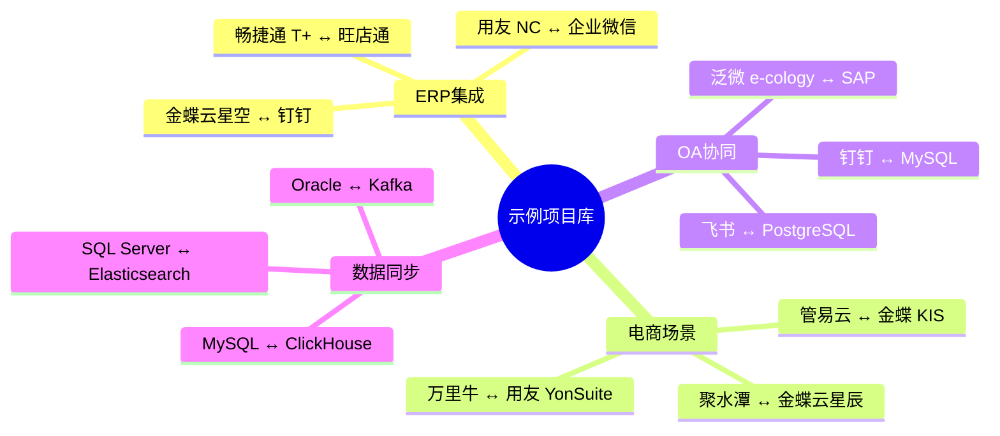
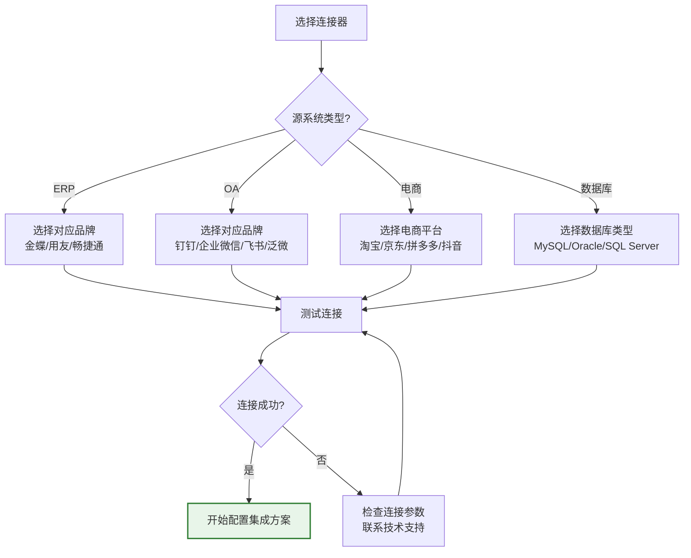

# 学习资源与平台接入指南

本文汇总轻易云 iPaaS 平台的官方学习资源、体验环境、已接入系统的 API 文档以及技术支持入口，帮助你快速上手平台并查找所需的集成对接资料。

## 官方学习资源

### 视频教程

轻易云提供丰富的视频学习资料，涵盖从基础概念到高级功能的完整知识体系：

| 教程系列 | 内容概要 | 适合人群 |
|---------|---------|---------|
| 快速入门系列 | 平台介绍、账号注册、第一个集成流程 | 初次接触 iPaaS 的用户 |
| 连接器配置指南 | 主流 ERP / OA / 电商系统的连接配置演示 | 实施工程师、系统集成人员 |
| 数据映射实战 | 字段映射、变量使用、函数转换技巧 | 数据工程师 |
| 高级功能进阶 | CDC 实时同步、自定义脚本、性能优化 | 进阶用户、技术架构师 |

> [!TIP]
> 建议按照「快速入门 → 连接器配置 → 数据映射 → 高级功能」的顺序观看，可获得最佳学习效果。

### 示例项目

平台内置丰富的官方集成方案模板，可直接复用或在此基础上修改：



### 学习路径推荐

```mermaid
flowchart LR
    subgraph 新手路径["🌱 新手入门路径"]
        A[观看快速入门视频] --> B[使用体验账号实操]
        B --> C[跟随"第一个集成流程"文档]
        C --> D[完成一个简单的数据同步任务]
    end

    subgraph 进阶路径["🚀 进阶提升路径"]
        E[深入学习连接器配置] --> F[掌握数据映射技巧]
        F --> G[尝试 CDC 实时同步]
        G --> H[开发自定义连接器]
    end

    D -.->|熟练掌握基础后| E

    style A fill:#e3f2fd,stroke:#1565c0
    style D fill:#e8f5e9,stroke:#2e7d32,stroke-width:2px
    style H fill:#e8f5e9,stroke:#2e7d32,stroke-width:2px
```

## 体验环境

### 平台体验账号

立即登录轻易云 iPaaS 平台进行体验：

| 对象 | 值 |
|-----|-----|
| 登录地址 | [https://pro.qliang.cloud/](https://pro.qliang.cloud/) |
| 用户名 | `demo1` |
| 密码 | `888888` |

> [!NOTE]
> 体验账号仅供功能体验使用，数据可能会定期清理。如需正式使用，请注册企业账号。

### 轻易云专属学习环境

以下环境专为轻易云用户搭建，用于集成测试和学习。注意：这些环境可能因服务器快照切换而暂时无法使用，如遇问题请联系技术支持协助切换。

#### 畅捷通 T+ 16.0

| 对象 | 值 |
|-----|-----|
| 地址 | [http://env.qliang.cloud/](http://env.qliang.cloud/) |
| 用户名 | `13713127786` |
| 密码 | `qaz!!123` |

#### 金蝶云星空

| 对象 | 值 |
|-----|-----|
| 地址 | [http://env.qliang.cloud:9527/k3cloud/html5](http://env.qliang.cloud:9527/k3cloud/html5) |
| 管理员用户名 | `administrator` |
| 管理员密码 | `Qeasy1024!` |
| 业务操作员 1 | `qeasy` / `Qeasy1024!` |
| 业务操作员 2 | `vincent` / `Qeasy1024!` |

#### 用友 NC Cloud

| 对象 | 值 |
|-----|-----|
| 地址 | [http://ncc.qliang.cloud:8080/](http://ncc.qliang.cloud:8080/) |
| 管理员用户 | `admin` / `qeasyvincent067` |
| 业务用户 1 | `qeasy` / `qeasyvincent067` |
| 业务用户 2 | `vincent067` / `qeasyvincent067` |

#### 泛微 E9

| 对象 | 值 |
|-----|-----|
| 地址 | [http://e-cology.qliang.cloud:82/](http://e-cology.qliang.cloud:82/) |
| 管理员 | `sysadmin` / `ce660481b820f7233fc31e05592824ee_random_` |
| 业务用户 1 | `vincent067` / `qeasyvincent067)A$$` |
| 业务用户 2 | `xiaoqing` / `qeasyvincent067)A$$` |

### 公有云产品学习环境

以下第三方平台提供公开的测试环境，可用于集成学习：

#### 管易 ERP

| 对象 | 值 |
|-----|-----|
| 地址 | [http://login.guanyierp.com/login](http://login.guanyierp.com/login) |
| 用户名 | `1500195434@qq.com` |
| 密码 | `Aa123456@` |

#### 吉客云

| 对象 | 值 |
|-----|-----|
| 地址 | [http://open.jackyun.com/developer/document.html?alias=test_environment](http://open.jackyun.com/developer/document.html?alias=test_environment) |
| 测试吉客号 | `54321` |
| 用户名 | `jky` |
| 密码 | `123456` |

#### 金蝶云星辰

| 对象 | 值 |
|-----|-----|
| 地址 | [https://tf.jdy.com/sec/ierp/login.html](https://tf.jdy.com/sec/ierp/login.html) |
| 账套 | 南京为谷生产管理体验账套 |
| 账号 | `18898612635` |
| 密码 | `oDb#1#LS` |

## 已接入平台 API 文档

轻易云 iPaaS 已集成 500+ 主流系统的 API 接口，以下是各平台的官方 API 文档链接，方便你在进行集成对接时查阅。

### 企业 ERP

| 平台 | API 文档类型 | 文档链接 |
|-----|-------------|---------|
| 用友 NC Cloud | Web API | [官方文档](https://www.yonyou.com/) |
| 用友 U8 Cloud | Web API | [官方文档](https://www.yonyou.com/) |
| 用友 U9 | Web API | [官方文档](https://www.yonyou.com/) |
| 用友 YonSuite | REST API | [官方文档](https://www.yonyou.com/) |
| 畅捷通 T+ | Open API | [官方文档](https://www.chanjet.com/) |
| 畅捷通好会计 | Open API | [官方文档](https://www.chanjet.com/) |
| 金蝶云星空 | Web API | [官方文档](https://www.kingdee.com/) |
| 金蝶云星辰 | Web API | [官方文档](https://www.kingdee.com/) |
| 金蝶 K3 WISE | API | [官方文档](https://www.kingdee.com/) |
| 金蝶 EAS | Web Service | [官方文档](https://www.kingdee.com/) |

### OA 办公协同

| 平台 | API 文档类型 | 文档链接 |
|-----|-------------|---------|
| 泛微 e-cology | Web Services | [官方文档](https://www.weaver.com.cn/) |
| 泛微 e-office | REST API | [官方文档](https://www.weaver.com.cn/) |
| 致远 OA | RESTful API | [官方文档](https://www.seeyon.com/) |
| 蓝凌 EKP | Open API | [官方文档](https://www.landray.com.cn/) |
| 钉钉 | Open API | [开发者平台](https://open.dingtalk.com/) |
| 企业微信 | 服务端 API | [开发者中心](https://work.weixin.qq.com/api/doc) |
| 飞书 | Open API | [开发者平台](https://open.feishu.cn/) |
| 阿里宜搭 | Open API | [官方文档](https://www.aliwork.com/) |
| 道一云 | Open API | [官方文档](https://www.do1.com.cn/) |

### 电商 ERP / WMS

| 平台 | API 文档类型 | 文档链接 |
|-----|-------------|---------|
| 旺店通 | Open API | [开放平台](https://www.wangdiantong.com/) |
| 旺店通 WMS | WMS API | [开放平台](https://www.wangdiantong.com/) |
| 聚水潭 | Open API | [开发者平台](https://www.jushuitan.com/) |
| 万里牛 | Open API | [开放平台](https://www.hupun.com/) |
| 管易云 | ERP API | [开发者中心](http://www.guanyiyun.com/) |
| 易仓 | Open API | [开发者平台](https://www.eccang.com/) |
| 快麦 | Open API | [官方文档](https://www.kuaimai.com/) |
| 网店管家 | Open API | [官方文档](https://www.wdgj.com/) |
| 网店精灵 | Open API | [官方文档](https://www.jushuitan.com/) |
| 领星 ERP | Open API | [开发者中心](https://www.lingxing.com/) |
| 积加 ERP | Open API | [官方文档](https://www.jijiaerp.com/) |

### 电商平台

| 平台 | API 文档类型 | 文档链接 |
|-----|-------------|---------|
| 淘宝 / 天猫 | TOP API | [开放平台](https://open.taobao.com/) |
| 京东 | Open API | [开放平台](https://open.jd.com/) |
| 拼多多 | Open API | [开放平台](https://open.pinduoduo.com/) |
| 抖音电商 | Open API | [开放平台](https://op.jinritemai.com/) |
| 小红书 | Open API | [开发者平台](https://open.xiaohongshu.com/) |
| 亚马逊 SP-API | Selling Partner API | [开发者中心](https://developer.amazonservices.com/) |

### CRM / HRM

| 平台 | API 文档类型 | 文档链接 |
|-----|-------------|---------|
| 纷享销客 | Open API | [开发者中心](https://www.fxiaoke.com/) |
| 销售易 | REST API | [官方文档](https://www.xiaoshouyi.com/) |
| 红圈营销 | Open API | [官方文档](https://www.redcircle.cn/) |
| 简道云 | Open API | [开发者文档](https://www.jiandaoyun.com/) |
| 氚云 | Open API | [开发者中心](https://www.chuanyun.com/) |
| 销帮帮 | Open API | [官方文档](https://www.xiaobangbang.com/) |
| Moka | Open API | [开发者中心](https://www.mokahr.com/) |
| 北森 | Open API | [开发者中心](https://www.beisen.com/) |
| Salesforce | REST API | [开发者文档](https://developer.salesforce.com/) |
| HubSpot | REST API | [开发者文档](https://developers.hubspot.com/) |
| Outreach | REST API | [开发者文档](https://www.outreach.io/) |

### 数据库与中间件

| 平台 | API / 协议 | 文档链接 |
|-----|-----------|---------|
| MySQL | JDBC / SQL | [官方文档](https://dev.mysql.com/doc/) |
| PostgreSQL | JDBC / SQL | [官方文档](https://www.postgresql.org/docs/) |
| Oracle | JDBC / SQL | [官方文档](https://docs.oracle.com/) |
| SQL Server | JDBC / SQL | [官方文档](https://docs.microsoft.com/sql/) |
| MongoDB | MongoDB Protocol | [官方文档](https://docs.mongodb.com/) |
| Redis | Redis Protocol | [官方文档](https://redis.io/documentation) |
| Elasticsearch | REST API | [官方文档](https://www.elastic.co/guide/) |
| ClickHouse | SQL / HTTP | [官方文档](https://clickhouse.com/docs/) |
| Kafka | Kafka Protocol | [官方文档](https://kafka.apache.org/documentation/) |

> [!IMPORTANT]
> 以上链接指向各平台的官方 API 文档，实际对接时请在轻易云 iPaaS 平台的连接器配置页面查看已封装好的接口列表，无需直接调用原生的 API。

## 社区与支持

### 技术支持渠道

| 渠道 | 联系方式 | 响应时间 |
|-----|---------|---------|
| 技术支持热线 | `181-7571-6035` | 工作日 9:00 - 18:00 |
| 在线客服 | 平台右下角在线客服入口 | 工作日 9:00 - 18:00 |
| 技术邮箱 | `support@qeasy.cloud` | 24 小时内响应 |
| 紧急工单 | 平台内提交工单 | 2 小时内响应 |

### 专业顾问团队

轻易云拥有经验丰富的系统集成顾问团队，可为企业提供专业的集成规划与实施服务：

| 顾问 | 专长领域 | 联系方式 |
|-----|---------|---------|
| 胡秀丛 | ERP / MES 集成、数据中台构建 | `158-1357-0600` |
| 卢剑航 | 数据中台、营销云中台、一站式集成方案 | `137-6075-5942` |
| 何海波 | 数据集成规划、多系统集成架构 | `181-7571-6035` |

### 社区资源

- **技术博客**: [https://www.qeasy.cloud/dataintegration](https://www.qeasy.cloud/dataintegration)
- **集成案例**: [https://www.qeasy.cloud/solution](https://www.qeasy.cloud/solution)
- **更新动态**: 关注「轻易云」官方公众号获取最新产品资讯

## 常见问题

### 如何选择合适的连接器？



### 集成过程中遇到问题怎么办？

1. **查阅文档**: 首先查看本文档和平台帮助中心
2. **搜索 FAQ**: 访问 [FAQ 页面](../faq) 查找常见问题解答
3. **社区求助**: 在技术博客评论区留言
4. **联系顾问**: 通过电话或微信联系专业顾问
5. **提交工单**: 在平台内提交技术支持工单

## 下一步

准备好开始你的数据集成之旅了吗？建议按照以下步骤进行：

1. **[注册账号](./registration)** — 创建你的轻易云 iPaaS 企业账号
2. **[环境配置](./environment-setup)** — 配置开发和测试环境的连接器
3. **[第一个集成流程](./first-integration)** — 跟随教程完成端到端数据同步
4. **[查看使用指南](../guide/)** — 深入学习平台各项功能

> [!TIP]
> 如果你是初次使用 iPaaS 平台，建议先观看「快速入门视频」，对平台有整体了解后再动手实践。
