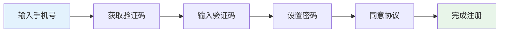
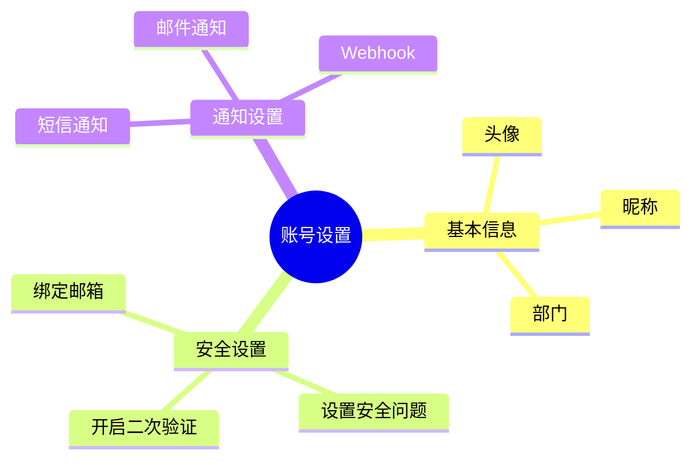

# 账号注册

使用轻易云 iPaaS 前，您需要先注册一个账号。本文档介绍账号注册的完整流程。

## 注册方式

轻易云 iPaaS 支持以下注册方式：

| 注册方式 | 说明 | 适用场景 |
|---------|------|---------|
| 手机号注册 | 使用手机号 + 验证码 | 个人用户 |
| 邮箱注册 | 使用邮箱地址 | 企业用户 |
| 钉钉扫码 | 使用钉钉账号授权 | 已使用钉钉的企业 |
| 企业微信扫码 | 使用企业微信授权 | 已使用企业微信的企业 |
| 飞书扫码 | 使用飞书账号授权 | 已使用飞书的企业 |

## 手机号注册流程

### 1. 访问注册页面

打开 [轻易云官网](https://www.qeasy.cloud)，点击右上角的「免费注册」按钮。

### 2. 填写注册信息

### 3. 注册信息要求

| 字段 | 要求 | 说明 |
|-----|------|------|
| 手机号 | 中国大陆手机号 | 用于登录和接收通知 |
| 验证码 | 6 位数字 | 5 分钟内有效 |
| 密码 | 8-20 位，包含字母和数字 | 建议包含特殊字符 |

## 企业注册

### 企业认证流程

如果您需要使用企业级功能，建议完成企业认证：

1. **填写企业信息**
   - 企业名称（与营业执照一致）
   - 统一社会信用代码
   - 企业地址
   - 联系人信息

2. **上传资质材料**
   - 营业执照扫描件
   - 法人身份证正反面
   - 授权书（如非法人办理）

3. **等待审核**
   - 审核时间：1-2 个工作日
   - 审核结果将以短信和邮件通知

### 企业认证权益

完成企业认证后，您将获得：

- 更高的任务并发配额
- 专属客户成功经理
- 发票开具权限
- 合同签署能力

## 注册后设置

### 完善个人信息

注册完成后，建议立即完善以下信息：

### 创建/加入工作空间

轻易云 iPaaS 使用「工作空间」来隔离不同团队或项目的资源：

| 操作 | 说明 | 权限 |
|-----|------|------|
| 创建工作空间 | 新建一个独立的工作空间 | 成为管理员 |
| 加入工作空间 | 通过邀请链接加入 | 成为成员 |
| 切换工作空间 | 在多个空间间切换 | 视角色而定 |

> [!TIP]
> 建议为不同的业务线或环境（开发、测试、生产）创建独立的工作空间。

## 登录方式

注册完成后，您可以通过以下方式登录：

### 账号密码登录

1. 访问 [登录页面](https://www.qeasy.cloud/login)
2. 输入手机号/邮箱和密码
3. 点击登录

### 扫码登录

- **钉钉扫码**：使用钉钉 App 扫描二维码
- **企业微信扫码**：使用企业微信 App 扫描二维码
- **飞书扫码**：使用飞书 App 扫描二维码

### 免密登录

开启免密登录后，可通过短信验证码快速登录：

1. 输入手机号
2. 点击「获取验证码」
3. 输入验证码即可登录

## 账号安全

### 密码安全建议

- 使用 8 位以上复杂密码
- 定期更换密码（建议 90 天）
- 不同网站使用不同密码
- 开启二次验证

### 二次验证设置

二次验证可为您的账号提供额外保护：

1. 进入「个人设置」→「安全设置」
2. 点击「开启二次验证」
3. 选择验证方式：
   - 短信验证码
   - 邮箱验证码
   - 身份验证器 App

## 常见问题

**Q: 收不到验证码怎么办？**

A: 请检查以下情况：
- 手机号是否输入正确
- 短信是否被拦截到垃圾箱
- 稍等 60 秒后重新获取
- 如仍无法收到，请联系客服

**Q: 忘记密码如何找回？**

A: 在登录页面点击「忘记密码」，通过手机号或邮箱验证后重置密码。

**Q: 一个手机号可以注册多个账号吗？**

A: 一个手机号只能注册一个个人账号，但可以作为多个企业工作空间的成员。

**Q: 如何注销账号？**

A: 如需注销账号，请联系客服处理。注销前请确保：
- 已备份重要数据
- 无未完成的订单或欠费
- 已退出所有工作空间

## 下一步

完成账号注册后，您可以：

- [配置您的第一个连接器](../guide/configure-connector)
- [了解平台核心概念](./introduction)
- [观看快速入门视频](./video-tutorials)
