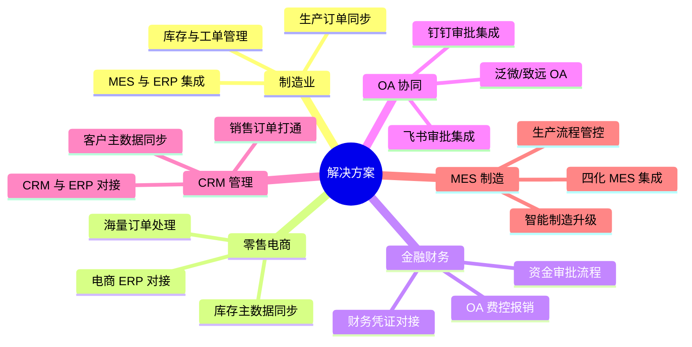
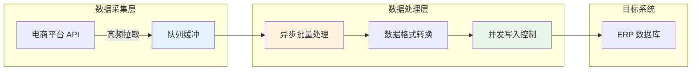
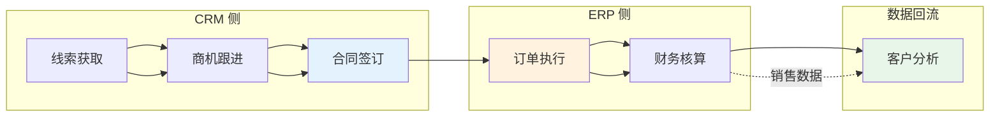
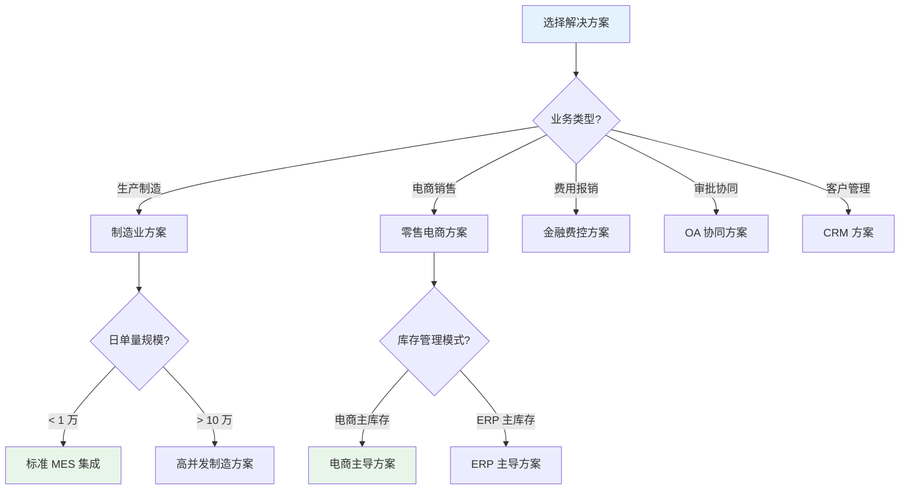

# 解决方案

轻易云 iPaaS 平台沉淀了 200+ 行业标准化集成方案，覆盖制造、零售、金融、OA 协同、CRM 等核心业务场景。本章节按行业分类整理典型应用场景，帮助你快速找到适合自身业务的集成方案，实现企业系统间的数据互通与业务协同。

> [!TIP]
> 每个方案均提供两种使用方式：**配置参考**（了解集成思路与字段映射规则）和**开箱即用**（直接部署标准方案模板）。建议首次使用时先阅读配置参考，理解方案设计逻辑后再进行部署。

## 方案分类导航



## 制造业解决方案

制造业数字化转型核心在于打通 ERP 与 MES、WMS 等生产执行系统的数据壁垒，实现产销协同与智能制造。

| 方案名称 | 核心场景 | 涉及系统 | 使用方式 |
|---------|---------|---------|---------|
| [MES 与 ERP 集成方案](./mes-erp) | 生产订单、工单派工、领料入库 | 四化 MES / 金蝶云星空 | [配置参考](./mes-erp) / [开箱即用](https://dh-open.qliang.cloud/market/datahub) |
| [生产订单全生命周期管理](./manufacturing) | 销售订单 → 生产订单 → 完工入库 | MES / ERP / WMS | [配置参考](./manufacturing) |
| [多工厂库存协同方案](./manufacturing) | 跨工厂库存调拨与实时同步 | 金蝶云星空 / 旺店通 / 聚水潭 | [配置参考](./manufacturing) |

### 方案亮点

- **生产数据实时回写**：MES 生产完工数据实时同步至 ERP，支持成本自动核算
- **工单级物料管控**：从领料、补料到退料的全流程追踪，精准归集生产成本
- **柔性生产支持**：支持改制、返工、委外等多种生产模式的数据集成

> [!NOTE]
> 制造业方案通常涉及多系统、多单据的复杂集成，建议先通过[标准方案库](../standard-schemes/README)了解预置模板，再根据企业实际调整字段映射与业务流程。

## 零售电商解决方案

面向日单量从千级到百万级的电商企业，提供电商平台与 ERP 系统的高效对接方案，解决库存同步、订单履约、财务核算等核心痛点。

| 方案名称 | 适用规模 | 核心能力 | 使用方式 |
|---------|---------|---------|---------|
| [旺店通与金蝶云星空集成](./kingdee-wangdian) | 中小型电商 | 库存同步、订单下载、售后处理 | [配置参考](./kingdee-wangdian) / [开箱即用](https://dh-open.qliang.cloud/market/datahub/solution/6b9b04e6-9f84-375e-83e1-6a90210d1eb8) |
| [金蝶云星空与聚水潭集成](./kingdee-jushuitan) | 中大型电商 | 双主库模式、全渠道库存、业财一体 | [配置参考](./kingdee-jushuitan) / [开箱即用](https://dh-open.qliang.cloud/market/datahub) |
| [用友与旺店通集成](./yonyou-wangdian) | 中大型电商 | YonSuite/U8 与旺店通、业财一体化 | [配置参考](./yonyou-wangdian) / [开箱即用](https://dh-open.qliang.cloud/market/datahub) |
| [电商数据中台集成方案](./ecommerce-data-hub) | 日单量 10 万+ | 数据中台、海量订单、降本增效 | [配置参考](./ecommerce-data-hub) / [开箱即用](https://dh-open.qliang.cloud/market/datahub) |
| [海量订单实时同步方案](./ecommerce-data-hub) | 日单量 10 万+ | 异步队列、批量处理、异常重试 | [配置参考](./ecommerce-data-hub) |
| [用友 U8 与聚水潭对接](./retail) | 传统 ERP 升级 | 线上线下库存一体、财务业务协同 | [配置参考](./retail) |

### 库存管理策略

零售电商方案根据库存管理主从关系分为两类模式：

| 模式 | 说明 | 适用场景 |
|-----|------|---------|
| **电商系统主库存** | 电商平台（旺店通/聚水潭）作为库存主数据，ERP 定时同步库存数量 | 以线上销售为主，库存变动频繁的电商企业 |
| **ERP 主库存** | ERP 系统作为库存主数据，实时同步至电商平台控制前端可售数量 | 线上线下一体化，需要统一库存管控的零售企业 |

### 海量订单处理技术

针对日单量超过 10 万的高并发场景，轻易云 iPaaS 提供以下技术保障：



- **多进程异步调度**：通过扩充进程实现并行处理，提升吞吐量
- **队列池任务管理**：采用 FIFO 队列机制，保障数据顺序性与完整性
- **自动对账校验**：支持跨系统数据一致性校验，及时发现差异

> [!IMPORTANT]
> 大促期间（如 618、双 11）订单量可能达到日常 5~10 倍，建议提前扩充进程数量并启用监控告警。

## 金融与费控解决方案

企业费用管控与财务核算的数字化方案，实现从费用申请、审批到付款、记账的全流程自动化。

| 方案名称 | 核心场景 | 涉及系统 | 使用方式 |
|---------|---------|---------|---------|
| [OA 费控集成方案](./oa-finance) | OA 报销、费控管理、业财一体化 | 泛微/致远/宜搭 / 金蝶云星空 | [配置参考](./oa-finance) / [开箱即用](https://dh-open.qliang.cloud/market/datahub) |
| [钉钉费控报销对接金蝶](./oa-finance) | 移动审批、费用报销、凭证生成 | 钉钉 / 金蝶云星空 | [配置参考](./oa-finance) |
| [飞书审批与金蝶集成](./kingdee-feishu-approval) | 审批流同步、费用归集 | 飞书 / 金蝶云星空 | [配置参考](./kingdee-feishu-approval) |
| [泛微 OA 报销对接](./oa-finance) | 复杂审批、预算控制 | 泛微 OA / 金蝶云星空 | [配置参考](./oa-finance) |
| [宜搭自建费控应用集成](./oa-finance) | 低代码搭建、灵活配置 | 阿里宜搭 / 金蝶云星空 | [配置参考](./oa-finance) |

### 费控集成关键要素

费用报销类集成需重点关注以下数据要素：

| 数据类别 | 关键字段 | 对接说明 |
|---------|---------|---------|
| 单据头信息 | 报销类型、报销人、所属组织、收款账户 | 需确保与 ERP 基础资料一致 |
| 费用明细 | 费用类型、金额、发生日期、发票信息 | 支持多行明细，需映射 ERP 费用项目 |
| 审批流程 | 审批节点、审批意见、审批时间 | 一般在终审通过后触发 ERP 单据生成 |
| 关联单据 | 借款单号、核销金额、关联合同 | 支持费用冲抵借款等复杂业务 |

> [!WARNING]
> 费控对接前**必须完成基础资料对接**（部门、员工、供应商、费用类型等），否则会导致单据写入失败。建议在正式对接前进行完整的基础数据清洗与映射。

## OA 协同解决方案

将 OA 系统的审批流与 ERP 的业务数据深度融合，实现业务发起在 OA、数据沉淀在 ERP 的协同模式。

| 方案名称 | 核心场景 | 涉及系统 | 使用方式 |
|---------|---------|---------|---------|
| [金蝶云星空与钉钉集成](./kingdee-dingtalk-approval) | 采购申请、销售出库、费用报销审批 | 金蝶云星空 / 钉钉 | [配置参考](./kingdee-dingtalk-approval) / [开箱即用](https://dh-open.qliang.cloud/market/datahub) |
| [金蝶云星空与飞书集成](./kingdee-feishu-approval) | 审批流双向同步、组织架构同步 | 金蝶云星空 / 飞书 | [配置参考](./kingdee-feishu-approval) |
| [多系统协同集成](./oa-finance) | 微盟、致远 OA、聚水潭、YonSuite 整体对接 | 多系统异构集成 | [配置参考](./oa-finance) |

### 审批流集成模式

OA 与 ERP 的审批流集成通常采用以下两种模式：

```mermaid
flowchart TB
    subgraph 模式一：ERP 发起 → OA 审批
        A1[ERP 创建单据<br/>草稿状态] -->|推送| B1[OA 发起审批]
        B1 --> C1{审批结果}
        C1 -->|通过| D1[ERP 单据生效]
        C1 -->|驳回| E1[ERP 单据关闭]
    end
    
    subgraph 模式二：OA 发起 → ERP 执行
        A2[OA 填写申请] -->|审批通过| B2[推送 ERP]
        B2 --> C2[ERP 生成业务单据]
        C2 --> D2[回写 OA 单据状态]
    end
    
    style D1 fill:#e8f5e9
    style C2 fill:#e8f5e9
```

| 模式 | 适用场景 | 特点 |
|-----|---------|------|
| **ERP 发起 → OA 审批** | 采购申请、销售出库等需要 ERP 控制业务数据的场景 | ERP 为数据主控，OA 仅作为审批通道 |
| **OA 发起 → ERP 执行** | 费用报销、出差申请等以审批为核心的场景 | OA 为流程主控，ERP 接收执行结果 |

## CRM 解决方案

客户关系管理系统与 ERP 的深度集成，打通从线索、商机到订单、回款的全流程数据链路。

| 方案名称 | 核心场景 | 涉及系统 | 使用方式 |
|---------|---------|---------|---------|
| [小满 CRM 与 ERP 对接](./crm-integration) | 客户同步、订单推送、回款核销 | 小满 CRM / 金蝶、用友等 ERP | [配置参考](./crm-integration) / [标准套件](https://dh-open.qliang.cloud/market/datahub) |
| [OKKI CRM 与金蝶集成](./crm-integration) | 外贸业务全流程数字化 | OKKI CRM / 金蝶云星空 | [配置参考](./crm-integration) |
| [Salesforce 与 ERP 集成](./crm-integration) | 跨国企业客户主数据统一 | Salesforce / 国内 ERP | [配置参考](./crm-integration) |

### CRM 集成价值



- **客户主数据统一**：避免 CRM 与 ERP 客户信息不一致，建立统一客户视图
- **销售订单自动转化**：CRM 合同直接推送 ERP 生成销售订单，减少人工录入
- **回款信息实时可见**：ERP 收款数据回写 CRM，销售人员实时掌握客户欠款情况

> [!TIP]
> 外贸企业推荐使用小满 CRM 标准集成套件，已预置外贸业务常用字段映射与转化规则，支持一键部署。

## 方案使用指南

### 如何选择合适的方案



### 配置参考 vs 开箱即用

| 使用方式 | 适用人群 | 操作路径 | 预期时间 |
|---------|---------|---------|---------|
| **配置参考** | 技术人员、实施顾问 | 阅读文档了解字段映射规则 → 参照文档自行配置 | 1~3 天 |
| **开箱即用** | 业务人员、快速验证 | 进入方案市场 → 选择对应方案 → 一键部署 → 修改连接参数 | 30 分钟 |

> [!NOTE]
> 标准方案开箱即用后，仍需根据企业实际配置连接器授权参数（如 AppKey、AppSecret 等）以及组织、仓库等基础资料映射。

### 实施建议

1. **需求确认阶段**：明确源系统与目标系统的单据流转关系，确认必填字段与业务规则
2. **基础资料先行**：优先完成物料、客户、供应商等基础资料的对接与清洗
3. **小范围验证**：选择 1~2 个典型业务场景进行端到端测试，验证数据准确性
4. **逐步推广**：验证通过后，分批上线其他单据类型，避免一次性切换风险

## 获取帮助

- **方案咨询**：如需定制化方案设计，请联系轻易云解决方案顾问
- **技术支持**：遇到集成问题请访问 [FAQ](../faq) 或提交技术支持工单
- **方案定制**：标准方案无法满足需求时，可通过[开发者文档](../developer)进行自定义扩展
