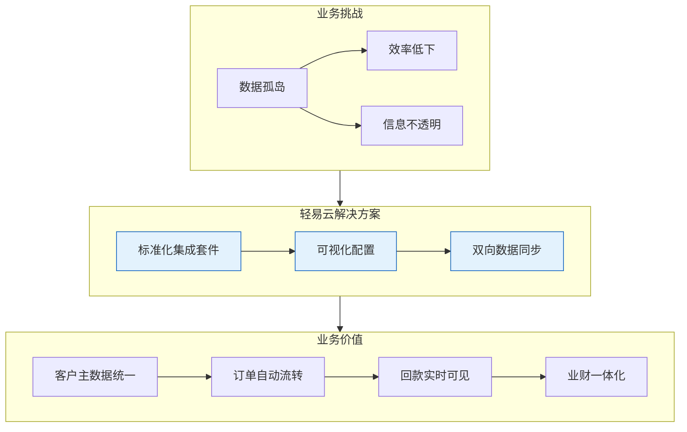
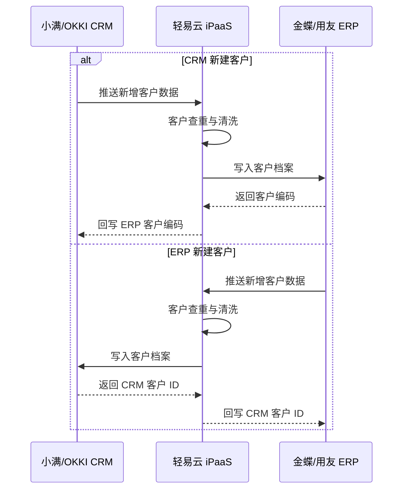
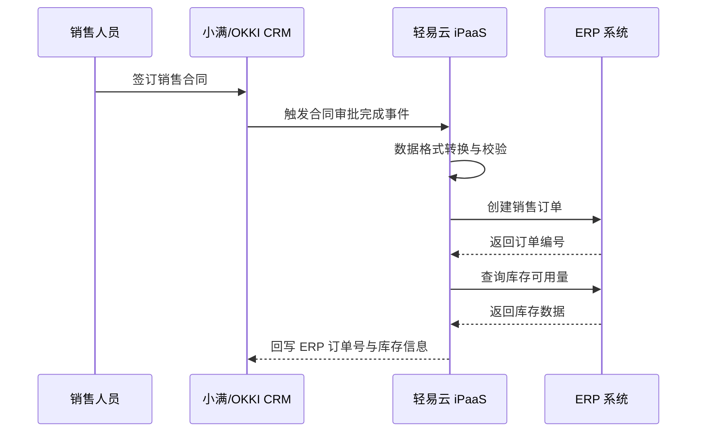
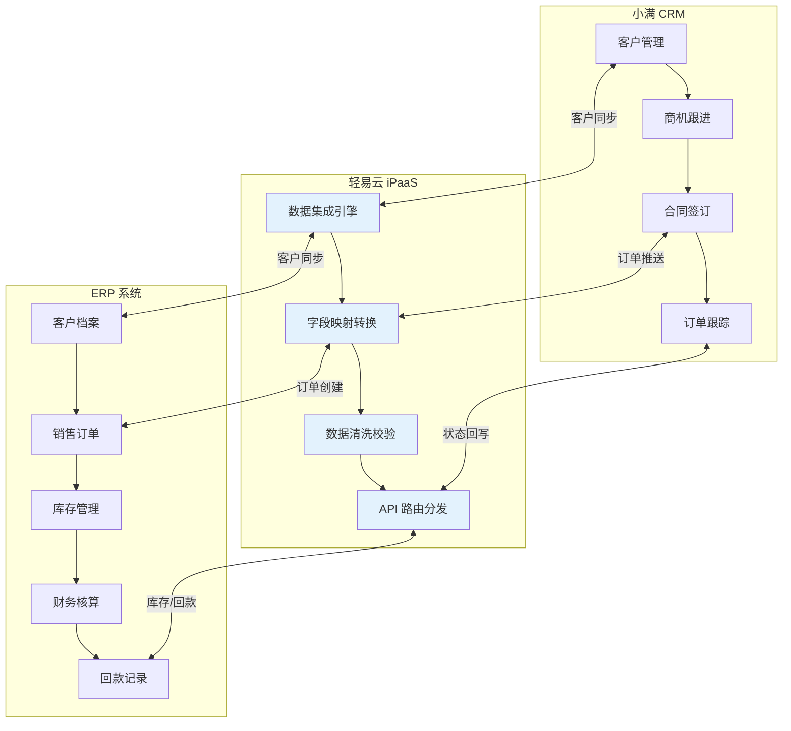
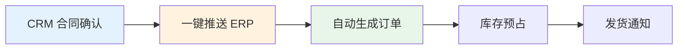
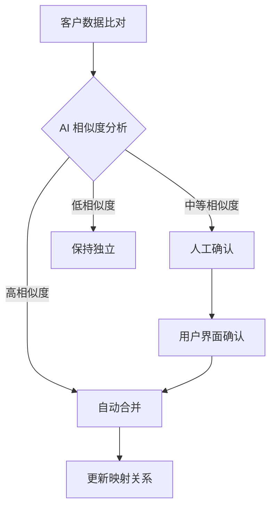
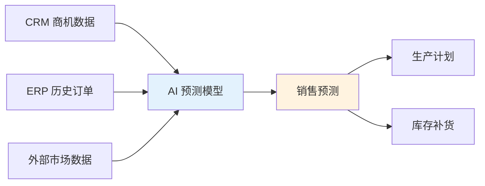
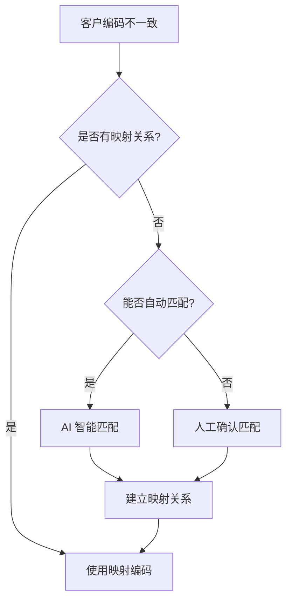

# CRM 与 ERP 集成解决方案

本方案针对外贸及内销企业普遍存在的 CRM（客户关系管理）与 ERP（企业资源计划）系统数据割裂问题，提供标准化集成套件与可视化配置方案，实现客户主数据、销售订单、回款信息的双向同步，打通从线索获取到财务核算的全业务流程。

> [!TIP]
> 本方案已预置小满 CRM、OKKI CRM 与主流 ERP 系统（金蝶、用友等）的标准化对接模板，支持一键部署。适用于外贸企业、B2B 销售型企业以及需要业财一体化的 SaaS 企业。

## 方案概述

### 业务痛点

企业内部同时使用 CRM 与 ERP 系统时，常面临以下挑战：

| 痛点 | 具体表现 | 业务影响 |
|-----|---------|---------|
| **客户信息不一致** | CRM 与 ERP 客户档案各自维护，编码不统一 | 重复录入、数据冗余、决策失真 |
| **订单流转断层** | 销售人员在 CRM 录入订单，需人工在 ERP 重复录入 | 效率低下、容易出错、响应滞后 |
| **回款信息不透明** | 财务人员掌握回款数据，销售人员无法实时查看 | 催款不及时、客户体验差 |
| **库存可视性差** | 销售无法在 CRM 查看实时库存 | 超卖风险、交期承诺不准 |
| **数据分析困难** | 客户数据分散在两个系统，难以统一分析 | 无法精准评估客户价值 |

### 解决思路

轻易云与小满 CRM 共同打造的标准化集成套件，通过预置的连接器与方案模板，帮助企业快速实现 CRM 与 ERP 的深度融合，无需复杂开发即可达成：

- **客户主数据统一**：建立统一客户视图，避免信息孤岛
- **订单自动转化**：CRM 合同直接推送 ERP 生成销售订单
- **回款实时同步**：ERP 收款数据回写 CRM，销售人员实时掌握欠款情况
- **库存可视共享**：ERP 库存实时回写，支持可用量查询

## 核心集成场景

### 一、客户主数据同步

客户主数据同步是 CRM 与 ERP 集成的基础，确保两个系统使用统一的客户档案。

#### 1. 客户档案双向同步

| 配置项 | 说明 |
|-------|------|
| 同步方向 | 支持单向同步（CRM → ERP 或 ERP → CRM）或双向同步 |
| 查重规则 | 支持按客户名称、统一社会信用代码、手机号等多维度查重 |
| 字段映射 | 客户名称、客户编码、联系人、地址、信用额度等 |
| 同步频率 | 实时同步或定时批量同步 |

#### 2. 联系人同步

| 配置项 | 说明 |
|-------|------|
| 源系统查询接口 | 获取联系人列表 |
| 目标系统写入接口 | 创建/更新联系人 |
| 关键字段映射 | 姓名、职位、电话、邮箱、关联客户 |

> [!IMPORTANT]
> 客户主数据对接前，建议先进行数据清洗，统一客户编码规则。对于历史存量客户，可通过批量导入功能建立 CRM 与 ERP 的映射关系。

### 二、销售订单集成

#### 1. CRM 合同推送 ERP 生成订单

当 CRM 中合同签订后，自动推送至 ERP 生成销售订单。

| 配置项 | 说明 |
|-------|------|
| 触发条件 | 合同审批通过 / 合同状态变更 |
| 源系统查询接口 | 获取合同详情 |
| 目标系统写入接口 | 创建销售订单 |
| 特殊处理 | 支持多币种汇率转换、含税价与不含税价转换 |

#### 2. 订单状态回写

| 配置项 | 说明 |
|-------|------|
| 回写字段 | 订单状态（已审核、已发货、已出库）、出库数量、发货日期 |
| 触发时机 | ERP 订单状态变更时实时回写 |
| 业务价值 | 销售人员实时掌握订单履约进度 |

### 三、回款与收款集成

#### 1. ERP 收款回写 CRM

ERP 收到客户款项后，自动回写 CRM 更新客户欠款信息。

| 配置项 | 说明 |
|-------|------|
| 源系统查询接口 | 收款单查询 |
| 目标系统写入接口 | 回款记录写入 |
| 关键字段 | 收款金额、收款日期、收款方式、关联订单 |
| 业务价值 | 销售人员实时掌握客户欠款，及时催款 |

#### 2. 应收账款同步

| 配置项 | 说明 |
|-------|------|
| 同步内容 | 应收账款余额、账龄分析、逾期预警 |
| 同步频率 | 每日定时同步或实时同步 |
| 预警机制 | 超期未回款自动提醒销售人员 |

### 四、库存信息同步

ERP 库存数据实时回写 CRM，支持销售人员查询可用库存。

| 配置项 | 说明 |
|-------|------|
| 同步字段 | 现有库存、可用库存、在途数量、锁定数量 |
| 同步频率 | 实时同步（推荐）或每 15 分钟同步 |
| 查询场景 | CRM 报价时查询库存、下单时校验库存 |

## 系统集成数据流程

### 小满 CRM 与 ERP 对接

### OKKI CRM 与金蝶云星空集成

OKKI CRM（原小满 CRM 企业版）与金蝶云星空的集成针对外贸企业特殊需求优化：

| 特性 | 说明 |
|-----|------|
| **多币种支持** | 自动处理外币合同与本位币订单的汇率转换 |
| **报关数据同步** | 报关单数据从 CRM 推送至 ERP 财务模块 |
| **信保数据集成** | 中信保保单信息与 CRM 客户档案关联 |
| **外销发票对接** | 出口发票数据自动生成与回写 |

## 实施配置步骤

### 步骤一：连接器配置

1. **配置 CRM 连接器**
   - 登录轻易云 iPaaS 平台
   - 进入**连接器管理** → **新建连接器**
   - 选择「小满 CRM」或「OKKI CRM」类型
   - 填写 AppKey、AppSecret 等授权参数
   - 点击**测试连接**，验证配置正确

2. **配置 ERP 连接器**
   - 进入**连接器管理** → **新建连接器**
   - 选择对应的 ERP 类型（金蝶云星空 / 用友 U8 / 用友 YonSuite 等）
   - 填写服务器地址、账套 ID、授权凭证
   - 完成连接测试

### 步骤二：方案市场部署

1. 进入**方案市场**，搜索「CRM 集成方案」
2. 选择对应的方案模板（小满 CRM 集成套件 / OKKI CRM 集成套件）
3. 点击**一键部署**，系统自动创建集成方案
4. 根据向导配置连接器选择（选择步骤一中配置的连接器）
5. 完成基础资料映射配置

### 步骤三：数据映射配置

#### 客户档案映射示例

| 小满 CRM 字段 | 金蝶云星空字段 | 转换规则 |
|-------------|--------------|---------|
| company_name | FName | 直接映射 |
| customer_code | FNumber | 直接映射 |
| credit_limit | FCreditLimit | 数值转换 |
| country | FCountry | 值集映射 |
| sales_owner | FSalerId | 关联员工档案 |

#### 销售订单映射示例

| 小满 CRM 字段 | 金蝶云星空字段 | 说明 |
|-------------|--------------|------|
| contract_no | FBillNo | 合同编号映射为订单编号 |
| customer_code | FCustId | 关联客户编码 |
| order_date | FDate | 订单日期 |
| currency | FCurrencyId | 币别 |
| exchange_rate | FExchangeRate | 汇率 |
| item_sku | FMaterialId | 产品 SKU 映射物料编码 |
| quantity | FQty | 数量 |
| unit_price | FTaxPrice | 含税单价 |

### 步骤四：测试与上线

1. **单条测试**：使用测试数据进行端到端验证
2. **批量测试**：导入批量历史数据进行压力测试
3. **灰度上线**：先选择一个客户/订单类型试点
4. **全面推广**：验证通过后全面启用

## 外贸市场一键下单方案

针对外贸企业的特殊需求，轻易云提供「一键下单」专项方案：

### 方案特点

- **秒级同步**：合同确认后 3 秒内推送 ERP
- **智能校验**：自动检查库存、信用额度、客户资质
- **异常预警**：订单创建失败实时通知销售人员
- **状态追踪**：订单履约全流程可视化

### 适用场景

| 场景 | 说明 |
|-----|------|
| 展会现场下单 | 展会期间快速录入合同，实时推送 ERP 备货 |
| 大客户专线 | 核心客户订单绿色通道，优先处理 |
| 紧急订单 | 交期紧张订单，快速流转至生产/仓储 |

## AI 技术在 CRM 集成中的应用

### 场景一：AI 辅助客户数据清洗

通过 AI 技术自动识别并处理 CRM 与 ERP 客户数据的不一致问题：

| AI 能力 | 应用场景 | 效果 |
|--------|---------|------|
| 语义相似度计算 | 识别名称相似但编码不同的客户 | 自动匹配率 > 85% |
| 地址标准化 | 统一不同格式的地址描述 | 地址匹配准确率 > 90% |
| 联系人归集 | 识别同一客户下的重复联系人 | 减少冗余 60%+ |

### 场景二：智能订单异常检测

利用 AI 模型实时检测订单数据异常：

| 检测类型 | 说明 | 处理方式 |
|---------|------|---------|
| 价格异常 | 单价偏离历史均值超过阈值 | 人工复核确认 |
| 数量异常 | 订单数量远超客户历史采购量 | 自动预警通知 |
| 交期异常 | 交期要求超出正常生产周期 | 自动计算建议交期 |
| 客户异常 | 新客户大额订单或长期未交易客户订单 | 风控审核流程 |

### 场景三：AI 驱动的销售预测

基于 CRM 商机数据与 ERP 历史订单数据，通过 AI 模型进行销售预测：

| 预测维度 | 输出结果 | 业务价值 |
|---------|---------|---------|
| 客户采购预测 | 未来 30/60/90 天采购量预测 | 提前备货，缩短交期 |
| 产品需求预测 | 各 SKU 未来需求量 | 优化库存结构 |
| 回款预测 | 未来回款金额与时间分布 | 现金流规划 |

## 常见问题

### Q1：CRM 与 ERP 客户编码不一致如何处理？

**解决方案：**

1. **建立映射表**：在轻易云平台建立 CRM 客户 ID 与 ERP 客户编码的映射关系
2. **编码规则统一**：新客户提供统一编码规则，两边系统使用相同编码
3. **智能匹配**：利用 AI 相似度算法自动识别相似客户，推荐匹配关系

### Q2：多币种订单如何处理汇率？

**处理建议：**

- 在数据映射中配置汇率转换规则
- 支持固定汇率与浮动汇率两种模式
- 汇率差异在财务模块单独处理

### Q3：历史存量数据如何对接？

**实施步骤：**

1. 导出 CRM 与 ERP 的客户主数据
2. 使用轻易云数据清洗工具进行匹配分析
3. 确认匹配关系后批量导入映射表
4. 存量客户后续按映射关系同步

### Q4：如何处理 CRM 与 ERP 的字段差异？

**解决方案：**

- 使用轻易云**值转换器**进行字段映射
- 支持固定值填充、字段拼接、条件判断等转换逻辑
- 复杂逻辑可通过自定义脚本实现

## 最佳实践

### 1. 分阶段实施建议

| 阶段 | 实施内容 | 预期周期 | 成功标准 |
|-----|---------|---------|---------|
| 第一阶段 | 客户主数据同步 | 3~5 天 | 客户档案双向同步准确率 > 99% |
| 第二阶段 | 销售订单集成 | 5~7 天 | 订单自动推送成功率 > 98% |
| 第三阶段 | 回款信息同步 | 3~5 天 | 回款回写及时率 > 95% |
| 第四阶段 | 库存信息集成 | 2~3 天 | 库存查询响应 < 3 秒 |

### 2. 数据质量保障

> [!WARNING]
> 数据质量是集成成功的关键。建议在正式对接前进行全面的数据清洗，特别是客户名称、物料编码等关键字段。

- **客户名称规范**：统一使用营业执照上的全称
- **物料编码对齐**：建立 CRM 产品 SKU 与 ERP 物料编码的映射
- **员工档案同步**：确保销售人员在两个系统的账号关联正确

### 3. 运维监控建议

| 监控项 | 告警阈值 | 处理建议 |
|-------|---------|---------|
| 同步成功率 | < 95% | 检查接口状态与网络连接 |
| 同步延迟 | > 5 分钟 | 检查队列积压情况 |
| 数据一致性 | 差异 > 1% | 启动对账校验流程 |
| API 调用失败 | 连续失败 3 次 | 触发人工介入 |

## 方案价值总结

通过 CRM 与 ERP 的深度集成，企业可实现：

| 价值维度 | 具体收益 | 量化指标 |
|---------|---------|---------|
| **效率提升** | 订单录入效率提升，告别重复录入 | 订单处理时间减少 80% |
| **数据一致** | 客户主数据统一，避免信息孤岛 | 数据一致性 > 99% |
| **决策支持** | 销售数据与财务数据实时关联 | 报表生成时间从天级降至分钟级 |
| **客户体验** | 响应速度提升，交期承诺准确 | 客户满意度提升 20%+ |
| **风险控制** | 信用额度、库存可用量实时管控 | 超卖、坏账风险降低 50% |

## 获取支持

- **方案咨询**：如需定制化方案设计，请联系轻易云解决方案顾问
- **技术支持**：访问 [FAQ](../faq) 或提交技术支持工单
- **标准套件**：前往[方案市场](https://dh-open.qliang.cloud/market/datahub)获取开箱即用的小满 CRM / OKKI CRM 集成套件
