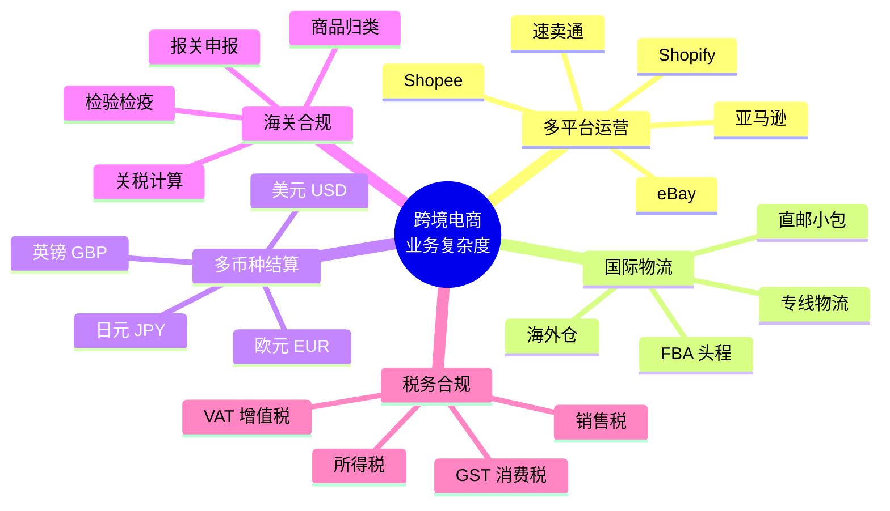
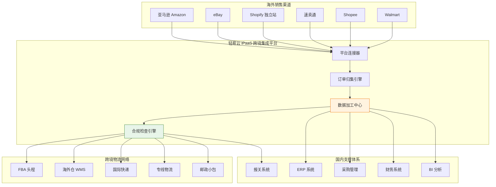
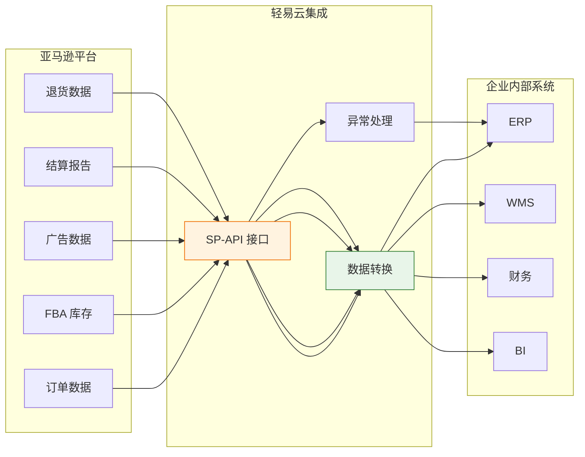
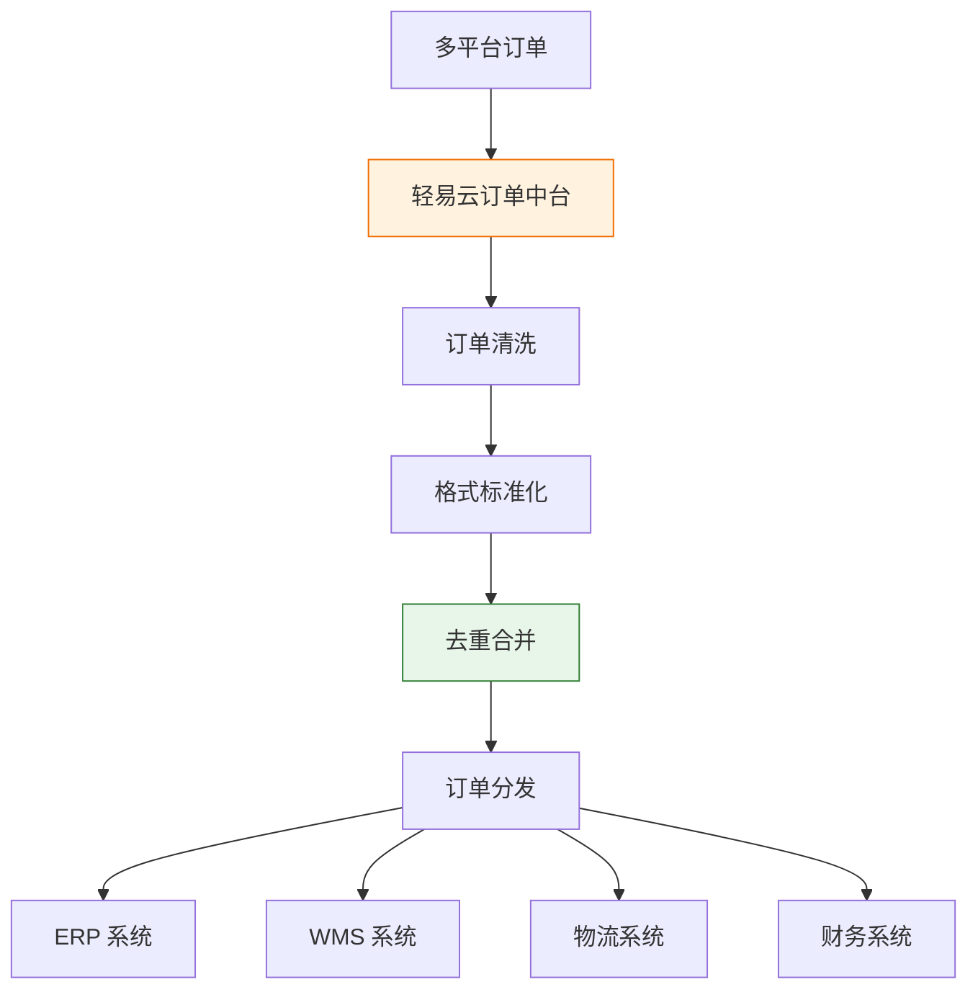
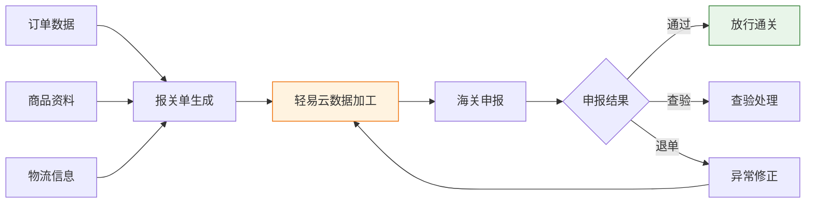
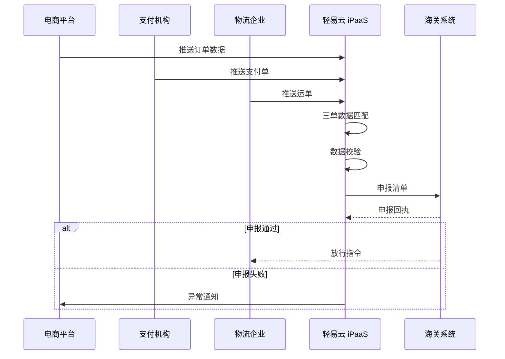
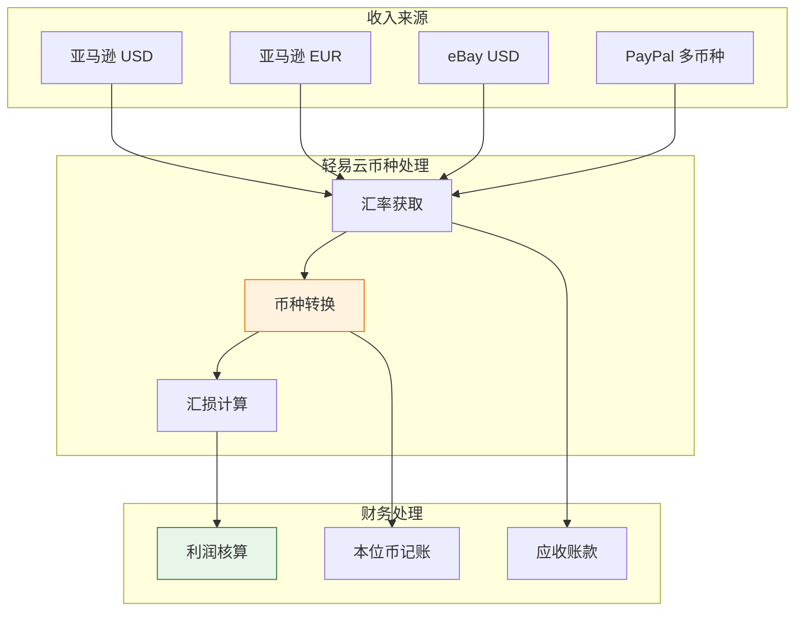
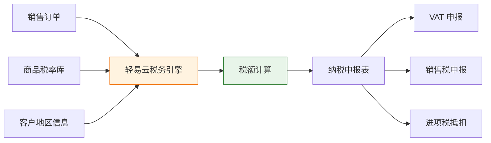
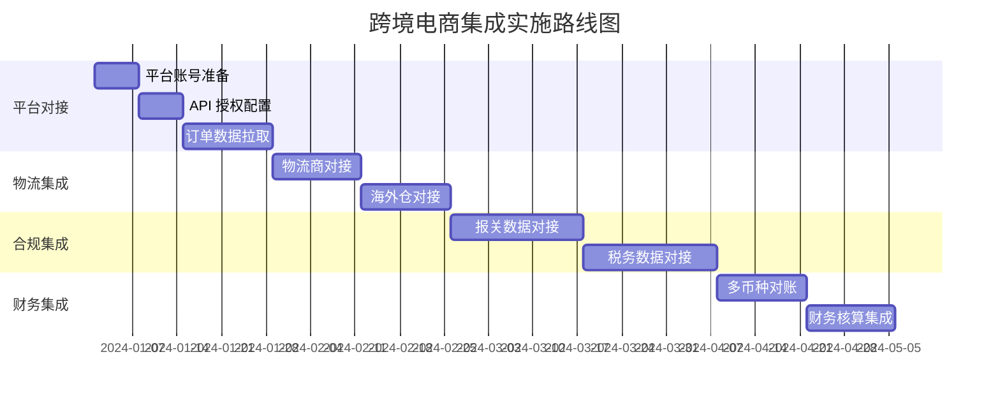
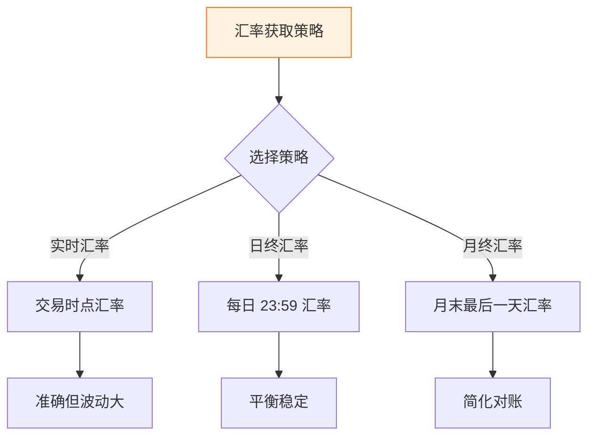

# 跨境电商集成解决方案

跨境电商业务涉及复杂的国际物流、多币种结算、海关合规等独特场景，对数据集成提出了更高的要求。轻易云 iPaaS 针对跨境电商的业务特点，提供覆盖全球主流电商平台、海外仓、物流商、支付渠道的 comprehensive 集成方案，帮助企业实现跨境业务的高效运营和合规管理。

> [!TIP]
> 本方案适用于亚马逊卖家、独立站商家、跨境多平台卖家以及跨境物流企业。实施前建议完成目标市场的合规要求和税务规划。

## 跨境业务特点

### 跨境电商业务复杂度分析

| 业务特点 | 具体表现 | 集成挑战 |
|---------|---------|---------|
| **多平台运营** | 同时在多个海外电商平台销售 | 订单分散，库存难以统一 |
| **国际物流** | FBA、海外仓、直邮多种模式并存 | 物流跟踪数据格式不一 |
| **多币种结算** | 销售收入、成本支出涉及多种货币 | 汇率波动影响利润核算 |
| **海关合规** | 商品进出口需满足各国监管要求 | 报关数据准备繁琐 |
| **税务合规** | 需缴纳 VAT、GST、销售税等 | 税务申报数据收集困难 |

### 跨境电商集成架构

## 跨境平台对接

### 全球主流电商平台集成

轻易云支持全球主流跨境电商平台的深度对接：

| 平台 | 地区覆盖 | 集成内容 | 数据同步频率 |
|-----|---------|---------|-------------|
| **亚马逊** | 北美/欧洲/日本/澳洲 | 订单、库存、FBA、广告 | 准实时 |
| **eBay** | 欧美/澳洲 | 订单、刊登、物流 | 准实时 |
| **Shopify** | 全球 | 订单、商品、客户 | 实时 |
| **速卖通** | 全球 | 订单、物流、结算 | 准实时 |
| **Shopee** | 东南亚/拉美 | 订单、库存、物流 | 准实时 |
| **Walmart** | 北美 | 订单、库存 | 准实时 |

### 亚马逊深度集成方案

#### 亚马逊集成场景

| 场景 | 数据流向 | 业务价值 |
|-----|---------|---------|
| **订单同步** | Amazon → ERP | 自动拉取订单，触发发货流程 |
| **FBA 库存同步** | Amazon → WMS | 实时掌握 FBA 库存，智能补货 |
| **结算对账** | Amazon → 财务 | 自动下载结算报告，生成应收 |
| **广告数据** | Amazon → BI | 分析广告 ROI，优化投放 |
| **退货处理** | Amazon → ERP | 自动处理退货，更新库存 |

> [!NOTE]
> 亚马逊 API 有严格的频率限制和权限管理。轻易云提供智能的 API 调用调度机制，确保在高并发场景下稳定获取数据。

### 多平台订单归集

**订单归集处理逻辑**：

| 处理环节 | 处理内容 | 输出结果 |
|---------|---------|---------|
| **数据清洗** | 去除无效数据，补充缺失字段 | 标准化订单数据 |
| **格式转换** | 统一各平台字段定义 | 企业标准格式 |
| **去重合并** | 识别重复订单，合并拆分单 | 唯一订单集 |
| **标签 enrich** | 添加渠道标签、区域标签 | 可分析订单 |

## 海关数据申报

### 报关数据自动化

实现报关数据的自动采集和申报，提升通关效率：

### 海关数据集成场景

| 场景 | 数据源 | 数据内容 | 对接系统 |
|-----|-------|---------|---------|
| **出口报关** | ERP、订单系统 | 商品信息、收发货人、金额 | 单一窗口、报关行系统 |
| **进口清关** | 电商平台、物流商 | 商品清单、收件信息 | 海关系统、清关代理 |
| **跨境电商申报** | 订单、支付、物流 | 三单对碰数据 | 跨境电商公共服务平台 |
| **商品归类** | 商品资料库 | HS 编码、申报要素 | 归类系统 |

> [!IMPORTANT]
> 海关数据申报的准确性直接影响通关效率。轻易云支持报关数据的自动校验和预审，提前发现并修正申报错误，降低查验率。

### 三单对碰方案

跨境电商 B2C 出口需完成订单、支付单、物流单的三单对碰：

## 多币种处理

### 多币种结算方案

跨境电商涉及多币种收款和付款，轻易云提供全面的币种处理能力：

### 币种处理功能

| 功能 | 说明 | 业务价值 |
|-----|------|---------|
| **实时汇率** | 对接央行、XE 等汇率源 | 准确折算本位币 |
| **历史汇率** | 记录交易时点的汇率 | 支持追溯查询 |
| **汇损计算** | 自动计算汇兑损益 | 准确核算利润 |
| **多币种对账** | 按币种分类对账 | 简化对账流程 |
| **资金归集** | 追踪各币种资金池 | 优化资金配置 |

### 平台结算对账

各电商平台的结算周期和币种不同，轻易云提供自动化的结算对账方案：

| 平台 | 结算周期 | 币种 | 对账内容 |
|-----|---------|------|---------|
| **亚马逊** | 14 天 | 站点币种 | 销售额、佣金、FBA 费用、广告费 |
| **eBay** | 实时/月度 | USD/EUR | 销售额、成交费、PayPal 费 |
| **Shopify** | 实时 | 多币种 | 销售额、手续费 |
| **速卖通** | 实时/月度 | USD | 销售额、佣金、物流费 |

> [!TIP]
> 建议每日自动下载平台结算报告，与企业 ERP 的应收数据进行自动对账，及时发现差异并处理。

## 税务合规集成

### 全球税务合规要求

不同国家和地区的税务要求差异较大：

| 国家/地区 | 税种 | 税率 | 申报要求 |
|----------|------|------|---------|
| **欧盟** | VAT | 20% 左右 | 月度/季度申报 |
| **英国** | VAT | 20% | 季度申报 |
| **美国** | 销售税 | 州际差异 | 月度/季度申报 |
| **澳洲** | GST | 10% | BAS 季度申报 |
| **日本** | 消费税 | 10% | 年度申报 |

### 税务数据自动化

## 实施建议

### 分阶段实施路线图

### 最佳实践

**1. 平台 API 管理**

| 注意事项 | 建议措施 |
|---------|---------|
| 频率限制 | 配置合理的调用间隔，避免触发限流 |
| 权限管理 | 仅申请必要的 API 权限，定期轮换密钥 |
| 异常处理 | 配置重试机制，记录失败的请求 |
| 数据备份 | 定期备份平台原始数据 |

**2. 汇率管理策略**

**3. 合规数据保留**

跨境业务涉及多国合规要求，建议：
- 保留完整的交易数据至少 5 年
- 建立数据分类和归档机制
- 定期进行合规性自查

### 常见问题解答

**Q1：如何处理平台 API 变更？**

A：轻易云团队会持续跟踪各平台的 API 变更，并及时更新连接器。建议客户订阅轻易云的变更通知，提前做好适配准备。

**Q2：多平台库存如何统一管理？**

A：建议建立统一的库存管理中心，通过轻易云将库存数据实时同步至各销售平台。可以设置安全库存和渠道分配比例，避免超卖。

**Q3：如何应对各国的数据合规要求？**

A：轻易云支持数据本地化部署和传输加密，符合 GDPR 等数据保护法规。建议根据业务所在国家的法规要求，选择合适的数据存储和处理方案。

## 方案价值总结

| 价值维度 | 量化收益 | 业务影响 |
|---------|---------|---------|
| **运营效率** | 订单处理效率提升 70% | 减少人工操作，降低错误率 |
| **通关效率** | 报关效率提升 60% | 缩短物流时效，降低查验率 |
| **财务效率** | 对账效率提升 80% | 减少财务人员工作量 |
| **合规保障** | 税务申报准确率 99%+ | 降低合规风险 |
| **决策支持** | 数据获取时效从天级到分钟级 | 支持快速业务决策 |

---

## 相关资源

- [跨境电商标准方案](../standard-plans/cross-border) - 开箱即用的跨境集成模板
- [零售业解决方案](./retail) - 零售业务集成方案
- [物流仓储解决方案](./logistics) - 跨境物流集成方案
