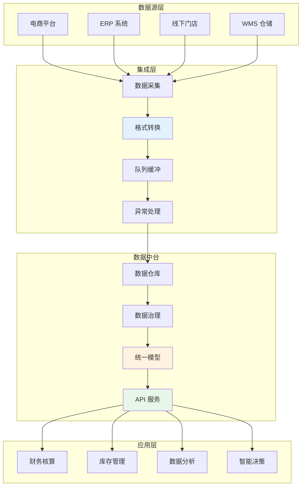
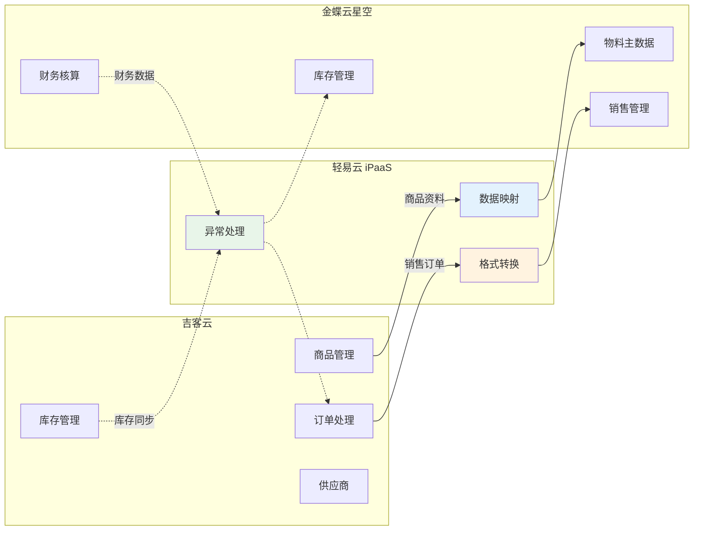
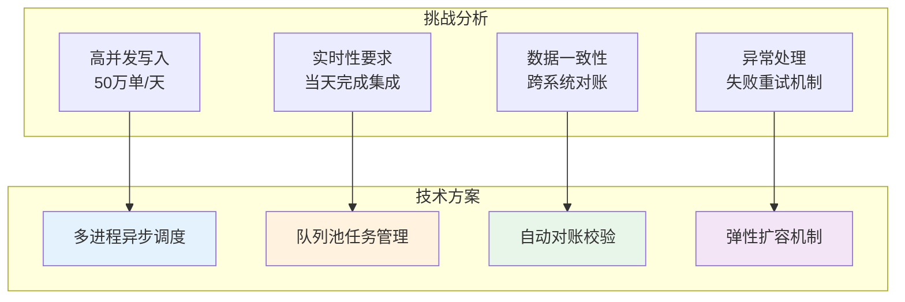
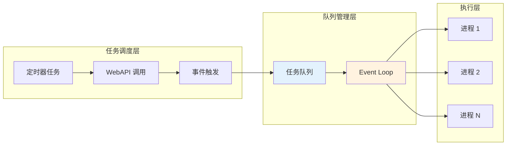
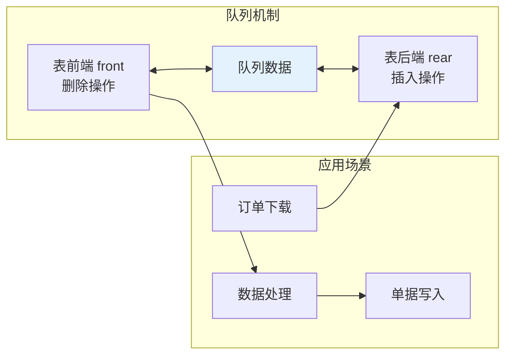
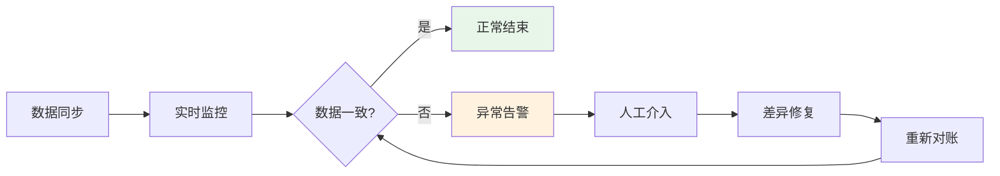
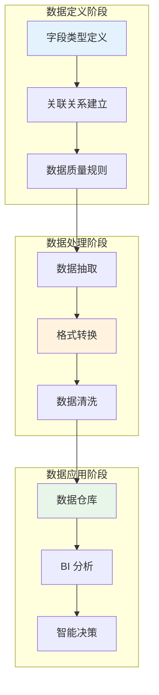
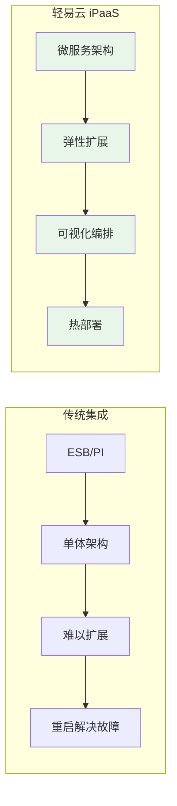
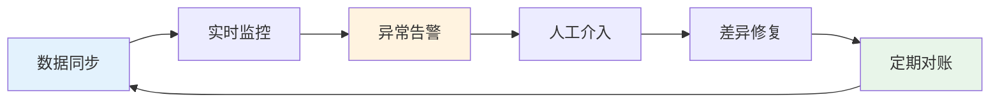

# 电商数据中台集成解决方案

本方案面向日单量从万级到百万级的电商企业，提供从数据集成到数据中台的完整解决方案。通过轻易云 iPaaS 平台，实现电商平台（如吉客云、旺店通、聚水潭）与 ERP 系统（如金蝶云星空、用友）的深度集成，帮助企业构建统一的数据中台，实现降本增效与数据资产化。

> [!TIP]
> 本方案适用于电商业务占主导地位，且面临多系统数据孤岛、库存不同步、财务核算滞后等问题的企业。实施前建议评估现有系统架构与数据质量，制定分阶段实施计划。

## 方案概述

### 业务挑战

随着电商业务的快速发展，企业面临以下典型痛点：

| 挑战类型 | 具体问题 | 业务影响 |
|---------|---------|---------|
| **数据孤岛** | 电商平台与 ERP 系统数据不通 | 人工录入工作量大，错误率高 |
| **库存失控** | 线上线下库存不同步 | 超卖风险、缺货损失 |
| **财务滞后** | 销售数据无法及时归集 | 财务核算效率低，决策滞后 |
| **高并发压力** | 大促期间订单量暴增 5~10 倍 | 系统响应慢，数据丢失风险 |
| **数据资产缺失** | 缺乏统一数据视图 | 无法支撑精准营销与业务分析 |

### 数据中台架构

### 核心价值

通过本方案，企业可实现：

| 价值维度 | 具体收益 | 量化指标 |
|---------|---------|---------|
| **效率提升** | 订单自动同步，减少人工录入 | 人力成本降低 80% |
| **库存精准** | 全渠道库存实时可视 | 超卖率降低 95% |
| **财务合规** | 业务数据自动沉淀至 ERP | 核算周期缩短 70% |
| **决策支持** | 统一数据视图，支持多维度分析 | 数据准备时间减少 90% |
| **成本降低** | 减少重复建设，降低系统对接成本 | IT 投入降低 60% |

## 集成场景总览

### 典型业务场景

| 场景类型 | 业务场景 | 数据流向 | 关键价值 |
|---------|---------|---------|---------|
| **基础资料同步** | 物料/商品、供应商、客户 | 双向同步 | 确保数据一致性 |
| **销售业务** | 销售出库、销售退货 | 电商平台 → ERP | 订单自动转化，减少人工录入 |
| **采购业务** | 采购入库、采购退货 | 根据主控方向同步 | 库存精准管控 |
| **库存管理** | 出入库、盘点、调拨 | 实时同步 | 全渠道库存可视 |
| **财务核算** | 收款、付款、凭证 | 自动生成 | 业财一体化 |

### 系统对接示例：吉客云与金蝶云星空

## 海量订单集成技术实现

### 技术挑战

以日单量 10 万单为例，618、双 11 等大促期间日单量可达 50 万单。如何在一天内完成如此大量级的数据集成，并确保数据完全一致，是本方案的核心技术难题。

### 多进程异步调度

轻易云 iPaaS 采用多进程异步定时器调度机制，提升数据处理能力：

**配置方式**：

1. 登录轻易云 iPaaS 平台
2. 进入**进程管理** → **扩充进程**
3. 根据业务量调整进程数量（建议每 10 万单配置 2~4 个进程）
4. 启用**异步执行**模式

> [!TIP]
> 大促期间建议提前扩充进程数量至日常的 3~5 倍，并启用监控告警，确保系统稳定运行。

### 队列池任务管理

队列（Queue）是一种先进先出（FIFO First In First Out）的线性数据结构，确保数据处理的顺序性与完整性。

轻易云 iPaaS 自动为每个集成方案生成专属队列池：

| 队列类型 | 用途 | 配置建议 |
|---------|------|---------|
| **请求队列** | 接收待处理的数据请求 | 根据并发量调整队列长度 |
| **处理队列** | 正在处理的数据任务 | 监控处理耗时，及时扩容 |
| **死信队列** | 处理失败的数据 | 配置重试策略与告警机制 |

### 自动对账校验

为确保跨系统数据一致性，建议启用自动对账功能：

**对账维度**：

| 对账类型 | 对比内容 | 频率 |
|---------|---------|------|
| **订单对账** | 电商平台订单数 vs ERP 订单数 | 每小时 |
| **库存对账** | 电商库存 vs ERP 库存 | 每 30 分钟 |
| **金额对账** | 销售额 vs 财务收款 | 每日 |

## 核心集成方案

### 1. 物料/商品同步

**金蝶主管库存模式**：金蝶云星空物料主数据 → 吉客云商品资料

| 配置项 | 说明 |
|-------|------|
| 源系统查询接口 | `executeBillQuery`（查询物料） |
| 目标系统写入接口 | 商品资料上传接口 |
| 同步频率 | 按需触发 / 定时同步 |

**关键字段映射**：

| 序号 | 金蝶字段 | 金蝶字段名 | 吉客云字段 | 说明 |
|-----|---------|-----------|-----------|------|
| 1 | `FNumber` | 编码 | `sku_id` | 商品唯一标识 |
| 2 | `FName` | 名称 | `name` | 商品名称 |
| 3 | `FSpecification` | 规格型号 | `properties_value` | 规格信息 |
| 4 | `FBaseUnitId_FName` | 基本单位.名称 | `unit` | 计量单位 |
| 5 | `FBARCODE` | 条码 | `sku_code` | 条形码 |

### 2. 销售出库同步

**吉客云 → 金蝶云星空**：销售出库单自动同步

| 配置项 | 说明 |
|-------|------|
| 源系统查询接口 | 销售出库查询接口 |
| 目标系统写入接口 | `batchSave`（创建销售出库单） |
| 同步频率 | 实时 / 每 5 分钟 |

**关键字段映射**：

| 序号 | 吉客云字段 | 金蝶字段 | 说明 |
|-----|-----------|---------|------|
| 1 | 固定值 `XSCKD01_SYS` | `FBillTypeID` | 单据类型 |
| 2 | `io_id` | `FBillNo` | 单据编号 |
| 3 | `io_date` | `FDate` | 日期 |
| 4 | `shop_id` | `FCustomerID` | 客户 |
| 5 | `items.sku_id` | `FEntity.FMaterialID` | 物料编码 |
| 6 | `items.qty` | `FEntity.FRealQty` | 实发数量 |
| 7 | `items.sale_price` | `FEntity.FTaxPrice` | 含税单价 |

### 3. 线下业务同步

**金蝶云星空 → 吉客云**：线下销售出入库同步至电商平台

| 单据类型 | 金蝶单据 | 吉客云单据 | 数据流向 |
|---------|---------|-----------|---------|
| 线下销售出库 | 销售出库单 | 其它出入库 | 金蝶 → 吉客云 |
| 采购入库 | 采购入库单 | 其它出入库 | 金蝶 → 吉客云 |
| 采购退货 | 采购退料单 | 其它出入库 | 金蝶 → 吉客云 |
| 其它出入库 | 其他出入库单 | 其它出入库 | 金蝶 → 吉客云 |
| 调拨单 | 直接调拨单 | 其它出入库 | 金蝶 → 吉客云 |
| 盘点单 | 盘盈/盘亏单 | 库存盘点 | 金蝶 → 吉客云 |

## 数据治理与建模

### 数据集成字段定义

在数据集成过程中，除了保证数据稳定、数据安全，更重要的是考虑到数据的关联性以及对应的字段类型，为后续的数据仓库建模打好基础。

### 字段类型定义建议

| 字段类别 | 字段类型 | 说明 |
|---------|---------|------|
| **主键字段** | 字符串/数字 | 唯一标识，如订单号、物料编码 |
| **时间字段** | 日期时间 | 统一格式，如 `yyyy-MM-dd HH:mm:ss` |
| **金额字段** | 高精度小数 | 保留 2~4 位小数 |
| **枚举字段** | 字符串 | 使用标准编码，如单据类型 |
| **关联字段** | 外键引用 | 建立跨系统关联关系 |

## 实施配置步骤

### 步骤一：连接器配置

1. **配置金蝶云星空连接器**
   - 登录轻易云 iPaaS 平台
   - 进入**连接器管理** → **新建连接器**
   - 选择「金蝶云星空」类型
   - 填写服务器地址、账套 ID、AppKey、AppSecret
   - 点击**测试连接**，验证配置正确

2. **配置吉客云连接器**
   - 进入**连接器管理** → **新建连接器**
   - 选择「吉客云」类型
   - 填写企业账号、API 密钥等信息
   - 完成授权验证

### 步骤二：基础资料同步方案配置

1. 进入**集成方案管理**，创建基础资料同步方案
2. 选择源系统和目标系统
3. 配置字段映射关系（参考上文字段映射表）
4. 设置同步策略（全量/增量）
5. 启用方案并测试同步

> [!WARNING]
> 业务单据对接前**必须完成基础资料对接**（物料、客户、供应商等），否则会导致单据写入失败。建议在正式对接前进行完整的基础数据清洗与映射。

### 步骤三：业务单据同步方案配置

1. 创建业务单据同步方案
2. 配置触发条件（定时/实时）
3. 设置数据映射规则
4. 配置异常处理与重试机制
5. 启用方案并监控运行状态

## 降本增效实现路径

### 企业数字化转型难题

企业在向数字化转型过程中通常面临以下挑战：

| 挑战 | 具体表现 | 轻易云解决方案 |
|-----|---------|---------------|
| **遗留系统** | 原有业务系统能力不能快速开放 | API 封装与编排，快速开放业务能力 |
| **集成途径** | 缺少统一的业务系统集成途径 | 统一集成平台，标准化接入流程 |
| **数据格式** | 数据格式、协议多样化，难以传输 | 内置 500+ 连接器，自动格式转换 |
| **生态对接** | 缺少与合作伙伴分享数据的便捷途径 | API 网关，安全可控的数据共享 |
| **云下集成** | 缺少云上云下集成的有效手段 | 混合云架构，支持多种部署模式 |

### 异构系统集成平台架构

轻易云 iPaaS 作为新一代异构系统集成平台，相比传统 ESB、PI 等集成产品具有以下优势：

### 核心能力

| 能力 | 说明 | 价值 |
|-----|------|------|
| **服务集成** | 从 API 服务总线层面解决企业烟囱式系统集成现状，实现流程端到端打通 | 复用已有业务系统能力，提升 API 利用率 |
| **数据融合** | 集中各系统中的数据，实现多种异构数据源集成，实时汇聚、分发与共享 | 业务操作连贯性，数据实时同步 |
| **SaaS 集成** | 已链接和打通主流 SaaS 系统超过 80+，快速对接各种 API 接口 | 云上云下互联互通，平滑演进 IT 架构 |
| **API 生命周期管理** | 全面管控企业的 API 资产，建立 API 的上线、下线、监控的统一管理体系 | API 低代码开发，快速发布服务 |

## 产品特性

轻易云 iPaaS 平台拥有丰富且强大的功能特性：

| 特性 | 说明 |
|-----|------|
| **易用性** | 提供丰富强大的组件堆，支持 Http Rest、Soap、Web Service、FTP、数据库操作、消息队列等，通过可视化设计器，使用极少的代码即可完成整套流程设计 |
| **开放性** | 产品源码开放，自带集成样例，支持远程调试；支持同步/异步多种通信模式，请求/响应、队列、点到点以及发布/订阅模式 |
| **扩展性** | 分布式部署结构，支持高并发、大数据量场景；支持脚本方式功能扩展，支持 Java 代码部署扩展 |
| **安全性** | 支持多种身份验证机制、传输消息安全性及完整性，支持 HTTPS、WS-Security 协议等；基于角色的功能权限、数据权限资源隔离 |
| **稳定性** | 可视化、拖拽式方式创建服务与流程，支持动态热部署、即时断点调试 |

## 最佳实践

### 分阶段实施建议

| 阶段 | 实施内容 | 预期周期 | 关键产出 |
|-----|---------|---------|---------|
| 第一阶段 | 基础资料对接（物料、供应商、客户） | 3~5 天 | 数据一致性验证 |
| 第二阶段 | 销售业务对接（出库、退货） | 5~7 天 | 订单自动流转 |
| 第三阶段 | 采购业务对接（入库、退货） | 3~5 天 | 供应链协同 |
| 第四阶段 | 库存同步与调拨 | 3~5 天 | 全渠道库存可视 |
| 第五阶段 | 数据分析与优化 | 持续 | 智能决策支持 |

### 数据一致性保障

- 启用轻易云的**数据一致性校验**功能
- 设置每日自动对账任务
- 配置异常告警，及时发现同步失败
- 建立差异处理流程，明确责任人

### 上线前检查清单

- [ ] 基础资料编码已统一或建立映射关系
- [ ] 测试环境完成端到端流程验证
- [ ] 历史数据已完成初始化同步
- [ ] 异常处理流程已确定
- [ ] 相关人员已完成培训
- [ ] 监控告警已配置
- [ ] 大促应急预案已制定

## 常见问题

### Q1：如何选择库存管理主从关系？

**选择建议**：

| 场景 | 推荐模式 | 说明 |
|-----|---------|------|
| 线上线下一体化，ERP 为主系统 | ERP 主管库存 | 财务业务一体化，适合大中型企业 |
| 纯电商业务，电商平台为主系统 | 电商平台主管库存 | 快速部署上线，适合中小型电商 |
| 多平台多仓库 | 混合模式 | 根据业务特点灵活配置 |

### Q2：两个系统的基础资料编码不一致怎么办？

**解决方案**：

1. 在轻易云平台配置**编码映射表**，建立对照关系
2. 使用**值转换器**在同步时自动转换编码
3. 建议项目初期统一编码规则，减少后期维护成本

### Q3：库存同步出现差异如何处理？

**排查步骤**：

1. 检查轻易云平台的同步日志，确认数据是否成功推送
2. 对比源系统和目标系统的库存变动时间戳
3. 确认是否存在未同步的出入库单据
4. 启用**数据一致性校验**功能，定期对账

### Q4：销售订单量大时如何处理？

**性能优化建议**：

- 启用**异步队列**处理，避免高峰期系统压力
- 调整**批量处理大小**（建议 100~500 条/批次）
- 大促期间提前扩充进程数量
- 启用**失败重试机制**，确保数据不丢失

### Q5：如何确保数据安全？

**安全措施**：

- 所有数据传输采用 HTTPS 加密
- API 调用支持身份认证（AppKey/AppSecret）
- 支持白名单、IP 限制等访问控制
- 操作日志全程记录，可追溯审计

## 方案价值总结

通过电商数据中台集成解决方案，企业可实现：

| 价值维度 | 具体收益 |
|---------|---------|
| **业务价值** | 基于轻易云的 API 网关将客户端与企业应用程序的直接耦合和依赖性隔离开，有助于源系统的独立更新、升级、部署，大幅度缩短项目落地时间，赋能 IT 管理人员、开发人员，进行敏捷集成、加速创新 |
| **管理价值** | 企业 IT 运维可视化实现了对 API 调用情况的跟踪，获得企业级的洞察结果，企业 IT 资产的安全管控完善了 API 调用授权和监控机制，全方位降低了潜在的调用风险 |
| **开发价值** | 基于轻易云的 API 管理提供快速配置开发 API 的方式，提供灵活的调整扩展机制、管理监控机制，版本控制机制，快速实现自定义 API 开发、API 服务组合、编排与敏捷集成，优化系统间的对接模式 |
| **数据价值** | 构建企业级数据中台，实现数据资产化，支撑精准营销与智能决策 |

## 获取支持

- **方案咨询**：如需定制化方案设计，请联系轻易云解决方案顾问
- **技术支持**：访问 [FAQ](../faq) 或提交技术支持工单
- **方案模板**：前往[方案市场](https://dh-open.qliang.cloud/market/datahub)获取开箱即用模板
- **标准方案**：查看[标准方案库](../standard-schemes/domestic-ecommerce)了解更多电商集成方案
