# 教育培训集成解决方案

教育培训行业涉及招生营销、教务管理、在线学习、财务收费等多个业务环节，信息化系统众多且数据孤岛现象严重。轻易云 iPaaS 针对教育培训行业的业务特点，提供覆盖招生 CRM、教务系统、在线学习平台、财务系统的 comprehensive 集成方案，帮助教育机构实现业务数据的统一管理和高效流转。

> [!TIP]
> 本方案适用于 K12 教育、职业教育、语言培训、素质教育、在线教育平台等各类教育培训机构。实施前建议完成系统盘点和业务流程梳理。

## 教育行业场景

### 教育培训业务全景

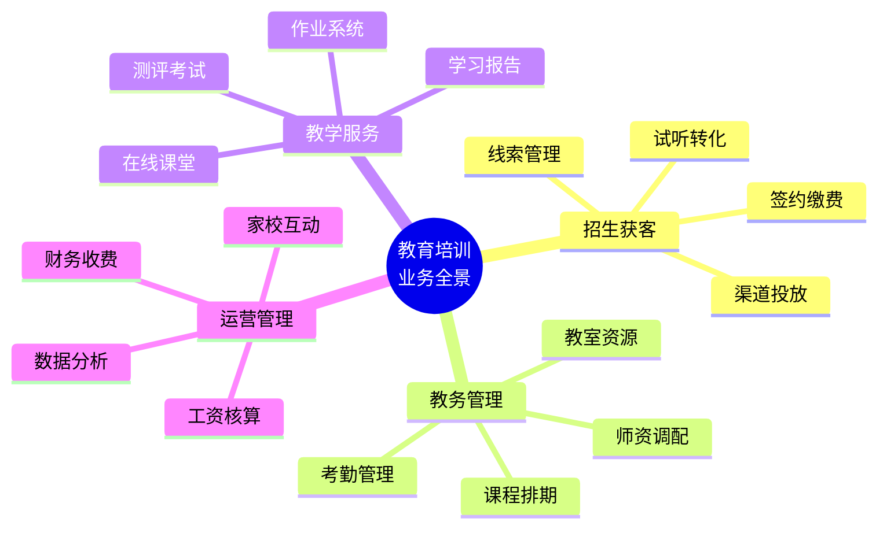

| 业务场景 | 涉及系统 | 集成痛点 |
|---------|---------|---------|
| **招生转化** | CRM、客服系统、营销自动化 | 线索数据分散，转化跟踪困难 |
| **教务排课** | 教务系统、在线课堂、教室管理 | 排课冲突，资源利用不充分 |
| **教学服务** | LMS、作业系统、测评系统 | 学习数据分散，无法形成画像 |
| **财务收费** | 收费系统、财务系统、对账平台 | 对账繁琐，退费处理复杂 |
| **家校互动** | 家长端 APP、微信、短信平台 | 消息触达不及时，反馈收集难 |

### 教育行业集成架构

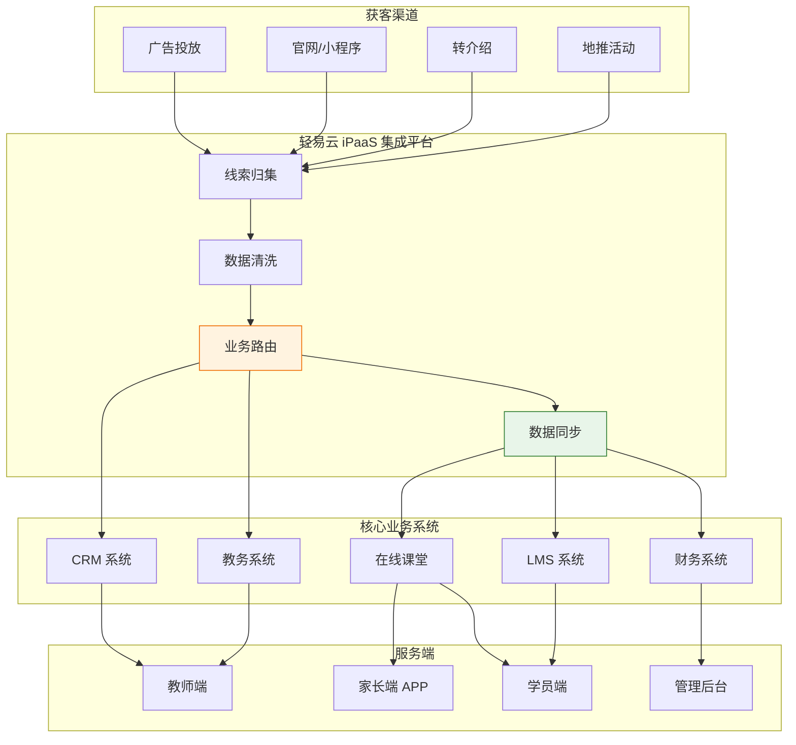

## 教务系统集成

### 教务管理核心流程

教务管理是教育机构的运营核心，涉及课程、教室、教师、学员的统筹安排：

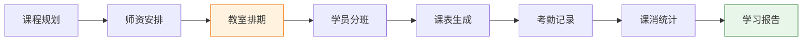

### 教务系统集成场景

| 场景 | 数据源 | 目标系统 | 业务价值 |
|-----|-------|---------|---------|
| **学员报名同步** | CRM/收费系统 | 教务系统 | 自动创建学员档案 |
| **课程排期同步** | 教务系统 | 在线课堂 | 自动生成课程表 |
| **考勤数据回传** | 在线课堂/教室系统 | 教务系统 | 自动计算课消 |
| **课消数据同步** | 教务系统 | 财务系统 | 自动确认收入 |
| **教师课时同步** | 教务系统 | 薪酬系统 | 自动核算课时费 |

### 排课冲突检测

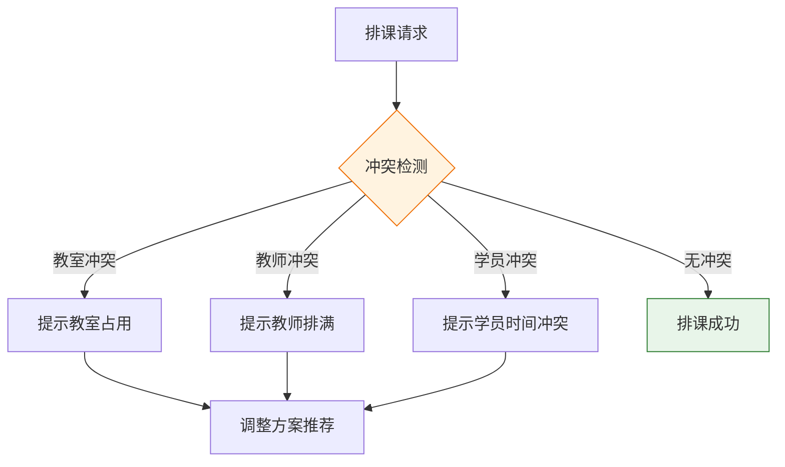

> [!TIP]
> 智能排课可以大幅提升教务效率。轻易云支持将排课规则配置到数据加工厂中，自动检测冲突并推荐最优排课方案。

## 在线教育系统对接

### 在线教育平台架构

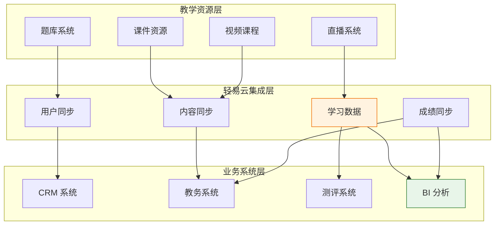

### 在线教育集成场景

| 场景 | 数据流向 | 业务价值 |
|-----|---------|---------|
| **课程发布** | 教务系统 → 在线课堂 | 课程信息自动同步 |
| **学员开通** | CRM → 在线课堂 | 报名后自动开通权限 |
| **学习进度** | 在线课堂 → LMS | 学习轨迹实时记录 |
| **作业成绩** | 在线课堂 → 教务系统 | 成绩自动汇总 |
| **直播数据** | 直播系统 → BI | 出勤率、互动数据分析 |

### 主流在线教育平台对接

轻易云支持与主流在线教育平台的快速对接：

| 平台 | 对接方式 | 集成内容 |
|-----|---------|---------|
| **ClassIn** | API | 课程、学员、考勤数据 |
| **腾讯会议** | API | 直播数据、出勤记录 |
| **钉钉在线课堂** | API | 课程、作业、成绩 |
| **企业微信直播** | API | 直播数据、互动记录 |
| **自研 LMS** | 开放接口 | 全面对接 |

> [!NOTE]
> 在线教育平台的数据格式各异，轻易云通过数据加工厂进行格式转换和标准化，确保与业务系统的无缝对接。

## 财务收费集成

### 教育行业收费场景

教育培训行业的收费业务复杂，涉及多种收费模式和退费场景：

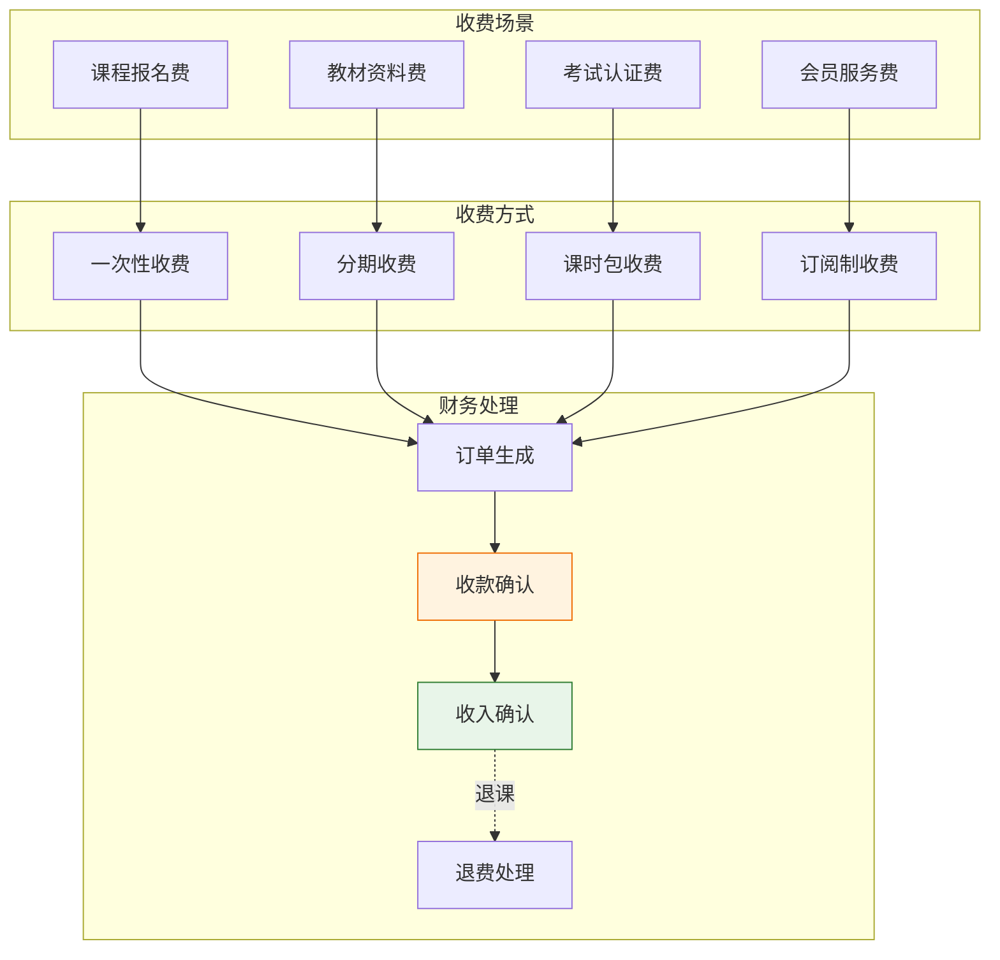

### 财务收费集成场景

| 场景 | 数据流向 | 业务价值 |
|-----|---------|---------|
| **订单生成** | CRM → 收费系统 | 签约后自动生成订单 |
| **收款同步** | 收费系统/支付平台 → 财务系统 | 实时确认收款 |
| **课消收入** | 教务系统 → 财务系统 | 按课消自动确认收入 |
| **退费处理** | 财务系统 → CRM/教务系统 | 退课后自动更新状态 |
| **对账报表** | 多渠道数据 → BI | 自动对账，生成报表 |

### 收入确认自动化

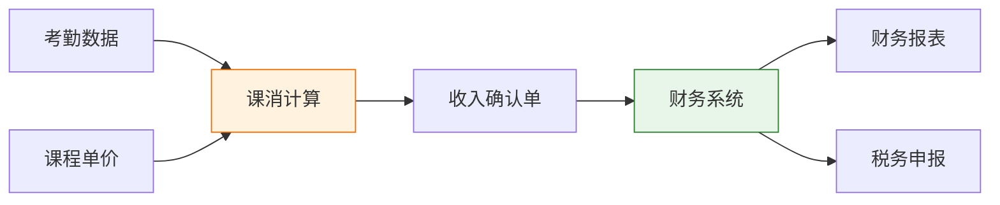

**收入确认规则**：

| 收费模式 | 确认规则 | 同步频率 |
|---------|---------|---------|
| **一次性收费** | 按课消进度分期确认 | 每日 |
| **课时包** | 按实际消耗课时确认 | 实时 |
| **订阅制** | 按服务期分摊确认 | 月末 |
| **分期收费** | 按收款时点确认 | 实时 |

### 退费处理流程

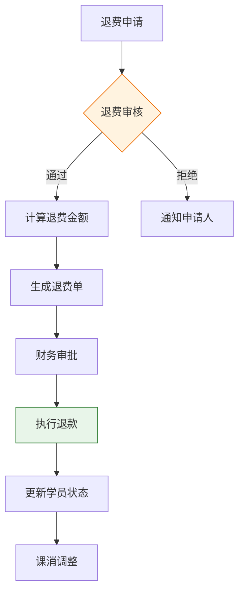

> [!IMPORTANT]
> 退费处理涉及财务风险，建议配置多级审批流程，并与合同条款关联，确保退费金额计算准确。

## 数据分析与决策支持

### 教育数据指标体系

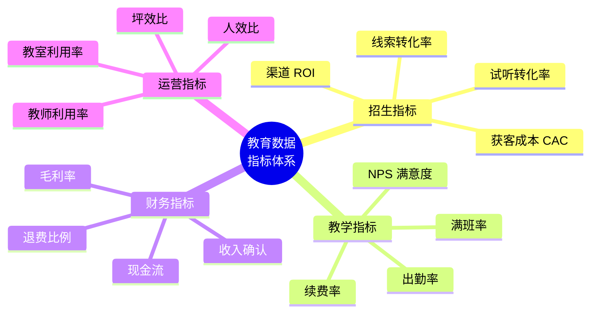

### 数据集成与可视化

| 数据源 | 数据内容 | 分析场景 |
|-------|---------|---------|
| **CRM** | 线索、转化、签约 | 招生漏斗分析 |
| **教务系统** | 排课、考勤、课消 | 教务效率分析 |
| **在线课堂** | 学习时长、完课率 | 学习效果分析 |
| **财务系统** | 收入、成本、退费 | 财务健康分析 |
| **家校互动** | 消息、反馈、评价 | 满意度分析 |

## 实施建议

### 分阶段实施路线图

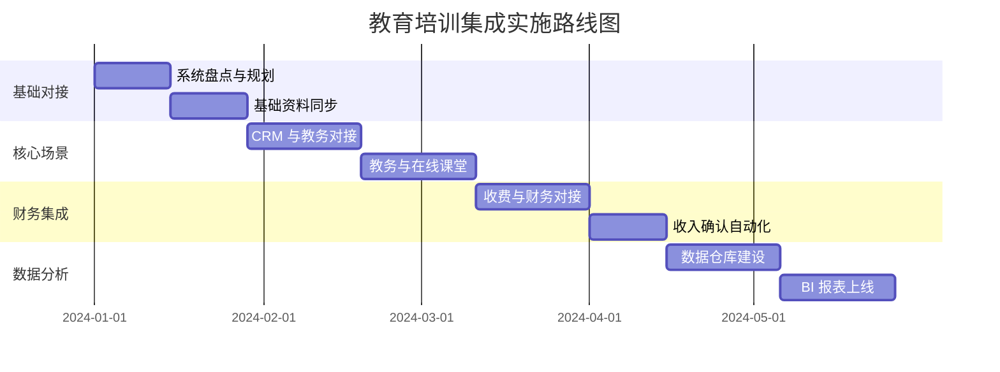

### 最佳实践

**1. 学员 OneID 体系**

建立统一的学员身份识别体系，打通各系统学员数据：

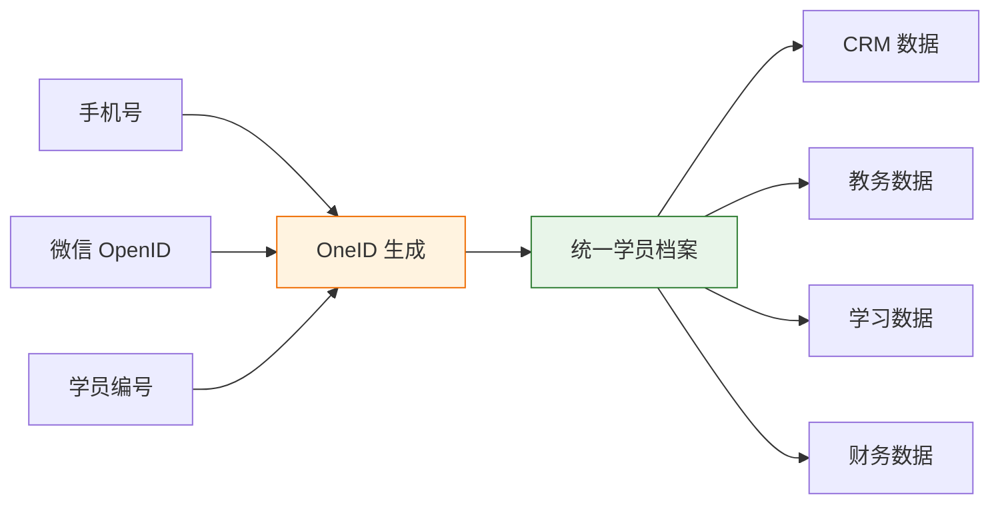

**2. 消息触达集成**

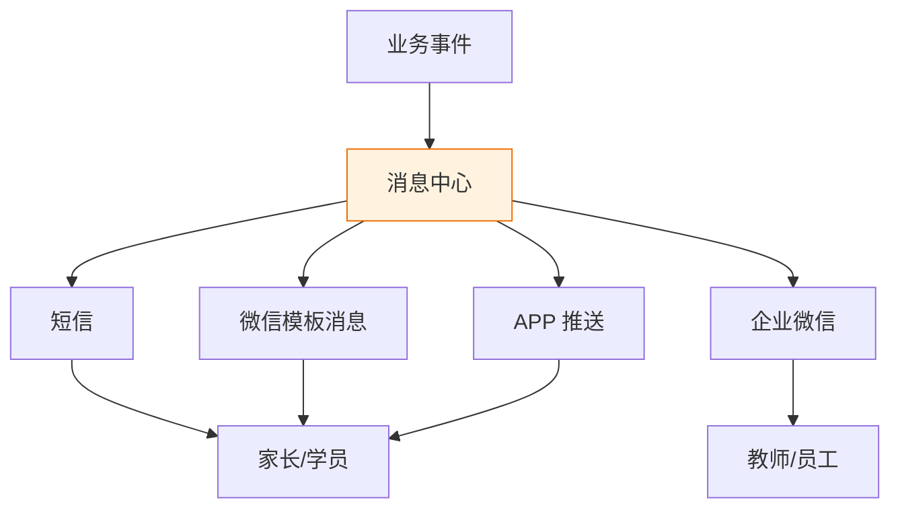

**3. 数据安全与隐私保护**

| 保护措施 | 实施方式 | 合规要求 |
|---------|---------|---------|
| **数据加密** | 传输加密、存储加密 | 等保要求 |
| **访问控制** | 角色权限、数据脱敏 | 最小权限原则 |
| **审计日志** | 操作留痕、定期审计 | 可追溯要求 |
| **数据备份** | 定期备份、异地容灾 | 业务连续性 |

### 常见问题解答

**Q1：如何确保各系统学员数据的一致性？**

A：建议建立 OneID 体系，以手机号或证件号作为唯一标识。轻易云通过数据加工厂进行数据清洗和关联，确保各系统学员数据的统一。

**Q2：在线教育平台的学习数据如何有效利用？**

A：轻易云支持将学习数据（学习时长、完课率、作业成绩等）同步至 CRM 和 BI 系统，形成完整的学员画像，支持精准营销和教学改进。

**Q3：多校区/多品牌的集团化教育机构如何统一管理？**

A：轻易云支持多租户架构，可为每个校区/品牌配置独立的集成方案，同时支持集团层面的数据汇总和分析，实现统一管理。

## 方案价值总结

| 价值维度 | 量化收益 | 业务影响 |
|---------|---------|---------|
| **招生效率** | 线索转化率提升 20% | 降低获客成本 |
| **教务效率** | 排课效率提升 50% | 减少教务人力 |
| **财务效率** | 对账效率提升 80% | 释放财务人力 |
| **数据洞察** | 决策时效从天级到小时级 | 支持快速决策 |
| **家长满意度** | 消息触达及时率 99%+ | 提升服务体验 |

---

## 相关资源

- [CRM 集成方案](./crm-integration) - 客户关系管理系统集成
- [SaaS 企业解决方案](./saas) - SaaS 化教育平台集成
- [零售标准方案](../standard-plans/domestic-ecommerce) - 电商化课程销售集成
