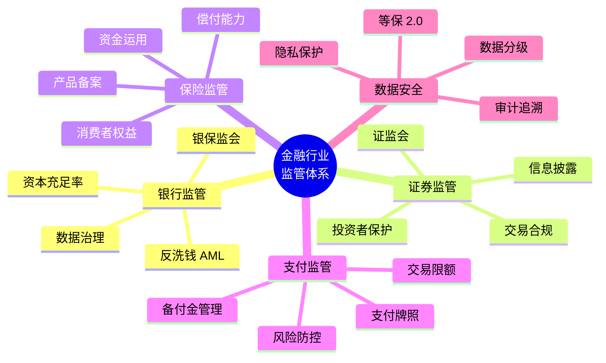
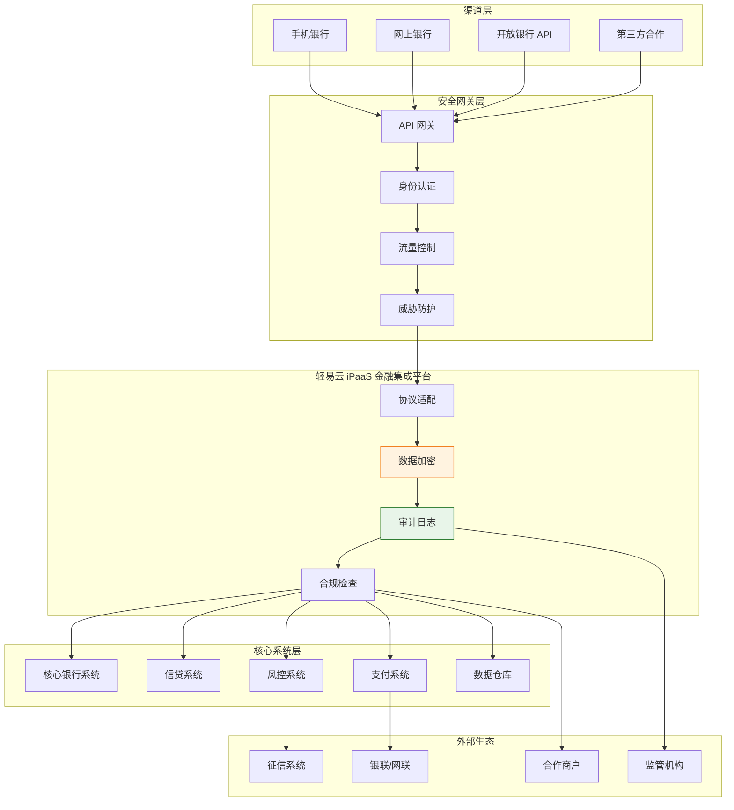
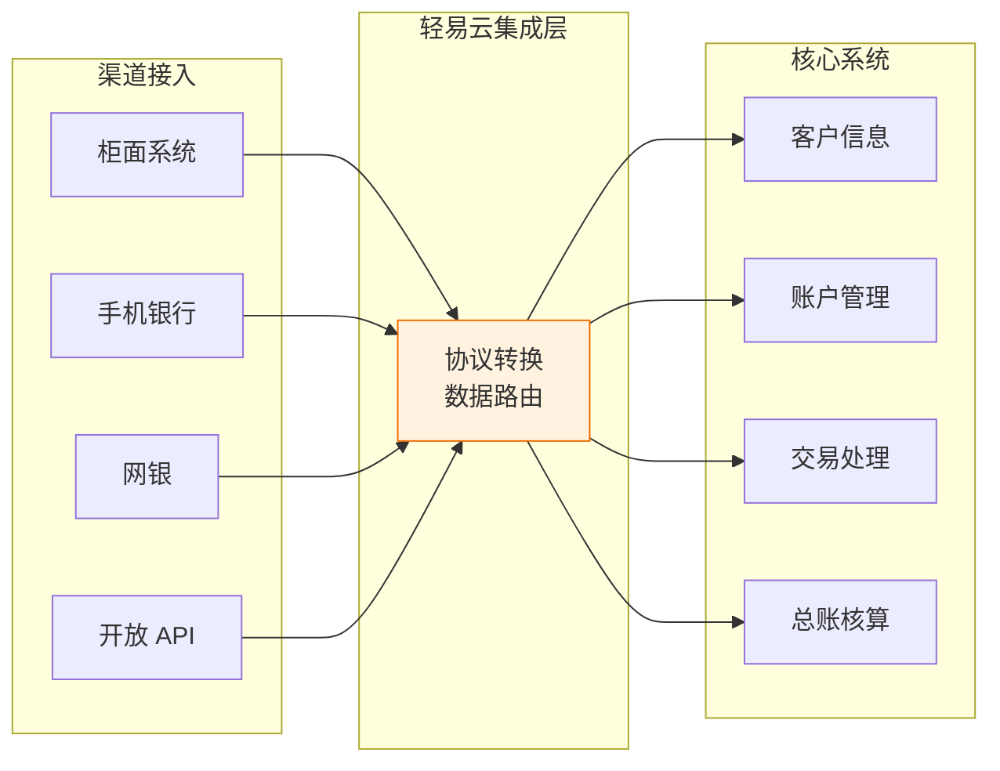
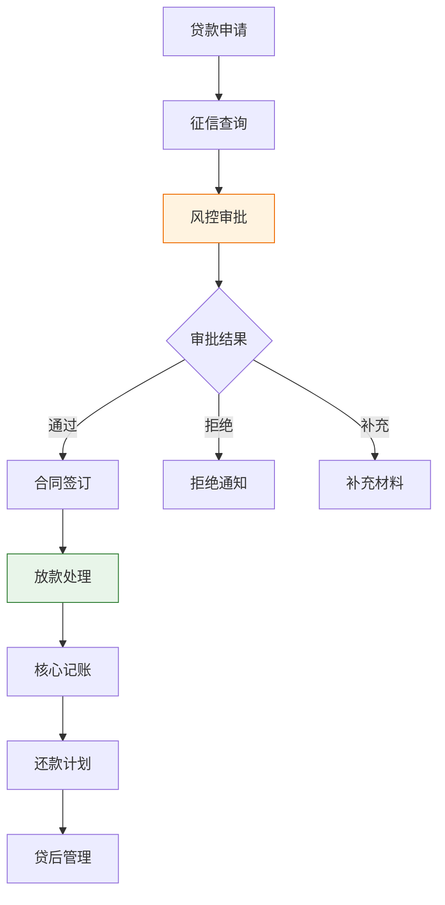
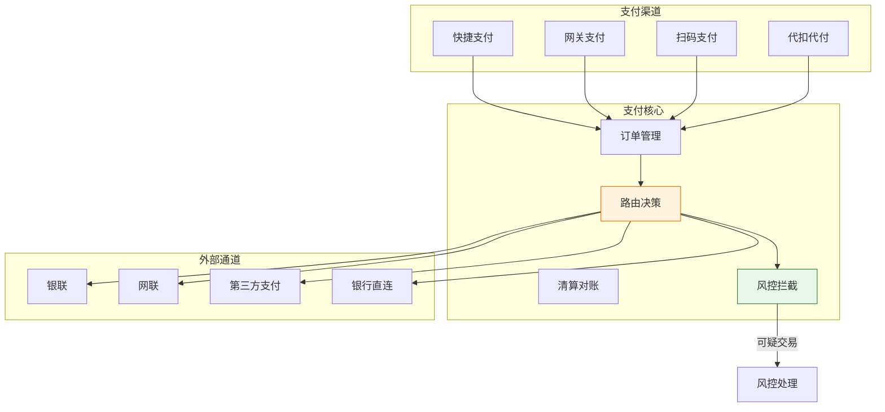
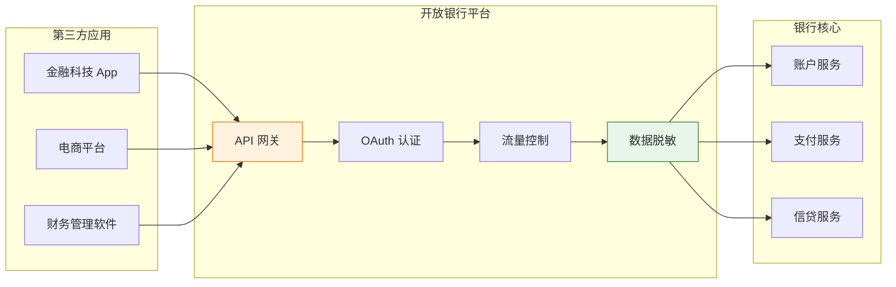
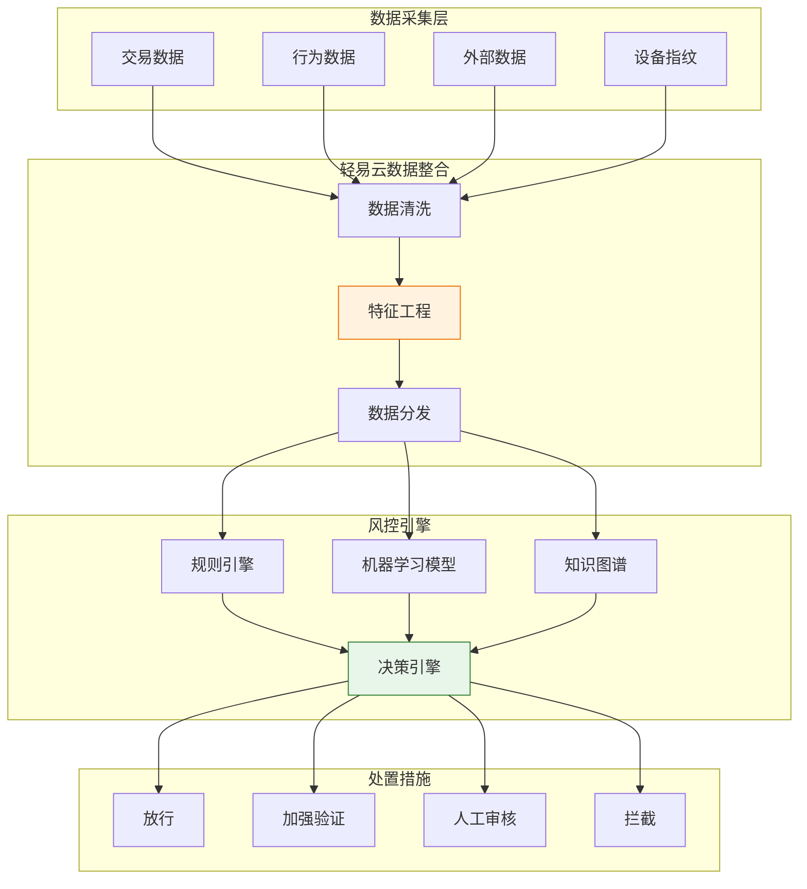
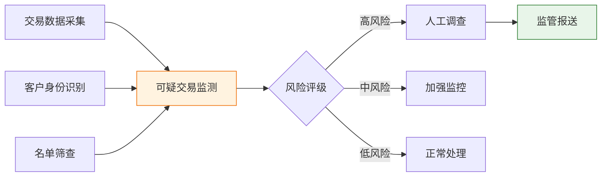
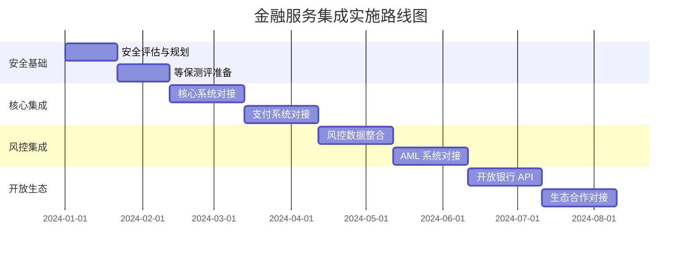

# 金融服务集成解决方案

金融行业是国民经济的核心，具有监管严格、数据敏感、系统复杂等特点。随着金融科技（FinTech）的发展，金融机构面临数字化转型、开放银行、生态合作等新趋势。轻易云 iPaaS 针对金融行业的特殊要求，提供符合金融监管标准的 comprehensive 集成方案，帮助金融机构实现系统互联、数据共享和业务协同。

> [!TIP]
> 本方案适用于银行、保险、证券、基金、支付机构、金融科技公司等金融服务企业。实施前建议完成合规评估和安全审计。

## 金融行业合规

### 金融行业监管体系

| 合规领域 | 法规要求 | 集成要求 |
|---------|---------|---------|
| **等保合规** | 信息系统安全等级保护 | 数据加密、访问控制、审计日志 |
| **数据治理** | 数据质量管理、数据标准 | 数据一致性、完整性校验 |
| **反洗钱** | 客户身份识别、交易监控 | 大额交易实时上报 |
| **隐私保护** | 个人信息保护、数据最小化 | 敏感数据脱敏、加密传输 |
| **业务连续性** | RTO/RPO 要求 | 灾备方案、故障自动切换 |

### 金融行业集成架构

## 核心系统对接

### 核心银行系统（CBS）集成

核心银行系统是金融机构的中枢神经系统：

### 核心系统集成场景

| 场景 | 数据流向 | 业务价值 |
|-----|---------|---------|
| **客户信息同步** | 多渠道 → 核心系统 | 统一客户视图 |
| **账户查询** | 核心系统 → 渠道 | 实时余额、交易明细 |
| **转账汇款** | 渠道 → 核心系统 | 实时到账处理 |
| **贷款申请** | 渠道 → 信贷系统 → 核心 | 快速审批放款 |
| **日终对账** | 核心系统 → 数据仓库 | 自动对账报表 |

### 信贷系统集成

**信贷系统集成要点**：

| 环节 | 集成系统 | 数据内容 | 时效要求 |
|-----|---------|---------|---------|
| **申请接入** | 渠道 → 信贷系统 | 申请信息、附件材料 | 实时 |
| **征信查询** | 信贷系统 → 征信中心 | 身份验证、信用报告 | 秒级 |
| **风控决策** | 信贷系统 → 风控引擎 | 申请数据、规则调用 | 秒级 |
| **审批流转** | 工作流系统 | 审批意见、决策结果 | 准实时 |
| **放款处理** | 信贷系统 → 核心系统 | 放款指令、记账凭证 | 实时 |
| **还款处理** | 支付系统 → 信贷系统 | 还款流水、状态更新 | 准实时 |

> [!IMPORTANT]
> 信贷系统涉及敏感的客户信用信息，必须确保数据传输的加密和访问的严格控制，符合征信合规要求。

## 支付系统集成

### 支付系统架构集成

### 支付系统集成场景

| 场景 | 集成内容 | 合规要求 |
|-----|---------|---------|
| **支付路由** | 智能选择最优支付通道 | 通道可用性监控 |
| **订单同步** | 多渠道订单统一接入 | 订单幂等性保障 |
| **清算对账** | 与银行/通道日终对账 | 差异自动发现 |
| **退款处理** | 原路退款、部分退款 | 退款风控检查 |
| **对账报表** | 交易明细、资金汇总 | 监管报送要求 |

### 开放银行 API 集成

**开放银行 API 清单**：

| API 类别 | 功能 | 安全级别 |
|---------|------|---------|
| **账户信息** | 余额查询、交易明细 | 高（需用户授权） |
| **支付服务** | 转账、代扣 | 高（需多重认证） |
| **信贷服务** | 额度查询、贷款申请 | 高（需风控审批） |
| **公共服务** | 汇率查询、网点信息 | 低 |

> [!TIP]
> 开放银行 API 需要严格的身份认证和授权机制。轻易云支持 OAuth 2.0、国密 SM2/SM4 等安全协议，确保 API 调用的安全性。

## 风控数据整合

### 智能风控体系

### 风控数据集成场景

| 场景 | 数据源 | 应用场景 | 实时性 |
|-----|-------|---------|-------|
| **反欺诈** | 交易数据、设备信息 | 交易风险评分 | 实时 |
| **反洗钱** | 交易流水、客户信息 | 可疑交易识别 | 准实时 |
| **信用评估** | 征信数据、行为数据 | 贷款审批 | 秒级 |
| **营销风控** | 用户行为、社交数据 | 活动反作弊 | 准实时 |
| **操作风控** | 系统日志、访问记录 | 内部风险监控 | T+1 |

### 反洗钱（AML）集成

**AML 集成要点**：

| 环节 | 集成内容 | 合规要求 |
|-----|---------|---------|
| **客户身份识别** | KYC 数据、证件核验 | 实名认证、留存证据 |
| **大额交易报告** | 交易金额监测 | 超阈值实时上报 |
| **可疑交易报告** | 行为模式分析 | STR 及时报送 |
| **名单筛查** | 制裁名单、PEP | 实时筛查、命中预警 |
| **监管报送** | 监管平台对接 | 数据格式合规 |

## 实施建议

### 分阶段实施路线图

### 安全实施要点

| 安全领域 | 实施措施 | 合规标准 |
|---------|---------|---------|
| **传输安全** | TLS 1.3、国密算法 | 等保三级 |
| **存储安全** | 敏感字段加密、密钥管理 | 等保三级 |
| **访问控制** | RBAC、最小权限原则 | 等保三级 |
| **审计日志** | 全链路日志、防篡改 | 等保三级 |
| **容灾备份** | 同城双活、异地灾备 | RTO<30min |

### 常见问题解答

**Q1：如何保障金融数据传输的安全性？**

A：轻易云支持国密 SM2/SM4 算法、TLS 1.3 加密传输，并提供数据脱敏、数字签名等安全机制，满足金融行业等保三级要求。

**Q2：核心银行系统对接如何保证高可用？**

A：轻易云支持集群部署、负载均衡、故障自动切换等高可用架构。同时配置熔断降级机制，确保在核心系统异常时能够快速失败，避免级联故障。

**Q3：开放银行 API 如何进行权限管理？**

A：轻易云支持 OAuth 2.0 + PKCE 流程，实现细粒度的 API 权限控制。支持按应用、按用户、按接口的权限配置，并提供完善的审计日志。

## 方案价值总结

| 价值维度 | 量化收益 | 业务影响 |
|---------|---------|---------|
| **开发效率** | API 开发效率提升 60% | 快速响应业务需求 |
| **运维效率** | 系统对接维护成本降低 50% | 降低 TCO |
| **安全合规** | 通过等保三级/PCI DSS | 满足监管要求 |
| **业务创新** | 新产品上线周期缩短 40% | 加速数字化转型 |
| **风险控制** | 风险识别时效从天级到分钟级 | 提升风控能力 |

---

## 相关资源

- [SaaS 企业解决方案](./saas) - 金融科技 SaaS 集成
- [央国企采购平台对接](./government-procurement) - 政府采购金融服务集成
- [开发者指南](../developer/guide) - API 开发最佳实践
