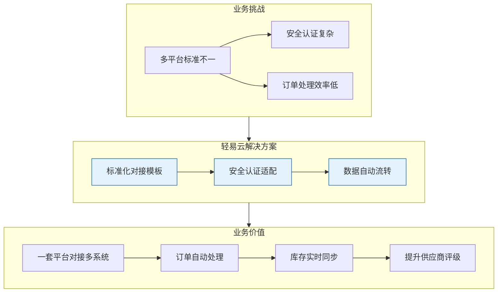
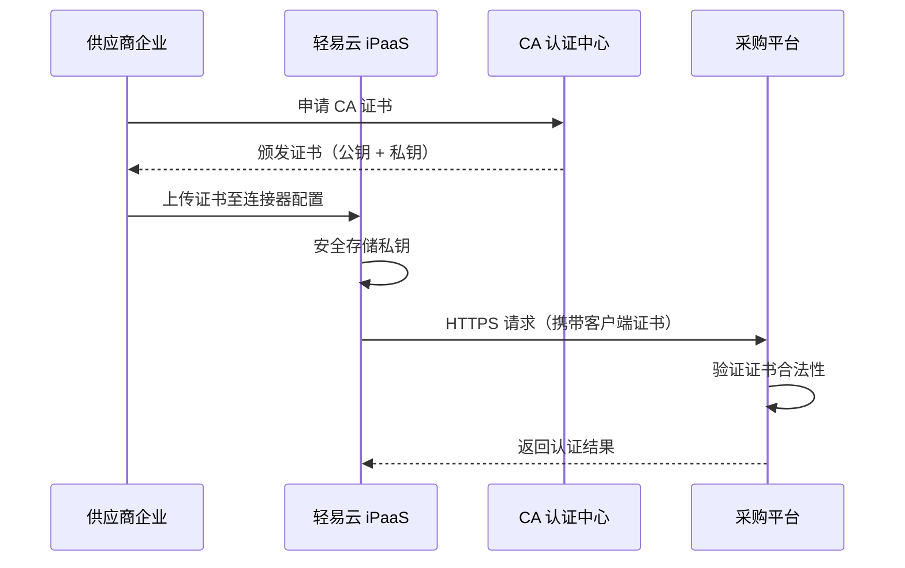
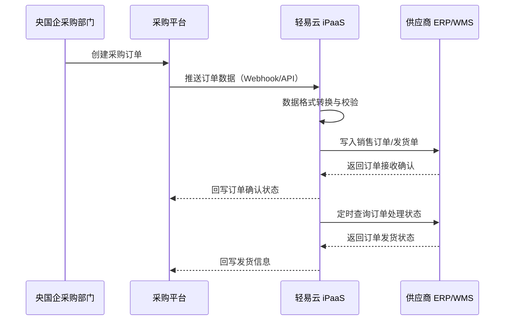
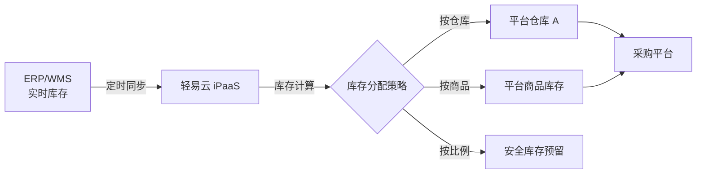
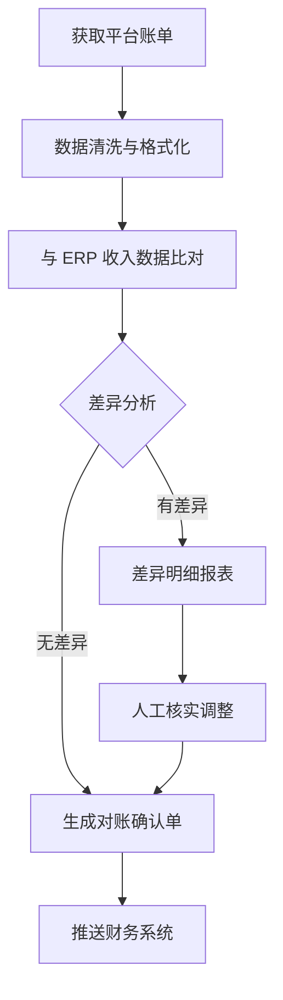
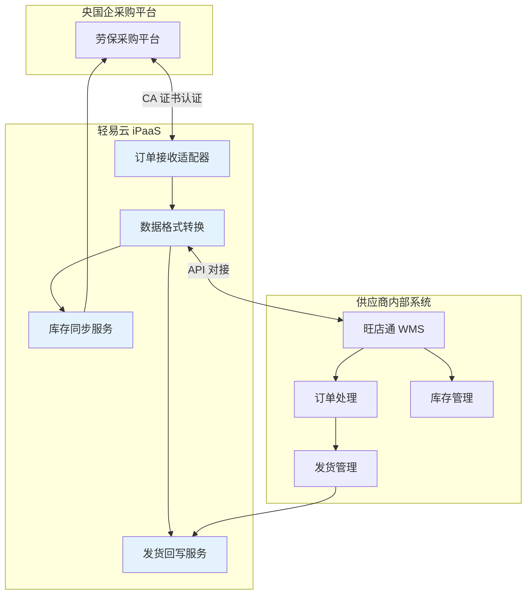
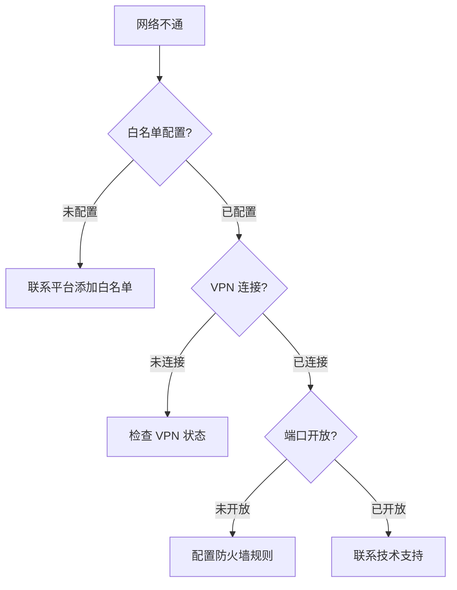

# 央国企采购平台对接方案

本方案针对民营企业与中央企业、国有企业采购平台对接的需求，提供标准化的系统集成解决方案。通过轻易云 iPaaS 平台，实现供应商企业内部系统与央国企电子采购平台的无缝对接，解决电商化采购趋势下的数据互通难题，实现从订单接收到发货履约的全流程自动化。

> [!TIP]
> 本方案已预置与国家能源集团、中国石油、中国移动等主流央国企采购平台的对接模板，支持 CA 证书认证与专网环境下的安全通信。适用于劳保用品、办公物资、MRO 工业品等电商化采购场景。

## 方案概述

### 背景与市场趋势

近年来，中央企业电商化采购发展迅速，已成为企业数字化转型的重要组成部分：

| 企业 | 采购规模 | 平台能力 |
|-----|---------|---------|
| **中国石油** | 累计采购金额超 1.37 万亿元 | 供应商与投标人超 8 万家，实施招标项目 21 万多个 |
| **中国移动** | 电子采购超 12,000 亿元 | 累计完成采购 10 万余笔，节约成本 2% |
| **国家电网** | 年采购额超 5,000 亿元 | 覆盖全国供应商网络，实现全流程电子化 |

随着越来越多的央国企采购需求走向电商化，民营企业需要快速响应并实现与这些采购平台的系统级对接，以满足：

- **供应商准入要求**：具备系统对接能力是成为合格供应商的必要条件
- **订单响应时效**：平台要求 T+0 或 T+1 的订单确认与发货响应
- **数据合规要求**：严格按照平台数据格式与传输规范进行交互

### 业务痛点

| 痛点 | 具体表现 | 业务影响 |
|-----|---------|---------|
| **多平台对接复杂** | 不同央国企采用不同的采购平台，接口标准各异 | 重复开发、维护成本高 |
| **安全认证严格** | 要求 CA 证书、专网接入、国密算法加密 | 技术门槛高，实施周期长 |
| **订单处理效率低** | 人工登录平台下载订单，再录入内部 ERP/WMS | 响应慢、易出错、影响供应商评级 |
| **库存同步滞后** | 无法实时同步库存数据，导致超卖或断货 | 订单履约率低，影响客户满意度 |
| **对账困难** | 平台账单与内部财务系统数据不一致 | 财务核算困难，回款周期长 |

### 解决思路



轻易云 iPaaS 平台通过预置的央国企采购平台连接器，帮助企业：

- **统一对接入口**：一套平台对接多个央国企采购系统
- **安全合规保障**：支持 CA 证书、专网接入、国密算法等安全要求
- **订单自动流转**：平台订单自动接入企业内部 ERP/WMS 系统
- **库存实时回写**：内部库存实时同步至采购平台，确保可售准确

## 对接特殊性说明

### CA 证书认证

央国企采购平台普遍要求使用 CA（Certificate Authority）数字证书进行身份认证，确保通信双方身份可信。

#### 证书类型

| 证书类型 | 适用场景 | 获取方式 |
|---------|---------|---------|
| **企业 CA 证书** | 供应商企业身份认证 | 向平台指定 CA 机构申请（如 CFCA、北京 CA 等） |
| **平台专用证书** | 特定采购平台接入 | 通过平台供应商入驻流程申请 |
| **双向 TLS 证书** | 专网环境下的双向认证 | 平台与企业各自持有证书 |

#### 轻易云证书配置



> [!IMPORTANT]
> CA 证书具有有效期，通常为 1~3 年。建议在证书到期前 30 天完成续期，避免对接中断。

#### 配置步骤

1. **申请证书**
   - 根据采购平台要求，向指定 CA 机构提交申请材料
   - 完成企业实名认证与审核
   - 下载证书文件（通常包含 `.cer`、`.pfx` 或 `.jks` 格式）

2. **上传至轻易云**
   - 进入**连接器管理** → 选择对应采购平台连接器
   - 在**安全认证**配置页上传证书文件
   - 输入证书密码（如有）
   - 点击**测试连接**验证证书有效性

3. **证书续期管理**
   - 在连接器详情页查看证书有效期
   - 设置证书到期提醒（建议提前 30 天）
   - 到期前上传新证书完成替换

### 专网接入

部分央国企采购平台要求通过**专线网络**或 **VPN** 进行接入，确保数据传输安全。

#### 专网接入模式

```mermaid
flowchart TB
    subgraph 模式一：VPN 接入
        A1[轻易云 iPaaS] -->|IPSec VPN| A2[企业边界网关]
        A2 -->|专网| A3[采购平台]
    end
    
    subgraph 模式二：专线接入
        B1[轻易云 iPaaS] -->|MPLS 专线| B2[采购平台数据中心]
    end
    
    subgraph 模式三：API 网关代理
        C1[轻易云 iPaaS] -->|HTTPS| C2[企业 API 网关]
        C2 -->|专网/VPN| C3[采购平台]
    end
    
    style A1 fill:#e3f2fd
    style B1 fill:#e3f2fd
    style C1 fill:#e3f2fd
```

| 接入模式 | 适用场景 | 配置要点 |
|---------|---------|---------|
| **VPN 接入** | 中小型供应商，成本敏感 | 配置 IPSec/SSL VPN 隧道，固定出口 IP 白名单 |
| **专线接入** | 大型供应商，高频交互 | 申请 MPLS 专线，网络延迟 < 50 ms |
| **API 网关代理** | 已有专网基础设施 | 通过企业 API 网关转发请求，统一管控 |

> [!WARNING]
> 专网环境下，需确保轻易云 iPaaS 平台的出口 IP 已加入采购平台白名单。如有 IP 变更，需提前通知平台管理员更新配置。

#### 网络配置要点

1. **IP 白名单配置**
   - 获取轻易云 iPaaS 平台出口 IP 地址段
   - 向采购平台提交白名单申请
   - 验证网络连通性（ping、telnet 测试）

2. **防火墙规则**
   - 开放采购平台 API 端口（通常为 443）
   - 配置出站规则允许访问平台域名/IP
   - 记录网络日志便于故障排查

3. **高可用配置**
   - 配置多出口 IP 冗余
   - 启用网络监控告警
   - 制定网络故障应急预案

## 核心集成场景

### 一、采购订单接入

#### 场景描述

央国企采购平台产生订单后，自动推送至供应商企业内部 ERP/WMS 系统，实现订单的无缝接入与处理。



#### 对接配置

| 配置项 | 说明 |
|-------|------|
| **数据接收方式** | Webhook 推送 / 定时拉取 / MQ 消息队列 |
| **协议支持** | HTTPS（CA 证书认证）、WebService、RESTful API |
| **数据格式** | JSON、XML（支持平台标准格式） |
| **频率设置** | 实时推送（推荐）或每 5 分钟拉取 |

#### 关键字段映射示例

| 采购平台字段 | ERP/WMS 字段 | 说明 |
|-------------|-------------|------|
| order_no | FBillNo | 采购订单号映射为销售订单号 |
| buyer_org_name | FCustId | 采购方组织名称映射为客户 |
| product_code | FMaterialId | 平台商品编码映射为物料编码 |
| quantity | FQty | 采购数量 |
| require_delivery_date | FDeliveryDate | 要求交货日期 |
| delivery_address | FAddress | 送货地址 |
| contact_phone | FPhone | 联系人电话 |

> [!NOTE]
> 不同采购平台的字段命名可能存在差异，轻易云提供字段映射配置功能，支持灵活的字段对应关系调整。

### 二、库存同步

#### 场景描述

将供应商企业内部 ERP/WMS 的实时库存数据同步至采购平台，确保平台展示的可售库存准确，避免超卖或断货。



#### 同步策略

| 策略 | 说明 | 适用场景 |
|-----|------|---------|
| **全量同步** | 定时推送全部商品库存 | 商品数量较少（< 1000 SKU） |
| **增量同步** | 仅推送库存变动商品 | 商品数量多，库存变动频繁 |
| **实时同步** | 库存变动立即推送 | 高价值商品，避免超卖 |
| **可用库存计算** | 扣除锁定库存后的可售量 | 多平台销售渠道共用库存 |

#### 配置参数

| 参数 | 说明 | 示例值 |
|-----|------|-------|
| 同步频率 | 库存数据推送周期 | 5 分钟 / 15 分钟 / 实时 |
| 安全库存 | 预留库存，不推送至平台 | 各 SKU 设置 10~50 件 |
| 同步阈值 | 库存变动超过阈值才推送 | 变动 > 5 件或变动率 > 10% |
| 仓库映射 | 内部仓库与平台仓库对应 | 中心仓 → 平台默认仓 |

### 三、发货信息回写

#### 场景描述

供应商内部 ERP/WMS 完成发货后，将物流信息回写至采购平台，便于采购方跟踪订单履约状态。

| 回写内容 | 字段示例 | 说明 |
|---------|---------|------|
| 发货单号 | delivery_no | 内部系统发货单号 |
| 物流公司 | logistics_company | 顺丰、京东物流、德邦等 |
| 物流单号 | tracking_no | 快递/物流追踪号 |
| 发货时间 | delivery_time | 实际发货时间戳 |
| 发货数量 | delivery_qty | 实际发货数量（允许多批次） |
| 签收状态 | receive_status | 待签收 / 已签收 / 拒收 |

### 四、对账与结算

#### 场景描述

定期从采购平台获取账单数据，与内部 ERP 财务模块进行对账，确保收入数据准确一致。



## 典型客户案例

### 案例：某知名服装企业劳保用品供应对接

#### 背景

某知名服装企业通过投标获取某大型国企单位的劳保用品采购供应商资格，需要与国企采购平台进行系统对接，实现订单自动接入与发货管理。

#### 业务需求

- 接收国企采购平台下发的劳保用品订单
- 订单自动同步至旺店通 WMS 系统
- 库存数据实时回写采购平台
- 发货信息自动回传

#### 系统架构



#### 对接效果

| 指标 | 对接前 | 对接后 | 改善幅度 |
|-----|-------|-------|---------|
| 订单处理时效 | 2~4 小时 | 5 分钟 | 提升 96% |
| 数据准确率 | 92% | 99.5% | 提升 7.5% |
| 人工录入工作量 | 每天 4 小时 | 接近 0 | 节约 100% |
| 库存同步延迟 | 无法同步 | 实时 | 质的飞跃 |
| 供应商评级 | B 级 | A 级 | 提升一级 |

> [!TIP]
> 该案例展示了通过轻易云 iPaaS 平台实现央国企采购平台与旺店通 WMS 的无缝对接，供应链数据一致准确，实现从接单到发货的一站式处理，显著提高工作效率并节约人力成本。

## 实施配置步骤

### 步骤一：采购平台准入

1. **供应商注册**
   - 完成采购平台供应商入驻申请
   - 提交企业资质文件（营业执照、税务登记证等）
   - 等待平台审核通过

2. **CA 证书申请**
   - 根据平台要求向指定 CA 机构申请证书
   - 完成证书下载与保管

3. **获取接口文档**
   - 从平台获取 API 接口文档
   - 确认接口地址、认证方式、数据格式
   - 申请测试环境账号

### 步骤二：连接器配置

1. **新建采购平台连接器**
   - 登录轻易云 iPaaS 平台
   - 进入**连接器管理** → **新建连接器**
   - 选择对应采购平台类型（如"国家能源集团采购平台"）

2. **配置安全认证**
   - 上传 CA 证书文件
   - 配置专网/VPN 参数（如适用）
   - 输入平台 API 密钥/令牌

3. **测试连接**
   - 点击**测试连接**验证配置
   - 确认网络连通与认证通过

### 步骤三：集成方案部署

1. **选择方案模板**
   - 进入**方案市场**，搜索对应采购平台方案
   - 选择「央国企采购平台对接方案」
   - 点击**一键部署**

2. **配置数据映射**
   - 根据实际 ERP/WMS 系统调整字段映射
   - 配置库存同步策略与频率
   - 设置订单处理规则

3. **测试验证**
   - 在测试环境进行端到端验证
   - 确认订单接收、库存同步、发货回写各环节正常
   - 处理测试中发现的问题

### 步骤四：正式上线

1. **切换生产环境**
   - 将连接器配置切换至生产环境地址
   - 更新生产环境 CA 证书

2. **监控运行状态**
   - 启用监控告警，关注订单处理成功率
   - 定期检查数据同步日志

3. **持续优化**
   - 根据实际运行情况调整同步频率
   - 优化异常处理机制

## 常见问题

### Q1：CA 证书过期如何处理？

**解决方案：**

1. 在证书到期前 30 天向 CA 机构申请续期
2. 下载新证书后，在轻易云连接器配置页上传替换
3. 点击**测试连接**验证新证书有效性
4. 保留旧证书 7 天作为回退备份

> [!WARNING]
> 证书过期会导致接口调用失败，订单无法接收。务必设置证书到期提醒，提前完成续期。

### Q2：专网环境下网络不通如何排查？

**排查步骤：**



1. 确认轻易云出口 IP 已加入平台白名单
2. 检查 VPN/专线连接状态
3. 验证防火墙端口开放情况（通常需要开放 443 端口）
4. 使用 `ping` 和 `telnet` 测试网络连通性
5. 如仍无法解决，联系轻易云技术支持

### Q3：订单数据格式不匹配如何处理？

**解决方案：**

- 使用轻易云**数据映射**功能调整字段对应关系
- 使用**值转换器**处理数据格式差异（如日期格式、编码格式）
- 对于复杂转换逻辑，可使用自定义脚本实现

### Q4：如何保障数据安全？

**安全措施：**

| 层级 | 安全措施 | 说明 |
|-----|---------|------|
| 传输层 | HTTPS + CA 证书 | 双向 TLS 认证，确保通信安全 |
| 网络层 | 专网/VPN 隔离 | 与公网隔离，降低攻击面 |
| 应用层 | API 密钥 + 签名 | 请求签名验证，防止篡改 |
| 数据层 | 加密存储 | 敏感数据加密存储，定期备份 |

### Q5：多平台如何统一管理？

**建议方案：**

- 在轻易云平台为每个采购平台配置独立连接器
- 使用统一的 ERP/WMS 连接器对接内部系统
- 通过方案编排实现多平台数据集中管理
- 建立统一的数据监控大屏，实时查看各平台对接状态

## 最佳实践

### 1. 分阶段实施建议

| 阶段 | 实施内容 | 预期周期 | 成功标准 |
|-----|---------|---------|---------|
| 第一阶段 | 订单接入对接 | 3~5 天 | 订单自动接收成功率 > 99% |
| 第二阶段 | 库存同步对接 | 2~3 天 | 库存同步延迟 < 5 分钟 |
| 第三阶段 | 发货回写对接 | 2~3 天 | 发货信息回写成功率 > 98% |
| 第四阶段 | 对账结算对接 | 3~5 天 | 对账差异率 < 1% |

### 2. 数据质量保障

> [!IMPORTANT]
> 数据质量是对接成功的关键。建议在正式对接前进行全面的数据清洗，特别是商品编码、客户编码等关键字段。

- **商品编码统一**：建立采购平台商品编码与内部 ERP 物料编码的映射关系
- **库存数据校准**：对接前进行全量库存盘点，确保基础数据准确
- **订单状态同步**：确保订单状态变更及时同步，避免状态不一致

### 3. 运维监控建议

| 监控项 | 告警阈值 | 处理建议 |
|-------|---------|---------|
| 订单接收成功率 | < 95% | 检查接口状态与网络连接 |
| 订单处理延迟 | > 10 分钟 | 检查内部系统处理能力 |
| 库存同步延迟 | > 15 分钟 | 检查同步任务执行状态 |
| CA 证书到期 | < 30 天 | 立即启动证书续期流程 |
| API 调用失败 | 连续失败 3 次 | 触发人工介入排查 |

## 方案价值总结

通过轻易云 iPaaS 平台实现央国企采购平台对接，企业可获得：

| 价值维度 | 具体收益 | 量化指标 |
|---------|---------|---------|
| **效率提升** | 订单自动接收与处理，告别手工录入 | 订单处理时间减少 90% |
| **成本节约** | 减少人工处理工作量，降低运营成本 | 人力成本节约 60%+ |
| **合规保障** | 满足央国企供应商系统对接要求 | 供应商评级提升 |
| **数据准确** | 避免人工录入错误，数据一致性高 | 数据准确率 > 99% |
| **响应及时** | 订单实时接入，快速响应采购方需求 | 订单响应时间 < 5 分钟 |

## 获取支持

- **方案咨询**：如需定制化方案设计，请联系轻易云解决方案顾问
- **技术支持**：访问 [FAQ](../faq) 或提交技术支持工单
- **标准套件**：前往[方案市场](https://dh-open.qliang.cloud/market/datahub)获取开箱即用的央国企采购平台对接套件
