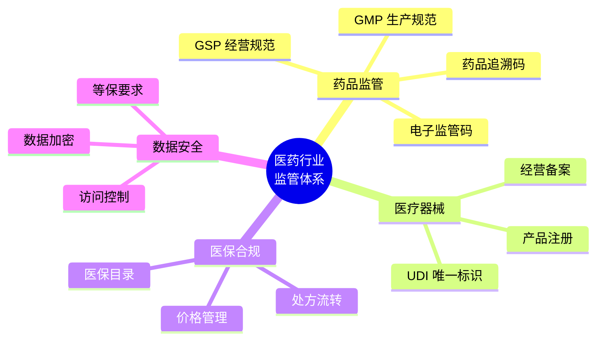
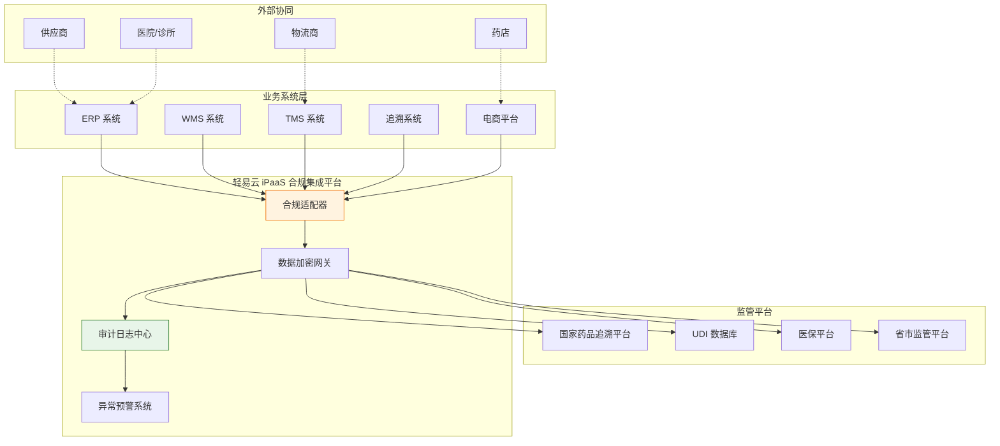
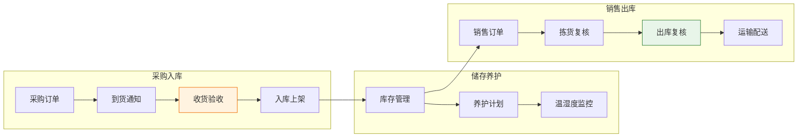
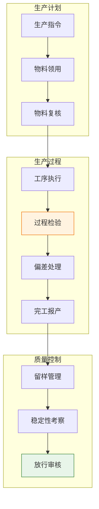
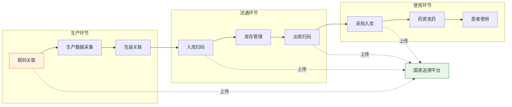
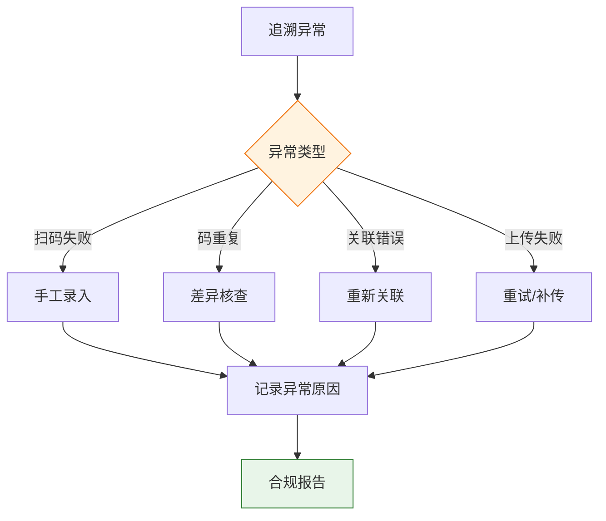
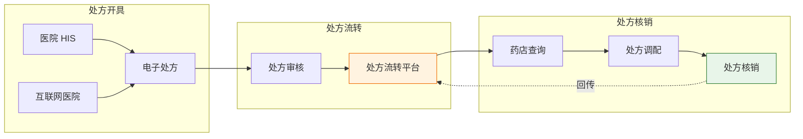
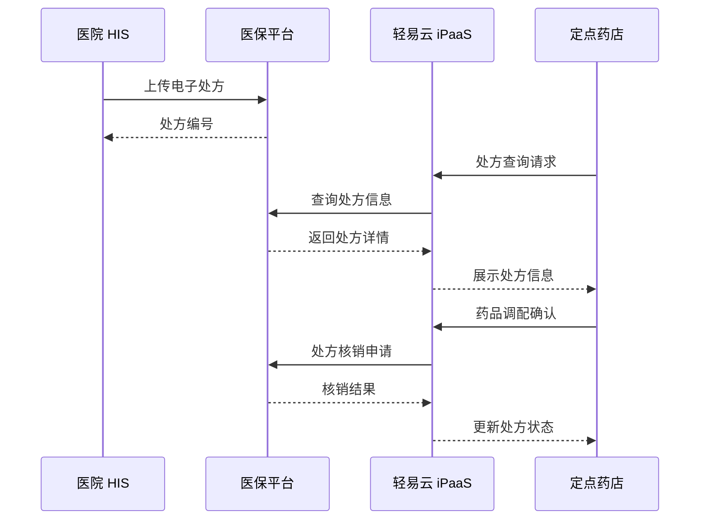
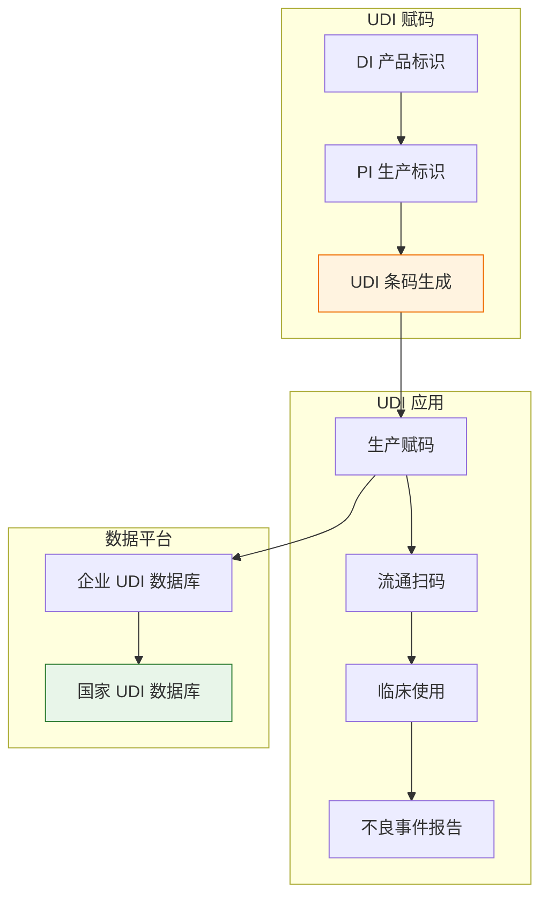
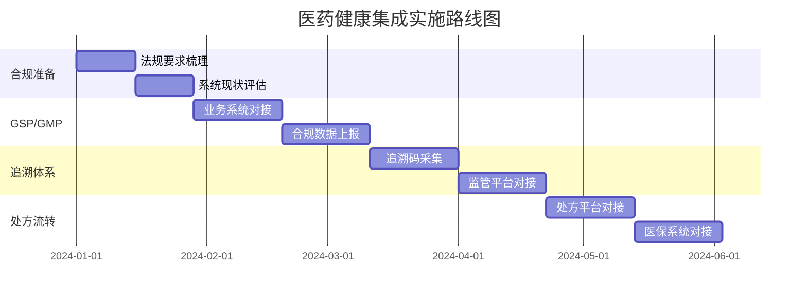

# 医药健康集成解决方案

医药健康行业是关系国计民生的重要行业，具有监管严格、合规要求高、追溯链条长等特点。随着 GSP（药品经营质量管理规范）、GMP（药品生产质量管理规范）等法规的严格执行，以及药品追溯体系的建设要求，医药企业对数据集成和合规管理的需求日益迫切。轻易云 iPaaS 针对医药健康行业的特殊要求，提供符合行业规范的 comprehensive 集成方案。

> [!TIP]
> 本方案适用于医药商业流通企业、药品生产企业、医疗器械企业、连锁药店等医药健康行业客户。实施前建议完成合规要求梳理和系统现状评估。

## 医药行业合规要求

### 医药行业监管体系

| 合规领域 | 法规要求 | 数据集成要求 |
|---------|---------|-------------|
| **GSP 合规** | 药品进销存全程可追溯 | 采购、销售、库存数据完整同步 |
| **GMP 合规** | 生产过程数据完整记录 | MES、LIMS、ERP 数据贯通 |
| **药品追溯** | 一物一码，全程可追溯 | 追溯码数据实时上传监管平台 |
| **UDI 合规** | 医疗器械唯一标识 | UDI 数据与业务系统关联 |
| **医保合规** | 医保目录、价格管控 | 医保数据实时对接 |

### 医药行业集成架构

## GSP/GMP 系统集成

### GSP 系统集成要点

GSP 要求药品经营企业对药品的采购、收货、验收、储存、养护、销售、出库、运输等全过程进行质量管理：

### GSP 关键数据集成场景

| 场景 | 数据源 | 目标系统 | 合规要求 |
|-----|-------|---------|---------|
| **首营企业管理** | ERP | 监管平台 | 首营审批资料完整 |
| **收货验收** | WMS | ERP/监管平台 | 验收记录可追溯 |
| **冷链监控** | 温湿度传感器 | 监管平台 | 全程温控数据 |
| **近效期预警** | WMS | ERP/通知系统 | 提前预警，避免过期 |
| **不合格品处理** | WMS | ERP/监管平台 | 处理流程合规 |

> [!IMPORTANT]
> GSP 要求所有操作留痕，数据不可篡改。轻易云提供完整的审计日志和数据加密机制，确保数据合规。

### GMP 系统集成要点

GMP 要求药品生产企业对生产过程进行全面质量管理：

### GMP 关键数据集成场景

| 场景 | 数据源 | 目标系统 | 合规要求 |
|-----|-------|---------|---------|
| **批生产记录** | MES | ERP | 生产过程完整记录 |
| **检验数据** | LIMS | ERP/MES | 检验结果可追溯 |
| **设备校准** | 设备系统 | ERP | 校准周期合规 |
| **物料追溯** | WMS/MES | ERP | 物料批次关联 |
| **清洁验证** | MES | 文档系统 | 验证记录完整 |

## 药品追溯方案

### 药品追溯体系架构

药品追溯体系要求实现"一物一码"，全程可追溯：

### 追溯数据采集与上传

| 采集节点 | 采集内容 | 上传平台 | 时效要求 |
|---------|---------|---------|---------|
| **生产赋码** | 产品码、追溯码关联关系 | 国家追溯平台 | 实时 |
| **生产入库** | 产品码、批次、数量 | 国家追溯平台 | 实时 |
| **采购入库** | 上游追溯码、收货信息 | 国家追溯平台 | 实时 |
| **销售出库** | 下游追溯码、发货信息 | 国家追溯平台 | 实时 |
| **终端销售** | 追溯码、销售信息 | 国家追溯平台 | 准实时 |

### 追溯异常处理

> [!NOTE]
> 追溯数据的上传时效性和准确性是监管检查的重点。轻易云提供断点续传、异常重试等机制，确保追溯数据的完整上传。

## 处方流转集成

### 处方流转体系

随着电子处方和互联网医疗的发展，处方流转成为医药分开改革的重要支撑：

### 处方流转集成场景

| 场景 | 数据流向 | 合规要求 |
|-----|---------|---------|
| **处方上传** | 医院/互联网医院 → 流转平台 | 处方信息完整、加密传输 |
| **处方审核** | 流转平台 → 审方中心 | 药师审核留痕 |
| **处方查询** | 药店 → 流转平台 | 身份验证合规 |
| **处方调配** | 药店系统记录 | 调配过程可追溯 |
| **处方核销** | 药店 → 流转平台 | 核销状态同步 |

### 医保电子处方对接

## 医疗器械 UDI 集成

### UDI 体系架构

医疗器械唯一标识（UDI）是医疗器械的"身份证"：

### UDI 数据集成场景

| 场景 | 数据内容 | 对接系统 | 合规要求 |
|-----|---------|---------|---------|
| **UDI 申报** | DI、PI、产品信息 | 国家药监局 UDI 数据库 | 数据准确完整 |
| **生产赋码** | UDI 码与产品关联 | 生产线赋码设备 | 赋码准确率 100% |
| **流通追溯** | UDI 码流向记录 | ERP/WMS | 流向可追溯 |
| **临床使用** | 患者与器械关联 | 医院系统 | 使用记录完整 |
| **不良事件** | UDI 码关联报告 | 不良事件监测系统 | 快速定位产品 |

## 实施建议

### 分阶段实施路线图

### 合规实施要点

| 实施阶段 | 关键任务 | 合规检查点 |
|---------|---------|-----------|
| **数据安全** | 加密传输、访问控制 | 等保测评 |
| **审计日志** | 操作留痕、日志留存 | 审计追踪 |
| **数据备份** | 定期备份、灾难恢复 | RPO/RTO 达标 |
| **接口规范** | 符合监管接口标准 | 接口测试通过 |
| **异常处理** | 异常记录、补救机制 | 应急预案 |

> [!IMPORTANT]
> 医药健康行业的数据集成必须严格遵守相关法规要求。建议在实施过程中邀请合规专家参与，确保方案符合监管要求。

### 常见问题解答

**Q1：如何确保追溯数据上传的实时性？**

A：轻易云采用事件驱动的架构，关键节点（入库、出库）的数据变更会触发实时上传。同时配置断点续传机制，确保网络异常恢复后自动补传。

**Q2：处方流转涉及多方系统，如何保障数据安全？**

A：轻易云提供端到端的数据加密传输，支持国密算法。同时配置严格的访问控制和审计日志，确保处方数据的安全性和可追溯性。

**Q3：UDI 赋码与业务数据如何关联？**

A：建议在 WMS 和 ERP 系统中增加 UDI 码字段，通过轻易云实现 UDI 码与业务单据（入库单、出库单）的自动关联，确保全程可追溯。

## 方案价值总结

| 价值维度 | 量化收益 | 业务影响 |
|---------|---------|---------|
| **合规保障** | 满足 GSP/GMP 要求 | 通过监管检查，降低合规风险 |
| **追溯效率** | 追溯查询时间缩短 90% | 快速响应质量问题 |
| **数据准确** | 数据准确率提升至 99.9% | 减少人工差错 |
| **运营效率** | 单据处理效率提升 60% | 释放人力成本 |
| **风险可控** | 异常响应时间缩短 70% | 降低质量风险 |

---

## 相关资源

- [制造业解决方案](./manufacturing) - 医药生产企业集成参考
- [物流仓储解决方案](./logistics) - 医药冷链物流集成
- [央国企采购平台对接](./government-procurement) - 医疗机构采购集成
