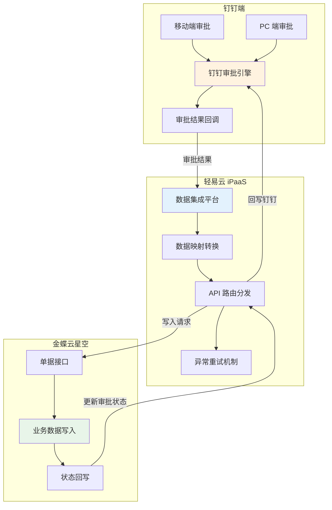
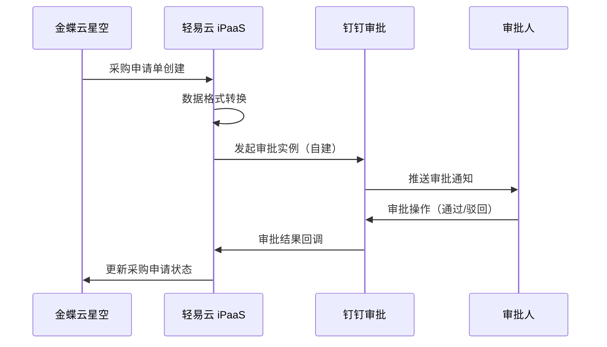

# 金蝶云星空与钉钉审批集成解决方案

本方案实现金蝶云星空 ERP 系统与钉钉审批平台的无缝对接，解决传统 ERP 审批流程单一、移动端体验差等问题。通过将钉钉强大的移动审批能力与金蝶云星空的业务数据管理相结合，实现采购申请、销售出库、费用报销、合同审批等业务流程的移动端发起与审批，提升企业运营效率。

> [!TIP]
> 本方案适用于已使用金蝶云星空作为核心 ERP 系统，同时采用钉钉作为办公协同平台的企业。实施前请确保已开通金蝶云星空与钉钉的 API 访问权限。

## 方案架构

## 集成场景概览

| 场景类型 | 业务场景 | 数据流向 | 关键价值 |
|---------|---------|---------|---------|
| 基础资料同步 | 物料、员工、部门、客户 | 金蝶 → 钉钉 | 确保审批表单数据一致性 |
| 采购审批 | 采购申请 → 钉钉审批 → 采购订单 | 双向同步 | 移动审批，实时追踪 |
| 销售审批 | 销售出库 → 钉钉审批 → 出库确认 | 双向同步 | 加速出库流程 |
| 费控报销 | 费用申请/报销 → 钉钉审批 → 凭证生成 | 双向同步 | 财务业务一体化 |
| 合同审批 | 合同签订申请 → 钉钉审批 → 合同归档 | 双向同步 | 规范合同管理流程 |

## 核心集成方案

### 一、基础资料同步

基础资料同步是审批集成的前提，确保钉钉审批表单中的下拉选项、人员选择等数据与金蝶云星空保持一致。

#### 1. 物料同步

| 配置项 | 说明 |
|-------|------|
| 源系统查询接口 | 获取审批实例详情 |
| 目标系统写入接口 | 创建物料 |
| 同步频率 | 按需触发 / 定时同步 |
| 关键字段映射 | 物料编码、物料名称、规格型号、计量单位 |

#### 2. 员工同步

| 配置项 | 说明 |
|-------|------|
| 源系统查询接口 | 获取员工列表查询 |
| 目标系统写入接口 | 创建员工 |
| 同步频率 | 实时同步 |
| 关键字段映射 | 员工编号、姓名、手机号、所属部门、职位 |

#### 3. 部门同步

| 配置项 | 说明 |
|-------|------|
| 源系统查询接口 | 获取部门列表查询 |
| 目标系统写入接口 | 创建部门 |
| 同步频率 | 实时同步 |
| 关键字段映射 | 部门编码、部门名称、上级部门、部门负责人 |

#### 4. 客户同步

| 配置项 | 说明 |
|-------|------|
| 源系统查询接口 | 获取审批实例详情 |
| 目标系统写入接口 | 创建客户 |
| 同步频率 | 按需触发 |
| 关键字段映射 | 客户编码、客户名称、客户分类、联系人信息 |

> [!IMPORTANT]
> 基础资料对接是审批流集成成功的前提。建议在正式对接单据审批前，优先完成基础资料的清洗与同步，确保编码、名称等关键字段在两个系统中保持一致。

### 二、采购业务审批

#### 1. 采购申请推送钉钉审批

当金蝶云星空中创建采购申请单后，自动推送至钉钉发起审批流程。

| 配置项 | 说明 |
|-------|------|
| 源系统查询接口 | 采购申请单查询 |
| 目标系统写入接口 | 发起审批实例（自建） |
| 触发条件 | 金蝶采购申请单保存/提交 |
| 审批结果处理 | 通过则更新为「已审核」，驳回则更新为「已关闭」 |

#### 2. 钉钉审批回写采购申请

钉钉审批完成后，审批结果及审批意见回写至金蝶云星空。

| 配置项 | 说明 |
|-------|------|
| 源系统查询接口 | 获取审批实例详情 |
| 目标系统写入接口 | 采购申请单写入 |
| 回写字段 | 审批状态、审批意见、审批时间、审批人 |

### 三、销售业务审批

#### 1. 销售出库推送钉钉审批

| 配置项 | 说明 |
|-------|------|
| 源系统查询接口 | 销售出库单查询 |
| 目标系统写入接口 | 发起审批实例（自建） |
| 触发条件 | 销售出库单创建 |
| 业务价值 | 出库前必须经过审批，防止超发/错发 |

#### 2. 销售出库审批回写

| 配置项 | 说明 |
|-------|------|
| 源系统查询接口 | 获取审批实例详情 |
| 目标系统写入接口 | 销售出库单写入 |
| 回写逻辑 | 审批通过后自动执行出库确认 |

### 四、费用管控审批

#### 1. 费用报销推送钉钉审批

| 配置项 | 说明 |
|-------|------|
| 源系统查询接口 | 费用报销单查询 |
| 目标系统写入接口 | 发起审批实例（官方） |
| 触发条件 | 费用报销单创建 |
| 特殊说明 | 使用钉钉官方费控模板，体验更佳 |

#### 2. 费用报销审批回写

| 配置项 | 说明 |
|-------|------|
| 源系统查询接口 | 获取审批实例详情 |
| 目标系统写入接口 | 费用报销单写入 |
| 回写逻辑 | 审批通过后自动生成财务凭证 |

#### 3. 费用申请集成

| 配置项 | 说明 |
|-------|------|
| 源系统查询接口 | 费用申请单查询 |
| 目标系统写入接口 | 发起审批实例（官方） |
| 业务场景 | 事前申请控制，预算管理 |

### 五、合同管理审批

| 配置项 | 说明 |
|-------|------|
| 源系统查询接口 | 获取审批实例详情 |
| 目标系统写入接口 | 采购合同写入 |
| 业务场景 | 合同签订前的审批流程 |
| 关键字段 | 合同金额、付款条款、供应商信息 |

## 实施配置步骤

### 步骤一：连接器配置

1. **配置金蝶云星空连接器**
   - 登录轻易云 iPaaS 平台
   - 进入**连接器管理** → **新建连接器**
   - 选择「金蝶云星空」类型
   - 填写服务器地址、账套 ID、AppKey、AppSecret
   - 点击**测试连接**，验证配置正确

2. **配置钉钉连接器**
   - 进入**连接器管理** → **新建连接器**
   - 选择「钉钉」类型
   - 填写 CorpID、AppKey、AppSecret
   - 完成钉钉授权验证

### 步骤二：基础资料同步方案配置

1. 进入**集成方案管理**，创建基础资料同步方案
2. 选择源系统（金蝶/钉钉）和目标系统
3. 配置字段映射关系
4. 设置同步策略（全量/增量）
5. 启用方案并测试同步

### 步骤三：审批流程方案配置

1. 创建单据审批方案
2. 配置触发条件（如：采购申请单创建）
3. 设置数据映射规则
4. 配置审批回调接口
5. 设置异常处理与重试机制

### 步骤四：钉钉审批模板配置

1. 登录钉钉管理后台
2. 进入**审批** → **审批模板管理**
3. 创建或编辑审批模板
4. 配置表单字段（与金蝶字段对应）
5. 设置审批流程节点

## 数据映射参考

### 采购申请单字段映射

| 金蝶云星空字段 | 钉钉表单字段 | 说明 |
|--------------|-------------|------|
| FBillNo | 申请单号 | 系统自动生成 |
| FDate | 申请日期 | 格式：YYYY-MM-DD |
| FRequestDeptId | 申请部门 | 关联部门基础资料 |
| FRequesterId | 申请人 | 关联员工基础资料 |
| FEntity_FMaterialId | 物料编码 | 关联物料基础资料 |
| FEntity_FQty | 申请数量 | 数值类型 |
| FEntity_FNote | 备注 | 文本类型 |

### 费用报销单字段映射

| 金蝶云星空字段 | 钉钉表单字段 | 说明 |
|--------------|-------------|------|
| FBillNo | 报销单号 | 系统自动生成 |
| FDate | 报销日期 | 格式：YYYY-MM-DD |
| FExpOrgId | 报销组织 | 关联组织基础资料 |
| FProposerID | 报销人 | 关联员工基础资料 |
| FEntity_FExpItemId | 费用项目 | 关联费用项目资料 |
| FEntity_FTaxAmt | 含税金额 | 数值类型 |
| FEntity_FInvoiceType | 发票类型 | 枚举值 |

## 常见问题

### Q1：钉钉审批通过后，金蝶单据状态未更新？

**排查步骤：**
1. 检查轻易云平台的方案执行日志，查看回调是否触发
2. 验证钉钉回调 URL 配置是否正确
3. 检查金蝶写入接口的权限是否充足
4. 确认字段映射中状态字段的配置正确

### Q2：基础资料同步出现编码不匹配？

**解决方案：**
- 建立编码对照表，在数据映射中使用值转换器
- 统一编码规则，确保两边系统采用相同的编码体系
- 使用名称作为关联键，配合唯一性校验

### Q3：审批流程复杂，如何配置多级审批？

**建议：**
- 在钉钉端配置完整的审批流程节点
- 轻易云仅负责数据传递，不干预审批流程
- 如需根据金额等条件分支，在钉钉审批模板中设置条件分支规则

### Q4：如何处理审批撤回场景？

**处理逻辑：**
- 钉钉审批撤回时，会触发回调通知
- 轻易云捕获撤回事件后，将金蝶对应单据状态更新为「已撤回」或删除
- 需在方案中配置事件监听与处理逻辑

## 最佳实践

### 1. 分阶段实施建议

| 阶段 | 实施内容 | 预期周期 |
|-----|---------|---------|
| 第一阶段 | 基础资料同步（部门、员工） | 1~2 天 |
| 第二阶段 | 简单单据试点（费用申请） | 2~3 天 |
| 第三阶段 | 核心业务单据推广 | 3~5 天 |
| 第四阶段 | 全流程优化与监控 | 持续 |

### 2. 数据一致性保障

- 启用轻易云的**数据一致性校验**功能
- 定期对比钉钉与金蝶的数据差异
- 设置异常告警，及时发现同步失败

### 3. 性能优化建议

- 高频单据（如费用报销）采用异步队列处理
- 批量数据同步设置合理的批次大小（建议 100~500 条）
- 避开业务高峰期执行全量同步

## 方案价值总结

通过金蝶云星空与钉钉审批集成，企业可实现：

| 价值维度 | 具体收益 |
|---------|---------|
| **效率提升** | 审批流程从平均 3~5 天缩短至 1 天内完成 |
| **体验优化** | 移动端随时随地审批，无需登录 ERP 系统 |
| **数据互通** | 审批数据自动沉淀至 ERP，减少人工录入 |
| **流程规范** | 统一审批入口，标准化审批流程 |
| **成本降低** | 减少纸质单据流转，降低管理成本 |

## 获取支持

- **方案咨询**：如需定制化方案设计，请联系轻易云解决方案顾问
- **技术支持**：访问 [FAQ](../faq) 或提交技术支持工单
- **方案模板**：前往[方案市场](https://dh-open.qliang.cloud/market/datahub)获取开箱即用模板
