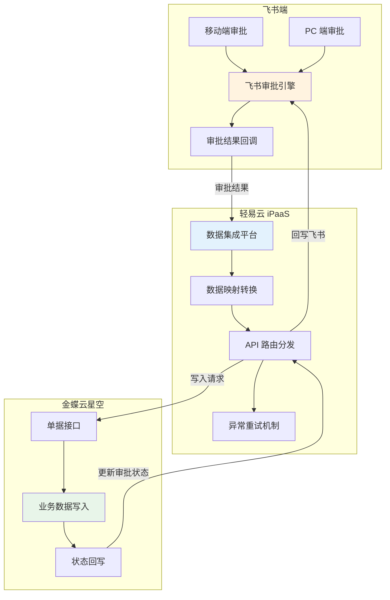
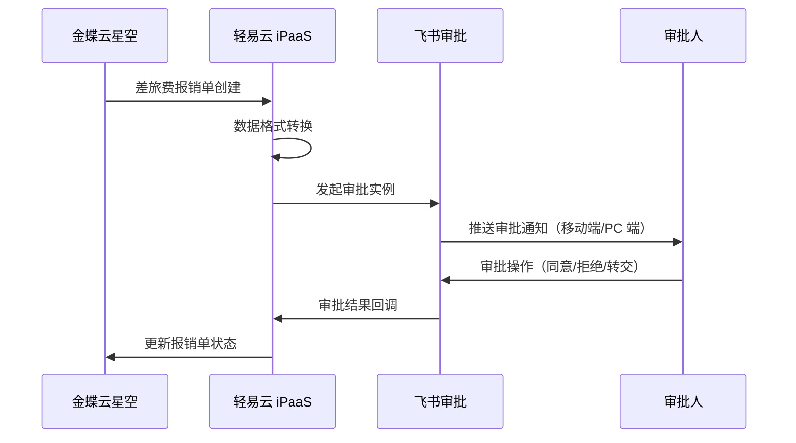

# 金蝶云星空与飞书审批集成解决方案

本方案实现金蝶云星空 ERP 系统与飞书审批平台的无缝对接，充分发挥飞书在移动协同办公方面的优势，解决传统 ERP 审批流程单一、移动端体验不佳等问题。通过将飞书审批能力与金蝶云星空的业务数据管理相结合，实现差旅费报销、费用申请、采购申请、售后申请等业务流程的移动化审批，提升企业运营效率与员工体验。

> [!TIP]
> 本方案适用于已使用金蝶云星空作为核心 ERP 系统，同时采用飞书作为办公协同平台的企业。实施前请确保已开通金蝶云星空与飞书的 API 访问权限。

## 方案架构

## 集成场景概览

| 场景类型 | 业务场景 | 数据流向 | 关键价值 |
|---------|---------|---------|---------|
| 基础资料同步 | 部门、员工信息同步 | 金蝶 ↔ 飞书 | 确保审批表单数据一致性 |
| 费控报销 | 差旅费报销单审批 | 双向同步 | 移动端报销，实时追踪 |
| 费用申请 | 费用申请单审批 | 双向同步 | 事前预算控制 |
| 采购审批 | 采购申请单审批 | 双向同步 | 规范采购流程 |
| 售后审批 | 售后申请单处理 | 双向同步 | 提升客户服务效率 |
| 出库审批 | 出库申请单审批 | 双向同步 | 库存管理规范化 |

## 核心集成方案

### 一、基础资料同步

基础资料同步是审批集成的前提，确保飞书审批表单中的部门选择、人员选择等数据与金蝶云星空保持一致。

#### 1. 部门同步

| 配置项 | 说明 |
|-------|------|
| 源系统查询接口 | 金蝶云星空部门查询 |
| 目标系统写入接口 | 飞书部门写入 |
| 同步频率 | 定时同步（建议每日一次） |
| 关键字段映射 | 部门编码、部门名称、上级部门、部门负责人 |

#### 2. 员工同步

| 配置项 | 说明 |
|-------|------|
| 源系统查询接口 | 金蝶云星空员工查询 |
| 目标系统写入接口 | 飞书员工写入 |
| 同步频率 | 定时同步（建议每日一次） |
| 关键字段映射 | 员工编号、姓名、手机号、所属部门、职位 |

> [!IMPORTANT]
> 基础资料对接是审批流集成成功的前提。建议在正式对接单据审批前，优先完成基础资料的清洗与同步，确保编码、名称等关键字段在两个系统中保持一致。飞书的用户体系以手机号为核心关联键，需确保金蝶员工档案中的手机号与飞书账号一致。

### 二、差旅费报销审批

#### 1. 金蝶差旅费报销单推送飞书审批

当金蝶云星空中创建差旅费报销单后，自动推送至飞书发起审批流程。

| 配置项 | 说明 |
|-------|------|
| 源系统查询接口 | 金蝶云星空差旅费报销单查询 |
| 目标系统写入接口 | 飞书费用报销申请写入 |
| 触发条件 | 金蝶差旅费报销单保存/提交 |
| 审批结果处理 | 通过则更新为「已审核」，拒绝则更新为「已关闭」 |

#### 2. 飞书审批回写金蝶差旅费报销单

飞书审批完成后，审批结果及审批意见回写至金蝶云星空。

| 配置项 | 说明 |
|-------|------|
| 源系统查询接口 | 飞书差旅费报销单查询 |
| 目标系统写入接口 | 金蝶云星空差旅费报销单写入 |
| 回写字段 | 审批状态、审批意见、审批时间、审批人 |

### 三、费用申请审批

#### 1. 金蝶费用申请单推送飞书审批

| 配置项 | 说明 |
|-------|------|
| 源系统查询接口 | 金蝶云星空费用申请单查询 |
| 目标系统写入接口 | 飞书活动经费申请写入 |
| 触发条件 | 费用申请单创建 |
| 业务价值 | 事前预算控制，规范费用支出 |

#### 2. 飞书审批回写金蝶费用申请单

| 配置项 | 说明 |
|-------|------|
| 源系统查询接口 | 飞书活动经费单查询 |
| 目标系统写入接口 | 金蝶云星空费用申请单写入 |
| 回写逻辑 | 审批通过后更新申请单状态，可作为后续报销关联依据 |

### 四、采购申请审批

#### 1. 金蝶采购申请单推送飞书审批

| 配置项 | 说明 |
|-------|------|
| 源系统查询接口 | 金蝶云星空采购申请单查询 |
| 目标系统写入接口 | 飞书采购申请写入 |
| 触发条件 | 采购申请单创建/提交 |
| 业务价值 | 规范采购流程，实现移动审批 |

#### 2. 飞书审批回写金蝶采购申请单

| 配置项 | 说明 |
|-------|------|
| 源系统查询接口 | 飞书采购申请单查询 |
| 目标系统写入接口 | 金蝶云星空采购申请单写入 |
| 回写逻辑 | 审批通过后推送至采购订单执行环节 |

### 五、售后申请审批

#### 1. 金蝶售后申请单推送飞书审批

| 配置项 | 说明 |
|-------|------|
| 源系统查询接口 | 金蝶云星空售后申请单查询 |
| 目标系统写入接口 | 飞书售后申请写入 |
| 触发条件 | 售后申请单创建 |
| 业务价值 | 提升客户售后服务响应效率 |

#### 2. 飞书审批回写金蝶售后申请单

| 配置项 | 说明 |
|-------|------|
| 源系统查询接口 | 飞书售后申请单查询 |
| 目标系统写入接口 | 金蝶云星空售后申请单写入 |
| 回写逻辑 | 审批通过后触发售后处理流程 |

### 六、出库申请审批

| 配置项 | 说明 |
|-------|------|
| 源系统查询接口 | 金蝶云星空出库申请查询 |
| 目标系统写入接口 | 飞书出库申请单写入 |
| 业务场景 | 销售出库、调拨出库等审批控制 |
| 关键字段 | 出库类型、物料信息、数量、目标仓库 |

## 实施配置步骤

### 步骤一：连接器配置

1. **配置金蝶云星空连接器**
   - 登录轻易云 iPaaS 平台
   - 进入**连接器管理** → **新建连接器**
   - 选择「金蝶云星空」类型
   - 填写服务器地址、账套 ID、AppKey、AppSecret
   - 点击**测试连接**，验证配置正确

2. **配置飞书连接器**
   - 进入**连接器管理** → **新建连接器**
   - 选择「飞书」类型
   - 填写 AppID、AppSecret
   - 完成飞书授权验证
   - 确保已开通「审批」相关权限

### 步骤二：基础资料同步方案配置

1. 进入**集成方案管理**，创建基础资料同步方案
2. 选择源系统（金蝶）和目标系统（飞书）
3. 配置字段映射关系
4. 设置同步策略（全量/增量）
5. 启用方案并测试同步

### 步骤三：审批流程方案配置

1. 创建单据审批方案
2. 配置触发条件（如：差旅费报销单创建）
3. 设置数据映射规则
4. 配置审批回调接口
5. 设置异常处理与重试机制

### 步骤四：飞书审批模板配置

1. 登录飞书管理后台
2. 进入**审批** → **审批模板管理**
3. 创建或编辑审批模板
4. 配置表单字段（与金蝶字段对应）
5. 设置审批流程节点
6. 配置回调地址（轻易云提供的 Webhook 地址）

## 数据映射参考

### 差旅费报销单字段映射

| 金蝶云星空字段 | 飞书表单字段 | 说明 |
|--------------|-------------|------|
| FBillNo | 报销单号 | 系统自动生成 |
| FDate | 报销日期 | 格式：YYYY-MM-DD |
| FOrgId | 报销组织 | 关联组织基础资料 |
| FExpenseDeptId | 费用承担部门 | 关联部门基础资料 |
| FProposerID | 报销人 | 关联员工基础资料 |
| FEntity_FExpItemId | 费用项目 | 关联费用项目资料 |
| FEntity_FTaxAmt | 含税金额 | 数值类型 |
| FEntity_FTaxSubmitAmt | 价税合计 | 数值类型 |
| FLocAmt | 申请金额 | 本位币金额 |
| FNote | 备注 | 文本类型 |

### 费用申请单字段映射

| 金蝶云星空字段 | 飞书表单字段 | 说明 |
|--------------|-------------|------|
| FBillNo | 申请单号 | 系统自动生成 |
| FDate | 申请日期 | 格式：YYYY-MM-DD |
| FRequestDeptId | 申请部门 | 关联部门基础资料 |
| FRequesterId | 申请人 | 关联员工基础资料 |
| FLocAmt | 申请金额 | 数值类型 |
| FNote | 申请事由 | 文本类型 |

### 采购申请单字段映射

| 金蝶云星空字段 | 飞书表单字段 | 说明 |
|--------------|-------------|------|
| FBillNo | 申请单号 | 系统自动生成 |
| FDate | 申请日期 | 格式：YYYY-MM-DD |
| FRequestDeptId | 申请部门 | 关联部门基础资料 |
| FRequesterId | 申请人 | 关联员工基础资料 |
| FEntity_FMaterialId | 物料编码 | 关联物料基础资料 |
| FEntity_FQty | 申请数量 | 数值类型 |
| FEntity_FNote | 备注 | 文本类型 |

## 常见问题

### Q1：飞书审批通过后，金蝶单据状态未更新？

**排查步骤：**
1. 检查轻易云平台的方案执行日志，查看回调是否触发
2. 验证飞书审批模板中的回调 URL 配置是否正确
3. 检查金蝶写入接口的权限是否充足
4. 确认字段映射中状态字段的配置正确

### Q2：基础资料同步出现人员不匹配？

**解决方案：**
- 飞书以手机号作为用户唯一标识，确保金蝶员工档案中的手机号与飞书账号一致
- 建立编码对照表，在数据映射中使用值转换器
- 对于未匹配的员工，可在轻易云平台查看同步失败日志并手动处理

### Q3：飞书审批模板如何配置多级审批？

**建议：**
- 在飞书审批模板中配置完整的审批流程节点
- 轻易云仅负责数据传递，不干预审批流程
- 如需根据金额等条件分支，在飞书审批模板中设置条件分支规则
- 支持按角色、部门、指定人员等多种方式设置审批人

### Q4：如何处理审批撤回场景？

**处理逻辑：**
- 飞书审批撤回时，会触发回调通知
- 轻易云捕获撤回事件后，将金蝶对应单据状态更新为「已撤回」或删除
- 需在方案中配置事件监听与处理逻辑

### Q5：金蝶与飞书的审批流程差异如何处理？

**处理建议：**
- 飞书审批流在飞书端独立配置，轻易云不参与流程控制
- 金蝶单据状态跟随飞书审批结果变化
- 复杂审批逻辑（如会签、或签、条件分支）在飞书模板中配置
- 建议在飞书中创建与金蝶业务对应的审批模板

## 最佳实践

### 1. 分阶段实施建议

| 阶段 | 实施内容 | 预期周期 |
|-----|---------|---------|
| 第一阶段 | 基础资料同步（部门、员工） | 1~2 天 |
| 第二阶段 | 简单单据试点（费用申请） | 2~3 天 |
| 第三阶段 | 核心业务单据推广（报销、采购） | 3~5 天 |
| 第四阶段 | 全流程优化与监控 | 持续 |

### 2. 数据一致性保障

- 启用轻易云的**数据一致性校验**功能
- 定期对比飞书与金蝶的数据差异
- 设置异常告警，及时发现同步失败
- 建议在非业务高峰期执行全量同步

### 3. 性能优化建议

- 高频单据（如费用报销）采用异步队列处理
- 批量数据同步设置合理的批次大小（建议 100~500 条）
- 避开业务高峰期执行全量同步
- 启用增量同步策略，减少不必要的数据传输

### 4. 用户体验优化

- 在飞书审批模板中配置清晰的表单布局
- 设置合理的审批提醒方式（应用内、短信、电话）
- 利用飞书的「审批评论」功能，保留审批意见
- 配置审批抄送功能，让相关人员及时了解审批进度

## 方案价值总结

通过金蝶云星空与飞书审批集成，企业可实现：

| 价值维度 | 具体收益 |
|---------|---------|
| **效率提升** | 审批流程从平均 3~5 天缩短至 1 天内完成 |
| **体验优化** | 移动端随时随地审批，飞书消息实时推送 |
| **数据互通** | 审批数据自动沉淀至 ERP，减少人工录入 |
| **流程规范** | 统一审批入口，标准化审批流程 |
| **成本降低** | 减少纸质单据流转，降低管理成本 |
| **协同增强** | 利用飞书即时通讯能力，审批沟通更高效 |

## 获取支持

- **方案咨询**：如需定制化方案设计，请联系轻易云解决方案顾问
- **技术支持**：访问 [FAQ](../faq) 或提交技术支持工单
- **方案模板**：前往[方案市场](https://dh-open.qliang.cloud/market/datahub)获取开箱即用模板
