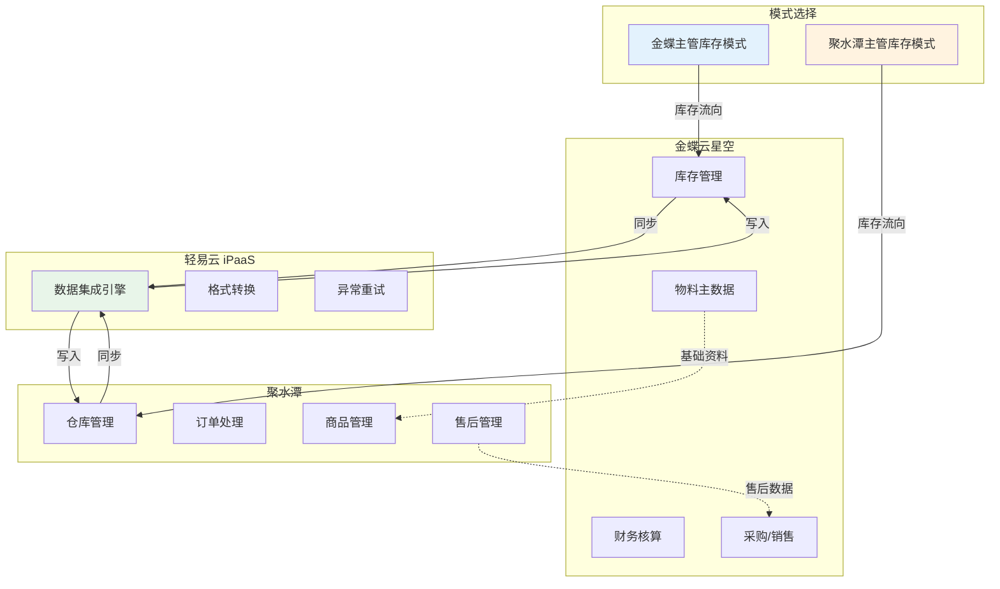
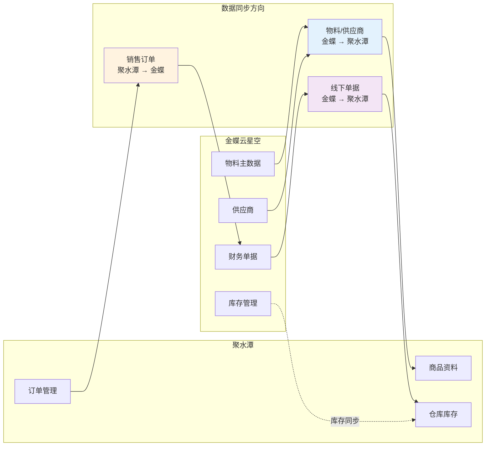
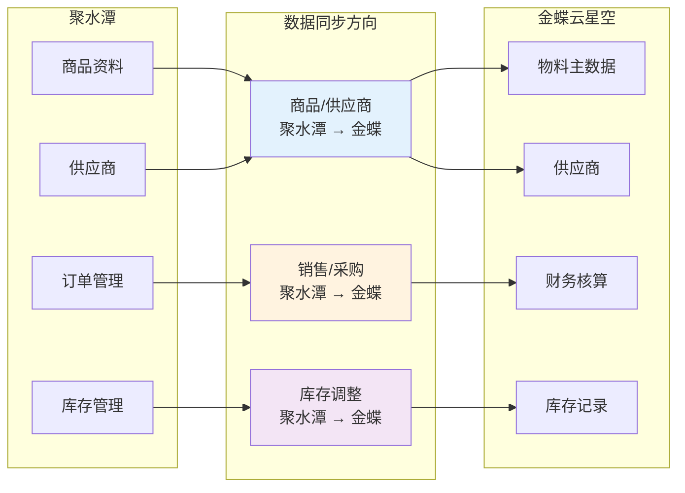
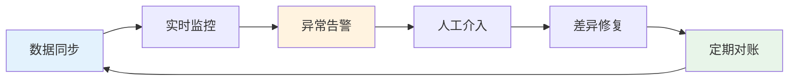

# 金蝶云星空与聚水潭系统集成解决方案

本方案实现金蝶云星空 ERP 系统与聚水潭电商管理系统之间的全面对接，支持物料、供应商、销售、采购、库存等核心业务数据的实时同步。根据企业库存管理策略的不同，提供**金蝶主管库存**和**聚水潭主管库存**两种集成模式，满足不同业务场景需求。

> [!TIP]
> 本方案适用于同时使用金蝶云星空作为核心 ERP 系统和聚水潭作为电商管理系统的企业。实施前请确保已开通双方系统的 API 访问权限，并完成基础资料（物料、客户、供应商）的清洗与标准化。

## 方案概述

### 双模式架构设计



### 模式对比

| 对比维度 | 金蝶主管库存模式 | 聚水潭主管库存模式 |
|---------|-----------------|-------------------|
| **库存主控** | 金蝶云星空 | 聚水潭 |
| **适用企业** | 线上线下一体化，ERP 为主系统 | 纯电商企业，聚水潭为主系统 |
| **物料流向** | 金蝶 → 聚水潭 | 聚水潭 → 金蝶 |
| **库存同步方向** | 金蝶 → 聚水潭 | 聚水潭 → 金蝶 |
| **销售订单流向** | 聚水潭 → 金蝶 | 聚水潭 → 金蝶 |
| **采购订单流向** | 金蝶 → 聚水潭 | 聚水潭 → 金蝶 |

## 集成场景总览

| 场景类型 | 业务场景 | 数据流向 | 关键价值 |
|---------|---------|---------|---------|
| 基础资料同步 | 物料/商品、供应商 | 双向同步 | 确保数据一致性 |
| 销售业务 | 销售出库、销售退货 | 聚水潭 → 金蝶 | 订单自动转化，减少人工录入 |
| 采购业务 | 采购入库、采购退货 | 金蝶/聚水潭 → 对方 | 库存精准管控 |
| 库存管理 | 出入库、盘点、调拨 | 根据主控方向同步 | 实时库存可见 |
| 线下业务 | 线下销售出入库 | 金蝶 → 聚水潭 | 线上线下库存打通 |

## 模式一：金蝶主管库存

> [!IMPORTANT]
> 此模式适用于以金蝶云星空作为核心 ERP 系统，聚水潭作为电商销售前端的企业。金蝶负责库存主数据管理、财务核算及全渠道库存统筹。

### 数据流架构



### 核心集成方案

#### 1. 物料同步至商品

将金蝶云星空的物料主数据同步至聚水潭商品资料。

| 配置项 | 说明 |
|-------|------|
| 源系统查询接口 | `executeBillQuery`（查询物料） |
| 目标系统写入接口 | `jushuitan.itemsku.upload`（普通商品资料上传） |
| 同步频率 | 按需触发 / 定时同步 |
| 标准方案 | [查看模板](https://dh-open.qliang.cloud/market/datahub/solution/ad485a49-0325-3eae-bf6a-899942e843c2) |

**关键字段映射**：

| 序号 | 金蝶字段 | 金蝶字段名 | 聚水潭字段 | 聚水潭字段名 | 说明 |
|-----|---------|-----------|-----------|-------------|------|
| 1 | `FNumber` | 编码 | `sku_id` | 商品编码 | 商品唯一标识 |
| 2 | `FName` | 名称 | `name` | 名称 | 商品名称 |
| 3 | `FName` | 名称 | `i_id` | 款式编码 | 款式编码 |
| 4 | `FBaseUnitId_FName` | 基本单位.名称 | `unit` | 单位 | 计量单位 |
| 5 | `FSpecification` | 规格型号 | `properties_value` | 颜色及规格 | 规格信息 |
| 6 | `FBARCODE` | 条码 | `sku_code` | 国际码 | 条形码 |
| 7 | `F_ABCD_ASSISTANT` | 品牌-自定义 | `brand` | 品牌 | 品牌信息 |
| 8 | 固定值 `1` | — | `enabled` | 是否启用 | 默认启用 |
| 9 | 固定值 `成品` | — | `item_type` | 商品属性 | 成品/半成品/原材料 |

#### 2. 供应商同步

将金蝶云星空的供应商资料同步至聚水潭。

| 配置项 | 说明 |
|-------|------|
| 源系统查询接口 | `executeBillQuery`（查询供应商） |
| 目标系统写入接口 | `supplier.upload`（供应商上传） |
| 标准方案 | [查看模板](https://dh-open.qliang.cloud/market/datahub/solution/cc95adb4-1353-3247-8924-acbab688f46e) |

**关键字段映射**：

| 序号 | 金蝶字段 | 聚水潭字段 | 说明 |
|-----|---------|-----------|------|
| 1 | `FNumber` | `supplier_code` | 供应商编码 |
| 2 | `FName` | `name` | 供应商名称 |
| 3 | 固定值 `true` | `enabled` | 是否生效 |

#### 3. 销售出库同步

将聚水潭销售出库单同步至金蝶云星空销售出库单。

| 配置项 | 说明 |
|-------|------|
| 源系统查询接口 | `orders.out.simple.query`（销售出库查询） |
| 目标系统写入接口 | `batchSave`（创建销售出库单） |
| 标准方案 | [查看模板](https://dh-open.qliang.cloud/market/datahub/solution/4aaf6b48-2291-38db-8ab8-96a22242cef9) |

> [!NOTE]
> 聚水潭标准接口不返回淘系及系统供销平台订单数据。相关平台规则与其他平台的敏感信息会根据平台规则同步调整。

**关键字段映射**：

| 序号 | 聚水潭字段 | 金蝶字段 | 说明 |
|-----|-----------|---------|------|
| 1 | 固定值 `XSCKD01_SYS` | `FBillTypeID` | 单据类型 |
| 2 | `io_id` | `FBillNo` | 单据编号 |
| 3 | `io_date` | `FDate` | 日期 |
| 4 | 固定值 `100` | `FSaleOrgId` | 销售组织 |
| 5 | `shop_id` | `FCustomerID` | 客户 |
| 6 | `items.sku_id` | `FEntity.FMaterialID` | 物料编码 |
| 7 | `items.qty` | `FEntity.FRealQty` | 实发数量 |
| 8 | `items.sale_price` | `FEntity.FTaxPrice` | 含税单价 |

#### 4. 线下销售出库同步

将金蝶云星空线下销售出库单同步至聚水潭其他出入库。

| 配置项 | 说明 |
|-------|------|
| 源系统查询接口 | `executeBillQuery`（查询销售出库单） |
| 目标系统写入接口 | `jushuitan.otherinout.upload`（新建其它出入库） |
| 标准方案 | [查看模板](https://dh-open.qliang.cloud/market/datahub/solution/3abab933-a3d6-358c-9136-f11c617331ce) |

**关键字段映射**：

| 序号 | 金蝶字段 | 聚水潭字段 | 说明 |
|-----|---------|-----------|------|
| 1 | 固定值 `true` | `is_confirm` | 是否自动确认单据 |
| 2 | 固定值 `out` | `type` | 出入库类型 |
| 3 | `FBillNo`+`FStockID_FNumber`+`QTOUT` | `external_id` | 外部单号 |
| 4 | 固定值 `1` | `warehouse` | 仓库（主仓=1） |
| 5 | `goods_list.FMATERIALID_FNumber` | `items.sku_id` | 商品编码 |
| 6 | `goods_list.FRealQty` | `items.qty` | 数量 |

#### 5. 销售退货同步

将聚水潭退货退款数据同步至金蝶云星空销售退货单。

| 配置项 | 说明 |
|-------|------|
| 源系统查询接口 | `refund.single.query`（退货退款查询） |
| 目标系统写入接口 | `batchSave`（创建销售退货单） |
| 标准方案 | [查看模板](https://dh-open.qliang.cloud/market/datahub/solution/490f816f-7047-3e97-8cdc-a4b6c7112910) |

#### 6. 采购入库同步

将金蝶云星空采购入库单同步至聚水潭其他出入库。

| 配置项 | 说明 |
|-------|------|
| 源系统查询接口 | `executeBillQuery`（查询采购入库单） |
| 目标系统写入接口 | `jushuitan.otherinout.upload`（新建其它出入库） |
| 标准方案 | [查看模板](https://dh-open.qliang.cloud/market/datahub/solution/69f7d14f-a05c-3b7a-b78c-94d76de535b1) |

#### 7. 其他出入库单据

| 单据类型 | 金蝶单据 | 聚水潭单据 | 数据流向 | 标准方案 |
|---------|---------|-----------|---------|---------|
| 采购退货 | 采购退料单 | 其它出入库 | 金蝶 → 聚水潭 | [查看](https://dh-open.qliang.cloud/market/datahub/solution/1fad92d1-ac4f-300a-859e-492f20e546fa) |
| 其它出库 | 其他出库单 | 其它出入库 | 金蝶 → 聚水潭 | [查看](https://dh-open.qliang.cloud/market/datahub/solution/55b0d878-eb15-3cd4-9d7d-8f454a71c40c) |
| 其它入库 | 其他入库单 | 其它出入库 | 金蝶 → 聚水潭 | [查看](https://dh-open.qliang.cloud/market/datahub/solution/39cb419a-df4c-3995-9dc8-74db4c74a2cc) |
| 调拨出库 | 直接调拨单 | 其它出入库 | 金蝶 → 聚水潭 | [查看](https://dh-open.qliang.cloud/market/datahub/solution/15163a8f-613b-374e-8241-34fe53663208) |
| 调拨入库 | 直接调拨单 | 其它出入库 | 金蝶 → 聚水潭 | [查看](https://dh-open.qliang.cloud/market/datahub/solution/c466e6fb-1827-35e5-b934-037d1365bb1b) |
| 盘盈单 | 盘盈单 | 其它出入库 | 金蝶 → 聚水潭 | [查看](https://dh-open.qliang.cloud/market/datahub/solution/4c2921a6-8fbd-3c48-b3b8-f49b14fa6520) |
| 盘亏单 | 盘亏单 | 其它出入库 | 金蝶 → 聚水潭 | [查看](https://dh-open.qliang.cloud/market/datahub/solution/c29e9fb6-fd5f-3185-9863-5ab4f842caf1) |

---

## 模式二：聚水潭主管库存

> [!IMPORTANT]
> 此模式适用于以聚水潭作为核心库存管理系统，金蝶云星空作为财务核算系统的企业。聚水潭负责库存主数据管理及电商业务处理，金蝶负责财务核算与报表分析。

### 数据流架构



### 核心集成方案

#### 1. 商品同步至物料

将聚水潭商品资料同步至金蝶云星空物料主数据。

| 配置项 | 说明 |
|-------|------|
| 源系统查询接口 | `sku.query`（普通商品资料查询 按 SKU 查询） |
| 目标系统写入接口 | `batchSave`（创建物料） |
| 同步频率 | 按需触发 / 定时同步 |
| 标准方案 | [查看模板](https://dh-open.qliang.cloud/market/datahub/solution/8e45642a-5c62-3199-91eb-9ad99e7aed0a) |

**关键字段映射**：

| 序号 | 聚水潭字段 | 聚水潭字段名 | 金蝶字段 | 金蝶字段名 | 说明 |
|-----|-----------|-------------|---------|-----------|------|
| 1 | `datas.name` | 名称 | `FName` | 名称 | 物料名称 |
| 2 | `sku_id` | 商品编码 | `FNumber` | 编码 | 物料编码 |
| 3 | `datas.properties_value` | 规格 | `FSpecification` | 规格型号 | 规格信息 |
| 4 | 固定值 `100` | — | `FCreateOrgId` | 创建组织 | 组织代码 |
| 5 | 固定值 `100` | — | `FUseOrgId` | 使用组织 | 组织代码 |
| 6 | 固定值 `1` | — | `SubHeadEntity.FErpClsID` | 物料属性 | 1=外购 |
| 7 | 固定值 `pcs` | — | `SubHeadEntity.FBaseUnitId` | 基本单位 | 基本计量单位 |
| 8 | 固定值 `CHLB01_SYS` | — | `SubHeadEntity.FCategoryID` | 存货类别 | 存货类别编码 |

#### 2. 供应商同步

将聚水潭供应商资料同步至金蝶云星空。

| 配置项 | 说明 |
|-------|------|
| 源系统查询接口 | `supplier.query`（供应商查询） |
| 目标系统写入接口 | `batchSave`（创建供应商） |
| 标准方案 | [查看模板](https://dh-open.qliang.cloud/market/datahub/solution/a3c58fcf-af17-362c-a2c0-cb8e2ec19959) |

**关键字段映射**：

| 序号 | 聚水潭字段 | 金蝶字段 | 说明 |
|-----|-----------|---------|------|
| 1 | `supplier_id` | `FNumber` | 供应商编码 |
| 2 | `name` | `FName` | 供应商名称 |
| 3 | 固定值 `100` | `FUseOrgId` | 使用组织 |
| 4 | 固定值 `100` | `FCreateOrgId` | 创建组织 |

#### 3. 销售出库同步

将聚水潭销售出库单同步至金蝶云星空销售出库单。

| 配置项 | 说明 |
|-------|------|
| 源系统查询接口 | `orders.out.simple.query`（销售出库查询） |
| 目标系统写入接口 | `batchSave`（创建销售出库单） |
| 标准方案 | [查看模板](https://dh-open.qliang.cloud/market/datahub/solution/4aaf6b48-2291-38db-8ab8-96a22242cef9) |

**关键字段映射**：

| 序号 | 聚水潭字段 | 金蝶字段 | 说明 |
|-----|-----------|---------|------|
| 1 | 固定值 `XSCKD01_SYS` | `FBillTypeID` | 单据类型 |
| 2 | `io_id` | `FBillNo` | 单据编号 |
| 3 | `io_date` | `FDate` | 日期 |
| 4 | 固定值 `100` | `FSaleOrgId` | 销售组织 |
| 5 | `shop_id` | `FCustomerID` | 客户 |
| 6 | `items.sku_id` | `FEntity.FMaterialID` | 物料编码 |
| 7 | `items.qty` | `FEntity.FRealQty` | 实发数量 |
| 8 | `items.sale_price` | `FEntity.FTaxPrice` | 含税单价 |
| 9 | `items.sale_amount` | `FEntity.FAllAmount` | 价税合计 |

#### 4. 销售退货同步

将聚水潭退货退款数据同步至金蝶云星空销售退货单。

| 配置项 | 说明 |
|-------|------|
| 源系统查询接口 | `refund.single.query`（退货退款查询） |
| 目标系统写入接口 | `batchSave`（创建销售退货单） |
| 标准方案 | [查看模板](https://dh-open.qliang.cloud/market/datahub/solution/490f816f-7047-3e97-8cdc-a4b6c7112910) |

**关键字段映射**：

| 序号 | 聚水潭字段 | 金蝶字段 | 说明 |
|-----|-----------|---------|------|
| 1 | 固定值 `XSTHD01_SYS` | `FBillTypeID` | 单据类型 |
| 2 | `items_asi_id` | `FBillNo` | 单据编号 |
| 3 | `shop_id` | `FRetcustId` | 退货客户 |
| 4 | `items_sku_id` | `FEntity.FMaterialId` | 物料编码 |
| 5 | `items_r_qty` | `FEntity.FRealQty` | 实退数量 |
| 6 | `items_price` | `FEntity.FPrice` | 单价 |
| 7 | 固定值 `13` | `FEntity.FEntryTaxRate` | 税率% |
| 8 | 固定值 `THLX01_SYS` | `FEntity.FReturnType` | 退货类型 |

#### 5. 采购入库同步

将聚水潭采购入库单同步至金蝶云星空采购入库单。

| 配置项 | 说明 |
|-------|------|
| 源系统查询接口 | `purchasein.query`（采购入库查询） |
| 目标系统写入接口 | `batchSave`（创建采购入库单） |
| 标准方案 | [查看模板](https://dh-open.qliang.cloud/market/datahub/solution/17330b63-6862-30c9-a9e3-95863fed0ced) |

**关键字段映射**：

| 序号 | 聚水潭字段 | 金蝶字段 | 说明 |
|-----|-----------|---------|------|
| 1 | 固定值 `RKD01_SYS` | `FBillTypeID` | 单据类型 |
| 2 | 固定值 `CG` | `FBusinessType` | 业务类型 |
| 3 | `io_id` | `FBillNo` | 单据编号 |
| 4 | `supplier_id` | `FSupplierId` | 供应商 |
| 5 | `io_date` | `FDate` | 入库日期 |
| 6 | `items.sku_id` | `FInStockEntry.FMaterialId` | 物料编码 |
| 7 | `items.qty` | `FInStockEntry.FRealQty` | 实收数量 |
| 8 | `items.cost_price` | `FInStockEntry.FTaxPrice` | 含税单价 |

#### 6. 采购退货同步

将聚水潭采购退货单同步至金蝶云星空采购退料单。

| 配置项 | 说明 |
|-------|------|
| 源系统查询接口 | `purchaseout.query`（采购退货查询） |
| 目标系统写入接口 | `batchSave`（创建采购退料单） |
| 标准方案 | [查看模板](https://dh-open.qliang.cloud/market/datahub/solution/a10fd81a-b74f-35d3-8bb3-c8c0bacace7d) |

#### 7. 其他出入库单据

| 单据类型 | 聚水潭单据 | 金蝶单据 | 标准方案 |
|---------|-----------|---------|---------|
| 其它出库 | 其它出入库 | 其他出库单 | [查看](https://dh-open.qliang.cloud/market/datahub/solution/f4ef376a-0070-3104-92ce-e858f1f60e0b) |
| 其它入库 | 其它出入库 | 其他入库单 | [查看](https://dh-open.qliang.cloud/market/datahub/solution/118c7e4f-4500-3ef7-867f-25bb7db61ef9) |
| 调拨单 | 调拨单 | 直接调拨单 | [查看](https://dh-open.qliang.cloud/market/datahub/solution/43d43811-d77e-39bf-9597-6180acd3d4f4) |
| 盘盈 | 库存盘点 | 其他入库单 | [查看](https://dh-open.qliang.cloud/market/datahub/solution/3ba533fa-37d5-312f-8c07-5eef9c49d901) |
| 盘亏 | 库存盘点 | 其他出库单 | [查看](https://dh-open.qliang.cloud/market/datahub/solution/8a1d4630-ce59-3c7f-8038-f9d84adbf3e1) |

## 实施配置步骤

### 步骤一：连接器配置

1. **配置金蝶云星空连接器**
   - 登录轻易云 iPaaS 平台
   - 进入**连接器管理** → **新建连接器**
   - 选择「金蝶云星空」类型
   - 填写服务器地址、账套 ID、AppKey、AppSecret
   - 点击**测试连接**，验证配置正确

2. **配置聚水潭连接器**
   - 进入**连接器管理** → **新建连接器**
   - 选择「聚水潭」类型
   - 填写企业账号、API 密钥等信息
   - 完成授权验证

### 步骤二：基础资料同步方案配置

1. 进入**集成方案管理**，创建基础资料同步方案
2. 根据所选模式选择源系统和目标系统：
   - **金蝶主管库存**：源=金蝶，目标=聚水潭
   - **聚水潭主管库存**：源=聚水潭，目标=金蝶
3. 配置字段映射关系（参考上文字段映射表）
4. 设置同步策略（全量/增量）
5. 启用方案并测试同步

### 步骤三：业务单据同步方案配置

1. 创建业务单据同步方案
2. 配置触发条件（定时/实时）
3. 设置数据映射规则
4. 配置异常处理与重试机制
5. 启用方案并监控运行状态

## 模式选择决策指南

```mermaid
flowchart TD
    START[选择集成模式] --> Q1{企业业务形态?}
    
    Q1 -->|线上线下一体化| Q2{核心管理系统?}
    Q1 -->|纯电商企业| JST[聚水潭主管库存模式]
    
    Q2 -->|金蝶 ERP 为主| KD[金蝶主管库存模式]
    Q2 -->|聚水潭为主| JST
    
    KD --> KD_ADV[优势]<br/>- 财务业务一体化<br/>- 库存统一管控<br/>- 适合大中型企业]
    JST --> JST_ADV[优势]<br/>- 快速部署上线<br/>- 电商功能完善<br/>- 适合中小型电商]
    
    style KD fill:#e3f2fd
    style JST fill:#fff3e0
    style KD_ADV fill:#e8f5e9
    style JST_ADV fill:#e8f5e9
```

| 评估维度 | 金蝶主管库存 | 聚水潭主管库存 |
|---------|-------------|---------------|
| **实施周期** | 2~4 周 | 1~2 周 |
| **系统复杂度** | 较高 | 较低 |
| **财务核算** | 金蝶完整支持 | 需金蝶配合 |
| **库存实时性** | 高（ERP 主导） | 中（需同步至 ERP） |
| **适用规模** | 中大型企业 | 中小型电商 |
| **定制灵活性** | 高 | 中 |

## 常见问题

### Q1：如何选择两种集成模式？

**选择建议：**
- **选择金蝶主管库存**：如果你的企业有线下门店或传统销售渠道，金蝶 ERP 已经运行多年，且需要统一的财务核算体系
- **选择聚水潭主管库存**：如果你的企业是纯电商业务，聚水潭是主要的业务操作系统，金蝶仅用于财务记账

### Q2：两个系统的基础资料编码不一致怎么办？

**解决方案：**
1. 在轻易云平台配置**编码映射表**，建立对照关系
2. 使用**值转换器**在同步时自动转换编码
3. 建议项目初期统一编码规则，减少后期维护成本

### Q3：库存同步出现差异如何处理？

**排查步骤：**
1. 检查轻易云平台的同步日志，确认数据是否成功推送
2. 对比源系统和目标系统的库存变动时间戳
3. 确认是否存在未同步的出入库单据
4. 启用**数据一致性校验**功能，定期对账

### Q4：销售订单量大时如何处理？

**性能优化建议：**
- 启用**异步队列**处理，避免高峰期系统压力
- 调整**批量处理大小**（建议 100~500 条/批次）
- 大促期间提前扩充进程数量
- 启用**失败重试机制**，确保数据不丢失

### Q5：线下销售单据如何与聚水潭打通？

**在金蝶主管库存模式下：**
- 金蝶的线下销售出库单同步至聚水潭其他出入库
- 实现线上线下库存统一视图
- 聚水潭可查看全渠道库存情况

## 最佳实践

### 1. 分阶段实施建议

| 阶段 | 实施内容 | 预期周期 | 关键产出 |
|-----|---------|---------|---------|
| 第一阶段 | 基础资料对接（物料、供应商） | 3~5 天 | 数据一致性验证 |
| 第二阶段 | 销售业务对接（出库、退货） | 5~7 天 | 订单自动流转 |
| 第三阶段 | 采购业务对接（入库、退货） | 3~5 天 | 供应链协同 |
| 第四阶段 | 库存同步与调拨 | 3~5 天 | 全渠道库存可视 |
| 第五阶段 | 异常处理与优化 | 持续 | 稳定运行 |

### 2. 数据一致性保障



- 启用轻易云的**数据一致性校验**功能
- 设置每日自动对账任务
- 配置异常告警，及时发现同步失败
- 建立差异处理流程，明确责任人

### 3. 上线前检查清单

- [ ] 基础资料编码已统一或建立映射关系
- [ ] 测试环境完成端到端流程验证
- [ ] 历史数据已完成初始化同步
- [ ] 异常处理流程已确定
- [ ] 相关人员已完成培训
- [ ] 监控告警已配置

## 方案价值总结

通过金蝶云星空与聚水潭系统集成，企业可实现：

| 价值维度 | 具体收益 |
|---------|---------|
| **效率提升** | 订单自动同步，减少 80% 以上人工录入工作 |
| **库存精准** | 全渠道库存实时可视，降低超卖/缺货风险 |
| **财务合规** | 业务数据自动沉淀至 ERP，财务核算更及时准确 |
| **决策支持** | 统一数据视图，支持多维度业务分析 |
| **成本降低** | 减少重复建设，降低系统对接开发成本 |

## 获取支持

- **方案咨询**：如需定制化方案设计，请联系轻易云解决方案顾问
- **技术支持**：访问 [FAQ](../faq) 或提交技术支持工单
- **方案模板**：前往[方案市场](https://dh-open.qliang.cloud/market/datahub)获取开箱即用模板
- **标准方案**：查看[标准方案库](../standard-schemes/domestic-ecommerce)了解更多电商集成方案
