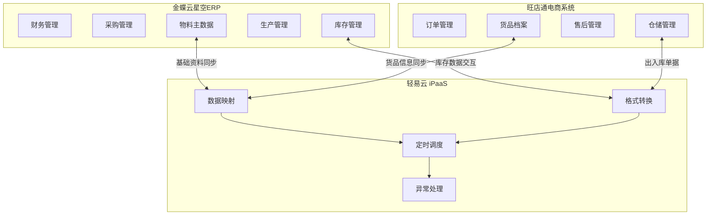

# 金蝶云星空与旺店通集成解决方案

本文档介绍金蝶云星空 ERP 与旺店通电商管理系统之间的双主库集成方案。根据企业库存管理策略的不同，提供两种集成模式：**金蝶主管库存**（ERP 作为库存主系统）和**旺店通主管库存**（电商系统作为库存主系统），帮助企业实现线上线下业务数据的实时同步与统一管理。

## 方案概述

金蝶云星空与旺店通分别服务于企业内部管理与电商运营两大业务领域。金蝶云星空作为企业级 ERP，管理财务、采购、生产、库存等核心业务；旺店通专注于电商订单处理、仓储发货、售后管理等场景。两者的数据集成面临系统异构、数据格式差异、业务流程交叉等挑战。

通过轻易云 iPaaS 集成平台，企业无需编写代码即可建立自动化的数据流转通道，实现基础资料同步、订单双向流转、库存实时校准等关键业务场景，消除信息孤岛，提升运营效率。

## 双主库模式对比

根据企业库存管理策略的不同，提供两种集成模式：

| 对比维度 | 金蝶主管库存 | 旺店通主管库存 |
|---------|------------|--------------|
| **库存主系统** | 金蝶云星空 | 旺店通企业版 |
| **适用场景** | 以生产制造、批发分销为主的企业 | 以电商零售为主的企业 |
| **物料/货品来源** | 金蝶物料同步至旺店通 | 旺店通货品同步至金蝶 |
| **库存校准方向** | 金蝶库存 → 旺店通盘点 | 旺店通库存 → 金蝶盘点 |
| **线下业务处理** | 金蝶线下单据同步至旺店通 | 旺店通单据同步至金蝶 |

> [!IMPORTANT]
> 企业应根据自身业务特点选择合适的集成模式。两种模式不可混用，需在项目启动前明确主库存系统。

## 金蝶主管库存模式

此模式适用于以 ERP 为核心业务系统的企业，金蝶云星空作为库存主系统，旺店通作为电商业务执行端。

### 基础资料同步

#### 物料同步货品

将金蝶云星空的物料主数据同步至旺店通，建立货品档案基础数据。

**接口信息**

| 项目 | 内容 |
|-----|------|
| 源系统查询接口 | `executeBillQuery`（查询物料） |
| 目标系统写入接口 | `goods_push.php`（创建货品档案） |

**核心字段映射**

| 序号 | 源系统字段 | 源字段名 | 目标系统字段 | 目标字段名 | 说明 |
|-----|-----------|---------|-------------|-----------|------|
| 1 | — | 固定值 | `goods_list` | 货品节点 | 货品表主键 |
| 2 | `FNumber` | 编码 | `goods_list.goods_no` | 货品编号 | SPU 唯一编号 |
| 3 | `1` | 固定值 | `goods_list.goods_type` | 货品类别 | 1=销售商品 |
| 4 | `FName` | 名称 | `goods_list.goods_name` | 货品名称 | 货品全称 |
| 5 | `FName` | 名称 | `goods_list.short_name` | 货品简称 | 简称显示 |
| 6 | `FMaterialGroup_FName` | 物料分组 | `goods_list.class_name` | 分类 | 类别名称 |
| 7 | `FBaseUnitId_FName` | 基本单位 | `goods_list.unit_name` | 基本单位 | 计量单位 |
| 8 | `FDescription` | 描述 | `goods_list.remark` | 备注 | 备注信息 |
| 9 | — | 固定值 | `goods_list.spec_list` | 单品节点 | SKU 属性节点 |

#### 供应商同步

将金蝶供应商档案同步至旺店通，用于采购业务处理。

**接口信息**

| 项目 | 内容 |
|-----|------|
| 源系统查询接口 | `executeBillQuery`（查询供应商） |
| 目标系统写入接口 | `purchase_provider_create.php`（创建供应商） |

**核心字段映射**

| 序号 | 源系统字段 | 源字段名 | 目标系统字段 | 目标字段名 | 说明 |
|-----|-----------|---------|-------------|-----------|------|
| 1 | `FNumber` | 编码 | `provider_no` | 供应商编号 | 唯一编码 |
| 2 | `FName` | 名称 | `provider_name` | 供应商名称 | 显示名称 |
| 3 | `1` | 固定值 | `min_purchase_num` | 最小采购量 | 默认 1 |
| 4 | `1` | 固定值 | `purchase_cycle_days` | 采购周期 | 默认 1 天 |
| 5 | `1` | 固定值 | `arrive_cycle_days` | 到货周期 | 默认 1 天 |

### 销售业务单据

#### 线上销售出库

旺店通电商订单发货后，同步至金蝶生成销售出库单。

**接口信息**

| 项目 | 内容 |
|-----|------|
| 源系统查询接口 | `stockout_order_query_trade.php`（查询销售出库单） |
| 目标系统写入接口 | `batchSave`（创建销售出库单） |

> [!NOTE]
> 旺店通标准接口不返回淘系及系统供销平台订单数据。相关平台规则会同步调整。

**核心字段映射**

| 序号 | 源系统字段 | 源字段名 | 目标系统字段 | 目标字段名 | 说明 |
|-----|-----------|---------|-------------|-----------|------|
| 1 | `XSCKD01_SYS` | 固定值 | `FBillTypeID` | 单据类型 | 销售出库单 |
| 2 | `order_no` | 出库单号 | `FBillNo` | 单据编号 | 外部单号 |
| 3 | `consign_time` | 发货时间 | `FDate` | 日期 | 业务日期 |
| 4 | `100` | 固定值 | `FStockOrgId` | 发货组织 | 默认组织 |
| 5 | `100` | 固定值 | `FSaleOrgId` | 销售组织 | 默认组织 |
| 6 | `shop_no` | 店铺编号 | `FCustomerID` | 客户 | 对应客户 |
| 7 | `logistics_no` | 物流单号 | `FCarriageNO` | 运输单号 | 快递单号 |
| 8 | `receiver_mobile` | 收件人电话 | `FLinkPhone` | 联系电话 | 联系方式 |
| 9 | `receiver_name` | 收件人 | `FLinkMan` | 收货人姓名 | 收货人 |
| 10 | `details_list` | 货品列表 | `FEntity` | 明细信息 | 商品明细 |
| 11 | `details_list.spec_code` | 规格码 | `FEntity.FMaterialID` | 物料编码 | SKU 编码 |
| 12 | `details_list.goods_count` | 数量 | `FEntity.FRealQty` | 实发数量 | 出库数量 |
| 13 | `details_list.price` | 价格 | `FEntity.FTaxPrice` | 含税单价 | 销售单价 |
| 14 | `13` | 固定值 | `FEntity.FEntryTaxRate` | 税率 | 13% |
| 15 | `warehouse_no` | 仓库编号 | `FEntity.FStockID` | 仓库 | 发货仓库 |

#### 线上销售退货

旺店通售后退货入库后，同步至金蝶生成销售退货单。

**接口信息**

| 项目 | 内容 |
|-----|------|
| 源系统查询接口 | `stockin_order_query_refund.php`（查询退货入库单） |
| 目标系统写入接口 | `batchSave`（创建销售退货单） |

**核心字段映射**

| 序号 | 源系统字段 | 源字段名 | 目标系统字段 | 目标字段名 | 说明 |
|-----|-----------|---------|-------------|-----------|------|
| 1 | `XSTHD01_SYS` | 固定值 | `FBillTypeID` | 单据类型 | 销售退货单 |
| 2 | `order_no` | 入库单号 | `FBillNo` | 单据编号 | 退货单号 |
| 3 | `100` | 固定值 | `FSaleOrgId` | 销售组织 | 默认组织 |
| 4 | `stockin_time` | 入库时间 | `FDate` | 日期 | 退货日期 |
| 5 | `100` | 固定值 | `FStockOrgId` | 库存组织 | 默认组织 |
| 6 | `shop_no` | 店铺编号 | `FRetcustId` | 退货客户 | 对应客户 |
| 7 | `refund_remark` | 退换备注 | `FHeadNote` | 备注 | 退货原因 |
| 8 | `details_list.spec_code` | 规格码 | `FEntity.FMaterialId` | 物料编码 | SKU 编码 |
| 9 | `details_list.goods_count` | 数量 | `FEntity.FRealQty` | 实退数量 | 退货数量 |
| 10 | `details_list.src_price` | 原价 | `FEntity.FTaxPrice` | 含税单价 | 退货单价 |

### 线下业务单据

#### 线下销售出库

金蝶线下渠道销售出库单同步至旺店通，生成其他出库单。

**接口信息**

| 项目 | 内容 |
|-----|------|
| 源系统查询接口 | `executeBillQuery`（查询销售出库单） |
| 目标系统写入接口 | `stockout_order_push.php`（创建其他出库单） |

**核心字段映射**

| 序号 | 源系统字段 | 源字段名 | 目标系统字段 | 目标字段名 | 说明 |
|-----|-----------|---------|-------------|-----------|------|
| 1 | `FBillNo-FStockID_FNumber` | 组合值 | `outer_no` | 外部单号 | 唯一标识 |
| 2 | `1` | 固定值 | `is_check` | 是否审核 | 自动审核 |
| 3 | `FStockID_FNumber` | 仓库 | `warehouse_no` | 仓库编号 | 出库仓库 |
| 4 | `金蝶内部销售出库` | 固定值 | `remark` | 备注 | 来源标识 |
| 5 | `goods_list` | 明细 | `detail_list` | 货品列表 | 商品明细 |
| 6 | `goods_list.FMaterialID_FNumber` | 物料编码 | `detail_list.spec_no` | 商家编码 | SKU 编码 |
| 7 | `goods_list.FRealQty` | 数量 | `detail_list.num` | 出库数量 | 出库数 |
| 8 | `0` | 固定值 | `detail_list.price` | 价格 | 成本价 |

#### 线下销售退货

金蝶线下销售退货单同步至旺店通，生成其他入库单。

**接口信息**

| 项目 | 内容 |
|-----|------|
| 源系统查询接口 | `executeBillQuery`（查询销售退货单） |
| 目标系统写入接口 | `stockin_order_push.php`（创建其他入库单） |

**核心字段映射**

| 序号 | 源系统字段 | 源字段名 | 目标系统字段 | 目标字段名 | 说明 |
|-----|-----------|---------|-------------|-----------|------|
| 1 | `FBillNoFStockId_FNumber` | 组合值 | `outer_no` | 外部单号 | 唯一标识 |
| 2 | `FStockId_FNumber` | 仓库 | `warehouse_no` | 仓库编号 | 入库仓库 |
| 3 | `1` | 固定值 | `is_check` | 是否审核 | 自动审核 |
| 4 | `金蝶线下销售退货` | 固定值 | `reason` | 入库原因 | 来源标识 |
| 5 | `goods_list` | 明细 | `goods_list` | 货品明细 | 商品明细 |
| 6 | `goods_list.FMaterialId_FNumber` | 物料编码 | `goods_list.spec_no` | 商家编码 | SKU 编码 |
| 7 | `goods_list.FRealQty` | 数量 | `goods_list.stockin_num` | 入库数量 | 入库数 |
| 8 | `0` | 固定值 | `goods_list.stockin_price` | 入库价 | 成本价 |

### 采购与库存单据

#### 采购入库

金蝶采购入库单同步至旺店通，生成其他入库单。

**接口信息**

| 项目 | 内容 |
|-----|------|
| 源系统查询接口 | `executeBillQuery`（查询采购入库单） |
| 目标系统写入接口 | `stockin_order_push.php`（创建其他入库单） |

#### 采购退货

金蝶采购退料单同步至旺店通，生成其他出库单。

**接口信息**

| 项目 | 内容 |
|-----|------|
| 源系统查询接口 | `executeBillQuery`（查询采购退料单） |
| 目标系统写入接口 | `stockout_order_push.php`（创建其他出库单） |

#### 其他出入库

金蝶其他出入库单据双向同步至旺店通。

| 单据类型 | 金蝶 → 旺店通 |
|---------|-------------|
| 其他出库单 | `executeBillQuery` → `stockout_order_push.php` |
| 其他入库单 | `executeBillQuery` → `stockin_order_push.php` |

#### 直接调拨单

金蝶直接调拨单同步至旺店通，生成调拨单。

**接口信息**

| 项目 | 内容 |
|-----|------|
| 源系统查询接口 | `executeBillQuery`（查询直接调拨单） |
| 目标系统写入接口 | `stock_transfer_push.php`（创建调拨单） |

**核心字段映射**

| 序号 | 源系统字段 | 源字段名 | 目标系统字段 | 目标字段名 | 说明 |
|-----|-----------|---------|-------------|-----------|------|
| 1 | `FBillNo` | 单据编号 | `outer_no` | 外部单号 | 调拨单号 |
| 2 | `FDestStockId_FNumber` | 调入仓库 | `from_warehouse_no` | 源仓库 | 注意方向对应 |
| 3 | `FSrcStockId_FNumber` | 调出仓库 | `to_warehouse_no` | 目标仓库 | 注意方向对应 |
| 4 | `1` | 固定值 | `transfer_type` | 调拨类型 | 同仓调拨 |
| 5 | `1` | 固定值 | `autocheck` | 是否审核 | 自动审核 |
| 6 | `skus` | SKU 列表 | `skus` | 货品列表 | 商品明细 |
| 7 | `skus.FMaterialId_FNumber` | 物料编码 | `skus.spec_no` | 商家编码 | SKU 编码 |
| 8 | `skus.FQty` | 数量 | `skus.num` | 调拨数量 | 调拨数 |

### 库存盘点

#### 盘盈单

金蝶盘盈单同步至旺店通，生成其他入库单。

**接口信息**

| 项目 | 内容 |
|-----|------|
| 源系统查询接口 | `executeBillQuery`（查询盘盈单） |
| 目标系统写入接口 | `stockin_order_push.php`（创建其他入库单） |

#### 盘亏单

金蝶盘亏单同步至旺店通，生成其他出库单。

**接口信息**

| 项目 | 内容 |
|-----|------|
| 源系统查询接口 | `executeBillQuery`（查询盘亏单） |
| 目标系统写入接口 | `stockout_order_push.php`（创建其他出库单） |

#### 库存校准

金蝶即时库存数据同步至旺店通，生成盘点单进行库存校准。

**接口信息**

| 项目 | 内容 |
|-----|------|
| 源系统查询接口 | `executeBillQuery`（查询即时库存） |
| 目标系统写入接口 | `stock_sync_by_pd.php`（创建盘点单） |

**核心字段映射**

| 序号 | 源系统字段 | 源字段名 | 目标系统字段 | 目标字段名 | 说明 |
|-----|-----------|---------|-------------|-----------|------|
| 1 | `FStockId_FNumber` | 仓库编码 | `warehouse_no` | 仓库编号 | 盘点仓库 |
| 2 | `1` | 固定值 | `mode` | 盘点方式 | 1=货位盘点 |
| 3 | — | 固定值 | `api_outer_no` | API 单号 | 外部单号 |
| 4 | `1` | 固定值 | `is_check` | 是否审核 | 自动审核 |
| 5 | `1` | 固定值 | `is_create_stock` | 是否添加库存 | 创建库存记录 |
| 6 | `detail_list` | 明细 | `goods_list` | 货品明细 | 库存明细 |
| 7 | `detail_list.FMaterialId_FNumber` | 物料编码 | `goods_list.spec_no` | 商家编码 | SKU 编码 |
| 8 | `detail_list.FBaseQty` | 库存数 | `goods_list.stock_num` | 库存数量 | 盘点数量 |

## 旺店通主管库存模式

此模式适用于以电商业务为主的企业，旺店通作为库存主系统，金蝶云星空作为财务核算端。

### 基础资料同步

#### 货品同步物料

将旺店通货品档案同步至金蝶，建立物料主数据。

**接口信息**

| 项目 | 内容 |
|-----|------|
| 源系统查询接口 | `goods_query.php`（查询货品档案） |
| 目标系统写入接口 | `batchSave`（创建物料） |

**核心字段映射**

| 序号 | 源系统字段 | 源字段名 | 目标系统字段 | 目标字段名 | 说明 |
|-----|-----------|---------|-------------|-----------|------|
| 1 | `goods_name` | 货品名称 | `FName` | 名称 | 物料名称 |
| 2 | `goods_no` | 货品编号 | `FNumber` | 编码 | 物料编码 |
| 3 | `short_name` | 简称 | `FDescription` | 描述 | 描述信息 |
| 4 | `100` | 固定值 | `FCreateOrgId` | 创建组织 | 默认组织 |
| 5 | `100` | 固定值 | `FUseOrgId` | 使用组织 | 默认组织 |
| 6 | `spec_list.spec_name` | 规格名 | `FSpecification` | 规格型号 | SKU 规格 |
| 7 | `SubHeadEntity` | — | `SubHeadEntity` | 基本 | 基本资料 |
| 8 | `1` | 固定值 | `SubHeadEntity.FErpClsID` | 物料属性 | 1=外购 |
| 9 | `Pcs` | 固定值 | `SubHeadEntity.FBaseUnitId` | 基本单位 | 默认单位 |

#### 供应商同步

将旺店通供应商档案同步至金蝶。

**接口信息**

| 项目 | 内容 |
|-----|------|
| 源系统查询接口 | `purchase_provider_query.php`（查询供应商） |
| 目标系统写入接口 | `batchSave`（创建供应商） |

**核心字段映射**

| 序号 | 源系统字段 | 源字段名 | 目标系统字段 | 目标字段名 | 说明 |
|-----|-----------|---------|-------------|-----------|------|
| 1 | `provider_no` | 供应商编号 | `FNumber` | 编码 | 供应商编码 |
| 2 | `provider_name` | 供应商名称 | `FName` | 名称 | 供应商名称 |
| 3 | `100` | 固定值 | `FUseOrgId` | 使用组织 | 默认组织 |
| 4 | `100` | 固定值 | `FCreateOrgId` | 创建组织 | 默认组织 |

### 销售业务单据

#### 销售出库

旺店通销售出库单同步至金蝶，生成销售出库单。

**接口信息**

| 项目 | 内容 |
|-----|------|
| 源系统查询接口 | `stockout_order_query_trade.php`（查询销售出库单） |
| 目标系统写入接口 | `batchSave`（创建销售出库单） |

> [!NOTE]
> 字段映射与金蝶主管库存模式的线上销售出库相同，详见上文。

#### 销售退货

旺店通退货入库单同步至金蝶，生成销售退货单。

**接口信息**

| 项目 | 内容 |
|-----|------|
| 源系统查询接口 | `stockin_order_query_refund.php`（查询退货入库单） |
| 目标系统写入接口 | `batchSave`（创建销售退货单） |

> [!NOTE]
> 字段映射与金蝶主管库存模式的线上销售退货相同，详见上文。

### 采购业务单据

#### 采购入库

旺店通采购入库单同步至金蝶，生成采购入库单。

**接口信息**

| 项目 | 内容 |
|-----|------|
| 源系统查询接口 | `stockin_order_query_purchase.php`（查询采购入库单） |
| 目标系统写入接口 | `batchSave`（创建采购入库单） |

**核心字段映射**

| 序号 | 源系统字段 | 源字段名 | 目标系统字段 | 目标字段名 | 说明 |
|-----|-----------|---------|-------------|-----------|------|
| 1 | `RKD01_SYS` | 固定值 | `FBillTypeID` | 单据类型 | 标准采购入库 |
| 2 | `CG` | 固定值 | `FBusinessType` | 业务类型 | 采购业务 |
| 3 | `order_no` | 入库单号 | `FBillNo` | 单据编号 | 外部单号 |
| 4 | `check_time` | 审核时间 | `FDate` | 入库日期 | 业务日期 |
| 5 | `101` | 固定值 | `FStockOrgId` | 收料组织 | 默认组织 |
| 6 | `101` | 固定值 | `FPurchaseOrgId` | 采购组织 | 默认组织 |
| 7 | `provider_no` | 供应商编号 | `FSupplierId` | 供应商 | 对应供应商 |
| 8 | `wms_result` | 外部结果 | `FTakeDeliveryBill` | 提货单号 | 物流单号 |
| 9 | `details_list` | 明细 | `FInStockEntry` | 明细信息 | 商品明细 |
| 10 | `details_list.spec_no` | 规格码 | `FInStockEntry.FMaterialId` | 物料编码 | SKU 编码 |
| 11 | `details_list.right_num` | 正品数 | `FInStockEntry.FRealQty` | 实收数量 | 入库数量 |
| 12 | `details_list.right_price` | 正品价 | `FInStockEntry.FTaxPrice` | 含税单价 | 采购单价 |
| 13 | `13` | 固定值 | `FInStockEntry.FEntryTaxRate` | 税率 | 13% |
| 14 | `warehouse_no` | 仓库编号 | `FInStockEntry.FStockId` | 仓库 | 入库仓库 |

#### 采购退货

旺店通采购退货单同步至金蝶，生成采购退料单。

**接口信息**

| 项目 | 内容 |
|-----|------|
| 源系统查询接口 | `purchase_return_query.php`（查询采购退货单） |
| 目标系统写入接口 | `batchSave`（创建采购退料单） |

**核心字段映射**

| 序号 | 源系统字段 | 源字段名 | 目标系统字段 | 目标字段名 | 说明 |
|-----|-----------|---------|-------------|-----------|------|
| 1 | `TLD01_SYS` | 固定值 | `FBillTypeID` | 单据类型 | 标准采购退料 |
| 2 | `CG` | 固定值 | `FBusinessType` | 业务类型 | 采购业务 |
| 3 | `order_no` | 出库单号 | `FBillNo` | 单据编号 | 退货单号 |
| 4 | `consign_time` | 出库时间 | `FDate` | 退料日期 | 业务日期 |
| 5 | `100` | 固定值 | `FStockOrgId` | 退料组织 | 默认组织 |
| 6 | `100` | 固定值 | `FPurchaseOrgId` | 采购组织 | 默认组织 |
| 7 | `provider_no` | 供应商编号 | `FSupplierID` | 供应商 | 对应供应商 |
| 8 | `B` | 固定值 | `FMRMODE` | 退料方式 | B=退料并扣款 |
| 9 | `details_list` | 明细 | `FPURMRBENTRY` | 明细信息 | 商品明细 |
| 10 | `details_list.spec_no` | 规格码 | `FPURMRBENTRY.FMATERIALID` | 物料编码 | SKU 编码 |
| 11 | `details_list.goods_count` | 数量 | `FPURMRBENTRY.FRMREALQTY` | 实退数量 | 退货数量 |
| 12 | `details_list.sell_price` | 售价 | `FPURMRBENTRY.FTAXPRICE` | 含税单价 | 退货单价 |
| 13 | `13` | 固定值 | `FPURMRBENTRY.FENTRYTAXRATE` | 税率 | 13% |
| 14 | `warehouse_no` | 仓库编号 | `FPURMRBENTRY.FSTOCKID` | 仓库 | 退货仓库 |

### 库存管理单据

#### 其他出库单

旺店通其他出库单同步至金蝶，生成其他出库单。

**接口信息**

| 项目 | 内容 |
|-----|------|
| 源系统查询接口 | `stockout_order_query.php`（查询出库单管理） |
| 目标系统写入接口 | `batchSave`（创建其他出库单） |

**核心字段映射**

| 序号 | 源系统字段 | 源字段名 | 目标系统字段 | 目标字段名 | 说明 |
|-----|-----------|---------|-------------|-----------|------|
| 1 | `order_no` | 出库单号 | `FBillNo` | 单据编号 | 外部单号 |
| 2 | `QTCKD01_SYS` | 固定值 | `FBillTypeID` | 单据类型 | 标准其他出库 |
| 3 | `100` | 固定值 | `FStockOrgId` | 库存组织 | 默认组织 |
| 4 | `100` | 固定值 | `FPickOrgId` | 领用组织 | 默认组织 |
| 5 | `consign_time` | 出库时间 | `FDate` | 日期 | 业务日期 |
| 6 | `A07` | 固定值 | `FDeptId` | 领料部门 | 默认部门 |
| 7 | `details_list` | 明细 | `FEntity` | 明细信息 | 商品明细 |
| 8 | `details_list.spec_no` | 规格码 | `FEntity.FMaterialId` | 物料编码 | SKU 编码 |
| 9 | `details_list.goods_count` | 数量 | `FEntity.FQty` | 实发数量 | 出库数量 |
| 10 | `warehouse_no` | 仓库编号 | `FEntity.FStockId` | 发货仓库 | 出库仓库 |

#### 其他入库单

旺店通其他入库单同步至金蝶，生成其他入库单。

**接口信息**

| 项目 | 内容 |
|-----|------|
| 源系统查询接口 | `stockin_order_query.php`（查询入库单管理） |
| 目标系统写入接口 | `batchSave`（创建其他入库单） |

**核心字段映射**

| 序号 | 源系统字段 | 源字段名 | 目标系统字段 | 目标字段名 | 说明 |
|-----|-----------|---------|-------------|-----------|------|
| 1 | `stockin_no` | 入库单号 | `FBillNo` | 单据编号 | 外部单号 |
| 2 | `QTRKD01_SYS` | 固定值 | `FBillTypeID` | 单据类型 | 标准其他入库 |
| 3 | `100` | 固定值 | `FStockOrgId` | 库存组织 | 默认组织 |
| 4 | `stockin_time` | 入库时间 | `FDate` | 日期 | 业务日期 |
| 5 | `A07` | 固定值 | `FDEPTID` | 部门 | 默认部门 |
| 6 | `来自旺店通` | 固定值 | `FNOTE` | 备注 | 来源标识 |
| 7 | `details_list` | 明细 | `FEntity` | 明细信息 | 商品明细 |
| 8 | `details_list.spec_no` | 规格码 | `FEntity.FMATERIALID` | 物料编码 | SKU 编码 |
| 9 | `warehouse_no` | 仓库编号 | `FEntity.FSTOCKID` | 收货仓库 | 入库仓库 |
| 10 | `details_list.goods_count` | 数量 | `FEntity.FQty` | 实收数量 | 入库数量 |
| 11 | `details_list.cost_price` | 成本价 | `FEntity.FPrice` | 成本价 | 入库成本 |

#### 调拨单

旺店通调拨单同步至金蝶，生成直接调拨单。

**接口信息**

| 项目 | 内容 |
|-----|------|
| 源系统查询接口 | `stock_transfer_query.php`（查询调拨单） |
| 目标系统写入接口 | `batchSave`（创建直接调拨单） |

**核心字段映射**

| 序号 | 源系统字段 | 源字段名 | 目标系统字段 | 目标字段名 | 说明 |
|-----|-----------|---------|-------------|-----------|------|
| 1 | `transfer_no` | 调拨单号 | `FBillNo` | 单据编号 | 外部单号 |
| 2 | `ZJDB01_SYS` | 固定值 | `FBillTypeID` | 单据类型 | 标准直接调拨 |
| 3 | `NORMAL` | 固定值 | `FBizType` | 业务类型 | 标准业务 |
| 4 | `GENERAL` | 固定值 | `FTransferDirect` | 调拨方向 | 普通调拨 |
| 5 | `InnerOrgTransfer` | 固定值 | `FTransferBizType` | 调拨类型 | 组织内调拨 |
| 6 | `100` | 固定值 | `FStockOutOrgId` | 调出库存组织 | 默认组织 |
| 7 | `100` | 固定值 | `FOwnerOutIdHead` | 调出货主 | 默认货主 |
| 8 | `100` | 固定值 | `FStockOrgId` | 调入库存组织 | 默认组织 |
| 9 | `created` | 创建时间 | `FDate` | 日期 | 业务日期 |
| 10 | `remark` | 备注 | `FNote` | 备注 | 调拨备注 |
| 11 | `details_list` | 明细 | `FBillEntry` | 明细信息 | 商品明细 |
| 12 | `details_list.spec_no` | 规格码 | `FBillEntry.FMaterialId` | 物料编码 | SKU 编码 |
| 13 | `details_list.num` | 数量 | `FBillEntry.FQty` | 调拨数量 | 调拨数 |
| 14 | `from_warehouse_no` | 源仓库 | `FBillEntry.FSrcStockId` | 调出仓库 | 调出仓库 |
| 15 | `to_warehouse_no` | 目标仓库 | `FBillEntry.FDestStockId` | 调入仓库 | 调入仓库 |

### 库存盘点

#### 盘盈处理

旺店通盘点盈亏统计中盘盈数据同步至金蝶，生成其他入库单。

**接口信息**

| 项目 | 内容 |
|-----|------|
| 源系统查询接口 | `stat_stock_pd_detail_query.php`（查询盘点盈亏统计） |
| 目标系统写入接口 | `batchSave`（创建其他入库单） |

**核心字段映射**

| 序号 | 源系统字段 | 源字段名 | 目标系统字段 | 目标字段名 | 说明 |
|-----|-----------|---------|-------------|-----------|------|
| 1 | `pd_no` | 盘点单号 | `FBillNo` | 单据编号 | 盘点单号 |
| 2 | `QTRKD01_SYS` | 固定值 | `FBillTypeID` | 单据类型 | 标准其他入库 |
| 3 | `101` | 固定值 | `FStockOrgId` | 库存组织 | 默认组织 |
| 4 | `created` | 盘点时间 | `FDate` | 日期 | 业务日期 |
| 5 | `A07` | 固定值 | `FDEPTID` | 部门 | 默认部门 |
| 6 | `盘盈` | 固定值 | `FNOTE` | 备注 | 盘盈标识 |
| 7 | `details` | 明细 | `FEntity` | 明细信息 | 商品明细 |
| 8 | `details.spec_no` | 规格码 | `FEntity.FMATERIALID` | 物料编码 | SKU 编码 |
| 9 | `details.warehouse_no` | 仓库 | `FEntity.FSTOCKID` | 收货仓库 | 盘点仓库 |
| 10 | `details.yk_num` | 盈亏数 | `FEntity.FQty` | 实收数量 | 盘盈数量（正值） |

#### 盘亏处理

旺店通盘点盈亏统计中盘亏数据同步至金蝶，生成其他出库单。

**接口信息**

| 项目 | 内容 |
|-----|------|
| 源系统查询接口 | `stat_stock_pd_detail_query.php`（查询盘点盈亏统计） |
| 目标系统写入接口 | `batchSave`（创建其他出库单） |

**核心字段映射**

| 序号 | 源系统字段 | 源字段名 | 目标系统字段 | 目标字段名 | 说明 |
|-----|-----------|---------|-------------|-----------|------|
| 1 | `pd_no` | 盘点单号 | `FBillNo` | 单据编号 | 盘点单号 |
| 2 | `QTCKD01_SYS` | 固定值 | `FBillTypeID` | 单据类型 | 标准其他出库 |
| 3 | `100` | 固定值 | `FStockOrgId` | 库存组织 | 默认组织 |
| 4 | `100` | 固定值 | `FPickOrgId` | 领用组织 | 默认组织 |
| 5 | `created` | 盘点时间 | `FDate` | 日期 | 业务日期 |
| 6 | `A07` | 固定值 | `FDeptId` | 领料部门 | 默认部门 |
| 7 | `盘亏` | 固定值 | `FNote` | 备注 | 盘亏标识 |
| 8 | `details` | 明细 | `FEntity` | 明细信息 | 商品明细 |
| 9 | `details.spec_no` | 规格码 | `FEntity.FMaterialId` | 物料编码 | SKU 编码 |
| 10 | `details.warehouse_no` | 仓库 | `FEntity.FStockId` | 发货仓库 | 盘点仓库 |
| 11 | `details.yk_num*(-1)` | 计算值 | `FEntity.FQty` | 实发数量 | 盘亏数量（取反） |

## 实施建议

### 数据初始化

1. **基础资料优先**：先完成物料/货品、供应商、客户等基础资料的同步
2. **库存期初对接**：确保两套系统期初库存数据一致后再启用实时同步
3. **仓库映射配置**：建立金蝶仓库与旺店通仓库的对应关系表

### 定时策略配置

| 数据类型 | 建议同步频率 | 说明 |
|---------|------------|------|
| 基础资料 | 每 15 分钟 | 新增变更实时同步 |
| 销售订单 | 实时/每 5 分钟 | 优先保证及时性 |
| 出入库单据 | 每 10 分钟 | 平衡性能与时效 |
| 库存校准 | 每日凌晨 2 点 | 避开业务高峰期 |

### 异常处理

> [!WARNING]
> 同步失败时，系统会记录错误日志并触发告警。建议配置以下异常处理机制：

1. **网络超时**：自动重试 3 次，间隔 5 分钟
2. **数据校验失败**：记录至异常数据表，人工介入处理
3. **重复推送**：利用外部单号去重，避免重复生成单据

### 常见问题

**Q1：两套系统的物料编码不一致如何处理？**

建议在旺店通货品档案的商家编码（`spec_no`）字段维护金蝶物料编码，建立映射关系。

**Q2：多仓库场景如何配置？**

在数据映射中配置仓库编码转换表，将金蝶仓库编码映射为旺店通仓库编号。

**Q3：调拨单方向如何对应？**

注意金蝶与旺店通的调拨方向定义可能相反，需根据实际业务验证调入/调出仓库的映射关系。

## 总结

金蝶云星空与旺店通的集成方案通过轻易云 iPaaS 平台实现了企业 ERP 与电商系统的无缝对接。无论是以 ERP 为主的金蝶主管库存模式，还是以电商为主的旺店通主管库存模式，均可通过可视化配置快速落地，满足企业线上线下一体化运营的需求。

根据企业实际业务特点选择合适的集成模式，并遵循本文档的实施建议，可有效降低集成风险，确保数据同步的准确性与及时性。
