# 物流仓储集成解决方案

物流仓储行业是供应链的核心枢纽，承担着商品存储、分拣、配送等关键职能。随着电商和新零售的快速发展，物流仓储业务面临订单碎片化、时效要求高、成本压力大等挑战。轻易云 iPaaS 针对物流仓储行业的业务特点，提供覆盖 WMS、TMS、OMS、ERP 等多系统的 comprehensive 集成方案，帮助企业实现物流仓储业务的数字化和智能化。

> [!TIP]
> 本方案适用于第三方物流企业、电商仓储、制造业仓储、冷链物流等多种仓储物流场景。实施前建议完成仓储网络布局和业务流程梳理。

## 物流行业特点

### 物流仓储业务复杂度

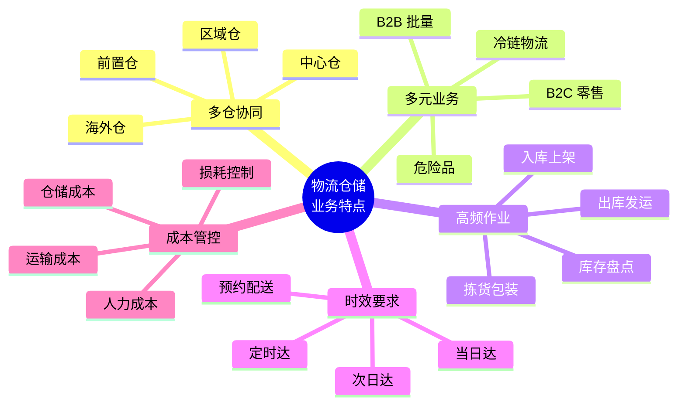

| 行业特点 | 具体表现 | 集成需求 |
|---------|---------|---------|
| **多仓网络** | 中心仓、区域仓、前置仓协同运作 | 库存统一视图，智能调拨 |
| **多元业务** | B2B、B2C、跨境等多种业务模式 | 灵活的业务流程配置 |
| **高频作业** | 日均数万甚至数十万单处理量 | 高并发、高性能集成 |
| **时效敏感** | 消费者对配送时效要求越来越高 | 实时跟踪，异常预警 |
| **成本压力** | 人力、租金、运输成本持续上涨 | 数据驱动成本优化 |

### 物流仓储集成架构

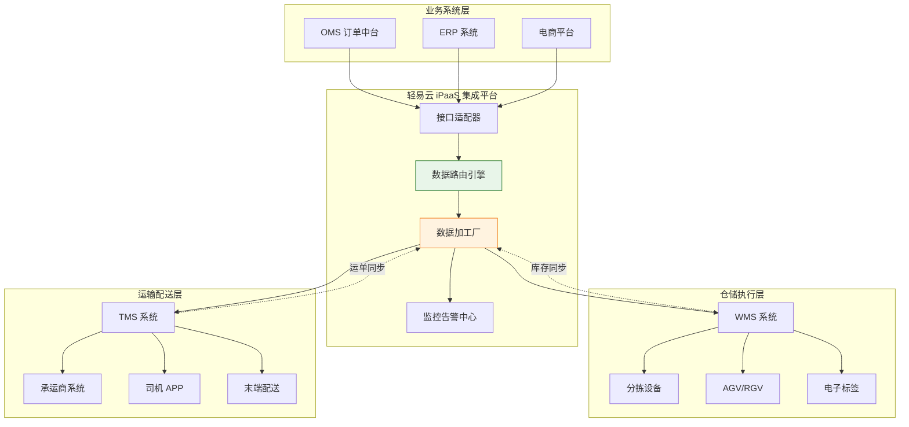

## WMS 系统集成

### WMS 与上下游系统对接

WMS（仓储管理系统）是仓储作业的核心系统，需要与 OMS、ERP、TMS 等多个系统协同：

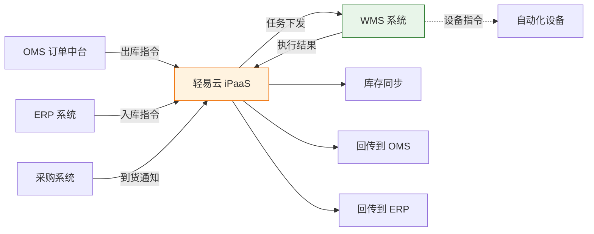

### 核心集成场景

| 场景 | 数据流向 | 业务价值 |
|-----|---------|---------|
| **入库集成** | ERP/OMS → WMS | 自动创建入库任务，指引上架 |
| **出库集成** | OMS → WMS | 自动分配库存，生成拣货任务 |
| **库存同步** | WMS → ERP/OMS | 实时库存可视，防止超卖 |
| **盘点集成** | WMS → ERP | 盘点差异自动过账 |
| **调拨集成** | ERP → WMS | 多仓调拨任务自动下发 |

### WMS 主流厂商对接

轻易云支持主流 WMS 系统的快速对接：

| WMS 厂商 | 对接方式 | 集成内容 |
|---------|---------|---------|
| **富勒 Flux** | API + 数据库 | 出入库、库存、盘点、调拨 |
| **唯智 vTradEx** | API | 全业务对接 |
| **Infor** | API + EDI | 出入库、库存同步 |
| **科箭** | API | 云 WMS 全面对接 |
| **巨沃** | API | 电商仓储对接 |
| **自研 WMS** | 开放接口 | 定制化对接 |

> [!NOTE]
> 对于自研 WMS 系统，轻易云提供标准的 API 规范和 SDK，帮助企业快速实现系统对接。

## 运输管理集成

### TMS 系统对接

TMS（运输管理系统）负责运输计划的制定和执行跟踪：

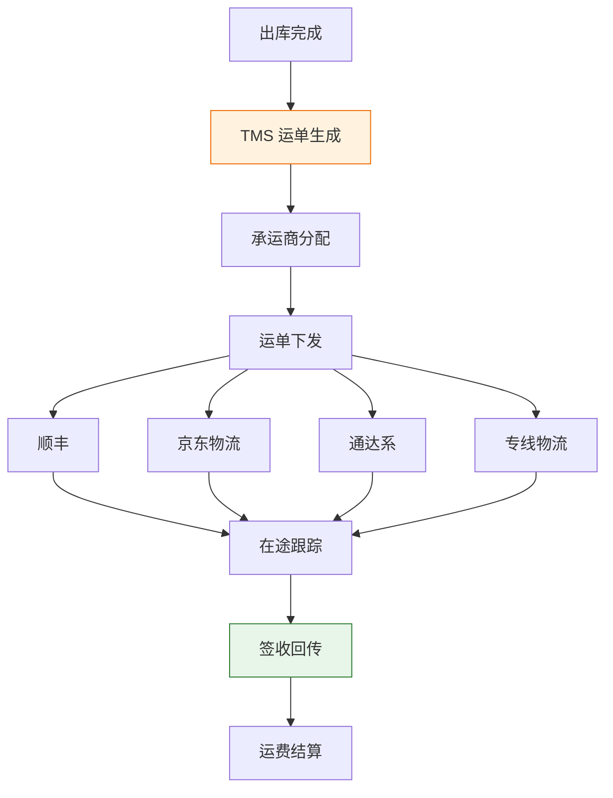

### 承运商对接矩阵

| 承运商 | 对接方式 | 数据内容 | 实时性 |
|-------|---------|---------|-------|
| **顺丰** | API | 运单、轨迹、签收、运费 | 准实时 |
| **京东物流** | API | 运单、轨迹、签收、运费 | 准实时 |
| **通达系** | API/EDI | 运单、轨迹、签收 | 准实时 |
| **德邦** | API | 运单、轨迹、签收、运费 | 准实时 |
| **货拉拉** | API | 同城运力调度 | 实时 |
| **国际快递** | API/EDI | DHL、FedEx、UPS 轨迹 | 准实时 |

### 物流跟踪集成

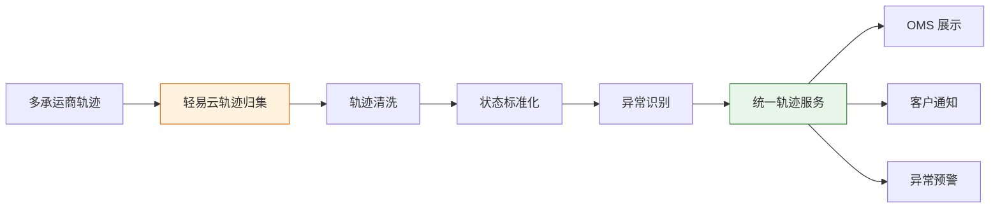

**物流状态标准化**：

| 标准状态 | 承运商原始状态 | 业务含义 |
|---------|--------------|---------|
| **已揽收** | 已揽件/已收件 | 包裹被快递员揽收 |
| **运输中** | 已发出/到达 xx 转运中心 | 包裹在运输途中 |
| **派送中** | 正在派送/快递员已出发 | 即将送达 |
| **已签收** | 已签收/代签收 | 配送完成 |
| **异常** | 滞留/退回/破损 | 需要人工介入 |

## 订单履约跟踪

### 全链路履约可视化

实现从订单下达到签收的全链路可视化：

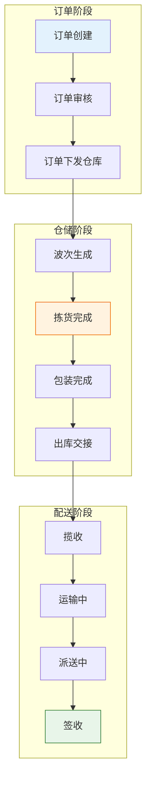

### 履约节点实时推送

| 节点 | 触发系统 | 推送内容 | 推送渠道 |
|-----|---------|---------|---------|
| **订单确认** | OMS | 订单号、预计发货时间 | 短信/微信 |
| **商品出库** | WMS | 出库时间、运单号 | 短信/微信/APP |
| **物流揽收** | TMS | 承运商、查询链接 | 短信/微信 |
| **派送提醒** | TMS | 预计送达时间 | 短信/微信 |
| **签收确认** | TMS | 签收时间、评价邀请 | APP/微信 |

### 异常预警机制

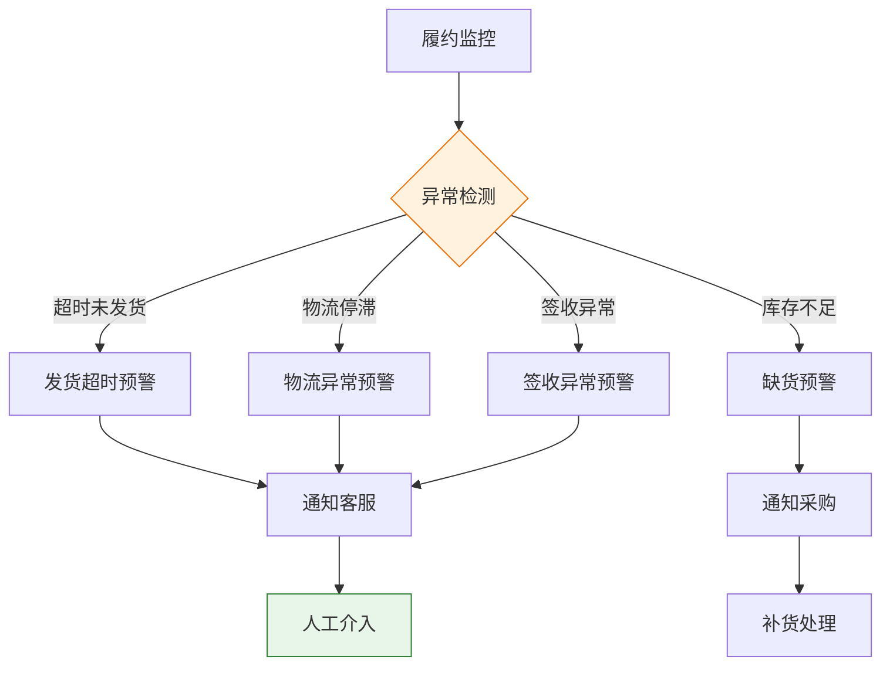

**预警规则配置**：

| 预警类型 | 触发条件 | 通知对象 | 响应时效 |
|---------|---------|---------|---------|
| **发货超时** | 超过承诺发货时间 2 小时 | 仓储主管 | 30 分钟内 |
| **物流停滞** | 48 小时无轨迹更新 | 客服专员 | 1 小时内 |
| **派送失败** | 第一次派送失败 | 客服专员 | 实时 |
| **签收异常** | 代收/拒收/破损 | 客服主管 | 实时 |
| **库存预警** | 低于安全库存 | 采购专员 | 2 小时内 |

## 智能仓储集成场景

### 自动化设备对接

现代仓储越来越多地采用自动化设备，轻易云支持与主流设备的无缝对接：

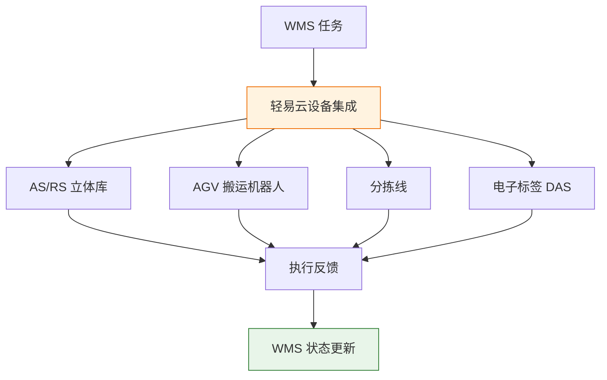

### 物联网数据采集

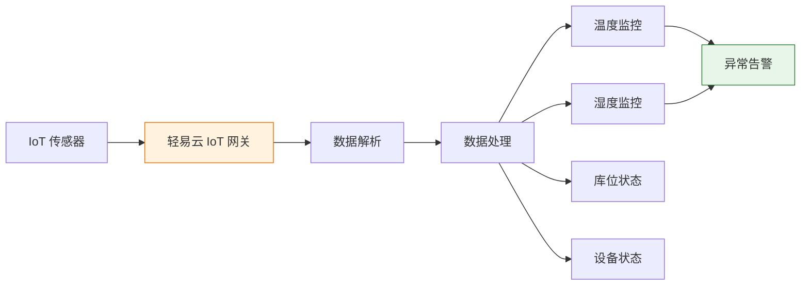

**IoT 集成场景**：

| 场景 | 传感器类型 | 数据内容 | 业务价值 |
|-----|-----------|---------|---------|
| **冷链监控** | 温湿度传感器 | 温度、湿度、位置 | 确保冷链不断链 |
| **库位管理** | RFID/光电传感器 | 库位占用状态 | 实时库位可视化 |
| **设备监控** | 振动/温度传感器 | 设备运行状态 | 预测性维护 |
| **能耗管理** | 电表/水表 | 能耗数据 | 成本优化 |

## 实施建议

### 分阶段实施路线图

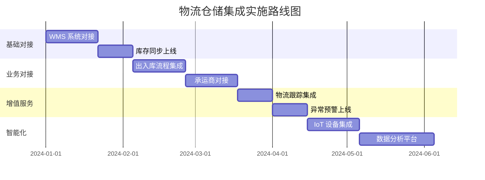

### 最佳实践

**1. 高并发处理策略**

| 场景 | 峰值 QPS | 处理策略 |
|-----|---------|---------|
| **大促订单下发** | 10,000+ | 消息队列削峰，异步处理 |
| **库存查询** | 50,000+ | 缓存 + 读写分离 |
| **轨迹推送** | 100,000+ | 批量聚合，定时推送 |

**2. 数据一致性保障**

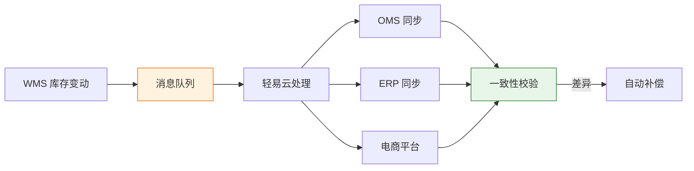

**3. 容灾与降级**

| 故障场景 | 降级策略 | 恢复机制 |
|---------|---------|---------|
| **WMS 不可用** | 缓存库存数据，暂停实时同步 | 自动重连，增量补偿 |
| **承运商 API 故障** | 切换备用查询通道 | 故障恢复后全量补偿 |
| **网络中断** | 本地缓存，断点续传 | 网络恢复后自动补发 |

### 常见问题解答

**Q1：如何处理大促期间的高并发？**

A：轻易云 iPaaS 采用云原生架构，支持弹性伸缩。建议大促前进行压测，并启用消息队列进行流量削峰。同时配置熔断和降级机制，保障核心业务流程。

**Q2：多仓库存如何统一视图？**

A：建议建立统一的库存中心，通过轻易云实时汇总各仓库存数据。可以设置库存分配策略和安全库存水位，实现智能补货和调拨建议。

**Q3：如何应对承运商接口不稳定？**

A：轻易云提供多承运商容灾机制，当主通道故障时自动切换备用通道。同时配置重试和补偿机制，确保数据的最终一致性。

## 方案价值总结

| 价值维度 | 量化收益 | 业务影响 |
|---------|---------|---------|
| **作业效率** | 订单处理效率提升 50% | 减少人力需求，提升产能 |
| **库存准确** | 库存准确率提升至 99.9% | 降低超卖风险，减少赔付 |
| **履约时效** | 发货时效缩短 30% | 提升客户满意度 |
| **物流可视** | 物流信息实时率 99%+ | 减少客服咨询，提升体验 |
| **成本优化** | 物流成本降低 15% | 数据驱动的成本优化决策 |

---

## 相关资源

- [WMS 集成标准方案](../standard-plans/wms-standard) - 开箱即用的 WMS 集成模板
- [制造业解决方案](./manufacturing) - 制造业仓储集成
- [零售业解决方案](./retail) - 零售仓储集成
- [跨境电商解决方案](./crossborder-ecommerce) - 跨境物流集成
