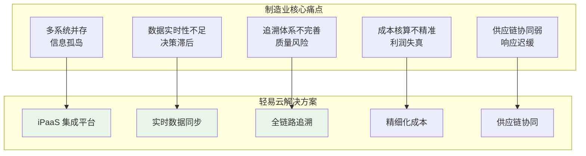
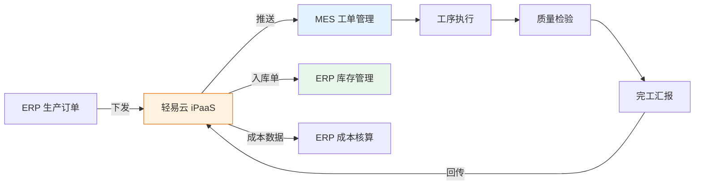
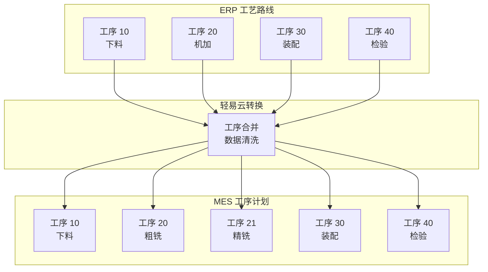
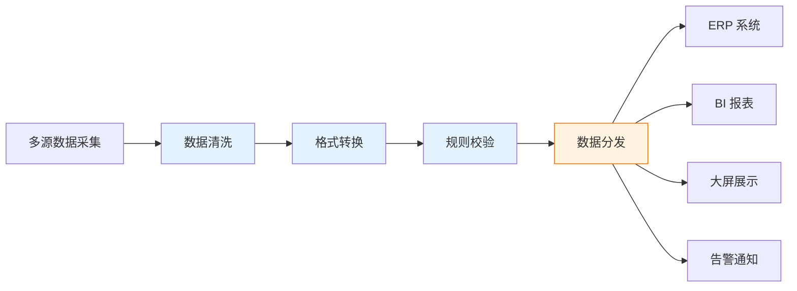
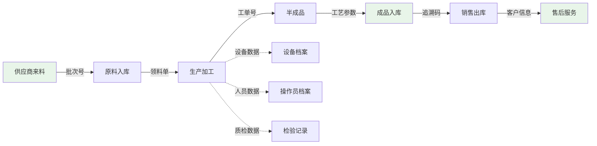
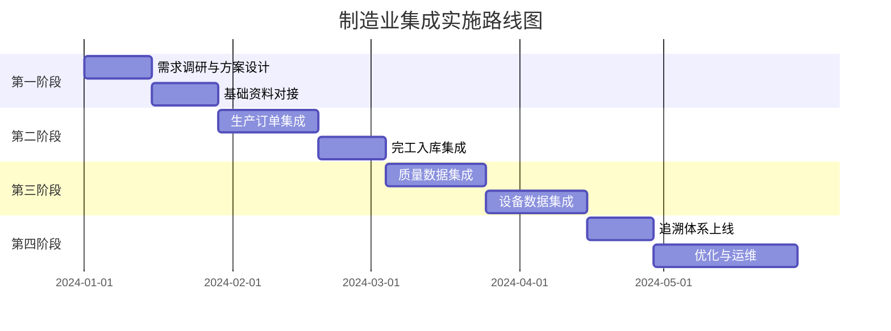

# 制造业集成解决方案

制造业数字化转型是工业 4.0 时代的核心命题。轻易云 iPaaS 针对制造业复杂的业务场景，提供从生产执行、供应链管理到财务核算的全链路集成方案，帮助制造企业打破信息孤岛，实现从订单到交付的全流程数字化贯通。

> [!TIP]
> 本方案适用于离散制造、流程制造及混合制造模式的企业，特别适合采用 MES、ERP、WMS 等多系统并存架构的制造型企业。实施前建议完成系统现状评估和数据标准化工作。

## 制造业集成场景概述

### 行业特点与挑战

制造业作为国民经济的支柱产业，面临着日益复杂的经营环境和数字化转型的迫切需求：

| 挑战维度 | 具体问题 | 业务影响 |
|---------|---------|---------|
| **系统割裂** | MES、ERP、WMS 等系统独立运行，数据无法互通 | 重复录入、数据不一致、效率低下 |
| **数据滞后** | 生产数据依靠人工统计和批量导入 | 决策依据滞后，无法及时响应异常 |
| **追溯困难** | 从原材料到成品的全链路追溯依赖纸质记录 | 质量问题定位慢，召回成本高 |
| **成本模糊** | 无法精确归集工单级物料消耗和人工成本 | 产品定价失真，盈利能力分析困难 |
| **协同低效** | 供应商、工厂、客户之间信息传递不畅 | 库存积压或缺料，交付延迟 |

### 制造业集成架构

```mermaid
flowchart TB
    subgraph 上游供应链
        S1[供应商门户]
        S2[采购协同]
        S3[来料质检]
    end
    
    subgraph 生产运营层
        P1[ERP 系统<br/>用友/金蝶/SAP]
        P2[MES 系统<br/>生产执行]
        P3[WMS 系统<br/>仓储管理]
        P4[QMS 系统<br/>质量管理]
        P5[设备物联<br/>IoT 采集]
    end
    
    subgraph 轻易云 iPaaS 集成平台
        I1[数据集成引擎]
        I2[数据加工厂]
        I3[API 网关]
        I4[事件总线]
    end
    
    subgraph 下游渠道
        C1[经销商门户]
        C2[电商平台]
        C3[客户服务]
    end
    
    S1 --> I1
    S2 --> I1
    S3 --> I1
    
    I1 --> P1
    I1 --> P2
    I1 --> P3
    I1 --> P4
    
    P1 --> I2
    P2 --> I2
    P3 --> I2
    P4 --> I2
    P5 --> I2
    
    I2 --> I3 --> I4
    I4 --> C1
    I4 --> C2
    I4 --> C3
    
    style I1 fill:#fff3e0,stroke:#ef6c00
    style I2 fill:#e8f5e9,stroke:#2e7d32
```

## MES 与 ERP 集成

### 集成价值与目标

MES（制造执行系统）与 ERP（企业资源计划）的集成是制造业数字化的核心环节，实现计划层与执行层的数据贯通：

| 集成方向 | 数据内容 | 业务价值 |
|---------|---------|---------|
| ERP → MES | 生产订单、BOM 物料清单、工艺路线 | 生产计划自动下发，消除人工录入 |
| MES → ERP | 工单汇报、完工入库、物料消耗 | 实时成本归集，库存自动更新 |
| 双向同步 | 质量数据、设备状态、异常告警 | 全程可追溯，异常及时响应 |

### 核心集成场景

#### 场景一：生产订单闭环管理

**业务流程**：
1. ERP 创建生产订单并下发至 MES
2. MES 接收订单并生成生产工单
3. 车间执行生产并实时报工
4. 完工后 MES 推送入库单至 ERP
5. ERP 自动更新库存和生产成本

**关键字段映射**：

| ERP 字段 | MES 字段 | 说明 |
|---------|---------|------|
| 生产订单号 | 工单编号 | 业务主键关联 |
| 物料编码 | 产品料号 | 物料一致性 |
| 计划数量 | 工单数量 | 生产目标 |
| 计划开工日期 | 计划开始时间 | 排程依据 |
| 计划完工日期 | 计划完成时间 | 交付承诺 |

#### 场景二：工艺路线同步

> [!NOTE]
> 工艺路线同步时需注意 ERP 与 MES 的工序粒度差异。轻易云数据加工厂支持工序合并、拆分及属性转换，确保两端系统工艺数据的一致性。

## 生产数据管理

### 数据采集与整合

制造业生产数据来源多样，轻易云 iPaaS 提供统一的数据采集和整合能力：

| 数据来源 | 采集方式 | 数据类型 | 同步频率 |
|---------|---------|---------|---------|
| 设备 PLC | IoT 网关采集 | 设备状态、产量、能耗 | 实时 |
| MES 系统 | API 接口 | 工单进度、质量数据 | 准实时 |
| 质检仪器 | 串口/网络 | 检测数据、SPC 数据 | 实时 |
| 人工录入 | 移动终端 | 异常记录、补录数据 | 准实时 |
| 视频监控 | AI 识别 | 安全违规、产量统计 | 准实时 |

### 数据加工与分发

### 生产可视化方案

轻易云支持将采集的生产数据推送至各类可视化平台：

- **车间看板**：实时显示工单进度、设备状态、质量指标
- **管理驾驶舱**：汇总生产效率、OEE、良品率等 KPI
- **移动端应用**：支持管理层随时随地查看生产动态

## 质量追溯方案

### 全链路追溯体系

构建从原材料到成品的全链路质量追溯体系：

### 追溯场景实现

| 追溯场景 | 追溯维度 | 数据源 | 响应时间 |
|---------|---------|--------|---------|
| 正向追溯 | 批次 → 成品 | 原材料批次号关联工单 | < 5 秒 |
| 反向追溯 | 成品 → 批次 | 成品追溯码查询原料 | < 5 秒 |
| 过程追溯 | 工艺参数查询 | 设备历史数据 | < 10 秒 |
| 人员追溯 | 操作记录查询 | MES 操作日志 | < 5 秒 |

> [!IMPORTANT]
> 质量追溯体系的有效运行依赖于基础数据的完整性。建议在实施追溯方案前，先完成物料批次管理、工艺参数采集等基础能力的建设。

## 实施建议

### 分阶段实施路线图

### 成功实施要素

| 要素类别 | 关键事项 | 建议措施 |
|---------|---------|---------|
| **数据准备** | 基础资料标准化 | 统一物料编码、建立物料对照表 |
| **流程梳理** | 业务流程规范化 | 明确系统边界，优化业务流程 |
| **技术准备** | 接口规范确认 | 提前获取系统接口文档 |
| **组织保障** | 跨部门协作 | 成立项目组，明确责任分工 |
| **风险控制** | 异常处理机制 | 制定数据异常处理预案 |

### 常见问题与解决方案

**Q1：如何保障生产数据同步的实时性？**

A：建议采用事件驱动与定时轮询相结合的同步策略。关键业务节点（如工单完工）使用事件触发实时同步，一般数据采用定时轮询。轻易云支持 WebSocket、Webhook 等多种实时推送方式。

**Q2：多工厂、多账套如何统一管理？**

A：轻易云支持多租户架构，可为每个工厂/账套配置独立的集成方案实例，同时通过统一的管理平台进行监控和运维。支持账套间的数据隔离和跨账套的数据汇总。

**Q3：如何处理历史数据迁移？**

A：建议采用"存量数据批量迁移 + 增量数据实时同步"的策略。轻易云提供数据迁移工具，支持批量导入和历史数据补录，确保新旧系统平滑切换。

> [!TIP]
> 制造业集成项目涉及多个业务系统和部门，建议采用敏捷迭代的方式分阶段交付，每个阶段都有明确的交付物和验收标准，降低项目风险。

## 方案价值总结

通过轻易云制造业集成方案，企业可实现以下核心价值：

| 价值维度 | 量化收益 | 业务影响 |
|---------|---------|---------|
| **效率提升** | 数据录入时间减少 80%+ | 释放人力，聚焦核心业务 |
| **成本精准** | 成本核算精度提升至 95%+ | 支持精细化定价和盈利分析 |
| **质量可控** | 质量问题定位时间缩短 70% | 降低质量风险和召回成本 |
| **交付准时** | 订单准时交付率提升 20%+ | 提升客户满意度和市场竞争力 |
| **决策高效** | 数据获取时效从天级降至分钟级 | 支持数据驱动的快速决策 |

---

## 相关资源

- [MES 与 ERP 集成方案](./mes-erp) - 详细的 MES 与 ERP 对接指南
- [MES 集成标准方案](../standard-plans/mes-standard) - 开箱即用的 MES 集成模板
- [WMS 集成标准方案](../standard-plans/wms-standard) - 仓储系统集成方案
- [央国企采购平台对接](./government-procurement) - 采购业务集成方案
