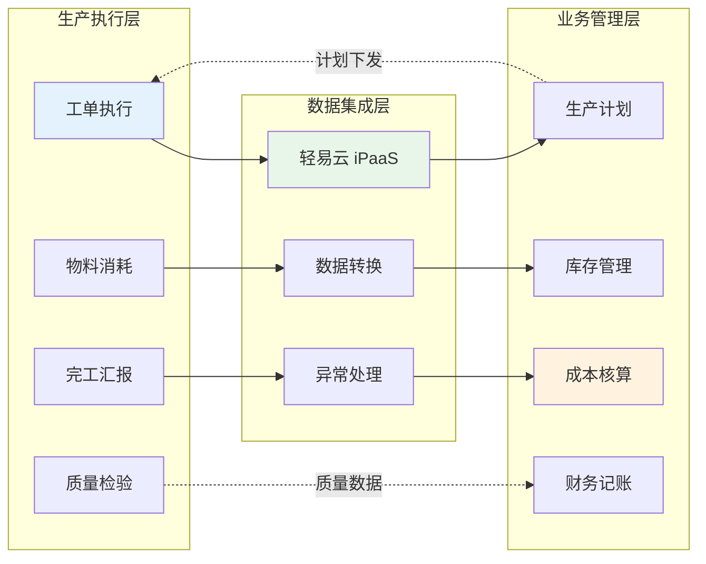
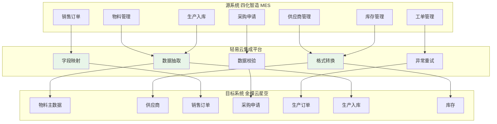

# MES 与 ERP 集成解决方案

本方案实现制造执行系统（MES）与企业资源计划系统（ERP）的深度集成，打通生产计划、工单执行、物料管理、质量追溯等核心业务环节。以四化智造 MES 与金蝶云星空 ERP 的对接为典型案例，帮助企业实现生产数据的实时采集与业务协同，支撑智能制造数字化转型。

> [!TIP]
> 本方案适用于采用 MES 系统进行生产执行管理、同时使用金蝶云星空进行财务与供应链管理的制造企业。实施前建议完成基础资料（物料、客户、供应商、工艺路线）的标准化与清洗工作。

## 方案概述

### 业务价值



通过 MES 与 ERP 系统集成，企业可获得以下核心价值：

| 价值维度 | 具体收益 |
|---------|---------|
| **数据实时性** | 生产完工数据实时回传 ERP，消除人工录入延迟 |
| **成本精准度** | 工单级物料消耗归集，支持精细化成本核算 |
| **库存准确性** | 生产出入库自动同步，减少账实差异 |
| **追溯完整性** | 实现从销售订单到生产工单的全链路追溯 |
| **业务协同性** | 销售、采购、生产、仓储多部门数据互通 |

### 系统架构



## 集成场景总览

本方案涵盖制造业核心业务场景的 18 个标准集成流程：

| 场景类型 | 集成方案 | 数据流向 | 关键价值 |
|---------|---------|---------|---------|
| 基础资料 | 物料同步货品 | MES → 金蝶 | 统一物料主数据 |
| 基础资料 | 供应商同步 | 金蝶 → MES | 共享供应商资料 |
| 基础资料 | 计量单位同步 | 金蝶 → MES | 统一计量标准 |
| 销售业务 | 销售订单同步 | MES → 金蝶 | 订单自动转生产 |
| 采购业务 | 采购申请（订单分配） | MES → 金蝶 | 委外需求自动触发 |
| 采购业务 | 采购申请（原材料采购） | MES → 金蝶 | 缺料自动补货 |
| 采购业务 | 采购申请（标准件采购） | MES → 金蝶 | 标准件需求同步 |
| 采购业务 | 采购申请（工件分配） | MES → 金蝶 | 工件委外管理 |
| 生产执行 | 生产订单（机加件） | MES → 金蝶 | 工单级成本归集 |
| 生产执行 | 生产订单（组立订单） | MES → 金蝶 | 组装配对管理 |
| 物料管理 | 生产补料单（原材料） | MES → 金蝶 | 异常补料追踪 |
| 物料管理 | 生产补料单（组立订单） | MES → 金蝶 | 组立补料管理 |
| 物料管理 | 生产退料单（原材料） | MES → 金蝶 | 余料退库追踪 |
| 完工入库 | 生产入库单（原材料） | MES → 金蝶 | 完工成本核算 |
| 完工入库 | 生产入库单（组立订单） | MES → 金蝶 | 组立完工入库 |
| 财务对接 | 应付单（暂估） | MES → 金蝶 | 委外费用结算 |
| 库存同步 | 库存同步（有库位） | 金蝶 → MES | 实时库存可视 |
| 库存同步 | 库存同步（无库位） | 金蝶 → MES | 简化库存管理 |

## 基础资料同步方案

### 01-物料同步货品

将四化智造 MES 的物料信息同步至金蝶云星空物料主数据，建立统一的物料档案。

| 配置项 | 说明 |
|-------|------|
| 源系统查询接口 | `basic/materialInfo/list`（查询物料列表） |
| 目标系统写入接口 | `batchSave`（创建物料） |
| 同步频率 | 按需触发 / 定时同步 |
| 标准方案 | [查看模板](https://dh-open.qliang.cloud/market/datahub/solution/84a99a26-2e28-3673-9d30-cdb851b8d192) |

**关键字段映射**：

| 序号 | MES 字段 | MES 字段名 | 金蝶字段 | 金蝶字段名 | 说明 |
|-----|---------|-----------|---------|-----------|------|
| 1 | `gradeName` | 物料名称 | `FName` | 名称 | 物料名称 |
| 2 | `partNo` | 物料编码 | `FNumber` | 编码 | 物料唯一标识 |
| 3 | `materialType` | 物料类型 | `FDescription` | 描述 | 物料类型描述 |
| 4 | 固定值 `100` | — | `FCreateOrgId` | 创建组织 | 组织代码 |
| 5 | 固定值 `100` | — | `FUseOrgId` | 使用组织 | 组织代码 |
| 6 | `groupCode` | 分组编码 | `FMaterialGroup` | 物料分组 | 物料分类 |
| 7 | `spec` | 规格 | `FSpecification` | 规格型号 | 规格信息 |
| 8 | `picNo` | 图号 | `F_lyzx_Text` | 图号 | 工程图号 |
| 9 | `customerPartNo` | 客户料号 | `F_lyzx_Text5` | 客户料号 | 客户侧料号 |
| 10 | `brand` | 品牌 | `F_lyzx_Text11` | 品牌 | 品牌信息 |
| 11 | `quality` | 材质 | `F_lyzx_Text1` | 材质及成份 | 材质说明 |

> [!NOTE]
> 物料属性（`FErpClsID`）通过计算函数根据 `materialAttribute` 字段自动映射：外购、自制、委外等属性需正确配置以确保后续业务流程正常。

### 02-供应商同步

将金蝶云星空供应商资料同步至四化智造 MES，支持采购业务开展。

| 配置项 | 说明 |
|-------|------|
| 源系统查询接口 | `executeBillQuery`（查询供应商） |
| 目标系统写入接口 | `/api/createSupplier`（新增供应商） |
| 标准方案 | [查看模板](https://dh-open.qliang.cloud/market/datahub/solution/2de0430b-4c32-32ca-8136-67a8d0b4f753) |

**关键字段映射**：

| 序号 | 金蝶字段 | 金蝶字段名 | MES 字段 | MES 字段名 | 说明 |
|-----|---------|-----------|---------|-----------|------|
| 1 | `FNumber` | 编码 | `supplierNo` | 供应商流水号 | 供应商编码 |
| 2 | `FName` | 名称 | `supplierName` | 供应商名称 | 供应商名称 |
| 3 | `FName` | 名称 | `supplierFullName` | 供应商全称 | 供应商全称 |
| 4 | `FNumber` | 编码 | `supplierShortCode` | 供应商简码 | 简码 |
| 5 | 固定值 `1` | — | `isInner` | 是否内部供应商 | 0: 是, 1: 否 |
| 6 | `FAddress` | 通讯地址 | `addressDetail` | 详细地址 | 供应商地址 |

### 03-计量单位同步

同步计量单位及换算关系，确保库存计量一致性。

| 配置项 | 说明 |
|-------|------|
| 源系统查询接口 | `ExecuteBillQuery`（逐个单据查询） |
| 目标系统写入接口 | `/api/createUnitInfo`（新增计量单位） |
| 标准方案 | [查看模板](https://dh-open.qliang.cloud/market/datahub/solution/060bb72a-245a-316c-b4cc-54eefde06d24) |

**关键字段映射**：

| 序号 | 金蝶字段 | 金蝶字段名 | MES 字段 | MES 字段名 | 说明 |
|-----|---------|-----------|---------|-----------|------|
| 1 | `Name` | 名称 | `unitName` | 计量单位名称 | 单位名称 |
| 2 | `Number` | 编码 | `unitNo` | 计算单位流水 | 单位编码 |
| 3 | `UNITCONVERTRATE.DestUnitId_Number` | 目标单位编码 | `basicUnitNo` | 基准单位流水 | 基准单位 |
| 4 | `UNITCONVERTRATE.DestUnitId_Name` | 目标单位名称 | `basicUnitName` | 基准单位名称 | 基准单位名 |
| 5 | 计算函数 | 换算率 | `coefficient` | 转换系数 | 单位换算比例 |

## 销售业务集成方案

### 04-销售订单同步

将 MES 业务订单同步至金蝶云星空销售订单，实现订单到生产的业务贯通。

| 配置项 | 说明 |
|-------|------|
| 源系统查询接口 | `mbs/order/list`（查询业务订单列表） |
| 目标系统写入接口 | `batchSave`（创建销售订单） |
| 标准方案 | [查看模板](https://dh-open.qliang.cloud/market/datahub/solution/4a849351-9da9-3193-ac3b-864dc66e2260) |

**关键字段映射**：

| 序号 | MES 字段 | MES 字段名 | 金蝶字段 | 金蝶字段名 | 说明 |
|-----|---------|-----------|---------|-----------|------|
| 1 | `bfn_num` | 单据编号 | `FBillNo` | 单据编号 | 销售订单号 |
| 2 | 固定值 `100` | — | `FSaleOrgId` | 销售组织 | 组织代码 |
| 3 | `createTime` | 创建时间 | `FDate` | 日期 | 订单日期 |
| 4 | `customerCode` | 客户编码 | `FCustId` | 客户 | 客户资料 |
| 5 | 固定值 `XSDD01_SYS` | — | `FBillTypeID` | 单据类型 | 标准销售订单 |
| 6 | `mbsOrderBomList_partNo` | 物料编码 | `FSaleOrderEntry.FMaterialId` | 物料编码 | 明细物料 |
| 7 | `mbsOrderBomList_orderNum` | 订单数量 | `FSaleOrderEntry.FQty` | 销售数量 | 数量 |
| 8 | `mbsOrderBomList_taxPrice` | 含税单价 | `FSaleOrderEntry.FTaxPrice` | 含税单价 | 单价 |
| 9 | `orderNo` | 订单号 | `F_sh_orderNo` | 四化 MES 订单号 | 关联标识 |
| 10 | `mbsOrderBomList_bomNo` | 派工案号 | `FSaleOrderEntry.FMtoNo` | 计划跟踪号 | 跟踪号 |

> [!IMPORTANT]
> 订单类型（`orderType`）通过计算函数映射：1=客户订单, 2=备货订单, 3=异常订单, 11=无 PO 订单, 12=免费打样。不同订单类型影响后续生产与财务处理逻辑。

## 采购业务集成方案

### 05-采购申请（订单分配）

将 MES 订单分配数据同步至金蝶采购申请单，触发委外采购流程。

| 配置项 | 说明 |
|-------|------|
| 源系统查询接口 | `mbs/order/distribute/distributeList`（查询订单分配） |
| 目标系统写入接口 | `batchSave`（创建采购申请单） |
| 标准方案 | [查看模板](https://dh-open.qliang.cloud/market/datahub/solution/4ab65a1d-046b-3d36-a61c-72c8fa50019d) |

**关键字段映射**：

| 序号 | MES 字段 | MES 字段名 | 金蝶字段 | 金蝶字段名 | 说明 |
|-----|---------|-----------|---------|-----------|------|
| 1 | 固定值 `ZZJBZCGSQD` | — | `FBillTypeID` | 单据类型 | 标准采购申请 |
| 2 | `updateTime` | 更新时间 | `FApplicationDate` | 申请日期 | 日期 |
| 3 | 固定值 `Material` | — | `FRequestType` | 申请类型 | 物料申请 |
| 4 | 固定值 `100` | — | `FApplicationOrgId` | 申请组织 | 组织代码 |
| 5 | `bomNo-id` | 派工案号 ID | `FBillNo` | 单据编号 | 申请单号 |
| 6 | `partNo` | 物料编码 | `FEntity.FMaterialId` | 物料名称 | 申请物料 |
| 7 | `distributeNum` | 分配数量 | `FEntity.FReqQty` | 申请数量 | 数量 |
| 8 | `purchaseUnitNo` | 采购单位 | `FEntity.FUnitId` | 申请单位 | 单位 |
| 9 | `bomNo` | 派工案号 | `FEntity.FMtoNo` | 计划跟踪号 | 跟踪号 |

### 06-采购申请（原材料采购）

将 MES 原材料采购需求同步至金蝶采购申请单。

| 配置项 | 说明 |
|-------|------|
| 源系统查询接口 | `mbs/pur/record/toBePurList`（查询原材料/标准件采购） |
| 目标系统写入接口 | `batchSave`（创建采购申请单） |
| 标准方案 | [查看模板](https://dh-open.qliang.cloud/market/datahub/solution/d75298e0-396e-3f38-9d63-c664502387a6) |

> [!TIP]
> 原材料采购与标准件采购共用同一查询接口，通过 `purType` 字段区分：1=标准件, 2=委外, 其他=原材料。

### 07-采购申请（标准件采购）

将 MES 标准件采购需求同步至金蝶采购申请单。

| 配置项 | 说明 |
|-------|------|
| 源系统查询接口 | `mbs/pur/record/toBePurList`（查询原材料/标准件采购） |
| 目标系统写入接口 | `batchSave`（创建采购申请单） |
| 标准方案 | [查看模板](https://dh-open.qliang.cloud/market/datahub/solution/ce20eb78-fcdf-3d09-aaab-a2e8078305b9) |

### 08-采购申请（工件分配）

将 MES 工件分配数据同步至金蝶采购申请单，用于工件委外场景。

| 配置项 | 说明 |
|-------|------|
| 源系统查询接口 | `mbs/distribute/selectMbsDistributeRecordList`（查询工件分配） |
| 目标系统写入接口 | `batchSave`（创建采购申请单） |
| 标准方案 | [查看模板](https://dh-open.qliang.cloud/market/datahub/solution/983e65a1-c7b0-31e4-b8f2-f0bce2f32a23) |

## 生产执行集成方案

### 09-生产订单（机加件）

将 MES 派工作业数据同步至金蝶生产订单，建立工单级成本归集基础。

| 配置项 | 说明 |
|-------|------|
| 源系统查询接口 | `/api/getDispatchRecord`（查询派工作业） |
| 目标系统写入接口 | `batchSave`（创建生产订单） |
| 标准方案 | [查看模板](https://dh-open.qliang.cloud/market/datahub/solution/f84ab348-b67f-354f-ac65-2ef719c63239) |

**关键字段映射**：

| 序号 | MES 字段 | MES 字段名 | 金蝶字段 | 金蝶字段名 | 说明 |
|-----|---------|-----------|---------|-----------|------|
| 1 | `dispatchPrefix` | 派工前缀 | `FBillNo` | 单据编码 | 生产订单号 |
| 2 | 固定值 `SCDD03_SYS` | — | `FBillType` | 单据类型 | 直接入库-普通生产 |
| 3 | `createTime` | 创建时间 | `Fdate` | 单据日期 | 日期 |
| 4 | `partNo` | 物料编码 | `FTreeEntity.FMaterialId` | 子项物料编码 | 产品物料 |
| 5 | 固定值 `1` | — | `FTreeEntity.FProductType` | 产品类型 | 1=主产品 |
| 6 | 固定值 `YA032` | — | `FTreeEntity.FWorkShopID` | 生产车间 | 车间代码 |
| 7 | `dispatchedNum` | 派工数量 | `FTreeEntity.Fqty` | 数量 | 生产数量 |
| 8 | `planBeginTime` | 计划开工 | `FTreeEntity.FPlanStartDate` | 计划开工时间 | 开工日期 |
| 9 | `planEndTime` | 计划完工 | `FTreeEntity.FPlanFinishDate` | 计划完工时间 | 完工日期 |
| 10 | `orderNo` | 订单号 | `FTreeEntity.F_sh_ywddh` | 四化业务订单号 | 关联订单 |
| 11 | `id` | ID | `FTreeEntity.F_sh_id` | 四化派工单号 ID | 关联标识 |
| 12 | `dispatchPrefix` | 派工前缀 | `FTreeEntity.F_sh_no` | 四化派工单号 | 派工单号 |
| 13 | `bomNo` | 派工案号 | `FTreeEntity.F_sh_bomNo` | 四化派工案号 | 案号 |
| 14 | `bomNo` | 派工案号 | `FTreeEntity.FMTONO` | 计划跟踪号 | 跟踪号 |

> [!NOTE]
> 单据类型 `FBillType` 支持多种生产模式：SCDD01_SYS=汇报入库-普通生产, SCDD03_SYS=直接入库-普通生产, SCDD05_SYS=工序汇报入库-普通生产。根据实际业务场景选择合适类型。

### 13-生产订单（组立订单）

将 MES 组立订单数据同步至金蝶生产订单，支持组装配对生产模式。

| 配置项 | 说明 |
|-------|------|
| 源系统查询接口 | `mbs/assemble/manage/alreadyReceiveDetailList`（查询组立订单） |
| 目标系统写入接口 | `batchSave`（创建生产订单） |
| 标准方案 | [查看模板](https://dh-open.qliang.cloud/market/datahub/solution/c47fba4a-34b3-32b2-ae8b-60b696f17f33) |

**关键字段映射**：

| 序号 | MES 字段 | MES 字段名 | 金蝶字段 | 金蝶字段名 | 说明 |
|-----|---------|-----------|---------|-----------|------|
| 1 | `id` | ID | `FBillNo` | 单据编码 | 生产订单号 |
| 2 | 固定值 `SCDD03_SYS` | — | `FBillType` | 单据类型 | 直接入库-普通生产 |
| 3 | `createTime` | 创建时间 | `Fdate` | 单据日期 | 日期 |
| 4 | `partNo` | 物料编码 | `FTreeEntity.FMaterialId` | 子项物料编码 | 产品物料 |
| 5 | `needNum` | 需求数量 | `FTreeEntity.Fqty` | 数量 | 生产数量 |
| 6 | 固定值 `YA035` | — | `FTreeEntity.FWorkShopID` | 生产车间 | 组立车间 |
| 7 | `moldNo` | 模具号 | `FTreeEntity.F_sh_bomNo` | 四化派工案号 | 组立案号 |
| 8 | `moldNo` | 模具号 | `FTreeEntity.FMTONO` | 计划跟踪号 | 跟踪号 |

## 物料管理集成方案

### 10-生产补料单（原材料）

将 MES 工单领料数据同步至金蝶生产补料单，记录异常补料情况。

| 配置项 | 说明 |
|-------|------|
| 源系统查询接口 | `/api/queryResourceOutStockDetail`（查询工单领料） |
| 目标系统写入接口 | `batchSave`（创建生产补料单） |
| 标准方案 | [查看模板](https://dh-open.qliang.cloud/market/datahub/solution/9444a732-e49a-3739-b381-07df90cca689) |

> [!IMPORTANT]
> 本方案对接到金蝶云星空的生产补料单会与方案 09 中的生产订单生成关联关系，用于后续的生产成本计算以及生产材料归集。

**关键字段映射**：

| 序号 | MES 字段 | MES 字段名 | 金蝶字段 | 金蝶字段名 | 说明 |
|-----|---------|-----------|---------|-----------|------|
| 1 | 固定值 `SCBLD01_SYS` | — | `FBillType` | 单据类型 | 生产补料单 |
| 2 | `createTime` | 创建时间 | `FDate` | 日期 | 日期 |
| 3 | 固定值 `100` | — | `FStockOrgId` | 发料组织 | 组织代码 |
| 4 | 固定值 `100` | — | `FPrdOrgId` | 生产组织 | 组织代码 |
| 5 | `partNo` | 物料编码 | `FEntity.FMaterialId` | 物料编码 | 物料 |
| 6 | `unitNo` | 单位 | `FEntity.FUnitID` | 单位 | 单位 |
| 7 | `confirmNumb` | 确认数量 | `FEntity.FAppQty` | 申请数量 | 申请数 |
| 8 | `confirmNumb` | 确认数量 | `FEntity.FActualQty` | 实发数量 | 实发数 |
| 9 | `warehouseCode` | 仓库编码 | `FEntity.FStockId` | 仓库 | 仓库 |
| 10 | 固定值 `BLYY01_SYS` | — | `FEntity.FFeedReasonId` | 补料原因 | 补料原因 |
| 11 | `dispatchPrefix` | 派工前缀 | `FEntity.FMoBillNo` | 生产订单编号 | 关联订单 |

### 14-生产补料单（组立订单）

将 MES 组立领料数据同步至金蝶生产补料单。

| 配置项 | 说明 |
|-------|------|
| 源系统查询接口 | `/api/queryZlOutStockDetail`（查询组立领料出库） |
| 目标系统写入接口 | `batchSave`（创建生产补料单） |
| 标准方案 | [查看模板](https://dh-open.qliang.cloud/market/datahub/solution/6b248d9a-ef4e-316c-a7a3-eb05d78164af) |

> [!NOTE]
> 本方案对接到金蝶云星空的生产补料单会与方案 13 中的生产订单生成关联关系。

### 12-生产退料单（原材料）

将 MES 余料入库数据同步至金蝶生产退料单，实现余料退库追踪。

| 配置项 | 说明 |
|-------|------|
| 源系统查询接口 | `wms/instockConfirm/queryInstockConfirmRecord`（查询余料入库） |
| 目标系统写入接口 | `batchSave`（创建生产退料单） |
| 标准方案 | [查看模板](https://dh-open.qliang.cloud/market/datahub/solution/239e8323-8af4-34c9-b5cb-84565d2b88ba) |

> [!NOTE]
> 本方案对接到金蝶云星空的生产退料单会与方案 09 中的生产订单生成关联关系，用于后续的生产成本计算以及生产材料归集。

## 完工入库集成方案

### 11-生产入库单（原材料）

将 MES 工单完工零件入库数据同步至金蝶生产入库单。

| 配置项 | 说明 |
|-------|------|
| 源系统查询接口 | `/api/queryWorkFinishInStockDetail`（查询工单完工零件入库） |
| 目标系统写入接口 | `batchSave`（创建生产入库单） |
| 标准方案 | [查看模板](https://dh-open.qliang.cloud/market/datahub/solution/54957653-f0c3-3c4c-a67c-00a8baf540bd) |

> [!IMPORTANT]
> 本方案对接到金蝶云星空的生产入库单会与方案 09 中的生产订单生成关联关系，用于后续的生产成本计算。

**关键字段映射**：

| 序号 | MES 字段 | MES 字段名 | 金蝶字段 | 金蝶字段名 | 说明 |
|-----|---------|-----------|---------|-----------|------|
| 1 | 固定值 `100` | — | `FStockOrgId` | 入库组织 | 组织代码 |
| 2 | 固定值 `SCRKD02_SYS` | — | `FBillType` | 单据类型 | 生产入库单 |
| 3 | 固定值 `100` | — | `FPrdOrgId` | 生产组织 | 组织代码 |
| 4 | 固定值 `BD_OwnerOrg` | — | `FOwnerTypeId0` | 货主类型 | 组织货主 |
| 5 | 固定值 `100` | — | `FOwnerId0` | 货主 | 货主代码 |
| 6 | `partNo` | 物料编码 | `FEntity.FMaterialId` | 物料编码 | 产品物料 |
| 7 | `unitNo` | 单位 | `FEntity.FUnitID` | 单位 | 单位 |
| 8 | `confirmNumb` | 确认数量 | `FEntity.FMustQty` | 应收数量 | 应收数 |
| 9 | `confirmNumb` | 确认数量 | `FEntity.FRealQty` | 实收数量 | 实收数 |
| 10 | `warehouseCode` | 仓库编码 | `FEntity.FStockId` | 仓库 | 仓库 |
| 11 | `businessNo` | 业务号 | `FEntity.FMoBillNo` | 生产订单编号 | 关联订单 |
| 12 | 固定值 `PRD_MO` | — | `FEntity.FSrcBillType` | 源单类型 | 生产订单 |
| 13 | `businessNo` | 业务号 | `FEntity.FSrcBillNo` | 源单编号 | 源单号 |
| 14 | `orderNo` | 订单号 | `FEntity.F_sh_ywddh` | 四化业务订单号 | 关联订单 |
| 15 | `bomNo` | 派工案号 | `FEntity.F_sh_bomNo` | 四化派工案号 | 案号 |

### 15-生产入库单（组立订单）

将 MES 组立完工成品入库数据同步至金蝶生产入库单。

| 配置项 | 说明 |
|-------|------|
| 源系统查询接口 | `/api/queryZlFinishInStockDetail`（查询组立完工成品入库） |
| 目标系统写入接口 | `batchSave`（创建生产入库单） |
| 标准方案 | [查看模板](https://dh-open.qliang.cloud/market/datahub/solution/6fa34fab-1d1c-342d-afa2-a2797363e760) |

> [!NOTE]
> 本方案对接到金蝶云星空的生产入库单会与方案 13 中的生产订单生成关联关系。

## 财务与库存集成方案

### 16-应付单（暂估）

将 MES 单工序委外数据同步至金蝶应付单，支持委外费用暂估与结算。

| 配置项 | 说明 |
|-------|------|
| 源系统查询接口 | `/api/queryOneProcessInfo`（查询单工序委外） |
| 目标系统写入接口 | `batchSave`（创建应付单） |

### 17-库存同步（有库位）

将金蝶库存数据同步至 MES，支持按库位管理的精细化库存场景。

| 配置项 | 说明 |
|-------|------|
| 源系统查询接口 | `executeBillQuery`（查询库存） |
| 目标系统写入接口 | `/api/synchronousWarehouseStock`（库存覆盖） |
| 标准方案 | [查看模板](https://dh-open.qliang.cloud/market/datahub/solution/f56acffe-cc83-3f26-8657-206a6c863553) |

**关键字段映射**：

| 序号 | 金蝶字段 | 金蝶字段名 | MES 字段 | MES 字段名 | 说明 |
|-----|---------|-----------|---------|-----------|------|
| 1 | `details` | 明细 | `details` | 明细 | 明细集合 |
| 2 | `FStockId_FNumber` | 仓库编码 | `details.warehouseCode` | 仓库代码 | 仓库 |
| 3 | `FStockLocId` | 库位 ID | `details.locationCode` | 库位代码 | 库位 |
| 4 | `details.FBaseQty` | 基本数量 | `details.stockNumb` | 库存数 | 库存数量 |
| 5 | `details.FMaterialId_FNumber` | 物料编码 | `details.partNo` | 物料编码 | 物料 |

### 18-库存同步（无库位）

将金蝶库存数据同步至 MES，适用于无需库位管理的简化库存场景。

| 配置项 | 说明 |
|-------|------|
| 源系统查询接口 | `executeBillQuery`（查询库存） |
| 目标系统写入接口 | `/api/synchronousWarehouseStock`（库存覆盖） |
| 标准方案 | [查看模板](https://dh-open.qliang.cloud/market/datahub/solution/002c5aae-690c-3d96-b970-ae719ce8cb69) |

> [!TIP]
> 无库位模式将库位代码固定为 `1`，适用于仓库管理相对简单的场景。如需启用库位管理，请参考方案 17。

## 实施配置步骤

### 步骤一：连接器配置

1. **配置四化智造 MES 连接器**
   - 登录轻易云 iPaaS 平台
   - 进入**连接器管理** → **新建连接器**
   - 选择「四化智造 MES」类型
   - 填写 MES 服务器地址、授权密钥等信息
   - 点击**测试连接**，验证配置正确

2. **配置金蝶云星空连接器**
   - 进入**连接器管理** → **新建连接器**
   - 选择「金蝶云星空」类型
   - 填写服务器地址、账套 ID、AppKey、AppSecret
   - 点击**测试连接**，完成授权验证

### 步骤二：基础资料同步方案配置

1. 进入**集成方案管理**，创建基础资料同步方案
2. 配置物料同步方案：
   - 源系统 = 四化智造 MES
   - 目标系统 = 金蝶云星空
   - 选择接口：`basic/materialInfo/list` → `batchSave`
3. 配置字段映射关系（参考上文字段映射表）
4. 设置同步策略（全量/增量）
5. 启用方案并测试同步

### 步骤三：业务单据同步方案配置

1. 创建生产订单同步方案
   - 源系统 = 四化智造 MES
   - 目标系统 = 金蝶云星空
   - 选择接口：`/api/getDispatchRecord` → `batchSave`
2. 配置生产入库同步方案
   - 确保入库单与生产订单建立关联关系
3. 配置采购申请同步方案
4. 设置触发条件（定时/实时）
5. 配置异常处理与重试机制
6. 启用方案并监控运行状态

## 实施建议

### 分阶段实施路线图

```mermaid
flowchart LR
    A[第一阶段<br/>基础资料] --> B[第二阶段<br/>销售采购]
    B --> C[第三阶段<br/>生产执行]
    C --> D[第四阶段<br/>库存财务]
    
    subgraph 第一阶段 3~5 天
        A1[物料同步]
        A2[供应商同步]
        A3[单位同步]
    end
    
    subgraph 第二阶段 5~7 天
        B1[销售订单]
        B2[采购申请]
    end
    
    subgraph 第三阶段 7~10 天
        C1[生产订单]
        C2[生产补料]
        C3[生产入库]
        C4[生产退料]
    end
    
    subgraph 第四阶段 3~5 天
        D1[库存同步]
        D2[应付单]
    end
    
    A --> A1
    B --> B1
    C --> C1
    D --> D1
    
    style A fill:#e3f2fd
    style B fill:#e8f5e9
    style C fill:#fff3e0
    style D fill:#f3e5f5
```

| 阶段 | 实施内容 | 预期周期 | 关键产出 |
|-----|---------|---------|---------|
| 第一阶段 | 基础资料对接（物料、供应商、计量单位） | 3~5 天 | 数据一致性验证 |
| 第二阶段 | 销售采购对接（销售订单、采购申请） | 5~7 天 | 订单自动流转 |
| 第三阶段 | 生产执行对接（生产订单、补料、入库、退料） | 7~10 天 | 工单级成本归集 |
| 第四阶段 | 库存财务对接（库存同步、应付单） | 3~5 天 | 全链路追溯 |
| 第五阶段 | 异常处理与优化 | 持续 | 稳定运行 |

### 数据一致性保障


- 启用轻易云的**数据一致性校验**功能
- 设置每日自动对账任务
- 配置异常告警，及时发现同步失败
- 建立差异处理流程，明确责任人

### 上线前检查清单

- [ ] 基础资料编码已统一或建立映射关系
- [ ] 测试环境完成端到端流程验证
- [ ] 生产订单与入库单关联关系正确建立
- [ ] 历史数据已完成初始化同步
- [ ] 异常处理流程已确定
- [ ] 相关人员已完成培训
- [ ] 监控告警已配置

## 常见问题

### Q1：生产订单与入库单如何建立关联？

**解决方案：**
通过 `FMoBillNo`（生产订单编号）字段建立关联：
1. 方案 09 创建生产订单时，使用 `dispatchPrefix` 作为订单编号
2. 方案 11 创建入库单时，将 `businessNo` 映射至 `FMoBillNo`
3. 确保两者编号一致，系统自动建立上下游关联

### Q2：如何处理多种生产模式（自制/委外/外购）？

**解决方案：**
1. 在物料同步方案中正确配置 `FErpClsID`（物料属性）字段
2. 通过计算函数根据 `materialAttribute` 自动映射：
   - `1` = 外购
   - `2` = 自制
   - `3` = 委外
3. 不同属性的物料在 ERP 中触发不同的业务流程

### Q3：库存同步出现差异如何处理？

**排查步骤：**
1. 检查轻易云平台的同步日志，确认数据是否成功推送
2. 对比 MES 和金蝶的库存变动时间戳
3. 确认是否存在未同步的生产出入库单据
4. 启用**数据一致性校验**功能，定期对账

### Q4：如何确保工单级成本归集准确？

**关键要点：**
1. 确保生产订单与生产入库单、补料单、退料单正确关联
2. 配置 `FMtoNo`（计划跟踪号）实现全流程跟踪
3. 在 ERP 中启用工单级成本核算模块
4. 定期进行成本差异分析

### Q5：委外加工业务如何集成？

**业务流程：**
1. MES 中创建委外派工单
2. 通过采购申请方案（05/08）同步至金蝶生成采购申请
3. 金蝶中采购申请转采购订单，下发给供应商
4. 委外完工后，MES 完工入库同步至金蝶
5. 通过应付单方案（16）进行费用结算

## 最佳实践

### 1. 编码规范建议

| 数据类型 | 建议规则 | 示例 |
|---------|---------|------|
| 物料编码 | 分类码 + 流水号 | `M001-20240001` |
| 派工案号 | 订单号 + 行号 | `SO2024001-01` |
| 派工单号 | 前缀 + 日期 + 流水 | `PG-20240313-001` |

### 2. 字段映射优化建议

- 使用**计算函数**处理复杂映射逻辑，如条件判断、数值计算
- 使用**关联查询函数**（`_findCollection`）实现跨方案数据引用
- 对固定值字段明确标注，便于后期维护

### 3. 异常处理策略

| 异常场景 | 处理策略 |
|---------|---------|
| 物料不存在 | 自动创建或标记异常待人工处理 |
| 库存不足 | 记录异常，通知相关人员进行库存调整 |
| 接口超时 | 自动重试 3 次，仍失败则进入异常队列 |
| 数据格式错误 | 记录详细错误日志，便于排查定位 |

## 方案价值总结

通过 MES 与 ERP 系统集成，制造企业可实现：

| 价值维度 | 具体收益 |
|---------|---------|
| **生产效率** | 生产数据自动采集与回传，减少 80% 以上人工录入 |
| **成本精准** | 工单级物料消耗归集，支持精细化成本核算 |
| **质量追溯** | 实现从订单到生产的全链路追溯，快速定位问题 |
| **库存优化** | 实时库存可视，降低库存积压与缺料风险 |
| **业务协同** | 销售、采购、生产、仓储多部门数据实时共享 |

## 获取支持

- **方案咨询**：如需定制化方案设计，请联系轻易云解决方案顾问
- **技术支持**：访问 [FAQ](../faq) 或提交技术支持工单
- **方案模板**：前往[方案市场](https://dh-open.qliang.cloud/market/datahub)获取开箱即用模板
- **标准方案**：查看[标准方案库](../standard-schemes/mes-integration)了解更多 MES 集成方案
